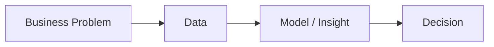

# Data Science란 무엇인가?

> Data Science 101 시리즈 (1/10)


## 이 글에서 다룰 문제

용어가 *섞여 쓰이는 분야* 일수록 *역할의 경계* 가 흐려집니다. 시작에서 *큰 그림* 을 잡으면 *어느 도구* 를 *언제 배울지* 가 분명해집니다.

> *큰 그림이 *없는 학습* 은 *조각의 모음* 일 뿐이다.*

## 전체 흐름


## Before/After

**Before**: *데이터* 가 있으니 *어디든* 분석을 시도한다. 결과가 *흐릿하다*.

**After**: *문제* 를 먼저 *한 줄* 로 정의하고 *필요한 데이터* 만 본다. 결과가 *명확하다*.

## 5단계 워크플로

### 1단계 — 문제 정의

```text
"이탈 가능성이 높은 사용자를 매주 100명 골라낸다"
```

### 2단계 — 데이터 수집

```python
import pandas as pd
df = pd.read_csv("users.csv")
print(df.shape, df.columns.tolist())
```

### 3단계 — 정제와 EDA

```python
df = df.dropna(subset=["last_login"])
df["days_since_login"] = (pd.Timestamp.today() - pd.to_datetime(df["last_login"])).dt.days
print(df["days_since_login"].describe())
```

### 4단계 — 모델/규칙

```python
candidates = df[df["days_since_login"] > 30].sort_values("amount_total", ascending=False).head(100)
```

### 5단계 — 의사결정 연결

```text
이메일 캠페인 대상 100명 → 전환율 측정 → 다음 주 반영
```

## 이 코드에서 주목할 점

- *문제 한 줄* 이 *모든 코드* 의 *방향* 을 정한다.
- *데이터 흐름* 은 *읽기 → 정제 → 탐색 → 결정* 으로 단순하다.
- *대시보드/모델* 은 *결정* 으로 이어져야 *가치* 가 생긴다.

## 자주 하는 실수 5가지

1. ***도구* 부터 배운다.** *문제 없이* 도구는 *방향* 이 없다.
2. **모델 *정확도* 만 본다.** *비즈니스 지표* 를 함께 본다.
3. **데이터 *없이* 가설을 굳힌다.** EDA 가 *생략* 된다.
4. ***분석가/사이언티스트* 의 차이를 무시.** 채용/협업이 *꼬인다*.
5. **결과를 *결정* 에 *연결하지 않는다*.** 보고서가 *서랍 행*.

## 실무에서는 이렇게 쓰입니다

스타트업의 데이터 팀은 *분석가 + 사이언티스트 + 엔지니어* 의 *미니 조직* 입니다. *주제별 OKR* 을 두고, *주간 단위* 로 *대시보드/모델* 을 *결정* 에 연결합니다.

## 체크리스트

- [ ] *분석가/사이언티스트/엔지니어* 의 차이를 안다.
- [ ] *EDA* 가 무엇인지 안다.
- [ ] *문제 → 데이터 → 결정* 의 흐름을 안다.
- [ ] *비즈니스 지표* 의 중요성을 안다.

## 정리 및 다음 단계

데이터 사이언스는 *문제* 와 *데이터* 를 잇는 *직업* 입니다. 다음 글에서는 *문제* 를 *데이터 문제* 로 *바꾸는* 기술을 살펴봅니다.

<!-- toc:begin -->
- **Data Science란 무엇인가? (현재 글)**
- 문제를 데이터 문제로 바꾸기 (예정)
- 데이터 수집 (예정)
- 데이터 정제 (예정)
- 탐색적 데이터 분석 (예정)
- 시각화 (예정)
- 모델링 (예정)
- 평가 (예정)
- 결과 해석 (예정)
- 데이터 프로젝트 전체 흐름 (예정)
<!-- toc:end -->

## 참고 자료

- [Drew Conway — The Data Science Venn Diagram](http://drewconway.com/zia/2013/3/26/the-data-science-venn-diagram)
- [Google — Rules of Machine Learning](https://developers.google.com/machine-learning/guides/rules-of-ml)
- [Hadley Wickham — R for Data Science](https://r4ds.hadley.nz/)
- [Stitch Fix — A Beginner's Guide to Algorithms](https://multithreaded.stitchfix.com/)

Tags: DataScience, Introduction, Workflow, Analytics, Beginner
