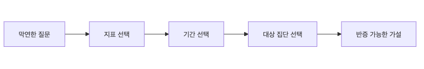

# 문제를 데이터 문제로 바꾸기

이 글은 Data Science 101 시리즈의 두 번째 글입니다.

실무에서 데이터 작업이 느려지는 가장 흔한 이유는 도구 부족이 아닙니다. 질문이 흐릿한 상태로 출발했기 때문입니다. “왜 매출이 떨어졌지?”, “이탈이 늘었나?”, “이번 캠페인이 효과 있었나?” 같은 질문은 모두 중요하지만, 그대로는 데이터가 답하기 어렵습니다. 무엇을 측정할지, 어느 기간을 비교할지, 누구를 대상으로 볼지가 빠져 있기 때문입니다.

그래서 분석의 절반은 계산이 아니라 프레이밍입니다. 질문을 다시 써서 데이터가 실제로 답할 수 있는 형태로 바꾸는 일입니다. 이 글에서는 그 변환 과정을 다섯 단계로 정리하겠습니다.

## 이 글에서 다룰 문제

- “왜 매출이 떨어졌지?” 같은 질문은 왜 그대로는 답하기 어려울까요?
- 지표, 기간, 대상 집단은 왜 문제 정의의 핵심일까요?
- 데이터가 답할 수 있는 질문은 어떤 형태여야 할까요?
- 반증 가능한 가설은 왜 분석 속도를 크게 높일까요?
- 모호한 요청을 받았을 때 팀은 무엇부터 다시 써야 할까요?

> 질문이 측정 가능한 문장으로 바뀌는 순간, 데이터는 비로소 답하기 시작합니다.

## 이 글에서 배우는 내용

- 비즈니스 질문을 데이터 질문으로 바꾸는 5단계 틀
- 측정 가능한 지표를 고르는 방법
- 반증 가능한 가설을 쓰는 법
- 짧은 프레이밍 실습 흐름
- 자주 빠지는 다섯 가지 함정

## 왜 중요한가

질문이 흐릿하면 어떤 데이터를 가져와야 할지도 정할 수 없습니다. 팀마다 다른 기간을 보고, 다른 집단을 보고, 다른 지표를 쓰기 시작하면 같은 문제를 놓고도 전혀 다른 결론이 나옵니다. 반대로 문제를 한 문장으로 정확히 쓰면 쿼리도 빨라지고, 분석 범위도 줄고, 팀 간 오해도 크게 줄어듭니다.

좋은 데이터 팀일수록 질문을 다시 쓰는 일을 분석 전 단계의 부수 작업으로 보지 않습니다. 코드 리뷰만큼 중요한 질문 리뷰로 다룹니다.

> 정확한 질문 한 줄이 몇 주의 분석 시간을 아껴 주기도 합니다.

## 핵심 개념 한눈에 보기



*막연한 질문을 지표, 기간, 대상 집단, 가설로 좁혀 가는 프레이밍 흐름*
## 핵심 용어

- **Metric**: DAU, 전환율, 매출처럼 실제로 측정할 수 있는 숫자입니다.
- **Window**: 최근 30일, 직전 7일처럼 비교할 시간 범위입니다.
- **Population**: 유료 구독자, 신규 가입자처럼 분석 대상 집단입니다.
- **Hypothesis**: 맞을 수도 틀릴 수도 있는 가설 문장입니다.
- **Counterfactual**: 변화가 없었다면 어떻게 되었을지를 상상하는 비교 기준입니다.

## Before / After

**Before**: “왜 매출이 떨어졌지?”라는 질문을 받고 어디서부터 봐야 할지 막막합니다. 사람마다 떠올리는 지표와 비교 구간도 달라집니다.

**After**: “최근 30일 동안 체험판을 제외한 유료 구독자의 월 매출이 직전 30일보다 5% 이상 감소했는가?”로 다시 씁니다. 그 순간 필요한 쿼리와 비교 방식이 거의 정해집니다.

## 실습: 5단계 프레이밍

### 1단계 — 막연한 질문을 그대로 적기

```text
"Revenue feels like it's dropping"
```

출발점은 대개 이렇게 모호합니다. 괜찮습니다. 중요한 것은 이 문장을 억지로 바로 분석하지 않는 것입니다. 먼저 지금 질문에 무엇이 빠져 있는지 드러내야 합니다.

### 2단계 — 지표를 고르기

```text
metric = monthly_revenue
```

지표는 분석의 중심축입니다. 매출인지, 활성 사용자 수인지, 주문 건수인지에 따라 필요한 데이터가 완전히 달라집니다. 그래서 보통은 지표를 가장 먼저 고릅니다.

### 3단계 — 기간을 고르기

```text
window = last 30 days vs previous 30 days
```

비교 기간이 다르면 결론도 쉽게 바뀝니다. 어떤 팀은 최근 7일을 보고, 어떤 팀은 월간 기준을 보면 논의가 엇갈릴 수밖에 없습니다. 기간은 질문 안에 명시되어야 합니다.

### 4단계 — 대상 집단을 좁히기

```text
population = paid subscribers (excluding trials)
```

전체 사용자를 한꺼번에 보면 중요한 패턴이 묻히기 쉽습니다. 무료 사용자와 유료 사용자를 섞거나, 체험판과 실제 고객을 섞으면 비교가 오염됩니다. 대상 집단을 좁히는 이유가 여기에 있습니다.

### 5단계 — 반증 가능한 문장으로 다시 쓰기

```text
"Paid-subscriber monthly revenue dropped more than 5% in the last 30 days versus the prior 30 days."
```

이제야 비로소 데이터가 답할 수 있는 질문이 됩니다. 맞는지 틀린지 확인할 수 있고, 필요한 집계도 분명합니다. 좋은 데이터 질문은 대부분 이 수준으로 구체적입니다.

**Expected output:** 지표·기간·대상 집단이 명시된 반증 가능한 질문 한 줄을 문서로 남깁니다.

## 이 코드에서 먼저 봐야 할 점

- 지표는 분석 전체를 잡아 주는 중심축입니다.
- 기간과 대상 집단을 명시해야 비교가 공정해집니다.
- 데이터가 답하려면 가설이 먼저 반증 가능해야 합니다.

## 자주 하는 실수 다섯 가지

1. **지표를 맨 마지막에 고르는 실수**: 분석이 계속 흔들립니다.
2. **팀마다 다른 기간을 쓰는 실수**: 같은 문제를 놓고도 불공정한 비교가 됩니다.
3. **대상 집단이 중간에 바뀌는 실수**: 추세가 섞여 원인을 읽기 어려워집니다.
4. **반증 불가능한 가설을 쓰는 실수**: 데이터가 답할 수 없는 질문이 됩니다.
5. **여러 질문을 한 번에 묻는 실수**: 답이 섞여 무엇이 원인인지 흐려집니다.

## 실무에서는 이렇게 나타납니다

좋은 데이터 팀은 모호한 요청을 받으면 바로 쿼리를 짜지 않습니다. 먼저 질문을 다시 씁니다. 어떤 팀은 이것을 질문 리뷰라고 부르고, 코드 리뷰만큼 엄격하게 다룹니다. 문제를 어떻게 정의했는지에 따라 이후 수집, EDA, 시각화, 모델링까지 모두 달라지기 때문입니다.

## 시니어는 이렇게 생각합니다

- 지표를 먼저 정해야 분석이 흔들리지 않습니다.
- 기간과 대상 집단은 문서에 명시해야 합니다.
- 반증 가능성은 질문 품질의 핵심 기준입니다.
- 질문 리뷰는 코드 리뷰만큼 중요합니다.
- 데이터가 답할 수 없다면 질문부터 다시 써야 합니다.

## 체크리스트

- [ ] 지표, 기간, 대상 집단을 분명하게 적을 수 있습니다.
- [ ] 반증 가능한 가설을 작성할 수 있습니다.
- [ ] counterfactual이 왜 필요한지 설명할 수 있습니다.
- [ ] 모호한 요청을 깔끔한 데이터 질문으로 바꿀 수 있습니다.

## 연습 문제

1. “이탈이 늘고 있다”를 5단계 프레임으로 다시 써 보세요.
2. 반증 불가능한 가설 3개를 적고, 각각을 반증 가능하게 고쳐 보세요.
3. 하나의 지표를 골라 기간이 달라질 때 결론이 어떻게 바뀌는지 적어 보세요.

## 정리 및 다음 글

데이터 분석은 답할 수 있는 질문에서만 시작됩니다. 문제를 데이터가 측정할 수 있는 형태로 바꾸는 일이 그만큼 중요합니다. 다음 글에서는 이렇게 정의한 질문을 뒷받침할 데이터를 실제로 어디서, 어떻게 수집할지 살펴보겠습니다.

<!-- toc:begin -->
- [Data Science란 무엇인가?](./01-what-is-data-science.md)
- **문제를 데이터 문제로 바꾸기 (현재 글)**
- 데이터 수집 (예정)
- 데이터 정제 (예정)
- 탐색적 데이터 분석 (예정)
- 시각화 (예정)
- 모델링 (예정)
- 평가 (예정)
- 결과 해석 (예정)
- 데이터 프로젝트 전체 흐름 (예정)
<!-- toc:end -->

## 참고 자료

- [Google — Rules of Machine Learning (Rule #1)](https://developers.google.com/machine-learning/guides/rules-of-ml)
- [Cassie Kozyrkov — How to Ask Smart Questions](https://kozyrkov.medium.com/)
- [Stitch Fix — A/B Testing Lessons](https://multithreaded.stitchfix.com/)
- [Andrew Gelman — Statistical Modeling Blog](https://statmodeling.stat.columbia.edu/)

Tags: DataScience, ProblemFraming, Metrics, Workflow, Beginner
