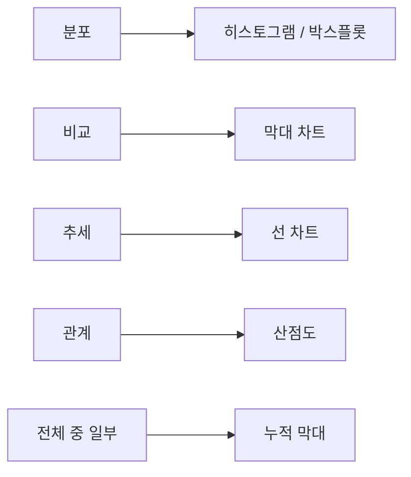

# 시각화

이 글은 Data Science 101 시리즈의 여섯 번째 글입니다.

시각화는 데이터를 예쁘게 꾸미는 작업이 아닙니다. 사람이 가장 빠르게 읽을 수 있는 형태로 결과를 다시 표현하는 작업입니다. 좋은 차트 하나가 설명 세 페이지를 줄여 주기도 하고, 반대로 잘못 고른 차트 하나가 완전히 다른 결정을 부르기도 합니다.

그래서 시각화의 핵심은 “무슨 차트 라이브러리를 쓰는가”보다 “무슨 메시지를 전달하려는가”에 있습니다. 이 글에서는 메시지와 차트를 연결하는 기본 지도, 그리고 차트를 정직하게 만드는 규칙들을 함께 정리하겠습니다.

## 이 글에서 다룰 문제

- 어떤 메시지에 어떤 차트를 써야 할까요?
- 같은 데이터를 두고도 왜 어떤 그래프는 이해를 돕고, 어떤 그래프는 오해를 만들까요?
- 축, 색상, 라벨은 왜 사소한 장식이 아니라 핵심 설계 요소일까요?
- 독자를 속이기 쉬운 시각화 패턴에는 무엇이 있을까요?
- 분석 결과를 결정으로 연결하려면 차트가 어떤 역할을 해야 할까요?

> 좋은 시각화 한 장은 장황한 설명 여러 페이지보다 더 빠르게 의사결정을 밀어 줍니다.

## 이 글에서 배우는 내용

- 다섯 가지 메시지와 다섯 가지 차트의 기본 매핑
- 축, 색상, 라벨의 기본 원칙
- 독자를 오해하게 만드는 대표 패턴
- 5단계 시각화 실습 흐름
- 시각화에서 자주 생기는 함정 다섯 가지

## 왜 중요한가

데이터는 그림으로 봤을 때 훨씬 빨리 읽힙니다. 하지만 빠르게 읽힌다는 장점은 동시에 위험도 있습니다. 차트가 잘못 설계되면 사람은 그 오해도 빠르게 받아들입니다. 그래서 메시지와 차트를 올바르게 짝짓는 일은 분석의 마지막 품질 관리에 가깝습니다.

저는 좋은 시각화를 “예쁜 차트”보다 “오해를 덜 만드는 차트”로 정의하는 편이 더 실용적이라고 생각합니다.

> 시각화는 분석의 마지막 한 줄입니다.

## 핵심 개념 한눈에 보기



## 핵심 용어

- **Encoding**: 값을 위치, 길이, 색상 같은 시각 요소에 대응시키는 방식입니다.
- **Scale**: 선형 축인지 로그 축인지 같은 축 변환 방식입니다.
- **Faceting**: 여러 작은 차트를 나란히 배치해 비교하는 방식입니다.
- **Annotation**: 차트 위에 맥락을 덧붙이는 주석과 강조 표시입니다.
- **Colorblind-safe**: 색각 이상이 있는 독자도 구분하기 쉬운 팔레트입니다.

## Before / After

**Before**: 3D 파이 차트로 비율을 보여 줍니다. 조각 크기를 정확히 비교하기 어려워서 중요한 차이를 읽기 힘듭니다.

**After**: 수평 막대 차트로 바꿉니다. 길이 비교가 쉬워져서 순위와 차이가 한눈에 들어옵니다.

## 실습: 5단계 시각화

### 1단계 — 분포는 히스토그램으로 보기

```python
import matplotlib.pyplot as plt
df["amount"].plot.hist(bins=30, title="amount distribution")
plt.show()
```

분포를 볼 때는 먼저 히스토그램이나 박스플롯을 떠올리는 편이 좋습니다. 평균이나 중앙값만으로는 보이지 않는 치우침과 긴 꼬리를 차트가 바로 드러내 줍니다.

### 2단계 — 비교는 막대 차트로 보기

```python
(
    df.groupby("country")["amount"]
      .sum()
      .sort_values()
      .plot.barh(title="revenue by country")
)
plt.show()
```

국가별 매출처럼 항목 간 비교가 목적일 때는 막대 차트가 가장 직관적입니다. 특히 수평 막대는 라벨이 긴 경우에도 읽기 편합니다.

### 3단계 — 추세는 선 차트로 보기

```python
df.groupby("order_date")["amount"].sum().plot(title="daily revenue")
plt.show()
```

시간 흐름이 핵심이면 선 차트가 자연스럽습니다. 날짜 축을 따라 상승과 하락, 계절성, 이벤트 전후 변화를 읽을 수 있기 때문입니다.

### 4단계 — 관계는 산점도와 faceting으로 보기

```python
import seaborn as sns
sns.relplot(
    data=df.sample(2000),
    x="quantity",
    y="amount",
    col="country",
    col_wrap=3,
)
```

두 수치형 변수의 관계를 볼 때는 산점도가 가장 강력합니다. 여기에 faceting을 더하면 국가별로 패턴이 어떻게 달라지는지도 함께 읽을 수 있습니다.

### 5단계 — 주석과 색상으로 맥락 더하기

```python
ax = df.groupby("order_date")["amount"].sum().plot()
ax.axvline(pd.Timestamp("2026-04-01"), color="red", linestyle="--", label="campaign")
ax.legend()
```

좋은 차트는 숫자만 그리지 않습니다. 중요한 이벤트 시점, 정책 변경, 캠페인 시작일 같은 맥락을 주석으로 표시해 주면 독자가 차트를 해석하는 시간이 크게 줄어듭니다.

## 이 코드에서 먼저 봐야 할 점

- 차트는 데이터보다 메시지에서 먼저 출발해야 합니다.
- 축의 스케일은 해석을 크게 바꿀 수 있습니다.
- 주석은 긴 설명 문단을 대신해 주는 실용적인 장치입니다.

## 자주 하는 실수 다섯 가지

1. **3D 차트를 쓰는 실수**: 비교가 어려워지고 왜곡도 커집니다.
2. **이중 축을 남용하는 실수**: 서로 다른 스케일이 오독을 만들기 쉽습니다.
3. **범주를 색으로만 구분하는 실수**: 색각 이상 독자에게 불친절합니다.
4. **막대 차트를 0이 아닌 값에서 시작하는 실수**: 차이를 과장하게 됩니다.
5. **라벨 없는 차트를 공유하는 실수**: 다음 주에는 아무도 다시 읽기 어렵습니다.

## 실무에서는 이렇게 나타납니다

실무에서는 Tableau나 Looker 같은 대시보드 도구와 Python 차트를 함께 씁니다. 주간 보고의 기본 단위가 대시보드인 팀도 많습니다. 중요한 것은 차트 수가 아니라, 몇 번의 스크롤 안에 의사결정이 가능하도록 설계되어 있는가입니다.

## 시니어는 이렇게 생각합니다

- 먼저 메시지를 쓰고, 그다음 차트를 고릅니다.
- 축과 라벨은 반드시 채웁니다.
- 기본 팔레트도 colorblind-safe를 우선합니다.
- 주석으로 독자가 맥락을 놓치지 않게 돕습니다.
- 대시보드는 세 화면 안에서 결정을 도와줘야 합니다.

## 체크리스트

- [ ] 다섯 가지 메시지와 차트의 기본 매핑을 알고 있습니다.
- [ ] 축과 라벨이 왜 중요한지 설명할 수 있습니다.
- [ ] colorblind-safe 팔레트 개념을 알고 있습니다.
- [ ] 주석을 넣어 해석을 돕는 습관이 있습니다.

## 연습 문제

1. 같은 데이터를 세 가지 차트로 그려 보고, 가장 명확한 차트를 골라 보세요.
2. 오해를 부르는 차트 하나를 찾아 더 정직한 형태로 고쳐 보세요.
3. 차트 세 개로 구성된 한 페이지 대시보드를 스케치해 보세요.

## 정리 및 다음 글

시각화는 분석을 사람이 읽을 수 있는 형태로 번역하는 작업입니다. 메시지와 차트를 올바르게 연결해야 결과가 결정으로 이어집니다. 다음 글에서는 정제된 데이터를 바탕으로 실제 예측 모델을 만드는 모델링 단계로 넘어가겠습니다.

<!-- toc:begin -->
- [Data Science란 무엇인가?](./01-what-is-data-science.md)
- [문제를 데이터 문제로 바꾸기](./02-problem-to-data-problem.md)
- [데이터 수집](./03-data-collection.md)
- [데이터 정제](./04-data-cleaning.md)
- [탐색적 데이터 분석](./05-exploratory-data-analysis.md)
- **시각화 (현재 글)**
- 모델링 (예정)
- 평가 (예정)
- 결과 해석 (예정)
- 데이터 프로젝트 전체 흐름 (예정)
<!-- toc:end -->

## 참고 자료

- [matplotlib — Tutorials](https://matplotlib.org/stable/tutorials/index.html)
- [seaborn — Tutorial](https://seaborn.pydata.org/tutorial.html)
- [Cole Knaflic — Storytelling with Data](https://www.storytellingwithdata.com/)
- [Tableau — Visual Best Practices](https://www.tableau.com/learn/articles/data-visualization-tips)

Tags: DataScience, Visualization, Matplotlib, Seaborn, Beginner
