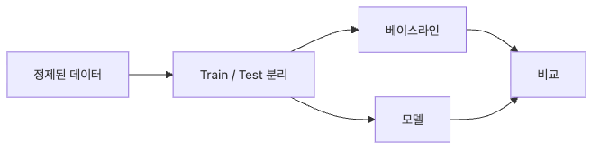

# 모델링

이 글은 Data Science 101 시리즈의 일곱 번째 글입니다.

모델링은 데이터 작업에서 가장 눈에 띄는 단계입니다. 그래서 입문자는 복잡한 알고리즘부터 배우고 싶어집니다. 하지만 실무에서는 화려한 모델보다 먼저 확인해야 할 것이 있습니다. 아주 단순한 기준선, 즉 베이스라인입니다. 기준선이 없으면 지금 만든 모델이 정말 나아졌는지조차 말할 수 없습니다.

좋은 모델링의 출발점은 복잡함이 아니라 비교 가능성입니다. 무엇과 비교하는지, 학습과 평가 데이터를 어떻게 나누는지, 전처리 과정에서 누수가 없는지, 한 번의 우연한 결과를 실력으로 착각하지 않는지가 더 중요합니다. 이 글에서는 첫 지도 학습 모델을 안전하게 만드는 기본 흐름을 정리하겠습니다.

## 이 글에서 다룰 문제

- 첫 모델을 만들 때 왜 베이스라인부터 시작해야 할까요?
- train/test 분리는 무엇을 막아 주는 장치일까요?
- 전처리와 모델을 하나의 Pipeline으로 묶는 이유는 무엇일까요?
- accuracy 하나만 보면 왜 쉽게 속을 수 있을까요?
- 교차 검증은 평균보다 무엇을 더 보여 줄까요?

> 베이스라인이 없는 모델은 서 있을 바닥이 없는 모델과 비슷합니다.

## 이 글에서 배우는 내용

- 지도 학습 모델링의 기본 흐름
- 베이스라인 모델의 역할
- train/test 분리 원칙
- 5단계 모델링 실습
- 입문자가 자주 하는 실수 다섯 가지

## 왜 중요한가

베이스라인이 없는 모델은 잘했다는 말도, 못했다는 말도 하기 어렵습니다. 복잡한 모델이 95% 정확도를 냈더라도 가장 단순한 기준선이 96%라면 그 시도는 개선이 아니라 퇴행입니다. 그래서 모델링의 진짜 출발선은 늘 기준선입니다.

실무에서는 베이스라인이 단순한 예비 단계가 아니라, 이후의 모든 실험을 해석하게 만드는 기준점입니다. 그 기준이 없으면 숫자는 있어도 판단은 없습니다.

> 모든 모델은 결국 베이스라인과 경쟁합니다.

## 핵심 개념 한눈에 보기



*정제된 데이터를 학습·평가로 나누고 베이스라인과 모델을 비교하는 흐름*
## 핵심 용어

- **Baseline**: 항상 다수 클래스만 예측하는 것처럼 가장 단순한 기준선입니다.
- **Train/test split**: 학습용 데이터와 평가용 데이터를 분리하는 방식입니다.
- **Cross-validation**: 데이터를 여러 폴드로 나누어 반복 평가하는 방법입니다.
- **Overfitting**: 학습 데이터에는 잘 맞지만 테스트 데이터에는 약한 상태입니다.
- **Pipeline**: 전처리와 모델을 하나의 객체로 묶는 방식입니다.

## Before / After

**Before**: 복잡한 모델을 만들었더니 정확도 95%가 나옵니다. 성능이 좋아 보이지만, 베이스라인이 96%였다는 사실을 나중에 알게 됩니다.

**After**: 먼저 베이스라인 96%를 기록합니다. 그 위를 넘는지 확인하면서 모델링을 진행하니, 비교 기준이 분명해집니다.

## 실습: 5단계 모델링

### 1단계 — 데이터 준비와 분리

```python
from sklearn.model_selection import train_test_split
import pandas as pd

df = pd.read_csv("churn.csv")
X = df.drop(columns=["churn"])
y = df["churn"]

X_train, X_test, y_train, y_test = train_test_split(
    X, y, test_size=0.2, random_state=42, stratify=y
)
```

데이터를 먼저 나누는 이유는 미래의 성능을 흉내 내기 위해서입니다. 학습에 쓴 데이터를 그대로 다시 평가하면 성능이 과장되기 쉽습니다. `stratify=y`를 쓰는 이유도 클래스 비율을 유지하기 위해서입니다.

### 2단계 — 베이스라인 만들기

```python
from sklearn.dummy import DummyClassifier
from sklearn.metrics import accuracy_score

base = DummyClassifier(strategy="most_frequent").fit(X_train, y_train)
print("baseline:", accuracy_score(y_test, base.predict(X_test)))
```

이 단계는 단순하지만 매우 중요합니다. 가장 흔한 답만 찍는 모델보다 나은지조차 확인하지 않고 복잡한 모델로 가면 성능 해석이 쉽게 틀어집니다.

### 3단계 — 전처리와 모델을 Pipeline으로 묶기

```python
from sklearn.compose import ColumnTransformer
from sklearn.pipeline import Pipeline
from sklearn.preprocessing import OneHotEncoder, StandardScaler
from sklearn.linear_model import LogisticRegression

num = X.select_dtypes("number").columns.tolist()
cat = X.select_dtypes("object").columns.tolist()

pre = ColumnTransformer([
    ("num", StandardScaler(), num),
    ("cat", OneHotEncoder(handle_unknown="ignore"), cat),
])
model = Pipeline([("pre", pre), ("clf", LogisticRegression(max_iter=1000))])
```

전처리를 Pipeline 안에 넣는 이유는 누수를 막기 위해서입니다. 테스트 데이터 정보가 전처리 단계에 섞이면 평가 점수가 실제보다 좋아 보일 수 있습니다. Pipeline은 이 과정을 안전하게 묶어 줍니다.

### 4단계 — 학습과 평가

```python
model.fit(X_train, y_train)
print("model:", accuracy_score(y_test, model.predict(X_test)))
```

이제야 실제 모델의 첫 점수를 봅니다. 중요한 것은 숫자 자체보다 베이스라인과 비교해 얼마나 나아졌는지입니다.

### 5단계 — 교차 검증으로 흔들림 보기

```python
from sklearn.model_selection import cross_val_score
scores = cross_val_score(model, X_train, y_train, cv=5, scoring="accuracy")
print(scores.mean(), "+/-", scores.std())
```

한 번의 분할 결과는 운이 섞일 수 있습니다. 교차 검증은 평균뿐 아니라 분산도 보여 주기 때문에, 모델이 얼마나 안정적인지 읽는 데 도움이 됩니다.

**Expected output:** 베이스라인 점수, 첫 모델 점수, 교차 검증 평균과 표준편차를 한 화면에서 비교합니다.

## 이 코드에서 먼저 봐야 할 점

- 베이스라인은 항상 가장 먼저 기록해야 합니다.
- Pipeline은 데이터 누수를 막아 주는 기본 안전장치입니다.
- 교차 검증은 평균 점수뿐 아니라 결과의 흔들림까지 보여 줍니다.

## 자주 하는 실수 다섯 가지

1. **베이스라인 없이 시작하는 실수**: 무엇이 개선인지 판단할 기준이 없습니다.
2. **테스트 데이터로 전처리 통계를 학습하는 실수**: 대표적인 데이터 누수입니다.
3. **accuracy만 보는 실수**: 클래스 불균형 상황에서는 특히 위험합니다.
4. **`random_state`를 고정하지 않는 실수**: 재현성이 무너집니다.
5. **한 번의 분할 결과로 결론 내리는 실수**: 운을 실력으로 착각하기 쉽습니다.

## 실무에서는 이렇게 나타납니다

실무 팀은 MLflow나 Weights & Biases 같은 도구로 실험을 기록합니다. 실험 1번은 거의 항상 베이스라인입니다. 피처 변경도 한 번에 하나씩 넣어야 어떤 변화가 점수를 움직였는지 설명할 수 있습니다.

## 시니어는 이렇게 생각합니다

- 가장 값진 실험은 종종 베이스라인입니다.
- 전처리와 모델은 항상 함께 묶습니다.
- `random_state`는 반드시 고정합니다.
- 평균뿐 아니라 교차 검증 분산도 봅니다.
- 한 번에 하나의 변화만 주는 편이 학습이 빠릅니다.

## 체크리스트

- [ ] 베이스라인 모델을 만들 수 있습니다.
- [ ] Pipeline이 왜 필요한지 설명할 수 있습니다.
- [ ] train/test 분리 이유를 알고 있습니다.
- [ ] 교차 검증 분산을 함께 봐야 한다는 점을 이해합니다.

## 연습 문제

1. Titanic 데이터셋에서 베이스라인과 logistic regression을 비교해 보세요.
2. Pipeline이 없어서 데이터 누수가 생긴 사례를 문서로 적어 보세요.
3. 교차 검증 폴드 수를 바꿔 가며 평균과 분산이 어떻게 달라지는지 확인해 보세요.

## 정리 및 다음 글

모델링은 복잡한 알고리즘 경연이 아니라, 기준선과 비교하며 조금씩 나아지는 과정입니다. 베이스라인, 분리, 누수 방지, 반복 평가를 챙겨야 모델 점수를 믿을 수 있습니다. 다음 글에서는 이렇게 만든 모델을 어떤 지표로 평가해야 하는지 살펴보겠습니다.

<!-- toc:begin -->
- [Data Science란 무엇인가?](./01-what-is-data-science.md)
- [문제를 데이터 문제로 바꾸기](./02-problem-to-data-problem.md)
- [데이터 수집](./03-data-collection.md)
- [데이터 정제](./04-data-cleaning.md)
- [탐색적 데이터 분석](./05-exploratory-data-analysis.md)
- [시각화](./06-visualization.md)
- **모델링 (현재 글)**
- 평가 (예정)
- 결과 해석 (예정)
- 데이터 프로젝트 전체 흐름 (예정)
<!-- toc:end -->

## 참고 자료

- [scikit-learn — User Guide](https://scikit-learn.org/stable/user_guide.html)
- [Google — Rules of Machine Learning](https://developers.google.com/machine-learning/guides/rules-of-ml)
- [Kaggle — Intro to Machine Learning](https://www.kaggle.com/learn/intro-to-machine-learning)
- [Hands-On Machine Learning with Scikit-Learn](https://github.com/ageron/handson-ml3)

Tags: DataScience, Modeling, ScikitLearn, MachineLearning, Beginner
