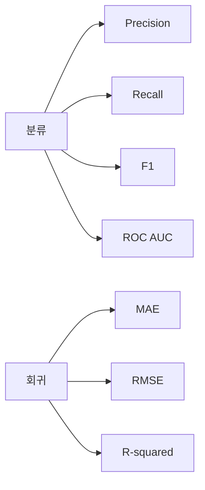

# 평가

## 이 글에서 다룰 문제

- 정확도가 높으면 정말 좋은 모델이라고 말할 수 있을까요?
- 분류 문제에서 precision, recall, F1, ROC AUC는 각각 무엇을 말해 줄까요?
- 회귀 문제에서 MAE, RMSE, R²는 어떻게 다를까요?
- 임계값 하나만 보고 판단하면 왜 위험할까요?
- 비즈니스 비용을 지표에 반영하지 않으면 어떤 문제가 생길까요?

> Data Science 101 시리즈 (8/10)

모델링이 끝나면 많은 입문자가 가장 먼저 정확도를 봅니다. 물론 정확도는 유용한 지표일 수 있습니다. 하지만 항상 좋은 지표는 아닙니다. 특히 클래스 불균형이 큰 문제에서는 정확도가 매우 높아도 실제로 중요한 대상을 거의 잡지 못할 수 있습니다. 사기 탐지, 장애 탐지, 이탈 예측처럼 놓치면 비용이 큰 문제에서는 더 그렇습니다.

그래서 평가는 “점수를 보는 단계”가 아니라 “우리가 어떤 문제를 풀고 있는지 다시 확인하는 단계”에 가깝습니다. 어떤 지표를 선택하느냐가 곧 어떤 실패를 더 아프게 볼 것인지 정하는 일이기 때문입니다.

## 왜 중요한가

지표가 문제와 어긋나면 모델은 잘못된 방향으로 최적화됩니다. 예를 들어 실제로는 놓치는 비용이 큰 문제인데 accuracy만 올리면, 팀은 좋은 모델이라고 믿지만 현업에서는 계속 불만이 나올 수 있습니다.

> 지표는 우리가 최적화하는 대상이므로 매우 신중하게 골라야 합니다.

## 평가 지표 한눈에 보기



분류와 회귀는 보는 지표 자체가 다릅니다. 그리고 같은 분류 문제 안에서도 어떤 실패가 더 비싼지에 따라 중심 지표가 달라집니다.

## 핵심 용어

- **Confusion matrix**: TP, FP, FN, TN으로 예측 결과를 정리한 표입니다.
- **Precision**: 양성이라고 예측한 것 중 실제 양성이 얼마나 되는지 보여 줍니다.
- **Recall**: 실제 양성 중에서 우리가 얼마나 많이 잡았는지 보여 줍니다.
- **F1**: precision과 recall의 조화평균입니다.
- **ROC AUC**: 임계값에 덜 의존적으로 모델의 구분 능력을 보여 주는 지표입니다.

이 용어들을 그냥 외우기보다, 어떤 비용을 반영하는지와 연결해 이해하는 편이 좋습니다. 예를 들어 recall은 놓치지 않는 능력과 더 가깝습니다.

## Before / After

**Before**: 사기 탐지 모델이 accuracy 99%를 찍습니다. 숫자만 보면 대단해 보이지만 recall이 5%라면 대부분의 사기를 놓치고 있다는 뜻입니다.

**After**: recall을 주요 지표로 두고, F1과 비용 기반 지표를 보조 지표로 둡니다. 그제야 문제와 지표가 맞기 시작합니다.

## 5단계 평가

### 1단계 — confusion matrix 보기

```python
from sklearn.metrics import confusion_matrix
cm = confusion_matrix(y_test, y_pred)
print(cm)
```

분류 평가의 시작점은 confusion matrix입니다. precision, recall, F1도 결국 이 표에서 나옵니다. 어떤 오류가 얼마나 많이 발생했는지 직접 보는 습관이 중요합니다.

### 2단계 — precision, recall, F1 계산

```python
from sklearn.metrics import precision_score, recall_score, f1_score
print(precision_score(y_test, y_pred))
print(recall_score(y_test, y_pred))
print(f1_score(y_test, y_pred))
```

precision은 잘못 알람을 울리는 비용과 연결되고, recall은 놓치는 비용과 연결됩니다. F1은 둘 사이 균형을 보고 싶을 때 유용합니다.

### 3단계 — ROC AUC 보기

```python
from sklearn.metrics import roc_auc_score
proba = model.predict_proba(X_test)[:, 1]
print(roc_auc_score(y_test, proba))
```

ROC AUC는 특정 임계값 하나에 덜 묶여 있다는 장점이 있습니다. 그래서 분류기의 전반적인 구분 능력을 볼 때 자주 사용합니다.

### 4단계 — 회귀 지표 보기

```python
from sklearn.metrics import mean_absolute_error, mean_squared_error, r2_score
import numpy as np

print("MAE :", mean_absolute_error(y_test, y_pred))
print("RMSE:", np.sqrt(mean_squared_error(y_test, y_pred)))
print("R^2 :", r2_score(y_test, y_pred))
```

회귀에서는 오차를 어떻게 벌주고 싶은지에 따라 지표를 다르게 봅니다. RMSE는 큰 오차에 더 민감하고, MAE는 보다 직관적인 평균 절대 오차를 보여 줍니다.

### 5단계 — 비즈니스 비용 직접 계산

```python
# A false negative costs 5x a false positive
cost = 5 * cm[1, 0] + 1 * cm[0, 1]
print("expected cost:", cost)
```

실무에서는 이 단계가 특히 중요합니다. false negative가 false positive보다 훨씬 비싼 문제라면, 그 비용을 직접 숫자로 계산해 지표로 삼아야 합니다. 그래야 모델 점수와 실제 의사결정이 같은 방향을 보게 됩니다.

## 이 코드에서 주목할 점

- confusion matrix는 분류 지표의 뿌리입니다.
- ROC AUC 같은 확률 기반 지표는 임계값 하나에 덜 묶입니다.
- 비즈니스 비용도 직접 계산해서 하나의 지표로 다뤄야 합니다.

## 자주 하는 실수 5가지

1. **accuracy만 봅니다.** 불균형 데이터에서는 특히 오해를 부릅니다.
2. **임계값 하나만 보고 판단합니다.** ROC나 threshold trade-off를 함께 봐야 합니다.
3. **RMSE만 봅니다.** 이상치에 지나치게 민감할 수 있습니다.
4. **테스트셋에서 임계값을 조정합니다.** 평가 데이터에 맞춰 버리는 데이터 누수입니다.
5. **비즈니스 비용을 무시합니다.** 점수는 좋아 보여도 현업 만족도는 낮아질 수 있습니다.

## 실무에서는 이렇게 드러납니다

실무 팀은 하나의 주 지표와 여러 가드레일 지표를 함께 둡니다. 예를 들어 recall을 최우선으로 보되, precision이 0.7 아래로 내려가면 배포하지 않는 식입니다. 이렇게 해야 한쪽 지표만 좋아지고 다른 쪽이 무너지는 상황을 막을 수 있습니다.

## 시니어는 이렇게 생각합니다

- 지표는 문제와 함께 고릅니다.
- 비용 행렬은 문서로 남겨야 합니다.
- 주 지표와 가드레일 지표를 분리해 둡니다.
- 임계값은 validation에서 조정하고 test에서는 건드리지 않습니다.
- 지표 정의를 바꾸는 일도 PR 가치가 있는 변경입니다.

## 체크리스트

- [ ] precision, recall, F1의 차이를 설명할 수 있습니다.
- [ ] ROC AUC가 어떤 의미인지 알고 있습니다.
- [ ] MAE, RMSE, R²의 차이를 알고 있습니다.
- [ ] 비용 행렬을 직접 만들 수 있습니다.

## 연습 문제

1. 불균형 데이터에서 accuracy와 recall이 충돌하는 사례를 만들어 보세요.
2. ROC 곡선을 그리고 임계값에 따라 trade-off가 어떻게 달라지는지 관찰해 보세요.
3. 비용 기반 지표를 정의하고, 가장 좋은 임계값을 골라 보세요.

## 정리 및 다음 글

평가는 단순히 점수를 읽는 단계가 아니라, 문제와 모델이 같은 방향을 보고 있는지 확인하는 단계입니다. 어떤 오류가 더 비싼지 지표에 반영해야 결과가 실무 의사결정과 연결됩니다. 다음 글에서는 이렇게 얻은 결과를 어떻게 과장 없이 해석하고 결정으로 옮길지 살펴보겠습니다.

<!-- toc:begin -->
- [Data Science란 무엇인가?](./01-what-is-data-science.md)
- [문제를 데이터 문제로 바꾸기](./02-problem-to-data-problem.md)
- [데이터 수집](./03-data-collection.md)
- [데이터 정제](./04-data-cleaning.md)
- [탐색적 데이터 분석](./05-exploratory-data-analysis.md)
- [시각화](./06-visualization.md)
- [모델링](./07-modeling.md)
- **평가 (현재 글)**
- 결과 해석 (예정)
- 데이터 프로젝트 전체 흐름 (예정)
<!-- toc:end -->

## 참고 자료

- [scikit-learn — Model Evaluation](https://scikit-learn.org/stable/modules/model_evaluation.html)
- [Google — Classification Metrics](https://developers.google.com/machine-learning/crash-course/classification)
- [Wikipedia — ROC AUC](https://en.wikipedia.org/wiki/Receiver_operating_characteristic)
- [Aurelien Geron — Hands-On ML](https://github.com/ageron/handson-ml3)

Tags: DataScience, Evaluation, Metrics, ScikitLearn, Beginner
