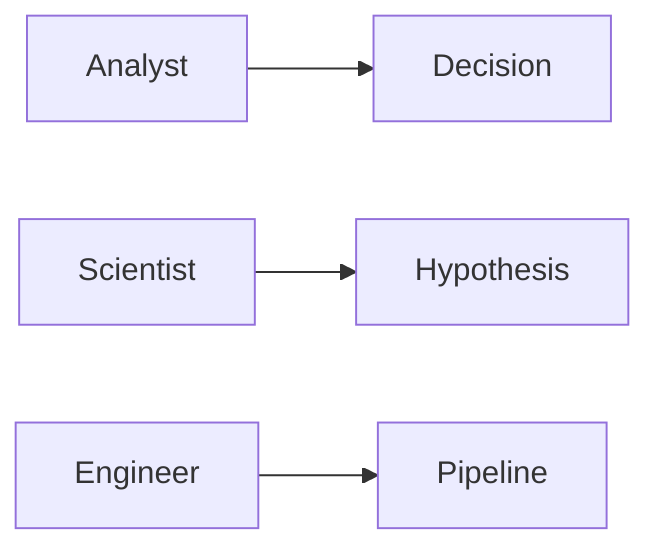

# Analyst vs Scientist vs Engineer

> Data Science Career 101 series (2/10)

<!-- a-grade-intro:begin -->

**Core question**: How do the three roles really differ?

> Different goals, deliverables, tools, and metrics.

<!-- a-grade-intro:end -->

This is post 2 in the Data Science Career 101 series.

## What You Will Learn

- The *purpose* of each role
- Typical *deliverables*
- Primary *tools*
- Success *metrics*
- *Collaboration* style

## Why It Matters

Misunderstanding roles misaligns learning and applications.

## Concept at a Glance



## Key Terms

- **decision support**: Driving decisions with data.
- **A/B test**: Controlled experiment.
- **ETL**: Extract, Transform, Load.
- **feature store**: Shared feature repository.
- **SLA**: Service Level Agreement.

## Before/After

**Before**: "All three just look at data."

**After**: "I can distinguish them by purpose and deliverable."

## Hands-on: Build a Comparison Table

### Step 1 — Purpose

```text
Analyst: answer questions
Scientist: validate hypotheses
Engineer: guarantee data flow
```

### Step 2 — Deliverables

```text
Analyst: dashboards, reports
Scientist: experiments, models
Engineer: pipelines, schemas
```

### Step 3 — Primary Tools

```text
Analyst: SQL, BI tool
Scientist: Python, notebook, Spark
Engineer: Airflow, dbt, Kafka
```

### Step 4 — Metrics

```text
Analyst: decision adoption rate
Scientist: experimental significance
Engineer: SLA, data quality
```

### Step 5 — Collaboration

```text
Analyst <-> PM/marketing
Scientist <-> PM/research
Engineer <-> backend/platform
```

## What to Notice in This Code

- Purpose dictates tools.
- Metrics drive behavior.
- Boundaries vary by company.

## Five Common Mistakes

1. **Judging role by toolset.**
2. **Ignoring deliverables.**
3. **No metric defined.**
4. **Targeting all three at once.**
5. **Ignoring the domain.**

## How This Shows Up in Production

Large orgs encourage T-shaped collaboration across roles.

## How a Senior Engineer Thinks

- Make the purpose explicit.
- Agree on deliverables.
- Share metrics.
- Treat boundaries flexibly.
- Learn T-shaped.

## Checklist

- [ ] Distinguish purposes.
- [ ] Know one deliverable per role.
- [ ] Try one tool per role.
- [ ] Know one metric per role.

## Practice Problems

1. One line: define A/B test.
2. One line: example of ETL.
3. One line: metric difference between analyst and scientist.

## Wrap-up and Next Steps

Next post covers *Designing the Learning Path*.

<!-- toc:begin -->
- [What Is a Data Career](./01-what-is-data-career.md)
- **Analyst vs Scientist vs Engineer (current)**
- Designing the Learning Path (upcoming)
- The Data Portfolio (upcoming)
- SQL and Analytics Interviews (upcoming)
- The ML Interview (upcoming)
- The Case Interview (upcoming)
- Settling into the First Data Job (upcoming)
- Building Domain Expertise (upcoming)
- The Path to Senior in Data (upcoming)
<!-- toc:end -->

## References

- [Type A vs Type B Data Scientist](https://www.quora.com/What-is-data-science)
- [Analytics Engineer role](https://www.getdbt.com/what-is-analytics-engineering)
- [Designing Data-Intensive Applications](https://dataintensive.net/)
- [The Data Engineering Cookbook](https://github.com/andkret/Cookbook)

Tags: DataCareer, Roles, Analyst, Scientist, Engineer
