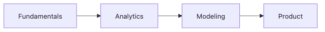

# Designing the Learning Path

Many beginners do not fail because they study too little. They fail because they study in a way that never compounds. A course here, a notebook there, a few SQL exercises over the weekend—effort accumulates, but the path does not, so it becomes hard to tell what is foundational and what is optional.

In data work, sequence matters. If you jump into modeling before you are comfortable with SQL, data cleaning, and basic statistics, you end up building on a surface that cannot support the kinds of questions interviews and real projects actually ask.

This is post 3 in the Data Science Career 101 series.

## Questions this chapter answers

- What should a beginner learn first, and what can wait?
- Why is a 12-week roadmap a more useful frame than a loose reading list?
- What outcomes should each four-week phase produce?
- Why do weekly artifacts matter more than passive study hours?
- How does a simple retro keep the plan sustainable?

> A strong learning path is not a list of resources. It is an order of operations that turns fundamentals into analysis, analysis into modeling, and every week into visible evidence of progress.

## What You Will Learn

- A *12-week roadmap*
- *Fundamentals* (4 weeks)
- *Analytics* (4 weeks)
- *Modeling* (4 weeks)
- *Weekly review*

## Why It Matters

Random study usually produces random confidence. You touch many topics, but you cannot tell which ones you can actually use.

An ordered path gives you something more valuable than motivation: it gives you checkpoints. You know when to move from syntax to analysis, when to build a small project, and when to pause and correct the pace instead of just collecting more material.

## Concept at a Glance



*A staged learning path from fundamentals to analytics, modeling, and product context*
## Key Terms

- **fundamentals**: Core building blocks.
- **analytics**: Question-driven analysis.
- **modeling**: Predictive modeling.
- **product sense**: Sense of user impact.
- **retro**: Periodic reflection.

## Before/After

**Before**: "I just buy books and stall."

**After**: "A 12-week roadmap with weekly artifacts."

## Hands-on: 12-Week Learning Path

### Step 1 — Fundamentals (Weeks 1-4)

```text
- Python syntax, pandas
- SQL JOIN, GROUP BY
- Statistics basics (mean, variance, p-value)
- Visualization (matplotlib)
```

### Step 2 — Analytics (Weeks 5-8)

```text
- Data cleaning
- A/B test design
- One dashboard
- One case study
```

### Step 3 — Modeling (Weeks 9-12)

```text
- One regression, one classification
- scikit-learn pipeline
- Model evaluation metrics
- One mini project
```

### Step 4 — Weekly Artifact

```markdown
- README
- Data source
- Code
- Result
- Retro
```

### Step 5 — Retro Template

```text
What went well / Improve / Next
```

## What to Notice in This Code

- Weekly artifacts are progress evidence.
- Fundamentals carry modeling.
- Retros close the loop.

## Five Common Mistakes

1. **Reading a book cover-to-cover first.**
2. **Starting from models.**
3. **No artifacts.**
4. **Skipping retros.**
5. **Switching tools frequently.**

## How This Shows Up in Production

Most bootcamps and internal training programs follow some version of this progression because the dependency chain is hard to escape: fundamentals first, analysis second, modeling third, product judgment throughout.

The exact tools vary, but the structure holds because real work still depends on being able to query data, clean it, explain it, and only then decide whether a model is even the right move.

## How a Senior Engineer Thinks

- Fundamentals compound.
- Weekly evidence wins.
- Retros direct you.
- Projects integrate.
- Sustainment is strategy.

## Checklist

- [ ] 12-week calendar.
- [ ] Weekly artifact template.
- [ ] One project.
- [ ] Four retros.

## Practice Problems

1. One line: define fundamentals.
2. One line: example of a retro.
3. One line: criterion for a weekly artifact.

## Wrap-up and Next Steps

The goal is not to consume the maximum number of resources in 12 weeks. It is to finish the period with a stronger base, a set of reusable artifacts, and at least one small body of work that proves you can turn study into output.

The next post shows how those artifacts become a portfolio instead of a pile of disconnected exercises.

<!-- toc:begin -->
- [What Is a Data Career](./01-what-is-data-career.md)
- [Analyst vs Scientist vs Engineer](./02-analyst-scientist-engineer.md)
- **Designing the Learning Path (current)**
- The Data Portfolio (upcoming)
- SQL and Analytics Interviews (upcoming)
- The ML Interview (upcoming)
- The Case Interview (upcoming)
- Settling into the First Data Job (upcoming)
- Building Domain Expertise (upcoming)
- The Path to Senior in Data (upcoming)
<!-- toc:end -->

## References

- [Mode - SQL Tutorial](https://mode.com/sql-tutorial/)
- [pandas documentation - User Guide](https://pandas.pydata.org/docs/user_guide/index.html)
- [scikit-learn - User Guide](https://scikit-learn.org/stable/user_guide.html)
- [Ron Kohavi et al. - Trustworthy Online Controlled Experiments](https://experimentguide.com/)

Tags: DataCareer, LearningPath, SQL, Python, Beginner
