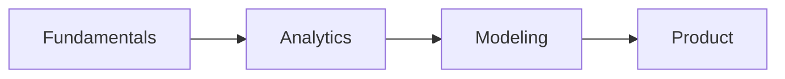

# Designing the Learning Path

> Data Science Career 101 series (3/10)

<!-- a-grade-intro:begin -->

**Core question**: In what order should you learn what?

> Fundamentals to analytics to modeling to product.

<!-- a-grade-intro:end -->

This is post 3 in the Data Science Career 101 series.

## What You Will Learn

- A *12-week roadmap*
- *Fundamentals* (4 weeks)
- *Analytics* (4 weeks)
- *Modeling* (4 weeks)
- *Weekly review*

## Why It Matters

Random study burns you out. A path keeps you going.

## Concept at a Glance



## Key Terms

- **fundamentals**: Core building blocks.
- **analytics**: Question-driven analysis.
- **modeling**: Predictive modeling.
- **product sense**: Sense of user impact.
- **retro**: Periodic reflection.

## Before/After

**Before**: "I just buy books and stall."

**After**: "A 12-week roadmap with weekly artifacts."

## Hands-on: 12-Week Learning Path

### Step 1 — Fundamentals (Weeks 1-4)

```text
- Python syntax, pandas
- SQL JOIN, GROUP BY
- Statistics basics (mean, variance, p-value)
- Visualization (matplotlib)
```

### Step 2 — Analytics (Weeks 5-8)

```text
- Data cleaning
- A/B test design
- One dashboard
- One case study
```

### Step 3 — Modeling (Weeks 9-12)

```text
- One regression, one classification
- scikit-learn pipeline
- Model evaluation metrics
- One mini project
```

### Step 4 — Weekly Artifact

```markdown
- README
- Data source
- Code
- Result
- Retro
```

### Step 5 — Retro Template

```text
What went well / Improve / Next
```

## What to Notice in This Code

- Weekly artifacts are progress evidence.
- Fundamentals carry modeling.
- Retros close the loop.

## Five Common Mistakes

1. **Reading a book cover-to-cover first.**
2. **Starting from models.**
3. **No artifacts.**
4. **Skipping retros.**
5. **Switching tools frequently.**

## How This Shows Up in Production

Bootcamps run on roughly the same 12-week roadmap.

## How a Senior Engineer Thinks

- Fundamentals compound.
- Weekly evidence wins.
- Retros direct you.
- Projects integrate.
- Sustainment is strategy.

## Checklist

- [ ] 12-week calendar.
- [ ] Weekly artifact template.
- [ ] One project.
- [ ] Four retros.

## Practice Problems

1. One line: define fundamentals.
2. One line: example of a retro.
3. One line: criterion for a weekly artifact.

## Wrap-up and Next Steps

Next post covers *The Data Portfolio*.

<!-- toc:begin -->
- [What Is a Data Career](./01-what-is-data-career.md)
- [Analyst vs Scientist vs Engineer](./02-analyst-scientist-engineer.md)
- **Designing the Learning Path (current)**
- The Data Portfolio (upcoming)
- SQL and Analytics Interviews (upcoming)
- The ML Interview (upcoming)
- The Case Interview (upcoming)
- Settling into the First Data Job (upcoming)
- Building Domain Expertise (upcoming)
- The Path to Senior in Data (upcoming)
<!-- toc:end -->

## References

- [Mode SQL Tutorial](https://mode.com/sql-tutorial/)
- [pandas docs](https://pandas.pydata.org/docs/)
- [scikit-learn user guide](https://scikit-learn.org/stable/user_guide.html)
- [Trustworthy Online Controlled Experiments](https://experimentguide.com/)

Tags: DataCareer, LearningPath, SQL, Python, Beginner
