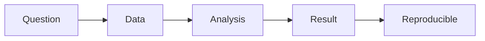

# The Data Portfolio

> Data Science Career 101 series (4/10)

<!-- a-grade-intro:begin -->

**Core question**: How do you compose a *data portfolio*?

> Problem to data to analysis to conclusion to reproducibility.

<!-- a-grade-intro:end -->

## What You Will Learn

- The shape of *three projects*
- A *README* template
- *Reproducibility*
- *Visualization*
- *Documentation*

## Why It Matters

It's the narrative, not the numbers, that gets you hired.

## Concept at a Glance



## Key Terms

- **portfolio**: A curated set of best work.
- **reproducible**: Anyone can rerun it.
- **storytelling**: Communicating the path.
- **README**: First-read document.
- **notebook**: Analysis notebook.

## Before/After

**Before**: "I push only model code to GitHub."

**After**: "I write up problem and conclusion alongside."

## Hands-on: Portfolio Composition

### Step 1 — Three Projects

```text
- one analytics (dashboard)
- one model (classification or regression)
- one data engineering (pipeline)
```

### Step 2 — README Template

```markdown
# Title
## Problem
## Data
## Approach
## Results
## How to Reproduce
```

### Step 3 — Reproducible Environment

```bash
uv pip install -r requirements.txt
make data
make run
```

### Step 4 — Visualization

```text
- one key chart
- one comparison table
- one one-line conclusion
```

### Step 5 — Documentation

```text
- enough markdown cells in the notebook
- decision notes
```

## What to Notice in This Code

- Reproducibility builds trust.
- Story builds memory.
- A conclusion creates impression.

## Five Common Mistakes

1. **Model only, no problem stated.**
2. **Unclear data source.**
3. **Not reproducible.**
4. **Empty README.**
5. **Excessive visualization.**

## How This Shows Up in Production

Interviewers look at the problem and conclusion within five minutes.

## How a Senior Engineer Thinks

- Reproducibility first.
- Define the problem.
- One-line conclusion.
- Story is the evidence.
- Links are your business card.

## Checklist

- [ ] Three projects.
- [ ] Five-section README.
- [ ] Reproduce command.
- [ ] One-sentence conclusion.

## Practice Problems

1. One line: define reproducible.
2. One line: example of storytelling.
3. One line: criterion for a good README.

## Wrap-up and Next Steps

Next post covers *SQL and Analytics Interviews*.

<!-- toc:begin -->
- [What Is a Data Career](./01-what-is-data-career.md)
- [Analyst vs Scientist vs Engineer](./02-analyst-scientist-engineer.md)
- [Designing the Learning Path](./03-learning-path.md)
- **The Data Portfolio (current)**
- SQL and Analytics Interviews (upcoming)
- The ML Interview (upcoming)
- The Case Interview (upcoming)
- Settling into the First Data Job (upcoming)
- Building Domain Expertise (upcoming)
- The Path to Senior in Data (upcoming)
<!-- toc:end -->

## References

- [Kaggle Datasets](https://www.kaggle.com/datasets)
- [Cookiecutter Data Science](https://drivendata.github.io/cookiecutter-data-science/)
- [Made with ML](https://madewithml.com/)
- [Towards Data Science portfolio guide](https://towardsdatascience.com/)

Tags: DataCareer, Portfolio, GitHub, Notebook, Beginner
