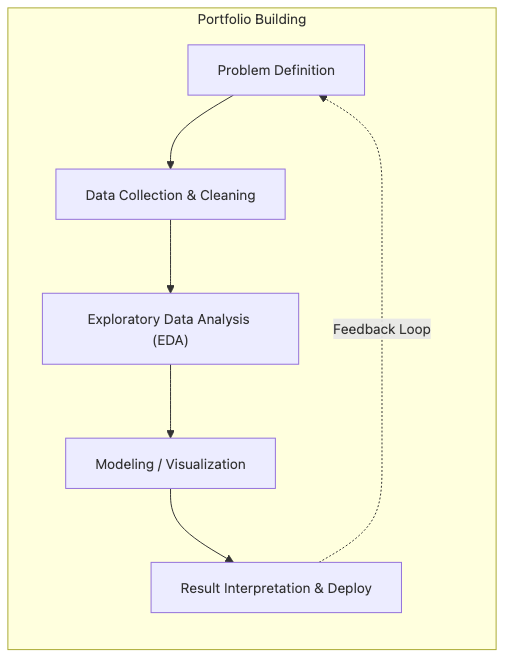

# The Data Portfolio

One of the fastest ways to weaken a data portfolio is to mistake code volume for proof of ability. Repositories full of notebooks and model files can still leave a hiring manager unconvinced if they never make the problem, the decision process, or the result easy to read.

Strong portfolios do something simpler and harder: they show a problem worth solving, a clean path through the data, a result that matters, and a reproducible way for someone else to inspect the work. That combination tells a much stronger story than “here is a model I trained.”

This is post 4 in the Data Science Career 101 series.

## Questions this chapter answers

- What mix of projects gives a beginner portfolio better signal?
- Why do code-only repositories usually feel weak in interviews?
- What should a strong README explain first?
- Why does reproducibility matter so much in data work?
- How much visualization and documentation is enough before it turns noisy?

> A good data portfolio is not a collection of notebooks. It is a record of problem framing, analysis, results, and reproducibility that another person can evaluate quickly.

## What You Will Learn

- The shape of *three projects*
- A *README* template
- *Reproducibility*
- *Visualization*
- *Documentation*

## Why It Matters

Hiring managers usually remember the shape of the story before they remember the exact metric.

If they can quickly understand the question, the data source, the method, the conclusion, and how to rerun the work, the project starts to look like evidence of judgment. Without that structure, even solid technical work can look unfinished or fragile.

## Concept at a Glance



*A portfolio becomes credible when problem framing, results, and reproducibility stay connected*
## Key Terms

- **portfolio**: A curated set of best work.
- **reproducible**: Anyone can rerun it.
- **storytelling**: Communicating the path.
- **README**: First-read document.
- **notebook**: Analysis notebook.

## Before/After

**Before**: "I push only model code to GitHub."

**After**: "I write up problem and conclusion alongside."

## Hands-on: Portfolio Composition

### Step 1 — Three Projects

```text
- one analytics (dashboard)
- one model (classification or regression)
- one data engineering (pipeline)
```

### Step 2 — README Template

```markdown
# Title
## Problem
## Data
## Approach
## Results
## How to Reproduce
```

### Step 3 — Reproducible Environment

```bash
uv pip install -r requirements.txt
make data
make run
```

### Step 4 — Visualization

```text
- one key chart
- one comparison table
- one one-line conclusion
```

### Step 5 — Documentation

```text
- enough markdown cells in the notebook
- decision notes
```

## What to Notice in This Code

- Reproducibility builds trust.
- Story builds memory.
- A conclusion creates impression.

## Five Common Mistakes

1. **Model only, no problem stated.**
2. **Unclear data source.**
3. **Not reproducible.**
4. **Empty README.**
5. **Excessive visualization.**

## How This Shows Up in Production

Interviewers often decide within a few minutes whether a project is worth deeper discussion. The first screen is usually the README, the main chart, and the conclusion.

That is why portfolio quality depends less on maximum complexity and more on whether a reviewer can recover the intent and trust the execution without guessing.

## How a Senior Engineer Thinks

- Reproducibility first.
- Define the problem.
- One-line conclusion.
- Story is the evidence.
- Links are your business card.

## Checklist

- [ ] Three projects.
- [ ] Five-section README.
- [ ] Reproduce command.
- [ ] One-sentence conclusion.

## Practice Problems

1. One line: define reproducible.
2. One line: example of storytelling.
3. One line: criterion for a good README.

## Wrap-up and Next Steps

The strongest beginner portfolio is usually not the flashiest one. It is the one that makes the problem legible, the method reproducible, and the conclusion easy to challenge or verify.

The next post moves from portfolio evidence to interview execution by focusing on SQL and analytics interview patterns.

<!-- toc:begin -->
- [What Is a Data Career](./01-what-is-data-career.md)
- [Analyst vs Scientist vs Engineer](./02-analyst-scientist-engineer.md)
- [Designing the Learning Path](./03-learning-path.md)
- **The Data Portfolio (current)**
- SQL and Analytics Interviews (upcoming)
- The ML Interview (upcoming)
- The Case Interview (upcoming)
- Settling into the First Data Job (upcoming)
- Building Domain Expertise (upcoming)
- The Path to Senior in Data (upcoming)
<!-- toc:end -->

## References

- [Kaggle - Datasets](https://www.kaggle.com/datasets)
- [DrivenData - Cookiecutter Data Science](https://drivendata.github.io/cookiecutter-data-science/)
- [Made With ML - MLOps and Project Structure Guides](https://madewithml.com/)
- [GitHub Docs - About READMEs](https://docs.github.com/repositories/managing-your-repositorys-settings-and-features/customizing-your-repository/about-readmes)

Tags: DataCareer, Portfolio, GitHub, Notebook, Beginner
