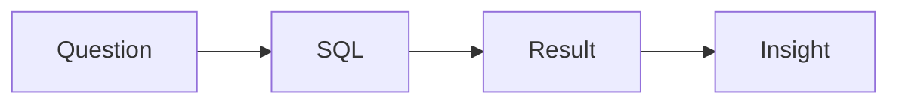

# SQL and Analytics Interviews

> Data Science Career 101 series (5/10)

<!-- a-grade-intro:begin -->

**Core question**: How do you prepare for SQL and analytics interviews?

> Decompose the question, JOIN, aggregate, window, interpret.

<!-- a-grade-intro:end -->

This is post 5 in the Data Science Career 101 series.

## What You Will Learn

- Core *SQL* patterns
- Question *decomposition*
- Metric *definition*
- Result *interpretation*
- Mock *practice*

## Why It Matters

SQL is the lingua franca of every data role.

## Concept at a Glance



## Key Terms

- **JOIN**: Combining tables.
- **GROUP BY**: Aggregation.
- **window function**: Row-wise aggregation over a frame.
- **CTE**: Common table expression.
- **funnel**: Funnel analysis.

## Before/After

**Before**: "I just write SELECT *."

**After**: "I decompose the question and use CTEs for readability."

## Hands-on: Five Question Patterns

### Step 1 — Single-Table Aggregation

```sql
SELECT date, COUNT(*) AS dau
FROM events
WHERE event = 'login'
GROUP BY date
ORDER BY date;
```

### Step 2 — JOIN

```sql
SELECT u.country, COUNT(o.id) AS orders
FROM users u
LEFT JOIN orders o ON o.user_id = u.id
GROUP BY u.country;
```

### Step 3 — Window Function

```sql
SELECT user_id, amount,
       SUM(amount) OVER (PARTITION BY user_id ORDER BY ts) AS cum
FROM payments;
```

### Step 4 — Funnel

```sql
WITH steps AS (
  SELECT user_id,
         MAX(CASE WHEN step='visit' THEN 1 ELSE 0 END) AS s1,
         MAX(CASE WHEN step='signup' THEN 1 ELSE 0 END) AS s2,
         MAX(CASE WHEN step='purchase' THEN 1 ELSE 0 END) AS s3
  FROM funnel GROUP BY user_id
)
SELECT SUM(s1), SUM(s2), SUM(s3) FROM steps;
```

### Step 5 — One-Sentence Interpretation

```text
"Conversion fell from X to Y, hypothesis Z."
```

## What to Notice in This Code

- CTEs improve readability.
- Metric definition changes the conclusion.
- Interpretation is the finish line.

## Five Common Mistakes

1. **Overusing SELECT *.**
2. **Ignoring NULL handling.**
3. **Ignoring time zones.**
4. **Vague metric definitions.**
5. **No interpretation.**

## How This Shows Up in Production

Analytics interviews typically pair one SQL problem with one case.

## How a Senior Engineer Thinks

- Define the metric first.
- CTEs are colleague-friendly.
- Interpretation is the value.
- Remember NULL.
- State the time zone.

## Checklist

- [ ] Four kinds of JOIN.
- [ ] Three windows.
- [ ] One funnel.
- [ ] One-sentence interpretation.

## Practice Problems

1. One line: define CTE.
2. One line: example of a funnel.
3. One line: criterion for a metric definition.

## Wrap-up and Next Steps

Next post covers *The ML Interview*.

<!-- toc:begin -->
- [What Is a Data Career](./01-what-is-data-career.md)
- [Analyst vs Scientist vs Engineer](./02-analyst-scientist-engineer.md)
- [Designing the Learning Path](./03-learning-path.md)
- [The Data Portfolio](./04-data-portfolio.md)
- **SQL and Analytics Interviews (current)**
- The ML Interview (upcoming)
- The Case Interview (upcoming)
- Settling into the First Data Job (upcoming)
- Building Domain Expertise (upcoming)
- The Path to Senior in Data (upcoming)
<!-- toc:end -->

## References

- [Mode SQL Tutorial](https://mode.com/sql-tutorial/)
- [LeetCode SQL](https://leetcode.com/studyplan/top-sql-50/)
- [Window Functions](https://www.postgresql.org/docs/current/tutorial-window.html)
- [Trustworthy Online Controlled Experiments](https://experimentguide.com/)

Tags: DataCareer, SQL, Analytics, Interview, Beginner
