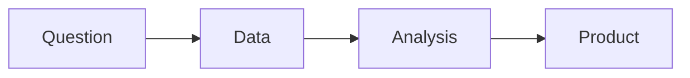

# 데이터 직무란 무엇인가

> Data Science Career 101 시리즈 (1/10)


## 이 글에서 다룰 문제

*같은* *데이터* 라도 *직책* 마다 *기대* 가 *다릅니다*.

## 전체 흐름


## Before/After

**Before**: "*데이터 직무* 는 *통계학* 만 *하는* *줄* *알았다*."

**After**: "*다섯* *직책* 의 *역할* 을 *구분* *할* *수* *있다*."

## 직책 5가지 한 줄 요약

### 1단계 — Analyst

```text
SQL과 대시보드로 의사결정 지원.
```

### 2단계 — Scientist

```text
실험과 모델로 가설 검증.
```

### 3단계 — Engineer

```text
파이프라인과 저장소로 데이터 인프라.
```

### 4단계 — ML Engineer

```text
모델 학습, 배포, 모니터링.
```

### 5단계 — Analytics Engineer

```text
dbt 등으로 신뢰 가능한 분석 모델.
```

## 이 코드에서 주목할 점

- *직책* *이름* 보다 *책임* 을 *본다*.
- *조직* *마다* *다르다*.
- *경계* 는 *흐릿* *하다*.

## 자주 하는 실수 5가지

1. ***이름* 으로 *판단* 한다.**
2. ***모든* *기술* 을 *동시* 에 *배운다*.**
3. ***도구* 만 *외운다*.**
4. ***도메인* 을 *무시* *한다*.**
5. ***측정* 을 *건너* *뛴다*.**

## 실무에서는 이렇게 쓰입니다

빅테크는 *Analyst*, *Scientist*, *ML Engineer*, *Analytics Engineer* 를 *분리* 합니다.

## 체크리스트

- [ ] *직책* 5가지 *구분*.
- [ ] *내* *관심* *영역* 1개 *선택*.
- [ ] *기본* 도구 *목록*.
- [ ] *학습* *예산* 1주.

## 정리 및 다음 단계

다음 글은 *분석가 vs 사이언티스트 vs 엔지니어* 입니다.

<!-- toc:begin -->
- **데이터 직무란 무엇인가 (현재 글)**
- 분석가 vs 사이언티스트 vs 엔지니어 (예정)
- 학습 경로 설계 (예정)
- 데이터 포트폴리오 (예정)
- SQL과 분석 인터뷰 (예정)
- ML 인터뷰 (예정)
- 케이스 인터뷰 (예정)
- 첫 직장 적응 (예정)
- 도메인 전문성 쌓기 (예정)
- 시니어 데이터 직무로 가는 길 (예정)
<!-- toc:end -->

## 참고 자료

- [Data roles overview](https://www.oreilly.com/library/view/data-science-from/9781492041122/)
- [dbt analytics engineering](https://www.getdbt.com/what-is-analytics-engineering)
- [Google Data Analytics Professional Certificate](https://grow.google/dataanalytics/)
- [DJ Patil — Data Scientist](https://hbr.org/2012/10/data-scientist-the-sexiest-job-of-the-21st-century)

Tags: DataCareer, Analyst, Scientist, Engineer, Beginner
