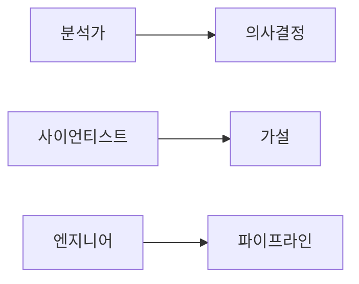

# 분석가 vs 사이언티스트 vs 엔지니어

데이터 커리어를 알아보다 보면 가장 자주 마주치는 질문이 있습니다. 분석가와 데이터 사이언티스트, 데이터 엔지니어는 도대체 어떻게 다르냐는 질문입니다. 겉으로 보면 셋 다 데이터를 다루고 SQL이나 Python을 쓰는 것처럼 보여서, 입문자 입장에서는 경계가 흐려 보이기 쉽습니다.

하지만 현업에서는 이 셋을 구분하는 기준이 꽤 분명합니다. 어떤 문제를 맡는지, 무엇을 결과물로 내는지, 어떤 도구를 우선으로 쓰는지, 무엇으로 성과를 판단하는지가 다릅니다. 이 차이를 이해하지 못하면 공부 방향도 흐려지고, 지원서도 모호해지기 쉽습니다.

## 이 글에서 다룰 문제

- 분석가, 사이언티스트, 엔지니어는 각각 어떤 목적을 중심에 둘까요?
- 세 역할은 어떤 산출물을 만들어 팀에 가치를 줄까요?
- 주요 도구가 다르게 보이는 이유는 무엇일까요?
- 각 역할의 성과를 평가하는 지표는 어떻게 다를까요?
- 한 사람이 여러 역할을 겸하는 조직에서는 무엇을 기준으로 구분해야 할까요?

> 같은 데이터를 다뤄도, 역할이 다르면 질문과 산출물과 성공 기준이 함께 바뀝니다.

## 한눈에 보는 전체 흐름



이 그림만 봐도 세 역할의 중심축이 다르다는 점을 알 수 있습니다. 분석가는 의사결정 지원, 사이언티스트는 가설 검증, 엔지니어는 데이터 흐름의 안정성에 무게를 둡니다. 결국 같은 팀에 있어도 “무엇을 먼저 잘해야 하는가”가 다르다는 뜻입니다.

## 핵심 용어

- **decision support**: 데이터를 바탕으로 의사결정을 돕는 일입니다.
- **A/B test**: 두 조건을 비교해 효과를 검증하는 통제 실험입니다.
- **ETL**: 데이터를 추출하고, 변환하고, 적재하는 흐름입니다.
- **feature store**: 모델이 쓰는 특징값을 공유·관리하는 저장소입니다.
- **SLA**: 서비스 수준 약속입니다.

## Before/After

**Before**: "셋 다 데이터를 보는 사람이니 큰 차이가 없는 줄 알았다."

**After**: "역할의 목적과 산출물을 기준으로 세 직무를 구분할 수 있다."

## 실습: 비교표를 직접 만들어 보기

세 역할을 한 번에 이해하려면 비교표가 가장 빠릅니다. 아래 다섯 기준은 채용 공고를 읽을 때도 그대로 사용할 수 있습니다.

### Step 1 — Purpose

```text
Analyst: answer questions
Scientist: validate hypotheses
Engineer: guarantee data flow
```

### Step 2 — Deliverables

```text
Analyst: dashboards, reports
Scientist: experiments, models
Engineer: pipelines, schemas
```

### Step 3 — Primary Tools

```text
Analyst: SQL, BI tool
Scientist: Python, notebook, Spark
Engineer: Airflow, dbt, Kafka
```

### Step 4 — Metrics

```text
Analyst: decision adoption rate
Scientist: experimental significance
Engineer: SLA, data quality
```

### Step 5 — Collaboration

```text
Analyst <-> PM/marketing
Scientist <-> PM/research
Engineer <-> backend/platform
```

## 이 예시에서 봐야 할 점

- 목적이 달라지면 자연스럽게 도구 우선순위도 달라집니다.
- 어떤 지표로 평가받는지 알면 역할의 성격이 더 선명해집니다.
- 회사마다 경계는 바뀔 수 있지만, 기본 축은 크게 흔들리지 않습니다.

예를 들어 분석가는 질문에 답해야 하므로 SQL과 지표 해석 역량이 중요하고, 사이언티스트는 가설 검증과 모델링이 중요하며, 엔지니어는 데이터가 제때 정확하게 흐르도록 만드는 일이 핵심입니다. 같은 Python을 써도 왜 쓰는지가 다릅니다. 입문자가 도구 목록만 보고 역할을 판단하면 자꾸 혼란스러워지는 이유가 여기에 있습니다.

## 자주 하는 실수 5가지

1. **도구만 보고 직무를 분류하는 실수**
2. **산출물을 보지 않고 추상적으로만 이해하는 실수**
3. **성과 지표를 생각하지 않는 실수**
4. **세 역할을 동시에 완벽하게 준비하려는 실수**
5. **도메인 맥락을 빼고 기술만 보는 실수**

## 실무에서는 이렇게 나타납니다

큰 조직에서는 세 역할이 비교적 뚜렷하게 나뉘지만, 작은 조직에서는 한 사람이 두 역할 이상을 맡는 경우가 많습니다. 그렇더라도 업무를 보면 차이는 남습니다. 대시보드와 리포트를 중심으로 돌아가면 분석가 성격이 강하고, 실험과 모델 검증이 많으면 사이언티스트에 가깝고, 데이터 적재·스키마·파이프라인 운영이 중심이면 엔지니어에 더 가깝습니다.

## 시니어는 이렇게 생각합니다

- 역할의 목적을 먼저 명확히 합니다.
- 산출물 합의를 먼저 해 두어야 협업이 편해집니다.
- 지표를 공유해야 서로 다른 역할도 같은 방향으로 움직입니다.
- 역할 경계는 유연하게 보되, 책임은 분명하게 둡니다.
- 한 축을 깊게 파면서도 옆 역할과 대화할 수 있는 T자형 역량을 키웁니다.

## 체크리스트

- [ ] 세 역할의 목적을 각각 설명할 수 있다.
- [ ] 각 역할의 대표 산출물을 하나씩 알고 있다.
- [ ] 역할별 주요 도구를 하나씩 적어 봤다.
- [ ] 역할별 핵심 지표를 하나씩 정리했다.

## 연습 문제

1. A/B test를 한 줄로 설명해 보세요.
2. ETL의 예를 한 줄로 적어 보세요.
3. 분석가와 사이언티스트의 지표 차이를 한 줄로 정리해 보세요.

## 정리 및 다음 단계

세 역할은 서로 경쟁 관계라기보다 분업 구조에 가깝습니다. 분석가는 질문을 구조화하고, 사이언티스트는 실험과 모델로 답을 검증하고, 엔지니어는 그 과정이 안정적으로 굴러가게 받쳐 줍니다. 이 차이를 이해하면 어느 역할을 준비할지 더 쉽게 고를 수 있고, 조직 안에서 역할이 겹칠 때도 무엇을 먼저 배워야 할지 판단하기 쉬워집니다.

다음 글에서는 입문자 관점에서 실제 학습 순서를 어떻게 짜면 좋은지, 12주 로드맵 형태로 정리해 보겠습니다.

<!-- toc:begin -->
- [데이터 직무란 무엇인가](./01-what-is-data-career.md)
- **분석가 vs 사이언티스트 vs 엔지니어 (현재 글)**
- 학습 경로 설계 (예정)
- 데이터 포트폴리오 (예정)
- SQL과 분석 인터뷰 (예정)
- ML 인터뷰 (예정)
- 케이스 인터뷰 (예정)
- 첫 직장 적응 (예정)
- 도메인 전문성 쌓기 (예정)
- 시니어 데이터 직무로 가는 길 (예정)
<!-- toc:end -->

## 참고 자료

- [Type A vs Type B Data Scientist](https://www.quora.com/What-is-data-science)
- [Analytics Engineer role](https://www.getdbt.com/what-is-analytics-engineering)
- [Designing Data-Intensive Applications](https://dataintensive.net/)
- [The Data Engineering Cookbook](https://github.com/andkret/Cookbook)

Tags: DataCareer, Roles, Analyst, Scientist, Engineer
