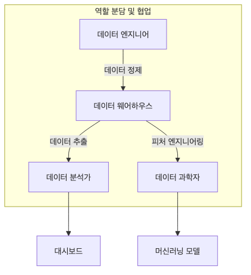

# 분석가 vs 사이언티스트 vs 엔지니어

입문자가 데이터 직무를 알아볼 때 가장 자주 묻는 질문은 결국 이것입니다. “분석가와 사이언티스트와 엔지니어는 정확히 뭐가 다른가요?” 겉으로 보면 모두 SQL과 Python을 쓰고, 모두 데이터를 다루기 때문에 차이가 흐릿하게 느껴질 수 있습니다.

하지만 실무에서는 누가 어떤 질문을 맡고, 어떤 결과물을 남기고, 무엇으로 평가받는지가 분명히 다릅니다. 이 차이를 모르고 준비하면 학습 계획도 넓게만 퍼지고, 지원서도 애매해지기 쉽습니다.

이 글은 Data Science Career 101 시리즈의 두 번째 글입니다.

## 이 글에서 다룰 문제

- 분석가, 사이언티스트, 엔지니어가 각각 어떤 목적을 중심에 두는지 비교합니다.
- 세 역할이 만드는 대표 산출물을 정리합니다.
- 주요 도구와 성과 지표가 왜 달라지는지 설명합니다.
- 협업 방식 차이가 어떤 실무 감각을 요구하는지 살펴봅니다.
- 한 사람이 여러 역할을 겸하는 조직에서 무엇을 기준으로 구분해야 하는지 짚습니다.

> 세 역할은 같은 데이터를 다루더라도 목표, 결과물, 협업 상대, 성공 기준이 다릅니다. 결국 직무를 가르는 것은 도구보다 목적입니다.

## 이 글에서 배우는 내용

- 각 역할의 목적
- 대표 산출물
- 주요 도구
- 성과 지표
- 협업 방식

## 왜 중요한가

역할 차이를 잘못 이해하면 학습 방향도 엇나가고 지원 전략도 모호해집니다. 특히 입문자일수록 “무엇을 잘해야 하는 직무인가”를 먼저 잡아야 불필요한 우회를 줄일 수 있습니다.

예를 들어 실험 설계와 해석이 강점인 사람에게는 사이언티스트 트랙이 맞을 수 있지만, 데이터 모델과 파이프라인 안정화에 더 끌리는 사람에게는 엔지니어 트랙이 더 자연스러울 수 있습니다. 같은 노력도 어디에 쓰느냐에 따라 체감 성장 속도가 크게 달라집니다.

## 한눈에 보는 개념



*분석가, 사이언티스트, 엔지니어가 각각 의사결정, 가설 검증, 데이터 흐름에 무게를 두는 구조*
이 그림은 세 역할의 중심축을 압축합니다. 분석가는 의사결정 지원, 사이언티스트는 가설 검증, 엔지니어는 데이터 흐름 보장에 무게를 둡니다.

## 핵심 용어

- **decision support**: 데이터를 바탕으로 의사결정을 돕는 일입니다.
- **A/B test**: 통제된 실험을 통해 효과를 비교하는 방식입니다.
- **ETL**: 데이터를 추출하고 변환하고 적재하는 흐름입니다.
- **feature store**: 모델 특징값을 재사용하기 위한 공유 저장소입니다.
- **SLA**: 서비스가 지켜야 하는 수준에 대한 약속입니다.

## Before / After

**Before**: "셋 다 데이터를 보는 사람이니 큰 차이가 없는 줄 알았다."

**After**: "목적과 산출물 기준으로 세 역할을 구분할 수 있다."

## 실습: 비교표 만들기

### Step 1 — Purpose

```text
Analyst: answer questions
Scientist: validate hypotheses
Engineer: guarantee data flow
```

목적은 역할의 나침반입니다. 질문에 답하는 역할인지, 가설을 검증하는 역할인지, 데이터 흐름을 보장하는 역할인지에 따라 필요한 역량이 달라집니다.

### Step 2 — Deliverables

```text
Analyst: dashboards, reports
Scientist: experiments, models
Engineer: pipelines, schemas
```

직무는 산출물로 가장 선명하게 드러납니다. 보고서와 대시보드가 중심인지, 실험 설계와 모델이 중심인지, 파이프라인과 스키마가 중심인지 보면 역할 구분이 쉬워집니다.

### Step 3 — Primary Tools

```text
Analyst: SQL, BI tool
Scientist: Python, notebook, Spark
Engineer: Airflow, dbt, Kafka
```

도구는 목적을 따라옵니다. 같은 Python을 써도 분석가는 가공과 해석에, 사이언티스트는 모델링에, 엔지니어는 파이프라인 자동화에 더 자주 씁니다.

### Step 4 — Metrics

```text
Analyst: decision adoption rate
Scientist: experimental significance
Engineer: SLA, data quality
```

어떤 지표로 평가받는지 알면 역할의 본질이 보입니다. 분석가는 의사결정 반영률, 사이언티스트는 검증의 신뢰도, 엔지니어는 안정성과 품질이 더 중요합니다.

### Step 5 — Collaboration

```text
Analyst <-> PM/marketing
Scientist <-> PM/research
Engineer <-> backend/platform
```

협업 상대도 다릅니다. 누구와 자주 대화하는지 보면 그 역할이 팀에서 어떤 위치를 차지하는지 이해하기 쉽습니다.

## 이 예시에서 먼저 봐야 할 점

- 목적이 도구를 결정합니다.
- 성과 지표가 행동을 바꿉니다.
- 회사마다 경계는 달라져도 기본 축은 유지됩니다.

입문자가 흔히 빠지는 함정은 도구 목록만 보고 역할을 판단하는 일입니다. 하지만 같은 SQL을 써도 질문을 푸는 사람과 데이터 흐름을 설계하는 사람의 일은 완전히 다릅니다.

## 자주 하는 실수 5가지

1. **도구만 보고 직무를 분류하는 실수**
2. **산출물을 무시하는 실수**
3. **성과 지표를 정의하지 않는 실수**
4. **세 역할을 동시에 완벽하게 준비하려는 실수**
5. **도메인을 빼고 기술만 보는 실수**

## 실무에서는 이렇게 나타납니다

큰 조직일수록 역할이 더 세밀하게 분리되고, 작은 조직일수록 한 사람이 둘 이상의 역할을 겸합니다. 그렇더라도 실제 업무를 보면 차이는 남습니다. 무엇을 책임지고 무엇으로 평가받는지 보면 역할은 결국 드러납니다.

## 시니어는 이렇게 생각합니다

- 역할의 목적을 먼저 명확히 합니다.
- 산출물 합의를 먼저 맞춥니다.
- 성과 지표를 팀과 공유합니다.
- 역할 경계는 유연하게 보되 책임은 분명히 둡니다.
- 한 축을 깊게 파면서도 옆 역할과 대화하는 T자형 역량을 키웁니다.

## 체크리스트

- [ ] 세 역할의 목적을 각각 설명할 수 있다.
- [ ] 각 역할의 대표 산출물을 하나씩 안다.
- [ ] 역할별 주요 도구를 하나씩 적어 봤다.
- [ ] 역할별 핵심 지표를 하나씩 정리했다.

## 연습 문제

1. A/B test를 한 줄로 설명해 보세요.
2. ETL의 예를 한 줄로 적어 보세요.
3. 분석가와 사이언티스트의 지표 차이를 한 줄로 정리해 보세요.

## 정리 및 다음 단계

세 역할은 경쟁 관계라기보다 분업 구조에 가깝습니다. 분석가는 질문을 구조화하고, 사이언티스트는 실험과 모델로 검증하고, 엔지니어는 그 과정이 안정적으로 돌아가게 받쳐 줍니다.

다음 글에서는 입문자 관점에서 실제 학습 순서를 어떻게 짜야 하는지 12주 로드맵으로 정리하겠습니다.

<!-- toc:begin -->
- [데이터 직무란 무엇인가](./01-what-is-data-career.md)
- **분석가 vs 사이언티스트 vs 엔지니어 (현재 글)**
- 학습 경로 설계 (예정)
- 데이터 포트폴리오 (예정)
- SQL과 분석 인터뷰 (예정)
- ML 인터뷰 (예정)
- 케이스 인터뷰 (예정)
- 첫 직장 적응 (예정)
- 도메인 전문성 쌓기 (예정)
- 시니어 데이터 직무로 가는 길 (예정)
<!-- toc:end -->

## 참고 자료

- [dbt Labs - What Is Analytics Engineering?](https://www.getdbt.com/blog/what-is-analytics-engineering)
- [Martin Kleppmann - Designing Data-Intensive Applications](https://dataintensive.net/)
- [IBM - What Is a Data Scientist?](https://www.ibm.com/think/topics/data-scientist)
- [IBM - What Is a Data Engineer?](https://www.ibm.com/think/topics/data-engineer)

Tags: DataCareer, Roles, Analyst, Scientist, Engineer
