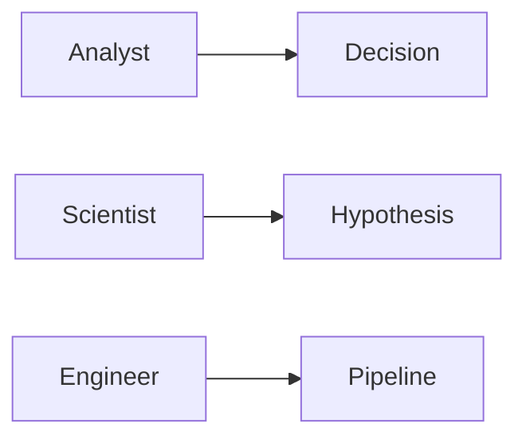

# 분석가 vs 사이언티스트 vs 엔지니어

> Data Science Career 101 시리즈 (2/10)

<!-- a-grade-intro:begin -->

**핵심 질문**: *세* *직책* 은 *무엇* 이 *어떻게* *다른가요*?

> *목적*, *산출물*, *도구*, *지표* 가 *다릅니다*.

<!-- a-grade-intro:end -->

## 이 글에서 배울 것

- *세* *직책* 의 *목적*
- *대표* *산출물*
- *주요* *도구*
- *성과* *지표*
- *협업* 방식

## 왜 중요한가

*직책* 을 *오해* *하면* *학습* 과 *지원* 이 *어긋* *납니다*.

## 개념 한눈에 보기



## 핵심 용어 정리

- **decision support**: *의사결정* *지원*.
- **A/B test**: *대조* *실험*.
- **ETL**: *추출-변환-적재*.
- **feature store**: *피처* *저장소*.
- **SLA**: *서비스* *수준* *약속*.

## Before/After

**Before**: "*셋* *다* *데이터* 만 *보는* *것* *같다*."

**After**: "*목적* 과 *산출물* 로 *구분* *할* *수* *있다*."

## 실습: 비교 표 만들기

### 1단계 — 목적

```text
Analyst: 질문에 답
Scientist: 가설 검증
Engineer: 데이터 흐름 보장
```

### 2단계 — 산출물

```text
Analyst: 대시보드, 리포트
Scientist: 실험 결과, 모델
Engineer: 파이프라인, 스키마
```

### 3단계 — 주요 도구

```text
Analyst: SQL, BI tool
Scientist: Python, Notebook, Spark
Engineer: Airflow, dbt, Kafka
```

### 4단계 — 성과 지표

```text
Analyst: 의사결정 채택률
Scientist: 실험의 통계적 유의성
Engineer: SLA, 데이터 품질
```

### 5단계 — 협업

```text
Analyst ↔ PM/마케팅
Scientist ↔ PM/리서처
Engineer ↔ 백엔드/플랫폼
```

## 이 코드에서 주목할 점

- *목적* 이 *툴* 을 *결정* 합니다.
- *지표* 가 *행동* 을 *유도* 합니다.
- *경계* 는 *조직* *마다* *다릅니다*.

## 자주 하는 실수 5가지

1. ***도구* 로 *직책* 을 *판단* *한다*.**
2. ***산출물* 을 *간과* 한다.**
3. ***지표* 가 *없다*.**
4. ***모든* *직책* 을 *동시* 에 *지향* *한다*.**
5. ***도메인* 을 *모른다*.**

## 실무에서는 이렇게 쓰입니다

대형 조직은 *역할* *간* *T자형* 협업을 *권장* 합니다.

## 시니어 엔지니어는 이렇게 생각합니다

- *목적* 을 *명시*.
- *산출물* 을 *합의*.
- *지표* 를 *공유*.
- *경계* 는 *유연*.
- *학습* 은 *T자*.

## 체크리스트

- [ ] *세* *직책* *목적* 구분.
- [ ] *대표* *산출물* 1개씩 알기.
- [ ] *주요* 도구 1개씩 실습.
- [ ] *지표* 1개씩 알기.

## 연습 문제

1. *A/B test* 한 줄 정의.
2. *ETL* *예* 한 줄.
3. *Analyst* 와 *Scientist* 의 *지표* 차이 한 줄.

## 정리 및 다음 단계

다음 글은 *학습 경로 설계* 입니다.

<!-- toc:begin -->
- [데이터 직무란 무엇인가](./01-what-is-data-career.md)
- **분석가 vs 사이언티스트 vs 엔지니어 (현재 글)**
- 학습 경로 설계 (예정)
- 데이터 포트폴리오 (예정)
- SQL과 분석 인터뷰 (예정)
- ML 인터뷰 (예정)
- 케이스 인터뷰 (예정)
- 첫 직장 적응 (예정)
- 도메인 전문성 쌓기 (예정)
- 시니어 데이터 직무로 가는 길 (예정)
<!-- toc:end -->

## 참고 자료

- [Type A vs Type B Data Scientist](https://www.quora.com/What-is-data-science)
- [Analytics Engineer role](https://www.getdbt.com/what-is-analytics-engineering)
- [Designing Data-Intensive Applications](https://dataintensive.net/)
- [The Data Engineering Cookbook](https://github.com/andkret/Cookbook)

Tags: DataCareer, Roles, Analyst, Scientist, Engineer
