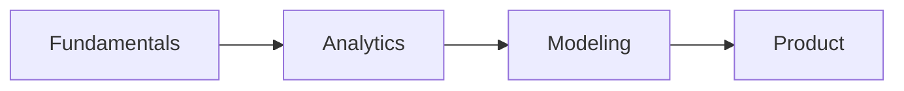

# 학습 경로 설계

> Data Science Career 101 시리즈 (3/10)


## 이 글에서 다룰 문제

*무작위 학습* 은 *지치고* *흩어집니다*. *경로* 가 *지속* 을 *돕습니다*.

## 개념 한눈에 보기



## Before/After

**Before**: "*책* 만 *사다가* *끝* *난다*."

**After**: "*12주* *로드맵* 으로 *주간* *산출물* 이 *남는다*."

## 실습: 12주 학습 경로

### 1단계 — 기초 (1~4주)

```text
- Python 문법, pandas
- SQL JOIN, GROUP BY
- 통계 기초 (평균, 분산, p-value)
- 시각화 (matplotlib)
```

### 2단계 — 분석 (5~8주)

```text
- 데이터 정제
- A/B test 설계
- 대시보드 1개
- 케이스 1건
```

### 3단계 — 모델 (9~12주)

```text
- 회귀, 분류 1개씩
- scikit-learn 파이프라인
- 모델 평가 지표
- 미니 프로젝트 1개
```

### 4단계 — 주간 산출물

```markdown
- README
- 데이터 출처
- 코드
- 결과
- 회고
```

### 5단계 — 회고 양식

```text
What went well / Improve / Next
```

## 이 코드에서 주목할 점

- *주간* *산출물* 이 *진척* 의 *증거*.
- *기초* 가 *모델* 을 *떠받칩니다*.
- *회고* 가 *루프* 를 *닫습니다*.

## 자주 하는 실수 5가지

1. ***책* 을 *처음부터* *끝* 까지.**
2. ***모델* 부터 *시작*.**
3. ***산출물* 이 *없다*.**
4. ***회고* 를 *건너* *뛴다*.**
5. ***도구* 만 *바꾼다*.**

## 실무에서는 이렇게 쓰입니다

기업 *부트캠프* 도 12주 *로드맵* 을 *기준* 으로 *운영* 합니다.

## 체크리스트

- [ ] 12주 *캘린더*.
- [ ] *주간* *산출물* 양식.
- [ ] *프로젝트* 1개.
- [ ] *회고* 4회.

## 정리 및 다음 단계

다음 글은 *데이터 포트폴리오* 입니다.

<!-- toc:begin -->
- [데이터 직무란 무엇인가](./01-what-is-data-career.md)
- [분석가 vs 사이언티스트 vs 엔지니어](./02-analyst-scientist-engineer.md)
- **학습 경로 설계 (현재 글)**
- 데이터 포트폴리오 (예정)
- SQL과 분석 인터뷰 (예정)
- ML 인터뷰 (예정)
- 케이스 인터뷰 (예정)
- 첫 직장 적응 (예정)
- 도메인 전문성 쌓기 (예정)
- 시니어 데이터 직무로 가는 길 (예정)
<!-- toc:end -->

## 참고 자료

- [Mode SQL Tutorial](https://mode.com/sql-tutorial/)
- [pandas docs](https://pandas.pydata.org/docs/)
- [scikit-learn user guide](https://scikit-learn.org/stable/user_guide.html)
- [Trustworthy Online Controlled Experiments](https://experimentguide.com/)

Tags: DataCareer, LearningPath, SQL, Python, Beginner
