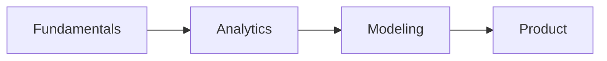

# 학습 경로 설계

이 글은 Data Science Career 101 시리즈의 세 번째 글입니다.

## 이 글에서 다룰 문제

- 데이터 직무 입문자는 무엇을 어떤 순서로 배워야 하는지 정리합니다.
- 12주 로드맵을 기초, 분석, 모델링 단계로 나누는 이유를 설명합니다.
- 매주 남기는 산출물이 왜 중요한지 짚습니다.
- 회고가 학습 지속성을 어떻게 높이는지 살펴봅니다.
- 완주 가능한 리듬을 어떻게 설계할지 제안합니다.

> 좋은 학습 경로는 더 많은 자료를 소비하는 계획이 아니라, 기초에서 분석과 모델링으로 이어지는 순서를 정하고 매주 증거를 남기는 계획입니다.

## 이 글에서 배우는 내용

- 12주 로드맵
- 4주 기초 구간
- 4주 분석 구간
- 4주 모델링 구간
- 주간 회고 방식

## 왜 중요한가

무작정 공부하면 의욕보다 먼저 방향을 잃습니다. 반대로 경로가 있으면 배운 내용이 다음 단계의 재료가 되고, 중간에 지치더라도 다시 돌아올 기준점이 남습니다.

## 한눈에 보는 개념



입문 단계에서는 이 순서가 중요합니다. 기초가 받쳐 줘야 분석이 흔들리지 않고, 분석 감각이 있어야 모델링 결과를 해석할 수 있으며, 마지막에는 제품과 사용자 맥락으로 연결해야 합니다.

## 핵심 용어

- **fundamentals**: Python, SQL, 통계 같은 핵심 기초입니다.
- **analytics**: 질문을 중심으로 데이터를 읽고 해석하는 단계입니다.
- **modeling**: 예측과 분류 같은 모델링 단계입니다.
- **product sense**: 결과가 사용자와 제품에 미치는 영향을 읽는 감각입니다.
- **retro**: 일정 주기로 학습을 돌아보는 회고입니다.

## Before / After

**Before**: "책만 사 두고 실제로는 진도가 나가지 않는다."

**After**: "주간 산출물이 있는 12주 로드맵으로 학습을 이어 갈 수 있다."

## 실습: 12주 학습 경로

### Step 1 — Fundamentals (Weeks 1-4)

```text
- Python syntax, pandas
- SQL JOIN, GROUP BY
- Statistics basics (mean, variance, p-value)
- Visualization (matplotlib)
```

처음 4주는 화려하지 않아도 괜찮습니다. 이 구간을 건너뛰면 뒤에서 더 큰 비용을 치르게 됩니다.

### Step 2 — Analytics (Weeks 5-8)

```text
- Data cleaning
- A/B test design
- One dashboard
- One case study
```

분석 단계에서는 질문을 구조화하고 결과를 설명하는 연습이 필요합니다. 지표와 해석을 같이 다뤄야 실전 감각이 붙습니다.

### Step 3 — Modeling (Weeks 9-12)

```text
- One regression, one classification
- scikit-learn pipeline
- Model evaluation metrics
- One mini project
```

모델링은 기초와 분석 위에 올라갑니다. 그래서 이 단계에서는 모델 자체보다 문제 정의와 평가 지표를 함께 보는 습관이 중요합니다.

### Step 4 — Weekly Artifact

```markdown
- README
- Data source
- Code
- Result
- Retro
```

주간 산출물은 “공부했다”가 아니라 “남겼다”는 증거입니다. 나중에 포트폴리오로 연결할 수 있다는 점에서도 중요합니다.

### Step 5 — Retro Template

```text
What went well / Improve / Next
```

회고는 의욕을 다지는 의식이 아니라 방향을 조정하는 장치입니다. 무엇이 잘됐고 무엇을 줄여야 하는지 짧게라도 남겨야 같은 실수를 반복하지 않습니다.

## 이 예시에서 먼저 봐야 할 점

- 주간 산출물은 성장의 증거입니다.
- 기초가 있어야 모델링도 흔들리지 않습니다.
- 회고가 학습 루프를 닫아 줍니다.

입문자가 자주 하는 실수는 모델부터 시작하는 일입니다. 하지만 실제로 더 자주 막히는 곳은 SQL, 데이터 정리, 기본 통계입니다. 기초를 건너뛰지 않는 편이 결국 더 빠릅니다.

## 자주 하는 실수 5가지

1. **책을 처음부터 끝까지 읽은 뒤 시작하려는 실수**
2. **모델링부터 먼저 시작하는 실수**
3. **산출물을 남기지 않는 실수**
4. **회고를 건너뛰는 실수**
5. **도구를 자주 바꾸는 실수**

## 실무에서는 이렇게 나타납니다

많은 부트캠프와 사내 교육도 대체로 이 12주 구조를 닮아 있습니다. 기초를 다지고, 분석 문제를 풀고, 마지막에 작은 모델링 프로젝트를 붙이는 흐름이 가장 재현 가능하기 때문입니다.

## 시니어는 이렇게 생각합니다

- 기초는 시간이 갈수록 복리처럼 쌓입니다.
- 매주 남는 증거가 있어야 성장도 설명할 수 있습니다.
- 회고가 다음 주의 방향을 정합니다.
- 프로젝트가 개별 기술을 하나로 묶어 줍니다.
- 지속 가능성이 곧 전략입니다.

## 체크리스트

- [ ] 12주 학습 캘린더를 만들었다.
- [ ] 주간 산출물 템플릿을 만들었다.
- [ ] 프로젝트 하나를 정했다.
- [ ] 최소 네 번의 회고 시점을 잡았다.

## 연습 문제

1. fundamentals를 한 줄로 설명해 보세요.
2. retro의 예를 한 줄로 적어 보세요.
3. 좋은 주간 산출물의 기준을 한 줄로 정리해 보세요.

## 정리 및 다음 단계

좋은 학습 계획은 더 많은 자료를 소비하는 계획이 아니라, 매주 작은 결과물을 만들며 다음 단계로 넘어가는 계획입니다. 기초, 분석, 모델링을 순서대로 밟고 매주 흔적을 남기면 공부가 자산으로 바뀝니다.

다음 글에서는 이렇게 쌓은 결과물을 어떻게 포트폴리오로 구성해야 하는지 살펴보겠습니다.

<!-- toc:begin -->
- [데이터 직무란 무엇인가](./01-what-is-data-career.md)
- [분석가 vs 사이언티스트 vs 엔지니어](./02-analyst-scientist-engineer.md)
- **학습 경로 설계 (현재 글)**
- 데이터 포트폴리오 (예정)
- SQL과 분석 인터뷰 (예정)
- ML 인터뷰 (예정)
- 케이스 인터뷰 (예정)
- 첫 직장 적응 (예정)
- 도메인 전문성 쌓기 (예정)
- 시니어 데이터 직무로 가는 길 (예정)
<!-- toc:end -->

## 참고 자료

- [Mode SQL Tutorial](https://mode.com/sql-tutorial/)
- [pandas docs](https://pandas.pydata.org/docs/)
- [scikit-learn user guide](https://scikit-learn.org/stable/user_guide.html)
- [Trustworthy Online Controlled Experiments](https://experimentguide.com/)

Tags: DataCareer, LearningPath, SQL, Python, Beginner
