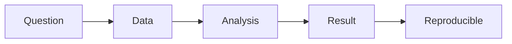

# 데이터 포트폴리오

이 글은 Data Science Career 101 시리즈의 네 번째 글입니다.

## 이 글에서 다룰 문제

- 데이터 포트폴리오를 어떤 프로젝트 조합으로 구성하면 좋은지 설명합니다.
- 코드만 있는 저장소가 왜 약하게 보이는지 짚습니다.
- README가 어떤 구조를 가져야 하는지 정리합니다.
- 재현 가능성이 왜 신뢰로 연결되는지 설명합니다.
- 시각화와 문서화를 어느 수준까지 넣어야 하는지 제안합니다.

> 좋은 포트폴리오는 모델 코드 모음이 아니라, 문제에서 데이터와 분석을 거쳐 결론과 재현 방법까지 이어지는 작업 기록입니다.

## 이 글에서 배우는 내용

- 세 가지 프로젝트 구성
- README 템플릿
- 재현 가능성
- 시각화 원칙
- 문서화 방식

## 왜 중요한가

채용에서 기억에 남는 것은 숫자 자체보다 서사입니다. 무슨 문제를 풀었고, 어떤 판단을 했고, 어떤 결론에 도달했는지를 빠르게 전달할 수 있어야 인터뷰로 이어집니다.

## 한눈에 보는 개념



좋은 포트폴리오는 이 흐름을 빠짐없이 보여 줍니다. 질문이 없으면 맥락이 없고, 결과만 있으면 신뢰가 약하며, 재현 방법이 없으면 협업 가능성이 잘 드러나지 않습니다.

## 핵심 용어

- **portfolio**: 가장 좋은 작업을 선별해 보여 주는 묶음입니다.
- **reproducible**: 다른 사람도 같은 결과를 다시 실행할 수 있는 상태입니다.
- **storytelling**: 문제에서 결론까지의 경로를 설득력 있게 전달하는 방식입니다.
- **README**: 저장소를 처음 열었을 때 가장 먼저 읽는 문서입니다.
- **notebook**: 분석 과정을 순서대로 기록한 작업 노트입니다.

## Before / After

**Before**: "모델 코드만 GitHub에 올리면 포트폴리오가 되는 줄 알았다."

**After**: "문제와 결론, 재현 방법까지 함께 정리해야 한다는 점을 이해했다."

## 실습: 포트폴리오 구성

### Step 1 — Three Projects

```text
- one analytics (dashboard)
- one model (classification or regression)
- one data engineering (pipeline)
```

세 프로젝트는 서로 다른 역량을 보여 줍니다. 분석 프로젝트는 질문과 해석, 모델 프로젝트는 평가와 검증, 데이터 엔지니어링 프로젝트는 흐름과 재현성을 보여 주기에 좋습니다.

### Step 2 — README Template

```markdown
# Title
## Problem
## Data
## Approach
## Results
## How to Reproduce
```

README는 저장소의 첫인상입니다. 무엇을 만들었는지보다 왜 만들었는지, 무엇을 배웠는지를 먼저 보여 주는 편이 더 강합니다.

### Step 3 — Reproducible Environment

```bash
uv pip install -r requirements.txt
make data
make run
```

실행 방법이 명확하면 프로젝트의 신뢰도가 크게 올라갑니다. 재현 가능성은 실무 감각을 드러내는 가장 값싼 신호 중 하나입니다.

### Step 4 — Visualization

```text
- one key chart
- one comparison table
- one one-line conclusion
```

시각화는 많다고 좋은 것이 아닙니다. 핵심 차트 하나, 비교 표 하나, 한 줄 결론 하나가 오히려 더 오래 남습니다.

### Step 5 — Documentation

```text
- enough markdown cells in the notebook
- decision notes
```

문서화는 단순 장식이 아닙니다. 어떤 선택을 왜 했는지 남겨 두면 협업 가능성과 사고 과정이 함께 드러납니다.

## 이 예시에서 먼저 봐야 할 점

- 재현 가능성은 신뢰를 만듭니다.
- 서사는 기억을 만듭니다.
- 결론 한 줄이 인상을 남깁니다.

입문자 포트폴리오일수록 화려함보다 완결성이 중요합니다. 작은 프로젝트라도 문제 정의, 접근 방식, 결과, 재현 방법이 모두 정리되어 있으면 훨씬 강한 인상을 줍니다.

## 자주 하는 실수 5가지

1. **문제 설명 없이 모델만 올리는 실수**
2. **데이터 출처를 불분명하게 두는 실수**
3. **재현할 수 없게 만드는 실수**
4. **README를 비워 두는 실수**
5. **시각화를 과하게 넣는 실수**

## 실무에서는 이렇게 나타납니다

면접관은 보통 몇 분 안에 프로젝트의 문제와 결론을 훑습니다. 이때 README 첫 화면, 핵심 시각화 한두 장, 결론 한 줄이 가장 큰 역할을 합니다. 복잡한 프로젝트보다 빠르게 이해되는 프로젝트가 더 강할 때가 많습니다.

## 시니어는 이렇게 생각합니다

- 재현 가능성이 먼저입니다.
- 문제를 먼저 정의합니다.
- 결론을 한 줄로 남깁니다.
- 서사가 곧 증거입니다.
- 링크 하나하나가 내 명함입니다.

## 체크리스트

- [ ] 서로 다른 성격의 프로젝트 세 개를 골랐다.
- [ ] 다섯 섹션 README 구조를 만들었다.
- [ ] 재현 명령을 적어 두었다.
- [ ] 한 문장 결론을 남겼다.

## 연습 문제

1. reproducible을 한 줄로 설명해 보세요.
2. storytelling의 예를 한 줄로 적어 보세요.
3. 좋은 README의 기준을 한 줄로 정리해 보세요.

## 정리 및 다음 단계

좋은 데이터 포트폴리오는 코드보다 문제 정의와 결론 전달이 더 또렷합니다. 분석, 모델, 데이터 엔지니어링 프로젝트를 균형 있게 고르고 README와 재현 방법까지 갖추면 입문자 포트폴리오의 설득력이 크게 올라갑니다.

다음 글에서는 데이터 직무 면접에서 빠지지 않는 SQL과 분석 인터뷰를 다루겠습니다.

<!-- toc:begin -->
- [데이터 직무란 무엇인가](./01-what-is-data-career.md)
- [분석가 vs 사이언티스트 vs 엔지니어](./02-analyst-scientist-engineer.md)
- [학습 경로 설계](./03-learning-path.md)
- **데이터 포트폴리오 (현재 글)**
- SQL과 분석 인터뷰 (예정)
- ML 인터뷰 (예정)
- 케이스 인터뷰 (예정)
- 첫 직장 적응 (예정)
- 도메인 전문성 쌓기 (예정)
- 시니어 데이터 직무로 가는 길 (예정)
<!-- toc:end -->

## 참고 자료

- [Kaggle Datasets](https://www.kaggle.com/datasets)
- [Cookiecutter Data Science](https://drivendata.github.io/cookiecutter-data-science/)
- [Made with ML](https://madewithml.com/)
- [Towards Data Science portfolio guide](https://towardsdatascience.com/)

Tags: DataCareer, Portfolio, GitHub, Notebook, Beginner
