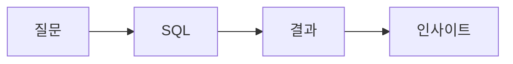

# SQL과 분석 인터뷰

데이터 직무 면접에서 SQL은 거의 빠지지 않습니다. 이유는 단순합니다. SQL은 많은 데이터 팀에서 공용어처럼 쓰이기 때문입니다. 모델링을 하든, 대시보드를 만들든, 지표를 검증하든, 결국 데이터를 읽고 묶고 비교하는 기본 역량이 필요합니다.

그런데 SQL 인터뷰를 어렵게 만드는 것은 문법 자체보다 질문 해석입니다. 어떤 테이블을 붙여야 하는지, 어떤 지표를 정의해야 하는지, 결과를 어떻게 읽어야 하는지가 함께 나오기 때문입니다. 그래서 준비할 때도 쿼리만 외우기보다 질문을 분해하고 해석까지 연결하는 연습이 필요합니다.

## 이 글에서 다룰 문제

- SQL과 분석 인터뷰는 무엇을 평가하려고 할까요?
- 문제를 받았을 때 어떤 순서로 분해해야 할까요?
- JOIN, 집계, 윈도우 함수, 퍼널 분석은 어떻게 자주 등장할까요?
- 지표 정의가 결과 해석을 바꾸는 이유는 무엇일까요?
- 쿼리 결과를 한 문장으로 해석하는 연습이 왜 중요할까요?

> SQL 인터뷰의 핵심은 문법 암기가 아니라, 질문을 구조화하고 결과를 의미 있는 해석으로 끝내는 능력입니다.

## 한눈에 보는 전체 흐름



좋은 답변은 여기서 끝납니다. 질문을 SQL로 옮기고, 결과를 뽑고, 마지막으로 그 결과가 무엇을 뜻하는지 말할 수 있어야 합니다. 많은 지원자가 쿼리 작성까지만 하고 멈추는데, 실제 현업에서는 해석이 빠지면 절반만 한 셈입니다.

## 핵심 용어

- **JOIN**: 여러 테이블을 연결하는 연산입니다.
- **GROUP BY**: 데이터를 기준별로 묶어 집계하는 구문입니다.
- **window function**: 행별 맥락을 유지하면서 집계를 수행하는 함수입니다.
- **CTE**: 쿼리를 단계별로 읽기 쉽게 나누는 common table expression입니다.
- **funnel**: 단계별 전환을 보는 퍼널 분석입니다.

## Before/After

**Before**: "문제가 나오면 일단 SELECT *부터 쓰는 편이다."

**After**: "질문을 분해하고, CTE로 구조를 나누고, 결과를 한 문장으로 해석할 수 있다."

## 실습: 자주 나오는 다섯 가지 문제 패턴

실제 인터뷰 문제는 다양해 보여도 몇 가지 패턴으로 묶입니다. 아래 다섯 유형을 익혀 두면 낯선 문제도 훨씬 덜 막힙니다.

### Step 1 — Single-Table Aggregation

```sql
SELECT date, COUNT(*) AS dau
FROM events
WHERE event = 'login'
GROUP BY date
ORDER BY date;
```

가장 기본적인 패턴입니다. 날짜별, 국가별, 채널별처럼 하나의 기준으로 묶어 지표를 보는 문제는 거의 항상 나옵니다. 이 문제는 문법보다도 무엇을 세고 있는지 명확히 말하는 습관이 중요합니다.

### Step 2 — JOIN

```sql
SELECT u.country, COUNT(o.id) AS orders
FROM users u
LEFT JOIN orders o ON o.user_id = u.id
GROUP BY u.country;
```

JOIN 문제에서는 연결 기준과 NULL 처리까지 같이 생각해야 합니다. 특히 `LEFT JOIN`인지 `INNER JOIN`인지에 따라 해석이 달라지므로, 왜 그 JOIN을 썼는지 말할 수 있어야 합니다.

### Step 3 — Window Function

```sql
SELECT user_id, amount,
       SUM(amount) OVER (PARTITION BY user_id ORDER BY ts) AS cum
FROM payments;
```

윈도우 함수는 누적 합, 순위, 이동 평균처럼 맥락이 있는 계산에 자주 쓰입니다. 인터뷰에서는 문법보다 `PARTITION BY`와 `ORDER BY`가 어떤 의미인지 설명하는 능력이 더 중요합니다.

### Step 4 — Funnel

```sql
WITH steps AS (
  SELECT user_id,
         MAX(CASE WHEN step='visit' THEN 1 ELSE 0 END) AS s1,
         MAX(CASE WHEN step='signup' THEN 1 ELSE 0 END) AS s2,
         MAX(CASE WHEN step='purchase' THEN 1 ELSE 0 END) AS s3
  FROM funnel GROUP BY user_id
)
SELECT SUM(s1), SUM(s2), SUM(s3) FROM steps;
```

퍼널 문제는 제품 분석 직군에서 특히 자주 나옵니다. 각 단계의 정의가 무엇인지, 중복 사용자를 어떻게 셀 것인지, 기간 조건을 어떻게 둘 것인지에 따라 결과가 크게 달라집니다.

### Step 5 — One-Sentence Interpretation

```text
"Conversion fell from X to Y, hypothesis Z."
```

이 마지막 한 문장이 의외로 가장 중요합니다. 결과가 나왔을 때 무엇이 바뀌었고, 어떤 가설이 가능한지, 다음에 무엇을 확인할지 말할 수 있어야 실제 분석 역량으로 이어집니다.

## 이 예시에서 봐야 할 점

- CTE는 정답을 더 읽기 쉽게 만듭니다.
- 지표 정의가 달라지면 결론도 달라집니다.
- 해석까지 가야 분석 답변이 완성됩니다.

면접관은 보통 SQL 자체보다 사고 과정을 함께 봅니다. 어떤 가정을 두는지, 시간대를 고려하는지, NULL을 어떻게 처리하는지, 결과를 어떻게 설명하는지가 드러나기 때문입니다. 그래서 쿼리를 빨리 쓰는 것보다, 질문을 천천히 분해하는 태도가 더 좋은 평가로 이어질 때가 많습니다.

## 자주 하는 실수 5가지

1. **SELECT *를 습관적으로 남발하는 실수**
2. **NULL 처리를 빼먹는 실수**
3. **시간대와 기간 기준을 무시하는 실수**
4. **지표 정의를 모호하게 두는 실수**
5. **결과 해석 없이 쿼리로만 끝내는 실수**

## 실무에서는 이렇게 나타납니다

많은 분석 인터뷰는 SQL 한 문제와 케이스 질문 한 문제를 함께 냅니다. SQL로 데이터를 다루는 기본기를 보고, 이어서 그 결과를 제품이나 비즈니스 판단으로 연결할 수 있는지 확인하는 방식입니다. 결국 쿼리 작성 능력과 해석 능력이 한 세트로 움직입니다.

## 시니어는 이렇게 생각합니다

- 지표 정의를 먼저 확정합니다.
- CTE로 동료가 읽기 쉬운 쿼리를 만듭니다.
- 결과 해석이 실제 가치라고 봅니다.
- NULL과 중복, 시간대를 먼저 의심합니다.
- 숫자만 말하지 않고 그 숫자가 뜻하는 바를 같이 설명합니다.

## 체크리스트

- [ ] 네 가지 JOIN 차이를 설명할 수 있다.
- [ ] 윈도우 함수 예시를 세 개 이상 풀어 봤다.
- [ ] 퍼널 분석 문제를 한 번 직접 풀어 봤다.
- [ ] 쿼리 결과를 한 문장으로 해석하는 연습을 했다.

## 연습 문제

1. CTE를 한 줄로 설명해 보세요.
2. 퍼널 분석의 예를 한 줄로 적어 보세요.
3. 좋은 지표 정의의 기준을 한 줄로 정리해 보세요.

## 정리 및 다음 단계

SQL과 분석 인터뷰는 쿼리 시험이면서 동시에 사고력 시험입니다. 질문을 분해하고, 적절한 JOIN과 집계를 고르고, 필요한 경우 CTE로 구조를 정리하고, 마지막에 결과를 해석하는 흐름이 핵심입니다. SQL을 잘한다는 것은 문법을 빨리 쓰는 일이 아니라, 질문을 숫자로 번역해 의미 있는 판단으로 연결하는 일에 가깝습니다.

다음 글에서는 머신러닝 인터뷰에서 어떤 질문이 나오고, 어떤 방식으로 답을 구성하면 좋은지 살펴보겠습니다.

<!-- toc:begin -->
- [데이터 직무란 무엇인가](./01-what-is-data-career.md)
- [분석가 vs 사이언티스트 vs 엔지니어](./02-analyst-scientist-engineer.md)
- [학습 경로 설계](./03-learning-path.md)
- [데이터 포트폴리오](./04-data-portfolio.md)
- **SQL과 분석 인터뷰 (현재 글)**
- ML 인터뷰 (예정)
- 케이스 인터뷰 (예정)
- 첫 직장 적응 (예정)
- 도메인 전문성 쌓기 (예정)
- 시니어 데이터 직무로 가는 길 (예정)
<!-- toc:end -->

## 참고 자료

- [Mode SQL Tutorial](https://mode.com/sql-tutorial/)
- [LeetCode SQL](https://leetcode.com/studyplan/top-sql-50/)
- [Window Functions](https://www.postgresql.org/docs/current/tutorial-window.html)
- [Trustworthy Online Controlled Experiments](https://experimentguide.com/)

Tags: DataCareer, SQL, Analytics, Interview, Beginner
