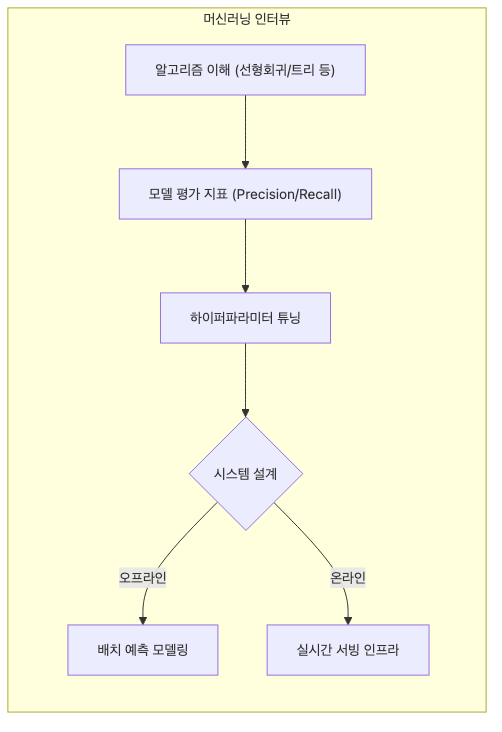

# ML 인터뷰

머신러닝 인터뷰를 처음 준비할 때는 보통 모델 이름과 알고리즘 개념부터 외우기 시작합니다. Random Forest, XGBoost, Logistic Regression, Precision, Recall 같은 키워드는 익숙해지지만, 막상 면접에서 “이 문제에서는 왜 이 지표를 보겠는가?”라는 질문이 나오면 답변이 급격히 얕아지기 쉽습니다.

실무 인터뷰는 모델 암기보다 판단 구조를 더 많이 봅니다. 어떤 문제를 풀고 있는지, 데이터 누수나 드리프트 같은 운영 함정을 알고 있는지, 그리고 모델을 서비스 안에서 어떻게 모니터링할지를 연결해 말할 수 있어야 깊이가 드러납니다.

이 글은 Data Science Career 101 시리즈의 여섯 번째 글입니다.

## 이 글에서 다룰 문제

- ML 인터뷰가 실제로 어떤 영역을 묻는지 정리합니다.
- 모델 선택을 설명할 때 무엇을 먼저 말해야 하는지 설명합니다.
- 평가 지표를 문제 정의와 함께 봐야 하는 이유를 짚습니다.
- 데이터 누수와 드리프트 같은 함정이 왜 자주 나오는지 살펴봅니다.
- 모델을 넘어 시스템 관점으로 답해야 하는 이유를 정리합니다.

> 좋은 ML 답변은 모델 이름을 나열하는 데서 끝나지 않습니다. 문제 정의, 지표 선택, 운영 함정, 시스템 설계까지 함께 설명해야 실무 감각이 드러납니다.

## 이 글에서 배우는 내용

- 기초 개념 질문
- 모델 선택 논리
- 평가 지표
- 운영 함정
- ML 시스템 설계 관점

## 왜 중요한가

머신러닝 면접은 모델 암기 시험이 아닙니다. 어떤 문제를 풀고 있는지, 어떤 지표를 우선해야 하는지, 운영에서 어떤 리스크가 있는지를 함께 생각할 수 있는지 보는 자리입니다.

특히 최근 면접은 모델 선택보다 배포 이후를 더 자주 묻습니다. 데이터가 언제 들어오는지, 재학습 주기는 어떻게 잡는지, 성능 저하를 어떻게 감지하는지 설명해야 실제 서비스 감각이 있는 지원자로 보입니다.

## 한눈에 보는 개념



*문제 정의에서 모델 선택, 평가, 배포로 이어지는 ML 인터뷰 답변 구조*
이 흐름을 답변 구조로 잡으면 훨씬 단단해집니다. 문제를 정의하고, 모델을 선택하고, 평가 기준을 설명한 뒤, 배포와 모니터링까지 연결해야 합니다.

## 핵심 용어

- **bias-variance**: 과소적합과 과적합 사이의 균형입니다.
- **overfitting**: 학습 데이터를 지나치게 외워 일반화가 약해진 상태입니다.
- **AUC**: ROC 곡선 아래 면적입니다.
- **precision/recall**: 오탐과 미탐 사이의 균형을 보여 주는 지표입니다.
- **drift**: 시간이 지나며 데이터 분포가 변하는 현상입니다.

## Before / After

**Before**: "Random Forest가 늘 무난한 정답이라고 생각했다."

**After**: "문제 정의와 지표를 기준으로 모델을 고를 수 있다."

## 실습: 다섯 가지 답변 패턴

### Step 1 — Fundamentals

```text
Explain bias-variance in one line.
```

기초 개념 질문은 짧지만 강합니다. 한 줄로 설명할 수 있을 정도로 개념을 압축해 두어야 응용 질문도 흔들리지 않습니다.

### Step 2 — Model Choice

```text
- assumptions: linear vs tree vs neural
- data size, interpretability
```

모델 선택 문제에서는 이름보다 기준이 중요합니다. 데이터 크기, 가정, 해석 가능성, 지연 요구사항 같은 판단 기준을 먼저 말해야 합니다.

### Step 3 — Evaluation

```python
from sklearn.metrics import precision_score, recall_score, roc_auc_score
```

평가 지표는 문제 맥락과 분리해서 말할 수 없습니다. 비용 구조가 다른 문제에서는 precision과 recall의 우선순위도 달라집니다.

### Step 4 — Production Traps

```text
- data leakage
- class imbalance
- time leakage
```

이 함정들을 먼저 언급하면 답변의 깊이가 달라집니다. 특히 leakage를 알고 있다는 사실 자체가 실무 감각 신호가 됩니다.

### Step 5 — System Design

```text
- data -> train -> serve -> monitor
- retraining cadence
- drift detection
```

좋은 답변은 모델 하나를 잘 고르는 데서 멈추지 않습니다. 데이터 수집부터 서빙과 모니터링까지 하나의 시스템으로 설명할 수 있어야 합니다.

## 이 예시에서 먼저 봐야 할 점

- 지표가 답변의 방향을 결정합니다.
- 함정을 먼저 언급하면 시니어리티가 드러납니다.
- 모델을 시스템 일부로 보는 관점이 중요합니다.

많은 지원자가 정확도나 AUC만 말하고 끝내지만, 서비스 환경에서는 그것만으로 충분하지 않습니다. 데이터 분포 변화와 운영 비용까지 생각해야 실제 답이 됩니다.

## 자주 하는 실수 5가지

1. **모든 문제에 같은 모델을 답으로 내는 실수**
2. **AUC만 보고 끝내는 실수**
3. **leakage를 모르는 실수**
4. **재학습 계획이 없는 실수**
5. **해석 가능성을 무시하는 실수**

## 실무에서는 이렇게 나타납니다

실제 인터뷰에서는 정확도보다 운영 질문이 더 길어지는 경우가 많습니다. 데이터가 언제 들어오고, 예측이 어디서 쓰이고, 분포가 바뀌면 어떻게 대응할지를 설명할 수 있어야 하기 때문입니다.

## 시니어는 이렇게 생각합니다

- 문제 정의에서 시작합니다.
- 지표가 모델 선택을 이끕니다.
- 함정을 먼저 떠올립니다.
- 개별 모델보다 시스템 수준에서 봅니다.
- 드리프트와 재학습 계획까지 포함합니다.

## 체크리스트

- [ ] 주요 평가 지표 다섯 개를 설명할 수 있다.
- [ ] 서로 다른 모델 세 가지를 비교할 수 있다.
- [ ] 실무 함정 세 가지를 말할 수 있다.
- [ ] 간단한 ML 시스템 흐름도를 설명할 수 있다.

## 연습 문제

1. overfitting을 한 줄로 설명해 보세요.
2. drift의 예를 한 줄로 적어 보세요.
3. AUC와 recall의 차이를 한 줄로 정리해 보세요.

## 정리 및 다음 단계

ML 인터뷰에서 중요한 것은 모델 이름을 많이 아는 일이 아니라, 문제와 지표와 운영 리스크를 함께 묶어 설명하는 일입니다. 문제 정의, 모델 선택, 평가, 함정, 시스템까지 하나의 흐름으로 답할 수 있어야 합니다.

다음 글에서는 제품 감각과 사고 구조를 많이 보는 케이스 인터뷰를 다루겠습니다.

<!-- toc:begin -->
- [데이터 직무란 무엇인가](./01-what-is-data-career.md)
- [분석가 vs 사이언티스트 vs 엔지니어](./02-analyst-scientist-engineer.md)
- [학습 경로 설계](./03-learning-path.md)
- [데이터 포트폴리오](./04-data-portfolio.md)
- [SQL과 분석 인터뷰](./05-sql-and-analytics-interview.md)
- **ML 인터뷰 (현재 글)**
- 케이스 인터뷰 (예정)
- 첫 직장 적응 (예정)
- 도메인 전문성 쌓기 (예정)
- 시니어 데이터 직무로 가는 길 (예정)
<!-- toc:end -->

## 참고 자료

- [Chip Huyen - Designing Machine Learning Systems](https://www.oreilly.com/library/view/designing-machine-learning/9781098107956/)
- [scikit-learn - Model Evaluation: Quantifying the Quality of Predictions](https://scikit-learn.org/stable/modules/model_evaluation.html)
- [Chip Huyen - Machine Learning Interviews Book](https://huyenchip.com/ml-interviews-book/)
- [Google Developers - Rules of ML](https://developers.google.com/machine-learning/guides/rules-of-ml)

Tags: DataCareer, ML, Interview, Modeling, Beginner
