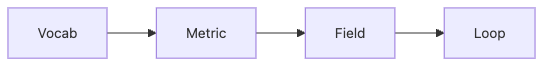

# 도메인 전문성 쌓기

데이터 직무에서 어느 순간부터는 기술만으로 설명되지 않는 차이가 벌어집니다. 같은 대시보드를 보고도 어떤 사람은 “숫자가 조금 흔들렸네”에서 멈추고, 어떤 사람은 “이건 프로모션 구조와 환불 정책 변화까지 같이 봐야 한다”는 식으로 더 좋은 질문을 던집니다. 그 차이를 만드는 축이 바로 도메인 전문성입니다.

입문자일수록 기술 학습만으로도 바쁘기 때문에 도메인 공부를 나중으로 미루기 쉽습니다. 하지만 실제로는 용어, KPI, 현장 흐름을 조금만 이해해도 질문 수준과 해석 품질이 빠르게 달라집니다. 도메인은 나중에 붙는 장식이 아니라, 기술을 실제 가치로 연결하는 번역기입니다.

이 글은 Data Science Career 101 시리즈의 아홉 번째 글입니다.

## 이 글에서 다룰 문제

- 데이터 직무에서 도메인 전문성이 왜 중요한지 설명합니다.
- 용어집과 KPI를 어떻게 익히면 좋은지 정리합니다.
- 현장 관찰이 숫자 해석 능력을 왜 높이는지 짚습니다.
- 외부 학습을 병행해야 하는 이유를 설명합니다.
- 도메인 학습을 반복 루프로 만드는 방법을 제안합니다.

> 기술은 어느 정도 복제될 수 있지만, 도메인 감각은 시간이 갈수록 복리처럼 쌓입니다. 결국 같은 데이터를 봐도 더 정확한 질문과 판단을 만드는 쪽은 도메인을 이해하는 사람입니다.

## 이 글에서 배우는 내용

- 도메인의 정의
- 용어집 학습
- 핵심 지표 이해
- 현장 관찰
- 지속적 학습 루프

## 왜 중요한가

기술만으로는 비즈니스 의미를 해석할 수 없습니다. 업종과 제품 맥락을 이해해야 같은 그래프를 봐도 중요한 변화인지 아닌지 구분할 수 있습니다.

특히 KPI는 업종에 따라 정상 범위와 의미가 다릅니다. 게임의 리텐션과 핀테크의 리텐션은 해석 기준이 다르고, 헬스케어의 전환율과 커머스의 전환율도 위험과 비용 구조가 전혀 다릅니다. 도메인을 알아야 숫자를 읽는 해상도가 올라갑니다.

## 한눈에 보는 개념



*용어, KPI, 현장 관찰, 회고를 반복하며 도메인 전문성이 쌓이는 학습 루프*
도메인 학습은 보통 이 순서로 쌓입니다. 용어를 알아야 회의가 들리고, 지표를 알아야 숫자가 읽히고, 현장을 알아야 왜 그런 숫자가 나오는지 감이 생깁니다.

## 핵심 용어

- **domain**: 특정 산업이나 비즈니스 영역입니다.
- **glossary**: 용어와 정의를 정리한 목록입니다.
- **KPI**: 핵심 성과 지표입니다.
- **playbook**: 반복 상황에서 따르는 운영 대응 가이드입니다.
- **shadowing**: 현장 업무를 옆에서 관찰하며 배우는 방식입니다.

## Before / After

**Before**: "업계를 잘 모르는 상태에서 대시보드 숫자만 바꿔 왔다."

**After**: "KPI와 업계 용어를 기준으로 비즈니스 대화를 이어 갈 수 있다."

## 실습: 다섯 단계 도메인 학습

### Step 1 — Build a Glossary

```text
- 30 words
- definition + example
```

도메인 학습의 시작은 어휘입니다. 회의에서 자주 나오는 단어 30개만 정리해도 이해도와 질문 수준이 눈에 띄게 달라집니다.

### Step 2 — Five Key Metrics

```text
- definition
- formula
- consuming team
```

지표는 이름만 알면 부족합니다. 계산식, 사용하는 팀, 어떤 의사결정에 연결되는지까지 알아야 해석이 깊어집니다.

### Step 3 — Field Shadowing

```text
- spend a day with sales or operations
- notes and questions
```

현장을 보면 숫자 뒤의 맥락이 빨리 보입니다. 운영팀이나 영업팀의 실제 흐름을 한 번만 봐도 왜 특정 KPI가 중요한지 훨씬 잘 이해됩니다.

### Step 4 — External Study

```text
- one industry conference per quarter
- industry news RSS
```

내부 데이터만 보면 조직 내부 시야에 갇히기 쉽습니다. 외부 학습은 업계 변화가 내부 지표에 어떻게 반영되는지 읽게 해 줍니다.

### Step 5 — Quarterly Retro

```text
- ten new words
- three new metrics
```

도메인 전문성도 회고가 필요합니다. 분기마다 새로 익힌 용어와 지표를 점검해야 지식이 흩어지지 않고 쌓입니다.

## 이 예시에서 먼저 봐야 할 점

- 어휘가 입구입니다.
- 지표가 방향을 잡아 줍니다.
- 현장이 진실을 보여 줍니다.

기술 공부만으로도 바쁜 입문자일수록 도메인 학습을 뒤로 미루기 쉽습니다. 하지만 도메인을 모르면 좋은 질문을 만들기 어렵고, 숫자의 중요도를 판단하기도 어렵습니다.

## 자주 하는 실수 5가지

1. **기술만 깊게 파는 실수**
2. **용어집 없이 회의를 버티는 실수**
3. **지표 정의를 모호하게 아는 실수**
4. **현장을 전혀 보지 않는 실수**
5. **외부 학습을 건너뛰는 실수**

## 실무에서는 이렇게 나타납니다

핀테크, 헬스케어, 게임처럼 규제와 사용자 행동 패턴이 강한 산업일수록 도메인이 답을 바꿉니다. 같은 리텐션 지표라도 업종마다 정상 범위와 해석이 달라질 수 있습니다.

## 시니어는 이렇게 생각합니다

- 용어부터 정확히 익힙니다.
- 지표 정의를 흐리지 않습니다.
- 현장을 직접 관찰합니다.
- 외부 변화도 같이 공부합니다.
- 도메인 학습을 반복 루프로 만듭니다.

## 체크리스트

- [ ] 핵심 용어 30개를 정리했다.
- [ ] 주요 KPI 다섯 개를 정의와 함께 적어 봤다.
- [ ] shadowing 일정을 잡았다.
- [ ] 분기 회고 방식을 정했다.

## 연습 문제

1. KPI를 한 줄로 설명해 보세요.
2. playbook의 예를 한 줄로 적어 보세요.
3. 좋은 도메인 학습의 기준을 한 줄로 정리해 보세요.

## 정리 및 다음 단계

데이터 직무에서 기술은 출발점이지만, 도메인 전문성은 해석의 질을 바꾸는 힘입니다. 용어집을 만들고, 핵심 KPI를 정리하고, 현장을 보고, 외부 학습을 병행하면 숫자 뒤의 맥락이 훨씬 선명해집니다.

다음 글에서는 이런 경험을 바탕으로 시니어 데이터 직무로 성장할 때 무엇이 달라지는지 살펴보겠습니다.

<!-- toc:begin -->
- [데이터 직무란 무엇인가](./01-what-is-data-career.md)
- [분석가 vs 사이언티스트 vs 엔지니어](./02-analyst-scientist-engineer.md)
- [학습 경로 설계](./03-learning-path.md)
- [데이터 포트폴리오](./04-data-portfolio.md)
- [SQL과 분석 인터뷰](./05-sql-and-analytics-interview.md)
- [ML 인터뷰](./06-ml-interview.md)
- [케이스 인터뷰](./07-case-interview.md)
- [첫 직장 적응](./08-first-job.md)
- **도메인 전문성 쌓기 (현재 글)**
- 시니어 데이터 직무로 가는 길 (예정)
<!-- toc:end -->

## 참고 자료

- [Eric Evans - Domain-Driven Design](https://www.domainlanguage.com/ddd/)
- [Alistair Croll and Benjamin Yoskovitz - Lean Analytics](https://leananalyticsbook.com/)
- [Klipfolio - KPI Examples and Templates](https://www.klipfolio.com/resources/kpi-examples)
- [Josh Kaufman - The Personal MBA](https://personalmba.com/)

Tags: DataCareer, Domain, Expertise, BusinessSense, Beginner
