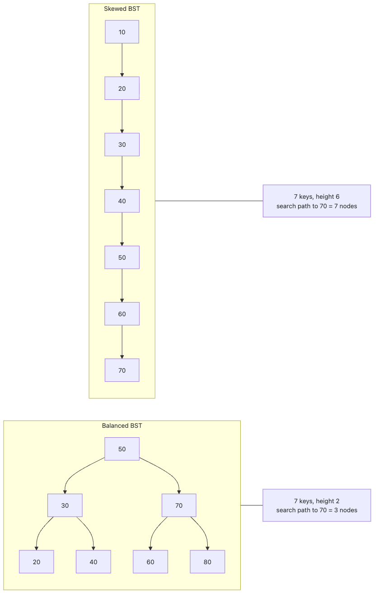

# Binary Search Trees

This is the seventh post in the Data Structures 101 series.

<!-- a-grade-intro:begin -->

**Core question**: When you need fast search over sorted data and fast insert and delete at the same time, which data structure should you reach for?

> A binary search tree (BST) is a binary tree with one simple rule: the left child is smaller than its parent and the right child is larger. That single rule gives you average O(log n) search, insert, and delete. But when the tree leans to one side, performance collapses to O(n), which is why production systems use balanced variants such as AVL or red-black trees. This article walks through how a BST works, where it breaks, and why balanced trees exist.

<!-- a-grade-intro:end -->

## What You Will Learn

- The definition of a BST and how search, insert, and delete work
- Why average and worst-case time complexities diverge
- The historical context for balanced trees (AVL, red-black, B-tree)
- When a BST is a better fit than a dict or a sorted array

## Why It Matters

BSTs are the foundation of database indexes, file system metadata, memory allocators, and any system that needs fast lookup over sorted data. Without an intuition for balanced trees, it is hard to understand database indexes deeply.

> Sorted plus search plus insert plus delete, all at O(log n), is a property that almost only the BST family delivers.

## Concept at a Glance

> A BST is a "sorted tree". Every node maintains an invariant: the entire left subtree is smaller than the node, and the entire right subtree is larger. That invariant lets you discard half the data at every step, which is what makes average O(log n) search possible.

### BST balanced vs skewed


*Figure. With the same seven keys, the balanced BST keeps the search path short while the skewed BST stretches the path almost linearly. That difference in height is why a BST can deliver average O(log n) search yet still collapse to O(n) in the worst case.*

## Key Terms

| Term | Meaning |
| --- | --- |
| BST invariant | left.key < node.key < right.key |
| Balanced | The left and right heights at every node differ by at most a fixed limit |
| Rotation | Restructuring parent-child links to restore balance |
| AVL tree | A BST that keeps left and right heights within 1 |
| Red-black tree | A BST that uses node colours to guarantee balance, the most common variant in practice |

## Before / After

**Before — inserting into a sorted array:**

```python
import bisect

arr = []
for v in data:
    bisect.insort(arr, v)   # search O(log n) + shift O(n) → insert O(n)
```

**After — inserting into a BST:**

```python
root = None
for v in data:
    root = insert(root, v)   # average O(log n)
```

## Hands-On: Step by Step

### Step 1: Define the BST node and insert

```python
class BSTNode:
    __slots__ = ("key", "left", "right")
    def __init__(self, key):
        self.key = key
        self.left = None
        self.right = None


def insert(root, key):
    if root is None:
        return BSTNode(key)
    if key < root.key:
        root.left = insert(root.left, key)
    elif key > root.key:
        root.right = insert(root.right, key)
    return root


root = None
for v in [50, 30, 70, 20, 40, 60, 80]:
    root = insert(root, v)
```

The comparison decides whether you walk left or right until you find an empty slot.

### Step 2: BST search

```python
def search(root, key):
    while root is not None:
        if key == root.key:
            return True
        root = root.left if key < root.key else root.right
    return False


print(search(root, 40))   # True
print(search(root, 99))   # False
```

Each step throws away half of the remaining tree. With a balanced tree, that is O(log n).

### Step 3: In-order traversal yields sorted output

```python
def inorder(node):
    if node is None:
        return
    inorder(node.left)
    print(node.key, end=" ")
    inorder(node.right)


inorder(root)   # 20 30 40 50 60 70 80
```

The in-order traversal of a BST is always sorted. It is the most elegant property of the structure.

### Step 4: Delete (the tricky operation)

```python
def find_min(node):
    while node.left is not None:
        node = node.left
    return node


def delete(root, key):
    if root is None:
        return None
    if key < root.key:
        root.left = delete(root.left, key)
    elif key > root.key:
        root.right = delete(root.right, key)
    else:
        # Zero or one child
        if root.left is None:
            return root.right
        if root.right is None:
            return root.left
        # Two children: replace with the in-order successor
        successor = find_min(root.right)
        root.key = successor.key
        root.right = delete(root.right, successor.key)
    return root


root = delete(root, 30)
inorder(root)   # 20 40 50 60 70 80
```

Delete splits into three cases based on the number of children, and the two-child case is the hardest one.

### Step 5: The tragedy of an unbalanced BST

```python
from random import Random


def build_bst(values):
    root = None
    for value in values:
        root = insert(root, value)
    return root


def tree_height(node):
    if node is None:
        return -1
    return 1 + max(tree_height(node.left), tree_height(node.right))


def search_steps(root, key):
    steps = 0
    while root is not None:
        steps += 1
        if key == root.key:
            return steps
        root = root.left if key < root.key else root.right
    return steps


values = list(range(31))
shuffled_values = values[:]
Random(42).shuffle(shuffled_values)

skewed = build_bst(values)
less_skewed = build_bst(shuffled_values)
target = values[-1]

skewed_height = tree_height(skewed)
less_skewed_height = tree_height(less_skewed)
skewed_steps = search_steps(skewed, target)
less_skewed_steps = search_steps(less_skewed, target)

print({
    "skewed_height": skewed_height,
    "shuffled_height": less_skewed_height,
    "skewed_steps": skewed_steps,
    "shuffled_steps": less_skewed_steps,
})

shape_check = (
    skewed_height == len(values) - 1
    and less_skewed_height < skewed_height
    and less_skewed_steps < skewed_steps
)
print(f"shape check passed: {shape_check}")

# Expected shape:
# {'skewed_height': 30, 'shuffled_height': <much smaller>, 'skewed_steps': 31, 'shuffled_steps': <smaller>}
# shape check passed: True
```

If you feed sorted data straight in, the BST degenerates into a linked list. The verification above checks shape directly, not just timing noise. If the gap does not appear, you probably shuffled incorrectly, introduced balancing logic by accident, or counted search steps incorrectly.

## Notable Points

- The BST invariant is simple but powerful enough to deliver fast search
- Delete is hardest in the two-child case and depends on the in-order successor
- An unbalanced BST is O(n) in the worst case, so production code uses balanced variants
- In-order traversal always yields sorted output

## Five Common Mistakes

| Mistake | Problem | Fix |
| --- | --- | --- |
| Assuming BST is always O(log n) | Sorted input gives O(n) | Use a balanced tree |
| Forgetting to handle duplicate keys | Infinite loop or lost data | Define a duplicate policy explicitly |
| Skipping the successor in delete | Tree breaks | Handle the two-child case correctly |
| Reaching for a BST instead of a dict | Slower and more complex | Use dict if you do not need sorted traversal |
| Recursing on a deep BST | RecursionError | Convert to iteration or an explicit stack |

## How This Is Used in Practice

- The B-tree and B+tree behind database indexes are disk-friendly generalisations of a BST
- Java's `TreeMap` and C++'s `std::map` are red-black trees
- In Python you usually reach for `sortedcontainers.SortedDict` for BST-like semantics
- Operating system virtual memory managers and process schedulers use balanced trees
- IP routing tables use a trie, a related variant, for longest-prefix matching

## How a Senior Engineer Thinks

A senior engineer knows that you almost never need to implement a tree from scratch. You reach for the standard library or for `sortedcontainers`. But you also know exactly what those libraries do internally, because that is what lets you choose well, predict the limits, and debug when things go wrong.

A senior also asks first: do I actually need sorted order? If you do not need sorted traversal or range queries, a dict is almost always faster. A BST or balanced tree is the price you pay for sorted order.

## Checklist

- [ ] Can you state the BST invariant precisely
- [ ] Can you explain why average and worst-case complexities diverge
- [ ] Do you know the three cases for BST delete
- [ ] Do you understand why balanced trees are needed
- [ ] Do you have criteria for choosing between a BST and a dict

## Practice Problems

1. Add a method that returns the k-th smallest value in the BST. Apply the in-order traversal idea. Try both an O(n) solution and an O(log n) solution that stores subtree sizes on each node.

2. Write a function that decides whether two BSTs hold the same set of keys. The shapes are allowed to differ.

3. Draw the four AVL rotations (LL, LR, RR, RL) and document which rotation applies in which situation.

## Wrap-Up and Next Steps

A binary search tree turns one simple invariant into average O(log n) search, insert, and delete. But the balance can break depending on the input, and the worst case is O(n), so production systems use self-balancing trees such as AVL or red-black. The most elegant property of a BST is that the in-order traversal is always sorted. It underpins every system that needs to manage sorted data dynamically.

The next article looks at the heap, a data structure specialised for fast access to the maximum or minimum value. It is the standard implementation of a priority queue. The heap is simpler than a BST but optimised for a narrower workload.

<!-- toc:begin -->
- [What Are Data Structures?](./01-what-are-data-structures.md)
- [Arrays and Dynamic Arrays](./02-arrays-and-dynamic-arrays.md)
- [Linked Lists](./03-linked-lists.md)
- [Stacks and Queues](./04-stacks-and-queues.md)
- [Hash Tables](./05-hash-tables.md)
- [Trees](./06-trees.md)
- **Binary Search Trees (current)**
- Heaps (upcoming)
- Graphs (upcoming)
- Choosing Data Structures (upcoming)
<!-- toc:end -->

## References

- [Open Data Structures — Binary Search Trees](https://opendatastructures.org/ods-python/6_2_BinarySearchTree_Unbala.html)
- [Wikipedia — Binary Search Tree](https://en.wikipedia.org/wiki/Binary_search_tree)
- [Wikipedia — Red-Black Tree](https://en.wikipedia.org/wiki/Red%E2%80%93black_tree)
- [sortedcontainers documentation](https://grantjenks.com/docs/sortedcontainers/)

Tags: Computer Science, Data Structures, Binary Search Tree, BST, Balanced Tree, Search
