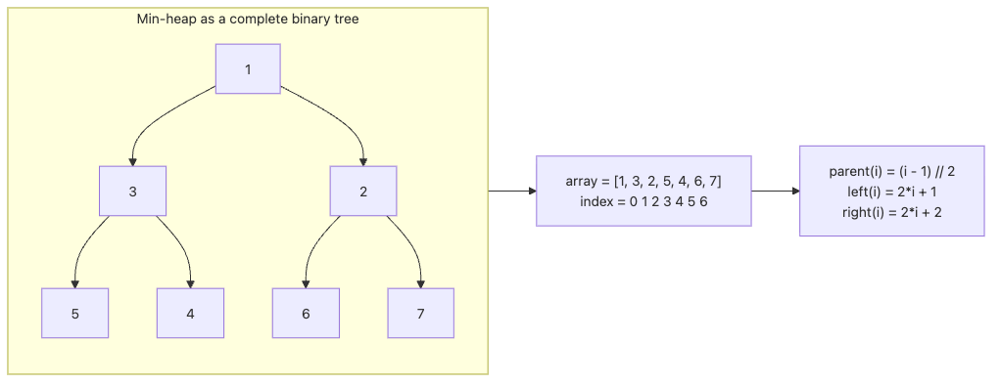

# Heaps

This is the eighth post in the Data Structures 101 series.

<!-- a-grade-intro:begin -->

**Core question**: When you constantly need to pull out the highest-priority task, which data structure should you reach for? Keeping the data sorted makes inserts slow; leaving it unordered makes pops slow.

> A heap is a complete binary tree with one rule: the parent is always less than or equal to its children (min-heap) or greater than or equal to them (max-heap). That single rule lets you read the minimum (or maximum) in O(1) and remove it in O(log n). The heap is the standard implementation of a priority queue, and Python ships it as the `heapq` module. This article walks through how heaps work, how they map onto an array, and how to implement one yourself.

<!-- a-grade-intro:end -->

## What You Will Learn

- The heap invariant and its relationship to a complete binary tree
- How to represent a heap inside a flat array
- How insert (sift up) and delete (sift down) work
- How to use Python's `heapq` and where it falls short

## Why It Matters

Heaps are the backbone of task scheduling, Dijkstra's algorithm, event simulation, and external sorting. They show up in every system that has to keep picking the next smallest (or largest) item to handle. If a BST is the general-purpose sorted tree, the heap is a specialised structure that handles only the two extremes.

> Heap = the de facto implementation of a priority queue.

## Concept at a Glance

> A heap is a complete binary tree that maintains an ordering invariant between every parent-child pair. Because the tree is complete, you can store it inside an array with no gaps and find parents and children purely by index arithmetic. The result is excellent memory efficiency.

### Heap array mapping


*Figure. A heap stays complete, so the tree can be packed into a flat array without gaps. That is what makes index arithmetic enough to recover parent and child relationships while keeping the minimum value at the root.*

## Key Terms

| Term | Meaning |
| --- | --- |
| Min-heap | Parent ≤ children |
| Max-heap | Parent ≥ children |
| Complete binary tree | A binary tree where every level except possibly the last is filled |
| Sift up | Walk a new element upward, swapping with its parent until the invariant holds |
| Sift down | Walk an element at the root downward, swapping with the smaller child until the invariant holds |

## Before / After

**Before — sort on every insert:**

```python
events = []
def add(event):
    events.append(event)
    events.sort()

def pop_next():
    return events.pop(0)
# Insert O(n log n), pop O(n)
```

**After — use a heap:**

```python
import heapq
events = []
def add(event):
    heapq.heappush(events, event)

def pop_next():
    return heapq.heappop(events)
# Insert and pop are both O(log n)
```

## Hands-On: Step by Step

### Step 1: Implement a heap by hand (sift up and down)

```python
class MinHeap:
    def __init__(self):
        self._data = []

    def push(self, value):
        self._data.append(value)
        self._sift_up(len(self._data) - 1)

    def pop(self):
        if not self._data:
            raise IndexError("pop from empty heap")
        top = self._data[0]
        last = self._data.pop()
        if self._data:
            self._data[0] = last
            self._sift_down(0)
        return top

    def _sift_up(self, i):
        while i > 0:
            parent = (i - 1) // 2
            if self._data[i] < self._data[parent]:
                self._data[i], self._data[parent] = self._data[parent], self._data[i]
                i = parent
            else:
                break

    def _sift_down(self, i):
        n = len(self._data)
        while True:
            left, right = 2 * i + 1, 2 * i + 2
            smallest = i
            if left < n and self._data[left] < self._data[smallest]:
                smallest = left
            if right < n and self._data[right] < self._data[smallest]:
                smallest = right
            if smallest == i:
                break
            self._data[i], self._data[smallest] = self._data[smallest], self._data[i]
            i = smallest


h = MinHeap()
for v in [5, 3, 8, 1, 9, 2]:
    h.push(v)

result = []
while h._data:
    result.append(h.pop())
print(result)   # [1, 2, 3, 5, 8, 9]
```

Push appends to the end and sifts up. Pop moves the last element to the root and sifts down. Both walk only the height of the tree, so both are O(log n).

### Step 2: Python's heapq module

```python
import heapq

heap = []
for v in [5, 3, 8, 1, 9, 2]:
    heapq.heappush(heap, v)

print(heap)                      # internal array (the tree representation)
print(heapq.heappop(heap))       # 1
print(heapq.heappop(heap))       # 2

# k smallest / largest
import heapq
data = [5, 3, 8, 1, 9, 2, 7]
print(heapq.nsmallest(3, data))   # [1, 2, 3]
print(heapq.nlargest(3, data))    # [9, 8, 7]
```

`heapq` only ships a min-heap. If you need a max-heap, negate the values when you insert and again when you pop.

### Step 3: Use it as a priority queue

```python
import heapq
from itertools import count

queue = []
tie_breaker = count()


def schedule(priority, task):
    heapq.heappush(queue, (priority, next(tie_breaker), task))


schedule(0, "critical alert")
schedule(2, "nightly batch")
schedule(1, "retry failed payment")
schedule(0, "page on-call")
schedule(1, "retry webhook")

order = []
while queue:
    priority, _, task = heapq.heappop(queue)
    order.append((priority, task))

print(order)

expected = [
    (0, "critical alert"),
    (0, "page on-call"),
    (1, "retry failed payment"),
    (1, "retry webhook"),
    (2, "nightly batch"),
]
print(f"order matches expectation: {order == expected}")

# [
#   (0, 'critical alert'),
#   (0, 'page on-call'),
#   (1, 'retry failed payment'),
#   (1, 'retry webhook'),
#   (2, 'nightly batch'),
# ]
# order matches expectation: True
```

This is much closer to a real scheduler than a three-item toy demo. If the dequeue order differs, you probably flipped the priority direction, forgot the tie-break counter, or broke the heap invariant by mutating queue entries in place.

### Step 4: heapify — turn an array into a heap in one pass

```python
import heapq

data = [5, 3, 8, 1, 9, 2, 7]
heapq.heapify(data)   # O(n) — sift down from the leaves backward
print(data)            # [1, 3, 2, 5, 9, 8, 7]
```

Pushing n items into an empty heap costs O(n log n), but heapifying once costs O(n). It is the better choice when you have a large batch of data to seed the heap.

### Step 5: Heap sort

```python
import heapq


def heap_sort(data):
    h = data[:]
    heapq.heapify(h)
    return [heapq.heappop(h) for _ in range(len(h))]


print(heap_sort([5, 3, 8, 1, 9, 2, 7]))
# [1, 2, 3, 5, 7, 8, 9]
```

Heap sort runs in O(n log n) overall. On average it is slower than quicksort, but it guarantees O(n log n) in the worst case.

## Notable Points

- A complete binary tree maps to a contiguous array with no gaps, which is great for memory
- A heap is not a "sorted data structure"; it only guarantees a partial order
- The fact that heapify runs in O(n) is one of the heap's most elegant properties
- Where a BST sorts every key, a heap manages only the two extremes

## Five Common Mistakes

| Mistake | Problem | Fix |
| --- | --- | --- |
| Treating a heap as a sorted structure | Indexing returns the wrong value | Remember "only the smallest is fast" |
| Using `heapq` for a max-heap directly | `heapq` is a min-heap | Negate values or wrap them |
| Forgetting to break ties | Comparison fails on incomparable objects | Add a counter to the tuple |
| Using a heap as a BST replacement | Arbitrary search is O(n) | Use a BST or dict if search dominates |
| Skipping heapify and pushing in a loop | O(n log n) instead of O(n) | Call heapify once on the array |

## How This Is Used in Practice

- Dijkstra's shortest-path algorithm is impractical without a priority queue
- OS schedulers and task queues use a priority heap to pick the next job
- Event-driven simulations process events in time order via a heap
- Some memory allocators manage free blocks with a heap keyed by size
- A* pathfinding, Huffman coding, and external merge sort all lean on heaps

## How a Senior Engineer Thinks

A senior engineer reaches for a heap the moment the pattern is "the next smallest (or largest) thing to process". They do not pull the heavier tool of full sorting. They also check the subtle requirements up front: tie-breaking, stability, mutable priorities. If priorities can change, a stock heap is not enough; you need an indexed heap variant.

A senior also asks: "Do we need k items or all of them?" If you only need the top 10 out of one million, `heapq.nsmallest` is dramatically faster than sorting the whole list. The difference comes from looking at the data structure and the algorithm together.

## Checklist

- [ ] Can you state the heap invariant and what "complete binary tree" means
- [ ] Do you know the parent and child index formulas
- [ ] Do you understand sift up, sift down, and their complexities
- [ ] Do you know that `heapq` only provides a min-heap
- [ ] Can you tell when to pick a heap and when to pick a BST

## Practice Problems

1. Generalise the `MinHeap` above so it accepts a comparison function. The same code should then implement both a min-heap and a max-heap.

2. Use two heaps (a min-heap and a max-heap) to maintain the median of a stream in O(log n) per update.

3. Find the 100 largest values in an array of one million integers using three approaches: (a) sort then slice, (b) `heapq.nlargest`, (c) maintain a min-heap of size 100 manually. Compare the timings.

## Wrap-Up and Next Steps

A heap is a complete binary tree specialised for handling the two extremes quickly, and it is the standard implementation of a priority queue. It packs into an array with no gaps, both insert and delete run in O(log n), and heapify runs in an elegant O(n). Arbitrary key search is O(n), so its purpose is clearly different from a BST or a dict. It powers task scheduling, Dijkstra's algorithm, event simulation, and any other system that has to decide "what's next" quickly.

The next article moves on to graphs, the most general way to represent relationships in data. A tree is a special case of a graph, and you will study the standard ways to represent graphs together with the basic algorithms.

<!-- toc:begin -->
- [What Are Data Structures?](./01-what-are-data-structures.md)
- [Arrays and Dynamic Arrays](./02-arrays-and-dynamic-arrays.md)
- [Linked Lists](./03-linked-lists.md)
- [Stacks and Queues](./04-stacks-and-queues.md)
- [Hash Tables](./05-hash-tables.md)
- [Trees](./06-trees.md)
- [Binary Search Trees](./07-binary-search-trees.md)
- **Heaps (current)**
- Graphs (upcoming)
- Choosing Data Structures (upcoming)
<!-- toc:end -->

## References

- [Open Data Structures — Heaps](https://opendatastructures.org/ods-python/10_Heaps.html)
- [Python `heapq` documentation](https://docs.python.org/3/library/heapq.html)
- [Wikipedia — Binary Heap](https://en.wikipedia.org/wiki/Binary_heap)
- [Wikipedia — Priority Queue](https://en.wikipedia.org/wiki/Priority_queue)

Tags: Computer Science, Data Structures, Heap, Priority Queue, heapq, Sorting
