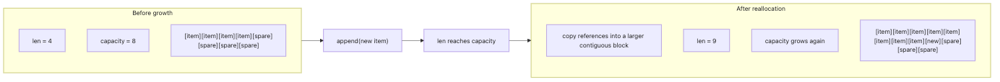

# Arrays and Lists

This is the second post in the Data Structures with Python 101 series.

## What This Article Answers

- Is Python's `list` an array or a linked list?
- Why can `append()` stay fast even though a list keeps growing?
- Why are `insert(0, x)` and mid-list deletion expensive?
- When is the `array` module worth using instead of `list`?

> Mental model: Python's `list` is not a loose "bag of values." Under the hood it is a dynamically resized array, so index access is fast, while front insertion must shift existing elements.

## Why It Matters

`list` is the data structure you touch most often in Python, so surface-level familiarity is not enough. If you do not know why front insertion is slow or why `append()` usually stays cheap, performance bugs look mysterious instead of mechanical.

> Understanding `list` deeply means understanding the foundation for stacks, heaps, and many other Python data structures.

Stacks naturally use `append()` and `pop()`, and even `heapq` stores its heap inside a list. Once you understand list internals, later topics become easier because you already know the storage model they sit on.

## Concept Overview

> Dynamic array = an array whose logical length can grow while reserving spare capacity underneath

```text
[static array]     fixed size, determined at declaration
  +---+---+---+---+
  | 1 | 2 | 3 | 4 |
  +---+---+---+---+

[dynamic array]    logical length 4, reserved capacity 8
  +---+---+---+---+---+---+---+---+
  | 1 | 2 | 3 | 4 |   |   |   |   |
  +---+---+---+---+---+---+---+---+
```

## List Capacity Growth



*How Python lists keep logical length separate from reserved capacity, then reallocate into a larger contiguous block when spare slots run out*

## Key Concepts

| Term | Description |
|------|------------|
| Static Array | A fixed-size array, like `int arr[10]` in C |
| Dynamic Array | An array that can reserve a larger block when more elements are added |
| Logical Length | The number of elements currently stored |
| Reserved Capacity | Spare slots already allocated for future appends |
| Amortized O(1) | `append()` occasionally pays for growth, but averages out to constant time |

## Before / After

Compare an inefficient and efficient way to insert at the front.

```python
# before: insert at front of list — O(n), shifts all elements
data = [1, 2, 3, 4, 5]
data.insert(0, 0)
```

```python
# after: insert at front with deque — O(1)
from collections import deque

data = deque([1, 2, 3, 4, 5])
data.appendleft(0)
```

The key difference is storage layout. `list` keeps one contiguous array, so making room at the front requires shifting existing references. `deque` is designed for both ends, so it avoids that full-array movement.

## Hands-On Steps

### Step 1: Verify the basic operations that stay cheap on a list

```python
numbers = [10, 20, 30, 40, 50]

print(numbers[2])  # 30   -- index lookup: O(1)

numbers.append(60)
print(numbers)     # [10, 20, 30, 40, 50, 60]

last = numbers.pop()
print(last)        # 60   -- pop from end: O(1)
```

### Step 2: Observe overallocation with `sys.getsizeof()`

```python
import struct
import sys

pointer_size = struct.calcsize("P")
empty_list_size = sys.getsizeof([])

data = []
previous_size = sys.getsizeof(data)

print("len  bytes  approx_capacity")
for value in range(40):
    data.append(value)
    current_size = sys.getsizeof(data)
    if current_size != previous_size:
        approx_capacity = (current_size - empty_list_size) // pointer_size
        print(f"{len(data):>3}  {current_size:>5}  {approx_capacity:>15}")
        previous_size = current_size
```

Example output on a 64-bit CPython build:

```text
len  bytes  approx_capacity
  1     88                4
  5    120                8
  9    184               16
 17    248               24
 25    312               32
 33    376               40
```

#### How to read this result

- Capacity jumps in chunks instead of growing on every `append()`.
- After the first growth, the list often has spare slots beyond its current length.
- That spare room is the observable footprint of CPython overallocation: it over-reserves references now so the next few appends stay cheap.

### Step 3: Measure why front insertion is expensive

```python
import time

size = 100_000
data = list(range(size))

start = time.perf_counter()
data.insert(0, -1)
front_insert = time.perf_counter() - start

start = time.perf_counter()
data.append(-1)
end_append = time.perf_counter() - start

print(f"front insert: {front_insert:.6f}s")
print(f"end append : {end_append:.6f}s")
print(f"front insert is {front_insert / max(end_append, 1e-9):.0f}x slower")
```

#### How to read this result

The important lesson is not just the Big-O label. `insert(0, x)` is slower because every existing reference must move one slot to the right to preserve contiguous storage. `append(x)` usually writes into an already reserved spare slot, so it often avoids that bulk movement.

### Step 4: Remember that slicing also copies

```python
data = [0, 1, 2, 3, 4, 5, 6, 7, 8, 9]

print(data[2:5])   # [2, 3, 4]
print(data[::2])   # [0, 2, 4, 6, 8]
print(data[::-1])  # [9, 8, 7, 6, 5, 4, 3, 2, 1, 0]
```

Slicing is convenient, but it allocates a new list. That means the operation cost scales with the slice length, not with the pleasant syntax.

### Step 5: Keep `array` as a specialized alternative, not the default

```python
from array import array

int_array = array("i", [1, 2, 3, 4, 5])
print(int_array[0])  # 1

mixed = [1, "hello", 3.14, True]
print(mixed)
```

`array` matters when all items share one primitive type and memory density is the goal. For general Python application code, `list` remains the default because it supports heterogeneous objects and integrates naturally with the rest of the language.

## What to Notice in This Code

- `list` is a dynamic array, not a linked list.
- Capacity growth is visible as memory-size plateaus followed by jumps.
- `append()` stays amortized O(1) because CPython usually adds into pre-reserved slots.
- Front insertion is expensive because contiguous storage forces element shifting.
- Slicing is readable but still allocates a new list.

Once you look at the artifacts this way, list performance stops feeling magical. You can see spare capacity, you can see when growth happens, and you can connect slow operations directly to how a dynamic array must preserve order in one contiguous block.

## 5 Common Mistakes

| Mistake | Why It Is a Problem | Fix |
|---------|-------------------|-----|
| Calling `list.insert(0, x)` in a loop | Becomes O(n²), extremely slow on large data | Use `deque.appendleft()` |
| Copying a list with `b = a` | Both reference the same object; changes to one affect the other | Use `b = a[:]` or `b = a.copy()` |
| Initializing nested lists with `[[]] * 3` | All inner lists reference the same object | Use `[[] for _ in range(3)]` |
| Modifying a list while iterating | Indices shift and produce unexpected results | Create a new list or iterate in reverse |
| Assuming slicing is free | It allocates a new list and copies references | Use iterators when you only need sequential access |

## Real-World Applications

- API responses arrive as JSON arrays and are processed as lists.
- Batch pipelines accumulate records in lists before handing them to another stage.
- `heapq` stores heap elements inside a plain list.
- Pagination and windowed processing often use slices, with copying cost worth remembering.
- Large numerical workloads usually move from `list` to NumPy arrays once layout and type constraints become explicit.

## How Senior Engineers Think About This

In production, `list` is usually fast enough. The trick is knowing when you are still operating in its sweet spot: end-heavy growth, indexed access, and iteration.

The first design question is simple: what operation pattern dominates? If you mostly push and pop at the end, `list` is ideal. If you need both ends, use `deque`. If you need constant-time membership by key, move to `set` or `dict`.

## Checklist

- [ ] Can explain that Python `list` is implemented as a dynamic array
- [ ] Can explain the difference between logical length and reserved capacity
- [ ] Can connect `append()` performance to overallocation
- [ ] Can explain why `insert(0, x)` requires element shifting
- [ ] Can describe when `array` is a specialized better fit than `list`

## Exercises

1. Extend the capacity-growth script to 1,000 appends and record every point where capacity changes.
2. Compare 1,000 calls to `insert(0, x)` on a large list with 1,000 calls to `deque.appendleft(x)`.
3. Write a function that removes duplicates while preserving order, then explain why it still needs a list for output order.

## Summary and Next Steps

Python `list` is a dynamic array with two different ideas of size: logical length and reserved capacity. That is why index access is O(1), `append()` is amortized O(1), and front insertion is expensive. The next article builds on this storage model to explain stacks and queues.

<!-- toc:begin -->
- [What Are Data Structures?](./01-what-are-data-structures.md)
- **Arrays and Lists (current)**
- Stacks and Queues (upcoming)
- Hash Tables and dict (upcoming)
- Linked Lists (upcoming)
- Trees and Binary Trees (upcoming)
- Heaps and Priority Queues (upcoming)
- Graph Representations (upcoming)
- Sets and Set Operations (upcoming)
- Choosing the Right Data Structure (upcoming)
<!-- toc:end -->

## References

- [Python Official Docs — Lists](https://docs.python.org/3/tutorial/datastructures.html#more-on-lists)
- [Python Official Docs — `sys.getsizeof`](https://docs.python.org/3/library/sys.html#sys.getsizeof)
- [Python TimeComplexity — Python Wiki](https://wiki.python.org/moin/TimeComplexity)
- [CPython list implementation (GitHub)](https://github.com/python/cpython/blob/main/Objects/listobject.c)
- [Real Python — Python Lists and Tuples](https://realpython.com/python-lists-tuples/)

Tags: Python, Data Structures, list, array, Time Complexity
