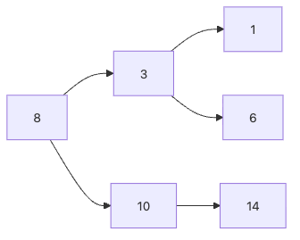

# 트리와 이진 트리

이 글은 Data Structures with Python 101 시리즈의 여섯 번째 글입니다.

## 이 글에서 다룰 문제

- 파일 시스템, DOM, 조직도는 왜 트리 구조로 모델링될까요?
- 트리의 루트, 리프, 깊이, 높이는 각각 무엇을 뜻할까요?
- 이진 트리 순회는 왜 재귀와 잘 맞을까요?
- BST는 어떻게 정렬된 데이터를 O(log n)에 탐색할 수 있을까요?

> 멘탈 모델: 트리는 “위에서 아래로 갈라지는 계층 구조”입니다. 그리고 BST는 그 계층 구조에 정렬 규칙까지 얹어, 탐색 범위를 매 단계 절반씩 줄여 가는 구조입니다.

## 왜 이 글이 중요한가

트리는 컴퓨터 과학에서 가장 널리 쓰이는 구조 중 하나입니다. 파일 시스템, HTML DOM, 데이터베이스 인덱스, AST까지 계층 관계를 표현해야 하는 곳에는 거의 항상 트리가 등장합니다. 그래서 트리를 이해하는 것은 특정 알고리즘 하나를 배우는 문제가 아니라, 복잡한 시스템을 구조적으로 읽는 연습에 가깝습니다.

> 트리를 이해하면 재귀 사고가 자연스러워집니다. 대부분의 트리 알고리즘은 재귀로 가장 잘 표현됩니다.

특히 이진 탐색 트리(BST)는 트리 위에 정렬 규칙을 얹은 구조입니다. 이 규칙 덕분에 선형 검색 O(n) 대신 O(log n)에 가까운 탐색이 가능해집니다. 물론 균형이 무너질 수 있다는 한계도 함께 배워야 합니다.

## 핵심 개념 한눈에 보기

> 트리 = 루트에서 시작해 자식 노드로 분기하는 계층 구조

```text
        [root]
       /      \
    [child]  [child]
    /   \       \
 [leaf] [leaf]  [leaf]

Binary Search Tree (BST):
        [8]
       /   \
     [3]   [10]
    /   \      \
  [1]   [6]   [14]
```

## 트리 구조를 그림으로 보면



*루트에서 리프까지 갈라지는 트리와 BST의 기본 형태를 보여 주는 그림*

## 핵심 개념

| 용어 | 설명 |
|------|------|
| 루트(root) | 트리의 가장 위에 있는 시작 노드입니다 |
| 리프(leaf) | 자식이 없는 말단 노드입니다 |
| 깊이(depth) | 루트에서 특정 노드까지 내려가는 거리입니다 |
| 높이(height) | 특정 노드에서 가장 먼 리프까지의 거리입니다 |
| 이진 탐색 트리(BST) | 왼쪽 자식 < 부모 < 오른쪽 자식 규칙을 만족하는 트리입니다 |

## Before / After

정렬된 데이터를 list로 순차 탐색하는 경우와 BST로 탐색하는 경우를 비교해 보겠습니다.

```python
# before: linear search in a sorted list — O(n)
data = [1, 3, 6, 8, 10, 14]
for item in data:
    if item == 10:
        print("found")
        break
```

```python
# after: BST search — O(log n)
# BST: 8 → 10 → found (2 steps)
def search_bst(node, target):
    if node is None:
        return False
    if target == node.data:
        return True
    elif target < node.data:
        return search_bst(node.left, target)
    else:
        return search_bst(node.right, target)
```

BST의 장점은 매 단계에서 볼 필요 없는 절반을 버릴 수 있다는 점입니다. 그래서 정렬 규칙은 단순한 예쁜 성질이 아니라, 탐색 비용을 줄이는 핵심 계약입니다.

## 단계별 실습

### Step 1: Define a binary tree node

```python
class TreeNode:
    def __init__(self, data):
        self.data = data
        self.left = None
        self.right = None

    def __repr__(self):
        return f"TreeNode({self.data})"
```

### Step 2: Implement tree traversals

```python
def inorder(node):
    """Inorder traversal: left → root → right"""
    if node is None:
        return []
    return inorder(node.left) + [node.data] + inorder(node.right)

def preorder(node):
    """Preorder traversal: root → left → right"""
    if node is None:
        return []
    return [node.data] + preorder(node.left) + preorder(node.right)

def postorder(node):
    """Postorder traversal: left → right → root"""
    if node is None:
        return []
    return postorder(node.left) + postorder(node.right) + [node.data]

# Build tree:        1
#                  /   \
#                 2     3
#                / \
#               4   5
root = TreeNode(1)
root.left = TreeNode(2)
root.right = TreeNode(3)
root.left.left = TreeNode(4)
root.left.right = TreeNode(5)

print(f"inorder:   {inorder(root)}")    # [4, 2, 5, 1, 3]
print(f"preorder:  {preorder(root)}")   # [1, 2, 4, 5, 3]
print(f"postorder: {postorder(root)}")  # [4, 5, 2, 3, 1]
```

### Step 3: Level-order traversal (BFS)

```python
from collections import deque

def level_order(root):
    """Level-order traversal: nodes at the same depth, left to right"""
    if root is None:
        return []
    result = []
    queue = deque([root])
    while queue:
        node = queue.popleft()
        result.append(node.data)
        if node.left:
            queue.append(node.left)
        if node.right:
            queue.append(node.right)
    return result

print(f"level-order: {level_order(root)}")  # [1, 2, 3, 4, 5]
```

### Step 4: Implement a binary search tree

```python
class BST:
    def __init__(self):
        self.root = None

    def insert(self, data):
        self.root = self._insert(self.root, data)

    def _insert(self, node, data):
        if node is None:
            return TreeNode(data)
        if data < node.data:
            node.left = self._insert(node.left, data)
        elif data > node.data:
            node.right = self._insert(node.right, data)
        return node

    def search(self, data):
        return self._search(self.root, data)

    def _search(self, node, data):
        if node is None:
            return False
        if data == node.data:
            return True
        elif data < node.data:
            return self._search(node.left, data)
        else:
            return self._search(node.right, data)

    def inorder(self):
        return inorder(self.root)

bst = BST()
for val in [8, 3, 10, 1, 6, 14]:
    bst.insert(val)

print(bst.inorder())       # [1, 3, 6, 8, 10, 14] — sorted result
print(bst.search(6))       # True
print(bst.search(7))       # False
```

### Step 5: Compute tree height and node count

```python
def tree_height(node):
    if node is None:
        return -1
    return 1 + max(tree_height(node.left), tree_height(node.right))

def count_nodes(node):
    if node is None:
        return 0
    return 1 + count_nodes(node.left) + count_nodes(node.right)

print(f"height: {tree_height(bst.root)}")      # 2
print(f"node count: {count_nodes(bst.root)}")   # 6
```

## 이 코드에서 먼저 봐야 할 점

- 트리 알고리즘은 `node is None`이라는 base case를 중심으로 재귀가 전개됩니다.
- BST의 inorder 순회 결과가 정렬되는 이유는 왼쪽 < 부모 < 오른쪽 규칙 때문입니다.
- level-order 순회는 큐를 사용하며, 트리에서 BFS 패턴을 가장 명확하게 보여 줍니다.
- BST 탐색은 매 단계에서 절반을 버릴 수 있을 때 O(log n)에 가까워집니다.

트리는 구현 세부사항보다 사고방식이 중요합니다. “현재 노드를 처리하고, 왼쪽과 오른쪽 서브트리에 같은 규칙을 적용한다”라는 반복 패턴을 익히면 순회, 높이 계산, 탐색, 검증 문제들이 하나의 패밀리처럼 보이기 시작합니다.

실무에서는 BST의 평균 O(log n)만 기억하면 위험합니다. 입력이 이미 정렬되어 있거나 편향된 순서로 들어오면 트리는 한쪽으로 길게 늘어져 O(n)으로 퇴화합니다. 그래서 운영 시스템은 단순 BST보다 AVL, Red-Black Tree, B-Tree 계열처럼 균형을 유지하는 구조를 택합니다.

Python 코드에서는 재귀 깊이도 함께 봐야 합니다. 트리가 깊어질수록 `RecursionError` 가능성이 생기고, 순회 중 노드 객체 수가 많으면 메모리 사용량도 커집니다. 즉, 트리 선택은 “탐색이 빠르다”는 장점만이 아니라 균형 유지 비용, 재귀 한계, 저장 형태까지 묶어서 판단해야 합니다.

## 흔한 실수 5가지

| 실수 | 왜 문제인가 | 해결 방법 |
|------|------------|----------|
| 재귀 base case 누락 | 무한 재귀와 `RecursionError`로 이어집니다 | 항상 `node is None`을 먼저 처리합니다 |
| BST 중복 정책 미정의 | 예상과 다른 트리 구조가 생깁니다 | 중복을 무시할지, 개수를 셀지 정책을 정합니다 |
| 편향 트리를 BST로 착각 | 한쪽으로만 치우치면 O(n)으로 퇴화합니다 | 균형 트리 필요 여부를 구분합니다 |
| 순회 순서 혼동 | 알고리즘 결과가 달라집니다 | preorder(NLR), inorder(LNR), postorder(LRN)를 분명히 구분합니다 |
| 삭제 연산을 단순하게 봄 | 자식이 둘인 노드 처리가 특히 까다롭습니다 | 후계자(in-order successor) 패턴을 따로 연습합니다 |

## 실무에서 이렇게 쓰입니다

- 데이터베이스 인덱스는 B-Tree/B+Tree 계열을 사용합니다.
- 파일 시스템 디렉터리 구조는 전형적인 트리입니다.
- HTML/XML DOM은 문서 구조를 트리로 표현합니다.
- 파서와 컴파일러는 AST를 만들어 식과 문장을 처리합니다.
- 자동 완성은 Trie 같은 특화 트리 구조를 사용합니다.

## 실무에서는 이렇게 생각합니다

실무에서 BST를 처음부터 직접 구현할 일은 많지 않습니다. 대신 `sorted()`, `bisect`, 데이터베이스 인덱스, 라이브러리 내부 구조가 이미 그런 역할을 대신합니다. 그래도 트리를 이해해야 이런 도구가 어떤 가정 위에서 빠르게 동작하는지 설명할 수 있습니다.

또 하나 중요한 점은 트리가 재귀 사고를 훈련하는 최고의 재료라는 사실입니다. 트리 문제를 반복해서 풀다 보면, 복잡한 문제를 “현재 노드와 하위 문제”로 분해하는 감각이 자연스럽게 생깁니다.

## 체크리스트

- [ ] 트리의 루트, 리프, 깊이, 높이를 설명할 수 있다
- [ ] preorder, inorder, postorder, level-order 순회를 구현할 수 있다
- [ ] BST에서 삽입과 탐색을 구현할 수 있다
- [ ] BST의 inorder 순회가 왜 정렬 결과를 반환하는지 설명할 수 있다
- [ ] 트리 높이와 노드 수를 재귀로 계산할 수 있다

## 연습 문제

1. 주어진 이진 트리가 BST인지 검증하는 함수를 작성해 보세요. 힌트: inorder 결과가 정렬되어야 합니다.
2. 두 이진 트리가 구조적으로 같은지 확인하는 함수를 작성해 보세요.
3. BST에서 값을 삭제하는 함수를 구현해 보세요. 자식 수가 0, 1, 2인 경우를 모두 처리해야 합니다.

## 정리 및 다음 글 안내

트리는 계층 관계를 표현하는 가장 중요한 자료구조 중 하나이고, BST는 그 위에 정렬 규칙을 얹어 탐색 효율을 높인 구조입니다. 순회와 높이 계산처럼 많은 트리 연산은 재귀로 자연스럽게 풀립니다. 다음 글에서는 트리의 특수한 형태이면서 우선순위 처리에 강한 힙과 우선순위 큐를 살펴보겠습니다.

<!-- toc:begin -->
- [자료구조란 무엇인가?](./01-what-are-data-structures.md)
- [배열과 리스트](./02-arrays-and-lists.md)
- [스택과 큐](./03-stacks-and-queues.md)
- [해시 테이블과 dict](./04-hash-tables-and-dict.md)
- [연결 리스트](./05-linked-lists.md)
- **트리와 이진 트리 (현재 글)**
- 힙과 우선순위 큐 (예정)
- 그래프 표현 (예정)
- set과 집합 연산 (예정)
- 자료구조 선택 기준 (예정)
<!-- toc:end -->

## 참고 자료

- [Runestone Academy — Trees](https://runestone.academy/ns/books/published/pythonds3/Trees/toctree.html)
- [Python 공식 문서 — bisect](https://docs.python.org/3/library/bisect.html)
- [SQLite File Format — B-Tree Pages](https://www.sqlite.org/fileformat.html#b_tree_pages)
- [Real Python — Binary Trees in Python](https://realpython.com/binary-search-python/)

Tags: Python, 자료구조, Tree, Binary Tree, BST
