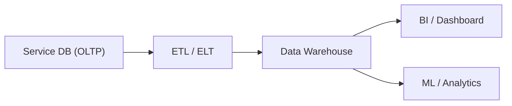

# What Is a Data Warehouse?
> Data Warehouse 101 series (1/10)

This is the first post in the Data Warehouse 101 series.

<!-- a-grade-intro:begin -->

**Core question**: Why does a *service database alone* fail at analytics, and what makes a *dedicated analytical store* different?

> *A data warehouse is a store built to answer questions fast.*

<!-- a-grade-intro:end -->

## What You Will Learn

- The *definition* and *purpose* of a data warehouse
- How it *differs* from a service DB
- Why analytics needs a *dedicated store*
- Five-step first analytical query
- Five common pitfalls

## Why It Matters

When a product grows, the database that handles *one order* and the one that answers *yesterday's revenue* have *very different needs*. Doing both on one engine *slows everything down*. *Separation* is the answer.

> *Run analytics on its own road; keep operations on its own.*

## Concept at a Glance



## Key Terms

- **OLTP**: *Online Transaction Processing*. Short transactions like orders and payments.
- **OLAP**: *Online Analytical Processing*. Aggregations across *large ranges*.
- **Data Warehouse**: A *central store* of analytics-ready data from many sources.
- **ETL / ELT**: Pipelines that *extract, transform, and load* source data.
- **BI**: *Business Intelligence*. Tools that turn data into *decisions*.

## Before/After

**Before**: You aggregate *six months* of revenue on the service DB and *production slows down*.

**After**: One load into the warehouse, and the same answer arrives in *seconds*.

## Hands-on: First Analytical Query in Five Steps

### Step 1 — Create a fact table

```sql
CREATE TABLE fact_orders (
    order_id BIGINT,
    user_id BIGINT,
    amount NUMERIC(12, 2),
    order_date DATE
);
```

### Step 2 — Load data

```sql
INSERT INTO fact_orders VALUES
    (1, 100, 25000, '2026-01-15'),
    (2, 100, 18000, '2026-02-03'),
    (3, 200, 42000, '2026-02-10');
```

### Step 3 — Monthly revenue

```sql
SELECT date_trunc('month', order_date) AS month,
       SUM(amount) AS revenue
FROM fact_orders
GROUP BY 1
ORDER BY 1;
```

### Step 4 — Per-user totals

```sql
SELECT user_id, SUM(amount) AS total
FROM fact_orders
GROUP BY user_id;
```

### Step 5 — Top customers

```sql
SELECT user_id, SUM(amount) AS total
FROM fact_orders
GROUP BY user_id
ORDER BY total DESC
LIMIT 10;
```

## What to Notice in This Code

- *Aggregation* is the *base unit*. We never look at single rows.
- *Dates* are the *axis* of analysis. Always have a *time column*.
- We analyze a *copy*, never the source.

## Five Common Mistakes

1. **Running analytical queries *directly on the service DB*.** A common cause of *production incidents*.
2. **Copying tables *as-is*.** A warehouse is *designed for analysis*, not mirroring.
3. **Loading data *without a time column*.** *Time-series analysis* becomes impossible later.
4. **Forcing *all transformations before load*.** *Preserve raw* and transform *inside* the warehouse.
5. **Trying to make the warehouse *real-time*.** *Minute-level* freshness is enough most of the time.

## How This Shows Up in Production

Startups often start with a *Postgres replica* as the warehouse. As scale grows, teams move to *BigQuery, Snowflake, or Redshift*. *Dashboards, reports, and ML feature extraction* all begin from the warehouse.

## How a Senior Engineer Thinks

- *Separate analytical workloads from service workloads.*
- *Preserve the raw source.* Transformations must be *replayable*.
- *Time and identity* are the *axes of every fact*.
- *Pay schema-change cost early*, at load time.
- *Warehouse cost* is shaped by *query patterns*.

## Checklist

- [ ] You can explain *OLTP vs OLAP*.
- [ ] You can argue *why separation matters*.
- [ ] You can name the *steps of ETL/ELT*.
- [ ] You know what a *time axis* is in a warehouse.

## Practice Problems

1. Summarize the difference between a *service DB* and a *warehouse* in three sentences.
2. Write a query for *yesterday's revenue*.
3. List three pains a company *without a warehouse* will hit.

## Wrap-up and Next Steps

A warehouse is a *separate store for analysis*. Next, we look at *OLTP vs OLAP* in more depth.

<!-- toc:begin -->
- **What Is a Data Warehouse? (current)**
- OLTP and OLAP (upcoming)
- Fact and Dimension (upcoming)
- Star Schema (upcoming)
- Partition and Clustering (upcoming)
- ETL and ELT (upcoming)
- BI and Dashboard (upcoming)
- Data Mart (upcoming)
- Performance Optimization (upcoming)
- Warehouse Design Example (upcoming)
<!-- toc:end -->

## References

- [Kimball Group — Data Warehouse Concepts](https://www.kimballgroup.com/data-warehouse-business-intelligence-resources/)
- [BigQuery — What Is a Data Warehouse?](https://cloud.google.com/learn/what-is-a-data-warehouse)
- [Snowflake — Data Warehouse Guide](https://www.snowflake.com/guides/what-data-warehouse/)
- [AWS — Data Warehouse Concepts](https://aws.amazon.com/data-warehouse/)

Tags: DataWarehouse, Analytics, OLAP, Database, BI
