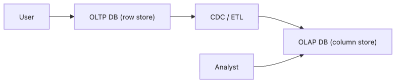

# OLTP and OLAP

From far away, both systems speak SQL. Up close, they solve opposite problems. One is built to confirm a payment in milliseconds. The other is built to scan months of history without dragging production down with it.

This is post 2 in the Data Warehouse 101 series.

In this post, we compare those workloads directly. The important question is not whether both systems can run queries, but what kind of query pattern each engine is optimized to carry all day.

## Questions this article answers

- How do OLTP and OLAP differ in the workloads they are built to handle?
- Where does the gap between row storage and column storage become most visible?
- Why does one engine become a bad compromise when you ask it to serve both workloads?
- How should you think about CDC and replication lag in a split architecture?
- What practical criteria do teams use to decide when to separate OLTP from OLAP?

## What You Will Learn

- The workload difference between *OLTP* and *OLAP*
- The trade-offs of *row* vs *column* storage
- Why we *separate* the two systems
- Five-step comparison hands-on
- Five common pitfalls

## Why It Matters

OLTP processes *one record right now* fast. OLAP scans *all of history* in one shot. The *optimization directions are opposite*, so a single engine struggles to be great at both.

> *Pick the right tool. Trying to do both with one makes both unhappy.*

## Concept at a Glance



*Short transactional writes stay on OLTP, while change capture feeds a separate OLAP engine for broad analytical reads.*

## Key Terms

- **OLTP**: Short, *concurrent* read/write workloads.
- **OLAP**: Large-range, *read-heavy* aggregations.
- **Row store**: Stores *all columns of a row* together.
- **Column store**: Stores *values of one column* contiguously.
- **CDC**: *Change Data Capture* — streaming OLTP changes into OLAP.

## Before/After

**Before**: A single Postgres handles *payments* and *monthly analytics*; both *slow down*.

**After**: OLTP on *Postgres*, OLAP on *BigQuery* — each is *optimized for its job*.

## Hands-on: Five-step Comparison

### Step 1 — OLTP pattern

```sql
-- Update one user's balance
UPDATE accounts SET balance = balance - 1000 WHERE id = 42;
```

### Step 2 — OLAP pattern

```sql
-- Average balance across all users
SELECT AVG(balance) FROM accounts;
```

### Step 3 — Row store cost

```sql
-- Row store reads all columns even if you ask for one
SELECT amount FROM fact_orders;
```

### Step 4 — Column store benefit

```sql
-- Column store scans only the amount column
SELECT SUM(amount) FROM fact_orders;
```

### Step 5 — Separated flow

```sql
-- OLTP receives single-row INSERT
INSERT INTO orders VALUES (...);
-- OLAP analyzes accumulated facts
SELECT date_trunc('day', created_at), COUNT(*) FROM fact_orders GROUP BY 1;
```

## What to Notice in This Code

- *Short queries* are fast on *row stores*.
- *Big aggregations* are fast on *column stores*.
- The *concurrency shape* is *completely different*.

## Five Common Mistakes

1. **Running OLAP queries *on OLTP*.** Lock waits pile up and *latency cascades*.
2. **Sending *short transactions* to OLAP.** *Cost goes up, value does not*.
3. **Assuming *zero replication lag*.** Always design for *minutes of lag*.
4. **Copying the *index strategy*.** Access patterns differ — *design indexes separately*.
5. **Sharing a backup policy.** OLTP wants *PITR*; OLAP wants *snapshots*.

## How This Shows Up in Production

Payments live on *Postgres / MySQL*. Revenue reports live on *Snowflake / BigQuery*. Between them, *Debezium*-style *CDC* moves changes with a *small lag*.

## How a Senior Engineer Thinks

- *Start by analyzing the *shape of the workload*.*
- *Be skeptical of doing both with one engine.*
- *Cost is shaped by access patterns.*
- *Treat replication lag as a constant, not a bug.*
- *Design *post-separation consistency* from day one.*

## Checklist

- [ ] You can compare OLTP and OLAP in *three lines*.
- [ ] You know the difference between *row and column store*.
- [ ] You can explain what *CDC* is.
- [ ] You can name the *backup difference* between the two.

## Practice Problems

1. List *three* OLTP workloads.
2. List *three* OLAP workloads.
3. Explain which *queries favor row store*.

## Wrap-up and Next Steps

OLTP and OLAP optimize for opposite directions. Next we cover *facts and dimensions*, the core OLAP modeling unit.

<!-- toc:begin -->
- [What Is a Data Warehouse?](./01-what-is-data-warehouse.md)
- **OLTP and OLAP (current)**
- Fact and Dimension (upcoming)
- Star Schema (upcoming)
- Partition and Clustering (upcoming)
- ETL and ELT (upcoming)
- BI and Dashboard (upcoming)
- Data Mart (upcoming)
- Performance Optimization (upcoming)
- Warehouse Design Example (upcoming)
<!-- toc:end -->

## References

- [Wikipedia — OLTP](https://en.wikipedia.org/wiki/Online_transaction_processing)
- [Wikipedia — OLAP](https://en.wikipedia.org/wiki/Online_analytical_processing)
- [Snowflake — Columnar Storage](https://docs.snowflake.com/en/user-guide/intro-key-concepts)
- [Designing Data-Intensive Applications](https://dataintensive.net/)

Tags: DataWarehouse, OLTP, OLAP, Database, Analytics
