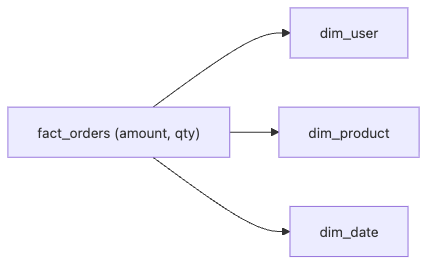

# Fact and Dimension

Most analytical questions hide the same structure: how much happened, and by which slice do you want to explain it? The moment you mix those two jobs in one wide table, every later change becomes more expensive than it needs to be.

This is post 3 in the Data Warehouse 101 series.

In this post, we split measures from attributes on purpose. That separation is what keeps aggregations stable, lets context evolve without rewriting history, and gives the warehouse a reusable modeling vocabulary.

## Questions this article answers

- What do fact tables and dimension tables each hold?
- What do you gain by separating measures from descriptive attributes?
- Why do you need to define the grain first in an analytical model?
- Why do surrogate keys and conformed dimensions appear so often in warehouse design?
- What is the first sentence you should write before you start OLAP modeling?

## What You Will Learn

- The definition of a *fact* table
- The definition of a *dimension* table
- Why this separation pays off
- Five-step modeling hands-on
- Five common pitfalls

## Why It Matters

Analytical questions almost always read as *how much (measure)* by *which slice (dimension)*. Separating the two lets *aggregations stay fast* and *attribute changes stay flexible*.

> *Split measures from attributes. Together they slow each other down.*

## Concept at a Glance



*Facts carry the measurable events, while user, product, and date dimensions provide the context needed to group and explain them.*

## Key Terms

- **Fact**: A *measurable event*. Amount, quantity, duration — numbers.
- **Dimension**: The *context* of a fact. User, product, date — attributes.
- **Grain**: What *one row represents* — the *atomic unit* of the fact.
- **Surrogate key**: An *internal identifier* for a dimension.
- **Conformed dimension**: A dimension *shared* across multiple facts.

## Before/After

**Before**: One *order row* contains *user name and product name*. If a name changes, *every row must be updated*.

**After**: User name lives in *dim_user* only. *Facts stay untouched*.

## Hands-on: Modeling in Five Steps

### Step 1 — Build a dimension

```sql
CREATE TABLE dim_user (
    user_key BIGINT PRIMARY KEY,
    user_id BIGINT,
    name TEXT,
    country TEXT
);
```

### Step 2 — Date dimension

```sql
CREATE TABLE dim_date (
    date_key INT PRIMARY KEY,
    full_date DATE,
    year INT,
    month INT,
    day_of_week INT
);
```

### Step 3 — Build a fact

```sql
CREATE TABLE fact_orders (
    order_id BIGINT,
    user_key BIGINT,
    date_key INT,
    amount NUMERIC(12, 2),
    qty INT
);
```

### Step 4 — Join for analysis

```sql
SELECT u.country, SUM(f.amount) AS revenue
FROM fact_orders f
JOIN dim_user u ON u.user_key = f.user_key
GROUP BY u.country;
```

### Step 5 — Time axis analysis

```sql
SELECT d.year, d.month, SUM(f.amount) AS revenue
FROM fact_orders f
JOIN dim_date d ON d.date_key = f.date_key
GROUP BY d.year, d.month
ORDER BY 1, 2;
```

## What to Notice in This Code

- The *fact carries only thin numbers*.
- The *dimension carries meaningful attributes*.
- Multiple facts *share* the same dimension.

## Five Common Mistakes

1. **Putting *string attributes* directly in the fact.** Storage explodes when rows reach *hundreds of millions*.
2. **Mixing *grain*.** Combining *order-level* and *line-item* in one fact makes *aggregations lie*.
3. **Using *natural keys only*.** When upstream keys change, *every fact wobbles*.
4. **Skipping the *date dimension*.** *Weekend / holiday* analyses become *painful*.
5. **Putting *measures* in the dimension.** Meaning blurs and the team gets confused.

## How This Shows Up in Production

E-commerce ships *fact_orders, fact_payments, fact_refunds* and *shares* dim_user, dim_product, dim_date. When a user *changes country*, only dim_user is updated.

## How a Senior Engineer Thinks

- *You should be able to write the *grain* in a single sentence.*
- *Treat conformed dimensions as *team assets*.*
- *Use surrogate keys to *absorb upstream change*.*
- *The date dimension is the *spine of all analytics*.*
- *Facts are *narrow and long*; dimensions are *wide and short*.*

## Checklist

- [ ] You can distinguish *fact* from *dimension*.
- [ ] You can write the *grain* in one sentence.
- [ ] You know why *surrogate keys* matter.
- [ ] You see the value of a *date dimension*.

## Practice Problems

1. Write the *grain* of *fact_payments* in one sentence.
2. List *five* columns for *dim_product*.
3. Name *three* downsides of skipping *surrogate keys*.

## Wrap-up and Next Steps

Splitting facts and dimensions is the *starting point* of analytical modeling. Next, we cover the *star schema* — the most common shape.

<!-- toc:begin -->
- [What Is a Data Warehouse?](./01-what-is-data-warehouse.md)
- [OLTP and OLAP](./02-oltp-and-olap.md)
- **Fact and Dimension (current)**
- Star Schema (upcoming)
- Partition and Clustering (upcoming)
- ETL and ELT (upcoming)
- BI and Dashboard (upcoming)
- Data Mart (upcoming)
- Performance Optimization (upcoming)
- Warehouse Design Example (upcoming)
<!-- toc:end -->

## References

- [Kimball — Fact Table Design](https://www.kimballgroup.com/data-warehouse-business-intelligence-resources/kimball-techniques/dimensional-modeling-techniques/)
- [dbt — Dimensional Modeling](https://docs.getdbt.com/best-practices/how-we-structure/1-guide-overview)
- [Snowflake — Star Schema](https://docs.snowflake.com/en/user-guide/intro-key-concepts)
- [BigQuery — Schema Design](https://cloud.google.com/bigquery/docs/schemas)

Tags: DataWarehouse, Fact, Dimension, Modeling, Analytics
