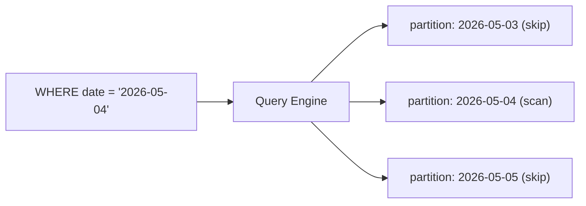

# Partition and Clustering

> Data Warehouse 101 series (5/10)

<!-- a-grade-intro:begin -->

**Core question**: How can you pull *today's data* from a *fact with billions of rows* in seconds? How does the engine *decide what to skip*?

> *Partitions split the file into chunks; clustering sorts inside each chunk.*

<!-- a-grade-intro:end -->

## What You Will Learn

- The definition and effect of *partitioning*
- The definition and effect of *clustering*
- How *pruning* works under the hood
- Five-step hands-on
- Five common pitfalls

## Why It Matters

Warehouse facts often hold *billions of rows*. A daily partition alone lets the engine *skip 95%* of the data — and *cost drops directly*.

> *You do not pay for data you do not read.*

## Concept at a Glance



## Key Terms

- **Partition**: A *physical chunk* of a table — usually keyed by *date*.
- **Clustering**: Sorting *within a partition* by frequently queried columns.
- **Pruning**: Picking only the *partitions to scan* based on the WHERE clause.
- **Partition key**: The *column used to split* the table.
- **Cluster key**: The *column used to sort* inside partitions.

## Before/After

**Before**: `WHERE order_date = '2026-05-04'` still scans *the whole table*.

**After**: The same query reads *one daily partition*. *Cost drops 100x*.

## Hands-on: Five Steps

### Step 1 — Define partitioning

```sql
-- BigQuery example
CREATE TABLE fact_orders (
    order_id BIGINT,
    user_key BIGINT,
    amount NUMERIC(12, 2),
    order_date DATE
)
PARTITION BY order_date;
```

### Step 2 — Add clustering

```sql
CREATE TABLE fact_orders (
    order_id BIGINT,
    user_key BIGINT,
    amount NUMERIC(12, 2),
    order_date DATE
)
PARTITION BY order_date
CLUSTER BY user_key;
```

### Step 3 — Query that prunes

```sql
-- Reads only one daily partition
SELECT SUM(amount)
FROM fact_orders
WHERE order_date = '2026-05-04';
```

### Step 4 — Query that defeats pruning

```sql
-- Wrapping order_date in a function disables pruning
SELECT SUM(amount)
FROM fact_orders
WHERE EXTRACT(YEAR FROM order_date) = 2026;
```

### Step 5 — Cluster-key benefit

```sql
-- Add user_key and read even less
SELECT SUM(amount)
FROM fact_orders
WHERE order_date BETWEEN '2026-05-01' AND '2026-05-31'
  AND user_key = 100;
```

## What to Notice in This Code

- The condition must hit the *partition key directly* for pruning.
- Wrapping in a *function* breaks pruning.
- Clustering helps *inside* a partition.

## Five Common Mistakes

1. **Wrapping the partition key in a *function*.** Falls back to *full scan*.
2. **Splitting partitions *too small*.** *Metadata cost* exceeds *read cost*.
3. **Choosing *too many* cluster keys.** *Sort cost* outweighs *read benefit*.
4. **Trusting *indexes alone*.** Warehouses are *not the world of indexes*.
5. **Mutating *historical partitions*.** Triggers an *avalanche of recomputes*.

## How This Shows Up in Production

BigQuery, Snowflake, and Redshift all expose *partition + clustering* as primary tools. *Date partition + user cluster* is the default combo.

## How a Senior Engineer Thinks

- *Make the partition key the *first WHERE clause*.*
- *Document patterns that *break pruning*.*
- *Measure cost in *bytes scanned*.*
- *Use *few, frequently used* cluster keys.*
- *Prefer *append* over *update* of historical partitions.*

## Checklist

- [ ] You can distinguish *partition* from *clustering*.
- [ ] You know patterns that *break pruning*.
- [ ] You know how *cost is measured*.
- [ ] You know how to choose a *partition key*.

## Practice Problems

1. Choose a *partition key* and *cluster key* for *fact_payments*.
2. List *three* queries that *break pruning*.
3. Name *two* downsides of *over-splitting* partitions.

## Wrap-up and Next Steps

Partition and clustering improve *cost and speed* together. Next, we look at *ETL* and *ELT* — how data gets in.

<!-- toc:begin -->
- [What Is a Data Warehouse?](./01-what-is-data-warehouse.md)
- [OLTP and OLAP](./02-oltp-and-olap.md)
- [Fact and Dimension](./03-fact-and-dimension.md)
- [Star Schema](./04-star-schema.md)
- **Partition and Clustering (current)**
- ETL and ELT (upcoming)
- BI and Dashboard (upcoming)
- Data Mart (upcoming)
- Performance Optimization (upcoming)
- Warehouse Design Example (upcoming)
<!-- toc:end -->

## References

- [BigQuery — Partitioned Tables](https://cloud.google.com/bigquery/docs/partitioned-tables)
- [BigQuery — Clustered Tables](https://cloud.google.com/bigquery/docs/clustered-tables)
- [Snowflake — Clustering Keys](https://docs.snowflake.com/en/user-guide/tables-clustering-keys)
- [Redshift — Distribution and Sort Keys](https://docs.aws.amazon.com/redshift/latest/dg/c_designing-tables-best-practices.html)

Tags: DataWarehouse, Partition, Clustering, Performance, Analytics
