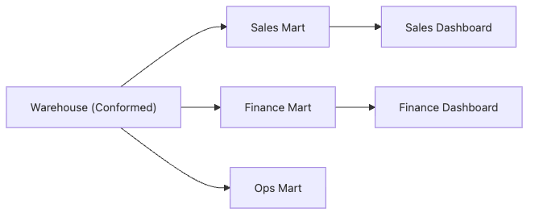

# Data Mart

One warehouse rarely means one shared language. Sales, finance, and operations may start from the same source data, but they read it through different questions, different permissions, and different levels of aggregation.

This is post 8 in the Data Warehouse 101 series.

In this post, we look at data marts as the layer that translates common warehouse assets into domain-ready analytical surfaces. The key is to narrow the interface without breaking the shared definitions underneath.

## Questions this article answers

- How is a data mart different from the warehouse itself?
- Why separate organization-wide shared data from team-specific analytical space?
- What gets better when you reflect domain vocabulary directly in the data model?
- What role do conformed dimensions play across multiple marts?
- Why do access boundaries and self-service analysis matter so much in mart design?

## What You Will Learn

- The definition of a *data mart*
- How it differs from a *warehouse*
- Why we keep *small zones per domain*
- Five-step mart design hands-on
- Five common pitfalls

## Why It Matters

A warehouse holds *org-wide common data*. But *sales, finance, and ops* speak *different vocabularies*. A mart re-organizes data *in each team's words* — a *thin layer* on top of the warehouse.

> *Common in the warehouse, domain in the mart.*

## Concept at a Glance



*The warehouse keeps conformed shared assets, while domain-specific marts reshape them for sales, finance, and operations consumers.*

## Key Terms

- **Data Mart**: A *domain-scoped* analytical zone — a *subset* of the warehouse.
- **Conformed Dimension**: A dimension *shared* across marts.
- **Domain Modeling**: Modeling data with the *team's vocabulary and rules*.
- **Aggregated Mart**: A *pre-aggregated* mart for speed.
- **Self-service**: An interface analysts *use directly*.

## Before/After

**Before**: Sales reads *raw facts* from the warehouse. Joins are *complex* and *slow*.

**After**: A *sales mart* aggregates in *team vocabulary*. Dashboards load in *3 seconds*.

## Hands-on: Mart Design in Five Steps

### Step 1 — Define the domain

```text
"The sales mart sees data at the *opportunity* level. It bundles *customer, stage, amount, owner*."
```

### Step 2 — Use conformed dimensions

```sql
CREATE OR REPLACE TABLE sales_mart.fact_opportunity AS
SELECT
    o.opp_id,
    u.user_key AS owner_key,
    c.customer_key,
    o.stage,
    o.amount,
    o.created_at
FROM staging.opportunities o
JOIN warehouse.dim_user u ON u.user_id = o.owner_id
JOIN warehouse.dim_customer c ON c.customer_id = o.customer_id;
```

### Step 3 — Pre-aggregate

```sql
CREATE OR REPLACE TABLE sales_mart.agg_pipeline_by_owner AS
SELECT
    owner_key,
    stage,
    SUM(amount) AS pipeline_amount,
    COUNT(*) AS opp_count
FROM sales_mart.fact_opportunity
GROUP BY 1, 2;
```

### Step 4 — Query the mart

```sql
SELECT u.name, SUM(a.pipeline_amount) AS total_pipeline
FROM sales_mart.agg_pipeline_by_owner a
JOIN warehouse.dim_user u ON u.user_key = a.owner_key
WHERE a.stage IN ('proposal', 'negotiation')
GROUP BY u.name;
```

### Step 5 — Separate permissions

```sql
GRANT SELECT ON SCHEMA sales_mart TO ROLE sales_readers;
GRANT SELECT ON SCHEMA finance_mart TO ROLE finance_readers;
```

## What to Notice in This Code

- *Conformed dims* come from the *warehouse*.
- The *team vocabulary* shows up in *column names*.
- Permissions split by *domain*.

## Five Common Mistakes

1. **Building *separate dims per mart*.** A common cause of *number conflicts*.
2. **Skipping the warehouse and *building marts first*.** *Conforming later* is *hard*.
3. **Pulling *every column* into the mart.** *Unnecessary cost*.
4. **Skipping *permission splits*.** Risk of *sensitive data exposure*.
5. **Unclear if a mart is a *live SQL* or *materialized copy*.** Document *refresh policy*.

## How This Shows Up in Production

dbt's *marts/* folder is split *by domain*. Sales, finance, product, and marketing each have *their own mart* and pull *common dims* from the warehouse.

## How a Senior Engineer Thinks

- *A mart is the warehouse *rewritten in team vocabulary*.*
- *Conformed dimensions are the *org's constitution*.*
- *Refresh marts *small and often*.*
- *Permissions follow *domain boundaries*.*
- *Track each mart's *lifespan* as a metric.*

## Checklist

- [ ] You can distinguish *warehouse* from *mart*.
- [ ] You can define *conformed dimension*.
- [ ] You see why *permission split* matters.
- [ ] You know the trade-off of *pre-aggregation*.

## Practice Problems

1. Pick *three fact tables* for a *finance mart*.
2. Describe a *conflict scenario* when marts use separate dims.
3. List *two risks* of a mart without *permission split*.

## Wrap-up and Next Steps

A mart is a *thin bridge* between the team and the data. Next, we cover *performance optimization patterns*.

<!-- toc:begin -->
- [What Is a Data Warehouse?](./01-what-is-data-warehouse.md)
- [OLTP and OLAP](./02-oltp-and-olap.md)
- [Fact and Dimension](./03-fact-and-dimension.md)
- [Star Schema](./04-star-schema.md)
- [Partition and Clustering](./05-partition-and-clustering.md)
- [ETL and ELT](./06-etl-and-elt.md)
- [BI and Dashboard](./07-bi-and-dashboard.md)
- **Data Mart (current)**
- Performance Optimization (upcoming)
- Warehouse Design Example (upcoming)
<!-- toc:end -->

## References

- [Kimball — Data Mart](https://www.kimballgroup.com/data-warehouse-business-intelligence-resources/kimball-techniques/dimensional-modeling-techniques/)
- [dbt — Mart Layer](https://docs.getdbt.com/best-practices/how-we-structure/4-marts)
- [Snowflake — Schema Design](https://docs.snowflake.com/en/user-guide/intro-key-concepts)
- [Wikipedia — Data Mart](https://en.wikipedia.org/wiki/Data_mart)

Tags: DataWarehouse, DataMart, Modeling, Domain, Analytics
