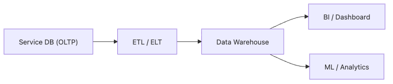

# Data Warehouse란 무엇인가?

서비스가 커지면 주문 한 건을 처리하는 데이터베이스와 어제 매출 합계를 빠르게 계산하는 데이터베이스가 서로 다른 요구를 받기 시작합니다. 같은 테이블과 같은 엔진으로 두 일을 동시에 처리하려고 하면 운영 쿼리도 느려지고 분석 쿼리도 느려집니다. 그래서 운영용 저장소와 분석용 저장소를 분리하는 사고방식이 필요합니다.

이 글은 Data Warehouse 101 시리즈의 첫 번째 글입니다.

## 이 글에서 다룰 문제

- Data Warehouse는 정확히 무엇이고 왜 따로 두어야 할까요?
- 서비스 DB만으로 분석까지 처리하면 어디서 한계가 드러날까요?
- OLTP와 OLAP는 어떤 점에서 요구가 다를까요?
- 분석용 저장소에서 시간 축과 집계가 왜 기본이 될까요?
- 초기 팀이 Warehouse 없이 버티다가 겪는 문제는 무엇일까요?

## 이 글에서 배울 것

- Data Warehouse의 정의와 역할
- 서비스 DB와 Warehouse가 어떻게 다른지
- 분석에 전용 저장소가 필요한 이유
- 첫 분석 쿼리를 만드는 5단계 흐름
- 입문 단계에서 자주 반복되는 실수 5가지

## 왜 중요한가

제품이 커지면 주문 한 건을 처리하는 데이터베이스와 어제 매출을 묻는 데이터베이스는 전혀 다른 요구를 받습니다. 두 작업을 하나의 엔진에 오래 묶어 두면 운영 쿼리도 느려지고 분석 쿼리도 느려집니다. 그래서 운영 저장소와 분석 저장소를 분리하는 설계가 필요합니다.

> 분석은 분석용 길로 보내고, 운영은 운영용 길로 지키는 편이 오래 버팁니다.

## 개념 한눈에 보기



*서비스 DB에서 Warehouse와 BI, ML 소비 계층으로 이어지는 기본 분석 경로*

## 핵심 용어

- **OLTP**: 주문, 결제처럼 짧고 동시성이 높은 트랜잭션 처리입니다.
- **OLAP**: 넓은 기간을 훑으며 집계하는 분석 처리입니다.
- **Data Warehouse**: 여러 소스에서 들어온 데이터를 분석 가능한 형태로 모아 둔 중앙 저장소입니다.
- **ETL / ELT**: 원천 데이터를 추출하고 변환한 뒤 적재하는 파이프라인입니다.
- **BI**: 데이터를 사람이 바로 판단에 쓸 수 있는 화면과 지표로 바꾸는 도구와 작업입니다.

## Before / After

**Before**: 서비스 DB에서 6개월 매출을 직접 집계하느라 프로덕션 응답이 느려집니다.

**After**: Warehouse에 한 번 적재한 뒤 필요한 관점으로 빠르게 집계합니다.

## 실습: 첫 분석 쿼리 5단계

### 1단계 — 사실 테이블 만들기

```sql
CREATE TABLE fact_orders (
    order_id BIGINT,
    user_id BIGINT,
    amount NUMERIC(12, 2),
    order_date DATE
);
```

### 2단계 — 데이터 적재

```sql
INSERT INTO fact_orders VALUES
    (1, 100, 25000, '2026-01-15'),
    (2, 100, 18000, '2026-02-03'),
    (3, 200, 42000, '2026-02-10');
```

### 3단계 — 월별 매출 구하기

```sql
SELECT date_trunc('month', order_date) AS month,
       SUM(amount) AS revenue
FROM fact_orders
GROUP BY 1
ORDER BY 1;
```

### 4단계 — 사용자별 합계 보기

```sql
SELECT user_id, SUM(amount) AS total
FROM fact_orders
GROUP BY user_id;
```

### 5단계 — 상위 고객 찾기

```sql
SELECT user_id, SUM(amount) AS total
FROM fact_orders
GROUP BY user_id
ORDER BY total DESC
LIMIT 10;
```

## 이 코드에서 먼저 봐야 할 점

- 분석 쿼리는 개별 행보다 집계를 중심으로 작성합니다.
- 날짜 컬럼은 거의 모든 분석의 기준축이 되므로 처음부터 명확히 둡니다.
- 원본 시스템을 직접 흔들지 않고 복사된 데이터를 대상으로 분석합니다.

## 자주 하는 실수 5가지

1. **서비스 DB에서 바로 분석 쿼리를 실행합니다.** 운영 장애로 이어지기 쉬운 대표 패턴입니다.
2. **모든 테이블을 그대로 복사합니다.** Warehouse는 목적에 맞게 다시 모델링해야 합니다.
3. **시간 컬럼 없이 적재합니다.** 나중에 시계열 분석이 막힙니다.
4. **적재 전에 모든 변환을 끝내려 합니다.** 먼저 원본을 보존하고 변환은 Warehouse 안에서 관리하는 편이 안전합니다.
5. **Warehouse를 실시간 시스템처럼 설계합니다.** 실제로는 분 단위 신선도로 충분한 경우가 많습니다.

## 실무에서는 이렇게 나타납니다

초기에는 Postgres replica를 분석용으로 써서 시작하는 팀도 많습니다. 데이터 규모와 사용자 수가 커지면 BigQuery, Snowflake, Redshift 같은 전용 엔진으로 옮겨 갑니다. 대시보드, 정기 리포트, ML feature 추출까지 대부분의 분석 작업이 Warehouse를 출발점으로 삼습니다.

## 실무에서는 이렇게 생각합니다

- 분석 워크로드와 서비스 워크로드는 초반부터 분리해서 봅니다.
- 원본 데이터는 보존하고, 변환은 다시 실행할 수 있게 관리합니다.
- 시간 축과 식별자는 거의 모든 fact의 기본 축으로 둡니다.
- 스키마 변경 비용은 적재 단계에서 먼저 치르는 편이 낫습니다.
- Warehouse 비용은 결국 쿼리 패턴이 결정합니다.

## 체크리스트

- [ ] OLTP와 OLAP의 차이를 설명할 수 있다.
- [ ] 운영 저장소와 분석 저장소를 왜 분리해야 하는지 말할 수 있다.
- [ ] ETL / ELT의 큰 흐름을 알고 있다.
- [ ] Warehouse에서 시간 컬럼이 왜 중요한지 이해하고 있다.

## 연습 문제

1. 서비스 DB와 Warehouse의 차이를 세 문장으로 정리해 보세요.
2. 어제 매출을 구하는 쿼리를 직접 적어 보세요.
3. Warehouse 없이 버티는 팀이 겪을 문제 세 가지를 적어 보세요.

## 마무리와 다음 글

Data Warehouse는 분석을 위해 따로 마련한 저장소입니다. 운영 시스템을 보호하면서도 넓은 범위의 집계를 빠르게 수행하려면 이런 분리가 필요합니다. 다음 글에서는 OLTP와 OLAP가 어떻게 다르고 왜 같은 엔진에 오래 함께 두기 어려운지 더 자세히 살펴보겠습니다.

<!-- toc:begin -->
- **Data Warehouse란 무엇인가? (현재 글)**
- OLTP와 OLAP (예정)
- Fact와 Dimension (예정)
- Star Schema (예정)
- Partition과 Clustering (예정)
- ETL과 ELT (예정)
- BI와 Dashboard (예정)
- Data Mart (예정)
- 성능 최적화 (예정)
- Warehouse 설계 예제 (예정)
<!-- toc:end -->

## 참고 자료

- [Kimball Group — Data Warehouse Concepts](https://www.kimballgroup.com/data-warehouse-business-intelligence-resources/)
- [BigQuery — What Is a Data Warehouse?](https://cloud.google.com/learn/what-is-a-data-warehouse)
- [Snowflake — Data Warehouse Guide](https://www.snowflake.com/guides/what-data-warehouse/)
- [AWS — Data Warehouse Concepts](https://aws.amazon.com/data-warehouse/)

Tags: DataWarehouse, Analytics, OLAP, Database, BI
