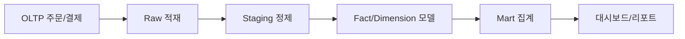

# Data Warehouse 101 (1/10): Data Warehouse란 무엇인가?

서비스가 커지면 주문 한 건을 처리하는 데이터베이스와 어제 매출 합계를 빠르게 계산하는 데이터베이스가 서로 다른 요구를 받기 시작합니다. 같은 테이블과 같은 엔진으로 두 일을 동시에 처리하려고 하면 운영 쿼리도 느려지고 분석 쿼리도 느려집니다. 그래서 운영용 저장소와 분석용 저장소를 분리하는 사고방식이 필요합니다.

이 글은 Data Warehouse 101 시리즈의 첫 번째 글입니다.


*Data Warehouse 101 1장 흐름 개요*
> Data Warehouse 설계는 '여러 출처의 데이터를 모아 분석 관점으로 재정렬하되, 운영 부담 없이' 처리하는 방식으로 시작합니다.

## 먼저 던지는 질문

- Data Warehouse는 정확히 무엇이고 왜 따로 두어야 할까요?
- 서비스 DB만으로 분석까지 처리하면 어디서 한계가 드러날까요?
- OLTP와 OLAP는 어떤 점에서 요구가 다를까요?

## 이 글에서 배울 것

- Data Warehouse의 정의와 역할
- 서비스 DB와 Warehouse가 어떻게 다른지
- 분석에 전용 저장소가 필요한 이유
- 첫 분석 쿼리를 만드는 5단계 흐름
- 입문 단계에서 자주 반복되는 실수 5가지

## 왜 중요한가

제품이 커지면 주문 한 건을 처리하는 데이터베이스와 어제 매출을 묻는 데이터베이스는 전혀 다른 요구를 받습니다. 두 작업을 하나의 엔진에 오래 묶어 두면 운영 쿼리도 느려지고 분석 쿼리도 느려집니다. 그래서 운영 저장소와 분석 저장소를 분리하는 설계가 필요합니다.

> 분석은 분석용 길로 보내고, 운영은 운영용 길로 지키는 편이 오래 버팁니다.

## 개념 한눈에 보기

Data Warehouse는 운영 시스템(OLTP)의 부담 없이 분석(OLAP)을 수행하기 위해 따로 마련한 저장소입니다. 여러 원천에서 들어온 데이터를 분석에 맞게 재정렬하고, 과거 기록을 빠르게 훑을 수 있도록 설계합니다.

## 핵심 용어

- **OLTP**: 주문, 결제처럼 짧고 동시성이 높은 트랜잭션 처리입니다.
- **OLAP**: 넓은 기간을 훑으며 집계하는 분석 처리입니다.
- **Data Warehouse**: 여러 소스에서 들어온 데이터를 분석 가능한 형태로 모아 둔 중앙 저장소입니다.
- **ETL / ELT**: 원천 데이터를 추출하고 변환한 뒤 적재하는 파이프라인입니다.
- **BI**: 데이터를 사람이 바로 판단에 쓸 수 있는 화면과 지표로 바꾸는 도구와 작업입니다.

## 전후 비교

**Before**: 서비스 DB에서 6개월 매출을 직접 집계하느라 프로덕션 응답이 느려집니다.

**After**: Warehouse에 한 번 적재한 뒤 필요한 관점으로 빠르게 집계합니다.

## 실습: 첫 분석 쿼리 5단계

### 1단계 — 사실 테이블 만들기

```sql
CREATE TABLE fact_orders (
    order_id BIGINT,
    user_id BIGINT,
    amount NUMERIC(12, 2),
    order_date DATE
);
```

### 2단계 — 데이터 적재

```sql
INSERT INTO fact_orders VALUES
    (1, 100, 25000, '2026-01-15'),
    (2, 100, 18000, '2026-02-03'),
    (3, 200, 42000, '2026-02-10');
```

### 3단계 — 월별 매출 구하기

```sql
SELECT date_trunc('month', order_date) AS month,
       SUM(amount) AS revenue
FROM fact_orders
GROUP BY 1
ORDER BY 1;
```

### 4단계 — 사용자별 합계 보기

```sql
SELECT user_id, SUM(amount) AS total
FROM fact_orders
GROUP BY user_id;
```

### 5단계 — 상위 고객 찾기

```sql
SELECT user_id, SUM(amount) AS total
FROM fact_orders
GROUP BY user_id
ORDER BY total DESC
LIMIT 10;
```

## 이 코드에서 먼저 봐야 할 점

- 분석 쿼리는 개별 행보다 집계를 중심으로 작성합니다.
- 날짜 컬럼은 거의 모든 분석의 기준축이 되므로 처음부터 명확히 둡니다.
- 원본 시스템을 직접 흔들지 않고 복사된 데이터를 대상으로 분석합니다.

## 자주 하는 실수 5가지

1. **서비스 DB에서 바로 분석 쿼리를 실행합니다.** 운영 장애로 이어지기 쉬운 대표 패턴입니다.
2. **모든 테이블을 그대로 복사합니다.** Warehouse는 목적에 맞게 다시 모델링해야 합니다.
3. **시간 컬럼 없이 적재합니다.** 나중에 시계열 분석이 막힙니다.
4. **적재 전에 모든 변환을 끝내려 합니다.** 먼저 원본을 보존하고 변환은 Warehouse 안에서 관리하는 편이 안전합니다.
5. **Warehouse를 실시간 시스템처럼 설계합니다.** 실제로는 분 단위 신선도로 충분한 경우가 많습니다.

## 실무에서는 이렇게 나타납니다

초기에는 Postgres replica를 분석용으로 써서 시작하는 팀도 많습니다. 데이터 규모와 사용자 수가 커지면 BigQuery, Snowflake, Redshift 같은 전용 엔진으로 옮겨 갑니다. 대시보드, 정기 리포트, ML feature 추출까지 대부분의 분석 작업이 Warehouse를 출발점으로 삼습니다.

## 실무에서는 이렇게 생각합니다

- 분석 워크로드와 서비스 워크로드는 초반부터 분리해서 봅니다.
- 원본 데이터는 보존하고, 변환은 다시 실행할 수 있게 관리합니다.
- 시간 축과 식별자는 거의 모든 fact의 기본 축으로 둡니다.
- 스키마 변경 비용은 적재 단계에서 먼저 치르는 편이 낫습니다.
- Warehouse 비용은 결국 쿼리 패턴이 결정합니다.

## 체크리스트

- [ ] OLTP와 OLAP의 차이를 설명할 수 있다.
- [ ] 운영 저장소와 분석 저장소를 왜 분리해야 하는지 말할 수 있다.
- [ ] ETL / ELT의 큰 흐름을 알고 있다.
- [ ] Warehouse에서 시간 컬럼이 왜 중요한지 이해하고 있다.

## 연습 문제

1. 서비스 DB와 Warehouse의 차이를 세 문장으로 정리해 보세요.
2. 어제 매출을 구하는 쿼리를 직접 적어 보세요.
3. Warehouse 없이 버티는 팀이 겪을 문제 세 가지를 적어 보세요.

## 마무리와 다음 글

Data Warehouse는 분석을 위해 따로 마련한 저장소입니다. 운영 시스템을 보호하면서도 넓은 범위의 집계를 빠르게 수행하려면 이런 분리가 필요합니다. 다음 글에서는 OLTP와 OLAP가 어떻게 다르고 왜 같은 엔진에 오래 함께 두기 어려운지 더 자세히 봅니다.

## OLTP와 OLAP를 한 번에 비교하기

Data Warehouse를 이해할 때 가장 먼저 해야 할 일은 운영 트랜잭션과 분석 트랜잭션을 같은 문제로 보지 않는 일입니다. 운영 시스템은 한 건의 정확한 성공과 실패를 다루고, 분석 시스템은 많은 건의 패턴을 읽습니다. 이 차이를 문장으로만 이해하면 실제 설계에서 흔들리기 쉬우므로, 비교표로 먼저 고정하는 편이 실무에서 도움이 됩니다.

| 항목 | OLTP(운영) | OLAP(분석) |
| --- | --- | --- |
| 핵심 질문 | 이 주문을 지금 처리할 수 있는가 | 지난 12개월 매출이 어떻게 변했는가 |
| 데이터 범위 | 현재 상태 중심, 최근 데이터 | 과거 포함 장기 이력 |
| 쿼리 형태 | 짧은 point lookup, update/insert | 긴 scan, group by, join |
| 지연 허용치 | 밀리초~초 | 초~분 |
| 실패 영향 | 고객 경험 직접 훼손 | 의사결정 지연 |
| 정합성 초점 | 강한 트랜잭션 일관성 | 분석 시점 일관성 |
| 스키마 변경 | 보수적, 다운타임 민감 | 배치 기반 점진 변경 가능 |
| 비용 최적화 | 쓰기/동시성 중심 | 스캔 바이트/집계 성능 중심 |

위 표에서 중요한 것은 어느 쪽이 더 고급인지가 아니라, 실패 비용이 완전히 다르다는 사실입니다. 운영 DB의 실패는 고객 결제 실패로 이어지고, 분석 DB의 실패는 리포트 지연으로 이어집니다. 둘 다 중요하지만 대응 방식이 다르기 때문에 저장소를 분리하는 것이 합리적입니다.

## Data Warehouse 아키텍처를 계층으로 보기

Data Warehouse를 처음 설계할 때는 제품 기능처럼 한 번에 완성하려고 하기보다, 계층을 나누고 책임을 분리하는 방식이 안정적입니다. 아래 YAML은 최소한의 계층을 보여 주는 예시입니다.

```yaml
warehouse_layers:
  - name: raw
    purpose: "원천 데이터를 변경 없이 보존"
    retention: "180 days or more"
    owner: "data-platform"
  - name: staging
    purpose: "타입 정리, 컬럼 표준화, 기본 정제"
    retention: "rebuildable"
    owner: "analytics-engineering"
  - name: marts
    purpose: "도메인별 소비 모델 제공"
    retention: "business defined"
    owner: "domain analytics"
serving:
  bi_tools:
    - looker
    - tableau
  refresh_policy:
    batch: "hourly"
    realtime: "not required for most metrics"
```

이 구조가 주는 실무 이점은 세 가지입니다. 첫째, raw를 유지하면 과거 시점 재현이 가능합니다. 둘째, staging을 분리하면 스키마 변경 충격을 완화할 수 있습니다. 셋째, marts를 도메인별로 나누면 팀마다 필요한 지표를 빠르게 제공할 수 있습니다.

## 왜 분리가 실제 비용을 줄이는가

운영 DB와 분석 DB를 분리하면 인프라가 두 배로 들 것처럼 보일 수 있습니다. 하지만 운영 지연으로 인한 장애 비용, 잘못된 리포트로 인한 의사결정 비용까지 합치면 분리가 장기적으로 저렴한 경우가 많습니다. 예를 들어 월말 집계를 운영 DB에서 직접 돌리면 다음과 같은 연쇄가 자주 발생합니다.

1. 장시간 집계 쿼리로 버퍼 캐시가 오염됩니다.
2. 같은 시간대의 주문/결제 API 응답이 느려집니다.
3. 타임아웃 재시도로 트래픽이 더 증가합니다.
4. 결국 장애 대응에 인력이 투입되고, 원인 분석에 추가 시간이 듭니다.

반대로 Warehouse 분리 구조에서는 운영 DB가 쓰기 중심 역할에 집중하고, 분석 DB는 읽기 중심 최적화를 적용할 수 있습니다. 분리의 핵심은 기술 유행이 아니라 실패 반경을 줄이는 아키텍처 결정입니다.

## 데이터 웨어하우스 아키텍처 상세 해설

아키텍처를 실제 운영 관점으로 풀어 보면, 데이터 웨어하우스는 단일 데이터베이스가 아니라 경계가 분명한 여러 계약의 조합입니다. 수집 계층은 "원천을 손상 없이 저장한다"는 계약을 지키고, 변환 계층은 "비즈니스 해석 가능한 컬럼으로 표준화한다"는 계약을 지킵니다. 마지막 소비 계층은 "지표 정의와 필터 규칙을 고정해 반복 가능한 숫자를 제공한다"는 계약을 지킵니다.

```yaml
architecture_contracts:
  ingest:
    rule: "raw is append-only"
    failure_policy: "retry with dead-letter"
  transform:
    rule: "explicit casting and test"
    failure_policy: "stop downstream publish"
  serve:
    rule: "metrics are centrally defined"
    failure_policy: "fallback to last successful snapshot"
```

이 계약이 문서와 코드로 함께 남아 있으면 장애가 발생해도 어디서 문제가 생겼는지 빠르게 좁힐 수 있습니다. 반대로 계약 없이 파이프라인이 커지면, 같은 수치를 두고도 원천 문제인지 변환 문제인지 소비 문제인지 구분이 어려워집니다.

## 도입 초기 팀을 위한 최소 실행 순서

1. 운영 DB에서 CDC 또는 스냅샷 방식으로 raw 적재를 시작합니다.
2. 핵심 fact 한 개와 공통 dimension 두세 개만 먼저 모델링합니다.
3. 지표 3개를 mart로 고정하고 대시보드 1장을 운영합니다.
4. 매주 스캔 비용과 지표 불일치 건수를 점검합니다.

이 순서는 작지만 강한 루프를 만듭니다. 처음부터 완전한 모델을 만드는 대신, 측정 가능한 루프를 돌리며 구조를 확장하는 방식이 장기적으로 안정적입니다.

## 실무 적용 메모

아래 메모는 해당 장의 개념을 실제 운영 환경에 옮길 때 반복적으로 확인하는 항목을 정리한 것입니다. 단순히 지식을 아는 것과 운영에서 안정적으로 반복하는 것은 다르기 때문에, 팀 단위 규칙으로 문서화해 두는 편이 좋습니다.

| 점검 영역 | 질문 | 권장 기준 |
| --- | --- | --- |
| 데이터 정의 | 같은 용어를 팀마다 다르게 쓰는가 | 용어집과 지표 정의를 단일 출처로 관리 |
| 파이프라인 안정성 | 재실행 시 결과가 동일한가 | idempotent 원칙, 상태 테이블 관리 |
| 비용 통제 | 월별 비용이 예측 가능한가 | 스캔 바이트, 고비용 쿼리 상위 추적 |
| 품질 보증 | 잘못된 데이터 유입을 조기에 잡는가 | null/중복/범위 검증 자동화 |
| 책임 분리 | 장애 시 소유자가 명확한가 | 계층별 owner와 on-call 채널 지정 |

운영에서는 기술 선택보다 경계와 책임이 더 큰 차이를 만듭니다. 예를 들어 모델이 훌륭해도 지표 소유자가 없으면 숫자 불일치 이슈가 장기간 방치될 수 있습니다. 반대로 도구가 완벽하지 않아도 책임 경계가 명확하면 복구 속도와 개선 속도가 빠릅니다.

```yaml
operating_baseline:
  contracts:
    raw: "append-only and replayable"
    transform: "test-required before publish"
    serving: "semantic definitions are versioned"
  quality_checks:
    - not_null
    - unique_key
    - accepted_values
    - referential_integrity
  cost_controls:
    - heavy_query_review_weekly
    - partition_filter_required
    - select_star_block_in_pr
  ownership:
    data_platform: "ingestion and storage"
    analytics_engineering: "transform and marts"
    domain_analytics: "metric definition and dashboard"
```

이 기준을 프로젝트 초기에 합의하면, 시리즈에서 다룬 개념이 문서 지식으로 끝나지 않고 운영 습관으로 정착됩니다. 특히 신규 팀원이 합류했을 때 학습 속도가 빨라지고, 장애나 지표 충돌 같은 사건이 생겨도 공통된 기준으로 빠르게 의사결정을 내릴 수 있습니다.

또한 분기 단위 회고에서는 기술 성능 지표뿐 아니라 의사결정 지표도 함께 보는 것이 좋습니다. 예를 들어 "대시보드 숫자 논쟁으로 소모된 회의 시간", "지표 정의 변경 후 영향 범위 확인 시간", "재처리 요청 처리 리드타임" 같은 운영 지표를 추적하면 데이터 조직의 성숙도를 더 현실적으로 파악할 수 있습니다.

## 실전 앵커: 모델, 파이프라인, 성능 검증

아래 예시는 이 글의 개념을 실제 운영으로 옮길 때 바로 재사용할 수 있는 최소 앵커입니다. 스키마, 적재 설정, 성능 비교를 한 묶음으로 두면 설계 논의가 추상 수준에서 끝나지 않고 실행 가능한 결정으로 이어집니다.

```sql
-- 공통 분석 질의 템플릿: 기간 + 세그먼트 + 지표
WITH scoped AS (
    SELECT
        f.date_key,
        f.amount,
        f.qty,
        c.segment,
        p.category
    FROM fact_sales f
    JOIN dim_customer c ON c.customer_key = f.customer_key
    JOIN dim_product p ON p.product_key = f.product_key
    WHERE f.date_key BETWEEN 20260101 AND 20260331
)
SELECT
    segment,
    category,
    SUM(amount) AS revenue,
    SUM(qty) AS units,
    COUNT(*) AS order_lines,
    ROUND(SUM(amount) / NULLIF(COUNT(*), 0), 2) AS avg_line_amount
FROM scoped
GROUP BY 1, 2
ORDER BY revenue DESC;
```

```yaml
pipeline_contract:
  schedule: "0 * * * *"
  source:
    type: cdc
    lag_slo_minutes: 15
  transform:
    engine: dbt
    model_layers: [stg, int, mart]
  quality_tests:
    - not_null
    - unique
    - relationships
    - accepted_values
  publish:
    target: mart_sales_daily
    strategy: merge
```



성능 비교는 반드시 동일 조건에서 수행해야 합니다. 파티션 필터 유무, 조인 순서, 집계 단위를 고정하지 않으면 숫자가 설계를 설명하지 못합니다.

| 비교 항목 | 조건 A(비최적화) | 조건 B(최적화) | 해석 |
| --- | --- | --- | --- |
| 스캔 바이트 | 480GB | 62GB | 파티션 프루닝이 대부분의 차이를 만듭니다. |
| 실행 시간 | 94초 | 18초 | 집계 이전 필터링으로 셔플 비용이 줄어듭니다. |
| 슬롯/크레딧 사용량 | 높음 | 중간 | 비용 안정성이 높아집니다. |
| 재현성 | 낮음 | 높음 | 표준 템플릿 쿼리 사용 시 비교 가능성이 유지됩니다. |

운영에서는 "정확한 한 번"보다 "안전한 재실행"이 더 중요한 경우가 많습니다. 그래서 적재 키를 두고 upsert 기준을 명확히 정의하는 방식이 필요합니다.

```sql
-- 재실행 가능한 머지 예시
MERGE INTO mart_sales_daily t
USING (
    SELECT
        d.full_date,
        c.segment,
        p.category,
        SUM(f.amount) AS revenue,
        SUM(f.qty) AS units
    FROM fact_sales f
    JOIN dim_date d ON d.date_key = f.date_key
    JOIN dim_customer c ON c.customer_key = f.customer_key
    JOIN dim_product p ON p.product_key = f.product_key
    WHERE d.full_date >= CURRENT_DATE - INTERVAL '7 day'
    GROUP BY 1, 2, 3
) s
ON t.full_date = s.full_date
AND t.segment = s.segment
AND t.category = s.category
WHEN MATCHED THEN UPDATE SET
    revenue = s.revenue,
    units = s.units,
    updated_at = CURRENT_TIMESTAMP
WHEN NOT MATCHED THEN INSERT (
    full_date, segment, category, revenue, units, updated_at
) VALUES (
    s.full_date, s.segment, s.category, s.revenue, s.units, CURRENT_TIMESTAMP
);
```

이 패턴을 기준선으로 두면, 모델 변경이나 파이프라인 장애가 생겨도 영향을 계층별로 좁혀 복구할 수 있습니다. 데이터 웨어하우스 운영은 쿼리 한두 개의 튜닝보다, 반복 가능한 설계 계약을 지키는 과정에 더 가깝습니다.

### 운영 확장 메모

데이터 웨어하우스를 오래 운영하면 기술 선택보다 운영 규율이 성능과 신뢰도를 좌우합니다. 다음 예시는 팀에서 반복적으로 사용하는 점검 묶음입니다.

```sql
-- 파티션 필터 누락 탐지용 예시
EXPLAIN
SELECT category, SUM(amount) AS revenue
FROM fact_sales
WHERE date_key BETWEEN 20260101 AND 20260131
GROUP BY category;
```

```yaml
review_policy:
  query_rules:
    - require_partition_filter: true
    - block_select_star_on_fact: true
    - require_owner_for_metric_change: true
  incident_rules:
    - classify: [schema_change, pipeline_lag, quality_failure]
    - first_response_minutes: 15
```


아키텍처가 단순해 보여도, 계약과 검증 루프를 문서화해 두면 신규 인원이 합류해도 같은 품질을 유지할 수 있습니다.

### 운영 확장 메모

데이터 웨어하우스를 오래 운영하면 기술 선택보다 운영 규율이 성능과 신뢰도를 좌우합니다. 다음 예시는 팀에서 반복적으로 사용하는 점검 묶음입니다.

```sql
-- 파티션 필터 누락 탐지용 예시
EXPLAIN
SELECT category, SUM(amount) AS revenue
FROM fact_sales
WHERE date_key BETWEEN 20260101 AND 20260131
GROUP BY category;
```

```yaml
review_policy:
  query_rules:
    - require_partition_filter: true
    - block_select_star_on_fact: true
    - require_owner_for_metric_change: true
  incident_rules:
    - classify: [schema_change, pipeline_lag, quality_failure]
    - first_response_minutes: 15
```


아키텍처가 단순해 보여도, 계약과 검증 루프를 문서화해 두면 신규 인원이 합류해도 같은 품질을 유지할 수 있습니다.

### 운영 확장 메모

데이터 웨어하우스를 오래 운영하면 기술 선택보다 운영 규율이 성능과 신뢰도를 좌우합니다. 다음 예시는 팀에서 반복적으로 사용하는 점검 묶음입니다.

```sql
-- 파티션 필터 누락 탐지용 예시
EXPLAIN
SELECT category, SUM(amount) AS revenue
FROM fact_sales
WHERE date_key BETWEEN 20260101 AND 20260131
GROUP BY category;
```

```yaml
review_policy:
  query_rules:
    - require_partition_filter: true
    - block_select_star_on_fact: true
    - require_owner_for_metric_change: true
  incident_rules:
    - classify: [schema_change, pipeline_lag, quality_failure]
    - first_response_minutes: 15
```


아키텍처가 단순해 보여도, 계약과 검증 루프를 문서화해 두면 신규 인원이 합류해도 같은 품질을 유지할 수 있습니다.

### 운영 확장 메모

데이터 웨어하우스를 오래 운영하면 기술 선택보다 운영 규율이 성능과 신뢰도를 좌우합니다. 다음 예시는 팀에서 반복적으로 사용하는 점검 묶음입니다.

```sql
-- 파티션 필터 누락 탐지용 예시
EXPLAIN
SELECT category, SUM(amount) AS revenue
FROM fact_sales
WHERE date_key BETWEEN 20260101 AND 20260131
GROUP BY category;
```

```yaml
review_policy:
  query_rules:
    - require_partition_filter: true
    - block_select_star_on_fact: true
    - require_owner_for_metric_change: true
  incident_rules:
    - classify: [schema_change, pipeline_lag, quality_failure]
    - first_response_minutes: 15
```


아키텍처가 단순해 보여도, 계약과 검증 루프를 문서화해 두면 신규 인원이 합류해도 같은 품질을 유지할 수 있습니다.

## 처음 질문으로 돌아가기

- **Data Warehouse는 정확히 무엇이고 왜 따로 두어야 할까요?**
  - Warehouse는 OLTP(운영)과 OLAP(분석)을 분리해 각각의 요구를 독립적으로 최적화합니다.
- **서비스 DB만으로 분석까지 처리하면 어디서 한계가 드러날까요?**
  - 운영 쿼리의 잠금 대기, 분석 쿼리의 장시간 실행 같은 상호 간섭이 발생합니다.
- **OLTP와 OLAP는 어떤 점에서 요구가 다를까요?**
  - OLTP는 짧고 동시성 높은 트랜잭션, OLAP는 넓은 범위를 읽는 대량 집계로 최적화 방향이 정반대입니다.

<!-- toc:begin -->
## 시리즈 목차

- **Data Warehouse란 무엇인가? (현재 글)**
- OLTP와 OLAP (예정)
- Fact와 Dimension (예정)
- Star Schema (예정)
- Partition과 Clustering (예정)
- ETL과 ELT (예정)
- BI와 Dashboard (예정)
- Data Mart (예정)
- 성능 최적화 (예정)
- Warehouse 설계 예제 (예정)

<!-- toc:end -->

## 참고 자료

- [Kimball Group — Data Warehouse Concepts](https://www.kimballgroup.com/data-warehouse-business-intelligence-resources/)
- [BigQuery — What Is a Data Warehouse?](https://cloud.google.com/learn/what-is-a-data-warehouse)
- [Snowflake — Data Warehouse Guide](https://www.snowflake.com/guides/what-data-warehouse/)
- [AWS — Data Warehouse Concepts](https://aws.amazon.com/data-warehouse/)

- [이 시리즈의 예제 코드 (book-examples)](https://github.com/yeongseon-books/book-examples/tree/main/data-warehouse-101/ko)

Tags: DataWarehouse, Analytics, OLAP, Database, BI
