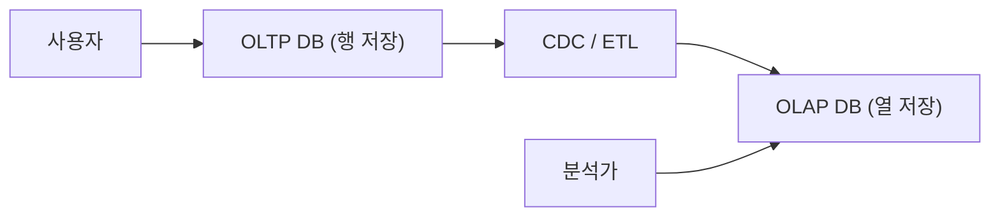

# OLTP와 OLAP

> Data Warehouse 101 시리즈 (2/10)


## 이 글에서 다룰 문제

OLTP는 지금 이 순간의 한 건을 빠르게 처리하고, OLAP는 과거 전체를 한 번에 훑습니다. 최적화 방향이 정반대라서 같은 엔진으로 두 요구를 모두 잘 만족시키기 어렵습니다.

> 적합한 도구를 골라야 합니다. 하나로 모두 해결하려 하면 두 워크로드가 함께 불편해집니다.

## 전체 흐름


## Before/After

**Before**: 하나의 Postgres에서 결제 처리와 월간 분석이 충돌해 지연이 발생합니다.

**After**: OLTP는 Postgres, OLAP는 BigQuery를 맡아 각자의 일에 맞게 최적화됩니다.

## 비교 5단계

### 1단계 — OLTP 패턴

```sql
-- 한 사용자의 잔액 갱신
UPDATE accounts SET balance = balance - 1000 WHERE id = 42;
```

### 2단계 — OLAP 패턴

```sql
-- 전체 사용자 평균 잔액
SELECT AVG(balance) FROM accounts;
```

### 3단계 — 행 저장 비용

```sql
-- 행 저장에서는 한 컬럼만 봐도 모든 컬럼을 읽는다
SELECT amount FROM fact_orders;
```

### 4단계 — 열 저장의 이점

```sql
-- 열 저장에서는 amount 컬럼만 스캔한다
SELECT SUM(amount) FROM fact_orders;
```

### 5단계 — 분리된 흐름

```sql
-- OLTP 에서는 한 건 INSERT
INSERT INTO orders VALUES (...);
-- OLAP 에서는 누적된 사실로 분석
SELECT date_trunc('day', created_at), COUNT(*) FROM fact_orders GROUP BY 1;
```

## 이 코드에서 주목할 점

- 짧은 쿼리는 행 저장에서 더 빠르게 처리됩니다.
- 큰 집계는 열 저장에서 더 유리합니다.
- 두 시스템이 감당하는 동시성의 성격도 완전히 다릅니다.

## 자주 하는 실수 5가지

1. **OLAP 쿼리를 OLTP에서 실행합니다.** 잠금 대기가 늘고 지연이 누적됩니다.
2. **OLAP에 짧은 트랜잭션을 그대로 보냅니다.** 비용만 늘고 효과는 거의 없습니다.
3. **두 시스템 사이의 동기화 지연이 0이라고 가정합니다.** 실제 운영에서는 몇 분의 lag를 감안해야 합니다.
4. **인덱스 전략을 그대로 복사합니다.** 접근 패턴이 다르므로 따로 설계해야 합니다.
5. **백업 정책을 공유합니다.** OLTP에는 PITR이, OLAP에는 snapshot이 더 적절한 경우가 많습니다.

## 실무에서는 이렇게 쓰입니다

서비스 결제는 Postgres나 MySQL 같은 OLTP에 두고, 매출 리포트는 Snowflake나 BigQuery 같은 OLAP에 둡니다. 두 시스템 사이는 Debezium 같은 CDC로 연결하고, 약간의 지연이 생기는 전제를 받아들입니다.

## 체크리스트

- [ ] OLTP와 OLAP의 차이를 세 줄로 설명할 수 있습니다.
- [ ] 행 저장과 열 저장의 차이를 이해했습니다.
- [ ] CDC가 무엇인지 설명할 수 있습니다.
- [ ] 두 시스템의 백업 방식 차이를 알고 있습니다.

## 정리 및 다음 단계

OLTP와 OLAP는 최적화 방향이 다릅니다. 다음 글에서는 OLAP의 핵심 개념인 Fact와 Dimension을 살펴봅니다.

<!-- toc:begin -->
- [Data Warehouse란 무엇인가?](./01-what-is-data-warehouse.md)
- **OLTP와 OLAP (현재 글)**
- Fact와 Dimension (예정)
- Star Schema (예정)
- Partition과 Clustering (예정)
- ETL과 ELT (예정)
- BI와 Dashboard (예정)
- Data Mart (예정)
- 성능 최적화 (예정)
- Warehouse 설계 예제 (예정)
<!-- toc:end -->

## 참고 자료

- [Wikipedia — OLTP](https://en.wikipedia.org/wiki/Online_transaction_processing)
- [Wikipedia — OLAP](https://en.wikipedia.org/wiki/Online_analytical_processing)
- [Snowflake — Columnar Storage](https://docs.snowflake.com/en/user-guide/intro-key-concepts)
- [Designing Data-Intensive Applications](https://dataintensive.net/)

Tags: DataWarehouse, OLTP, OLAP, Database, Analytics
