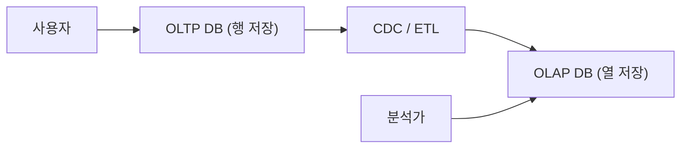

# OLTP와 OLAP

> Data Warehouse 101 시리즈 (2/10)

<!-- a-grade-intro:begin -->

**핵심 질문**: 같은 *SQL* 인데 *왜 다른 엔진* 이 필요할까요? *행 vs 열 저장* 은 *왜 큰 차이* 를 만들까요?

> *OLTP 는 *짧고 많이*, OLAP 는 *길고 적게* 쓴다.*

<!-- a-grade-intro:end -->

## 이 글에서 배울 것

- *OLTP* 와 *OLAP* 의 워크로드 차이
- *행 저장* 과 *열 저장* 의 trade-off
- 두 시스템을 *분리* 하는 이유
- 5단계 비교 실습
- 흔한 함정 5가지

## 왜 중요한가

OLTP 는 *지금 이 순간* 한 건을 빠르게 처리하고, OLAP 는 *과거 전체* 를 한 번에 훑습니다. *최적화의 방향이 정반대* 라서 *같은 엔진으로는* 둘 다 *잘하기 어렵습니다*.

> *적합한 도구를 골라라. 하나로 모두 하려면 둘 다 불행해진다.*

## 개념 한눈에 보기



## 핵심 용어 정리

- **OLTP**: 짧고 *동시* 한 *읽기/쓰기* 위주.
- **OLAP**: 큰 범위의 *읽기 위주 집계*.
- **Row store**: 한 행의 *모든 컬럼* 을 *함께* 저장.
- **Column store**: 같은 컬럼의 *값들* 을 *연속* 으로 저장.
- **CDC**: *Change Data Capture*, OLTP 변경을 OLAP 로 *흘리는* 방식.

## Before/After

**Before**: 하나의 Postgres 에서 *결제 처리* 와 *월간 분석* 이 충돌해 *지연이 발생* 한다.

**After**: OLTP 는 *Postgres*, OLAP 는 *BigQuery* — 각자의 일에 *최적화* 된다.

## 실습: 비교 5단계

### 1단계 — OLTP 패턴

```sql
-- 한 사용자의 잔액 갱신
UPDATE accounts SET balance = balance - 1000 WHERE id = 42;
```

### 2단계 — OLAP 패턴

```sql
-- 전체 사용자 평균 잔액
SELECT AVG(balance) FROM accounts;
```

### 3단계 — 행 저장 비용

```sql
-- 행 저장에서는 한 컬럼만 봐도 모든 컬럼을 읽는다
SELECT amount FROM fact_orders;
```

### 4단계 — 열 저장의 이점

```sql
-- 열 저장에서는 amount 컬럼만 스캔한다
SELECT SUM(amount) FROM fact_orders;
```

### 5단계 — 분리된 흐름

```sql
-- OLTP 에서는 한 건 INSERT
INSERT INTO orders VALUES (...);
-- OLAP 에서는 누적된 사실로 분석
SELECT date_trunc('day', created_at), COUNT(*) FROM fact_orders GROUP BY 1;
```

## 이 코드에서 주목할 점

- *짧은 쿼리* 는 *행 저장* 에서 빠르다.
- *큰 집계* 는 *열 저장* 에서 빠르다.
- *동시성* 의 모양이 *완전히 다르다*.

## 자주 하는 실수 5가지

1. **OLAP 쿼리를 *OLTP* 에서 돌린다.** *잠금 대기* 가 늘어 *지연이 누적*.
2. **OLAP 에 *짧은 트랜잭션* 을 보낸다.** *비용만 늘고 효과는 없다*.
3. **두 시스템 *동기화 지연* 을 *0* 이라 가정.** 항상 *몇 분의 lag* 를 가정한다.
4. **인덱스 전략을 *그대로 복사*.** *접근 패턴이 다르므로* 따로 설계한다.
5. **백업 정책을 *공유*.** OLTP 는 *PITR*, OLAP 는 *snapshot* 이 더 적절하다.

## 실무에서는 이렇게 쓰입니다

서비스 결제는 *Postgres / MySQL* 같은 OLTP 에, 매출 리포트는 *Snowflake / BigQuery* 같은 OLAP 에 둡니다. 두 시스템 사이는 *Debezium* 같은 *CDC* 로 *작은 지연* 을 두고 흘립니다.

## 시니어 엔지니어는 이렇게 생각합니다

- *워크로드의 *모양* 부터 분석한다.*
- *한 시스템으로 *둘 다* 하려는 욕심을 의심한다.*
- *비용은 *접근 패턴* 으로 결정된다.*
- *동기화 지연* 을 *상수* 로 다룬다.
- *분리 이후* 의 *데이터 일관성* 을 *처음부터* 설계한다.

## 체크리스트

- [ ] OLTP 와 OLAP 를 *세 줄* 로 비교할 수 있다.
- [ ] *행 저장 / 열 저장* 의 차이를 안다.
- [ ] *CDC* 가 무엇인지 안다.
- [ ] 두 시스템의 *백업 차이* 를 안다.

## 연습 문제

1. *OLTP* 워크로드 예시 *3가지* 를 적어 보세요.
2. *OLAP* 워크로드 예시 *3가지* 를 적어 보세요.
3. *행 저장* 이 *어떤 쿼리* 에 유리한지 설명해 보세요.

## 정리 및 다음 단계

OLTP 와 OLAP 는 *최적화의 방향* 이 다릅니다. 다음 글에서는 OLAP 의 핵심 개념인 *Fact 와 Dimension* 을 봅니다.

<!-- toc:begin -->
- [Data Warehouse란 무엇인가?](./01-what-is-data-warehouse.md)
- **OLTP와 OLAP (현재 글)**
- Fact와 Dimension (예정)
- Star Schema (예정)
- Partition과 Clustering (예정)
- ETL과 ELT (예정)
- BI와 Dashboard (예정)
- Data Mart (예정)
- 성능 최적화 (예정)
- Warehouse 설계 예제 (예정)
<!-- toc:end -->

## 참고 자료

- [Wikipedia — OLTP](https://en.wikipedia.org/wiki/Online_transaction_processing)
- [Wikipedia — OLAP](https://en.wikipedia.org/wiki/Online_analytical_processing)
- [Snowflake — Columnar Storage](https://docs.snowflake.com/en/user-guide/intro-key-concepts)
- [Designing Data-Intensive Applications](https://dataintensive.net/)

Tags: DataWarehouse, OLTP, OLAP, Database, Analytics
