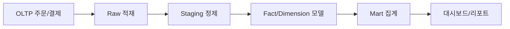

# Data Warehouse 101 (2/10): OLTP와 OLAP

이 글은 데이터 웨어하우스 101 시리즈의 2번째 글입니다.

OLTP는 지금 이 순간의 한 건을 빠르게 처리하고, OLAP는 과거 전체를 한 번에 훑습니다. 최적화 방향이 정반대라서 같은 엔진으로 두 요구를 모두 잘 만족시키기 어렵습니다.


## 먼저 던지는 질문

- OLTP와 OLAP는 어떤 워크로드를 다르게 처리할까요?
- 행 저장과 열 저장은 어느 쿼리에서 차이가 커질까요?
- 하나의 엔진으로 두 요구를 함께 처리하면 왜 곤란할까요?

## 큰 그림


*Data Warehouse 101 2장 흐름 개요*

OLTP는 짧은 트랜잭션에 최적화되고 OLAP는 대량 집계에 최적화됩니다. 입력 패턴의 차이가 저장 구조(행 vs 열), 인덱싱 전략, 동시성 모델까지 결정하므로 같은 엔진에 함께 두기 어렵습니다.

> OLTP와 OLAP는 입력 패턴이 반대입니다: OLTP는 한 행씩 빠르게, OLAP는 여러 행을 한 번에 처리합니다.

## 이 글에서 배울 것

- OLTP와 OLAP의 워크로드 차이
- 행 저장과 열 저장의 트레이드오프
- 두 시스템을 분리해야 하는 이유
- 비교 실습 5단계
- 입문 단계에서 자주 나오는 실수 5가지

## 왜 중요한가

OLTP는 지금 한 건을 빠르게 처리해야 하고, OLAP는 과거 전체를 한 번에 훑어야 합니다. 최적화 방향이 반대라서 하나의 엔진이 두 요구를 모두 잘 만족시키기는 어렵습니다. 그래서 워크로드의 모양을 먼저 보고 시스템을 나누는 판단이 중요합니다.

> 맞는 도구를 고르는 편이 낫습니다. 하나로 둘 다 하려 하면 둘 다 불편해집니다.

## 개념 한눈에 보기

OLTP는 '지금 이 건'을 빠르게 처리하고, OLAP는 '과거 전체'를 한 번에 훑습니다. 최적화 방향이 정반대라서 행 저장(OLTP) vs 열 저장(OLAP) 선택부터 인덱싱 전략까지 모든 것이 달라집니다.

## 핵심 용어

- **OLTP**: 짧고 동시성이 높은 읽기/쓰기 트랜잭션입니다.
- **OLAP**: 넓은 범위를 읽는 대용량 집계 중심 쿼리입니다.
- **행 저장**: 한 행의 모든 컬럼을 함께 저장하는 방식입니다.
- **열 저장**: 같은 컬럼의 값을 연속해서 저장하는 방식입니다.
- **CDC**: Change Data Capture. OLTP의 변경을 OLAP 쪽으로 흘려 보내는 방식입니다.

## 전후 비교

**Before**: 하나의 Postgres에서 결제 처리와 월간 분석이 충돌해 지연이 발생합니다.

**After**: OLTP는 Postgres, OLAP는 BigQuery를 맡아 각자의 일에 맞게 최적화됩니다.

## 실습: 비교 5단계

### 1단계 — OLTP 패턴

```sql
-- Update one user's balance
UPDATE accounts SET balance = balance - 1000 WHERE id = 42;
```

### 2단계 — OLAP 패턴

```sql
-- Average balance across all users
SELECT AVG(balance) FROM accounts;
```

### 3단계 — 행 저장의 비용

```sql
-- Row store reads all columns even if you ask for one
SELECT amount FROM fact_orders;
```

### 4단계 — 열 저장의 이점

```sql
-- Column store scans only the amount column
SELECT SUM(amount) FROM fact_orders;
```

### 5단계 — 분리된 흐름

```sql
-- OLTP receives single-row INSERT
INSERT INTO orders VALUES (...);
-- OLAP analyzes accumulated facts
SELECT date_trunc('day', created_at), COUNT(*) FROM fact_orders GROUP BY 1;
```

## 이 코드에서 먼저 봐야 할 점

- 짧은 쿼리는 행 저장에서 더 빠르게 처리됩니다.
- 큰 집계는 열 저장에서 더 유리합니다.
- 두 시스템이 감당하는 동시성의 성격도 완전히 다릅니다.

## 자주 하는 실수 5가지

1. **OLAP 쿼리를 OLTP에서 실행합니다.** 잠금 대기가 늘고 지연이 누적됩니다.
2. **OLAP에 짧은 트랜잭션을 그대로 보냅니다.** 비용만 늘고 효과는 거의 없습니다.
3. **두 시스템 사이의 동기화 지연이 0이라고 가정합니다.** 실제 운영에서는 몇 분의 lag를 감안해야 합니다.
4. **인덱스 전략을 그대로 복사합니다.** 접근 패턴이 다르므로 따로 설계해야 합니다.
5. **백업 정책을 공유합니다.** OLTP에는 PITR이, OLAP에는 snapshot이 더 적절한 경우가 많습니다.

## 실무에서는 이렇게 나타납니다

서비스 결제는 Postgres나 MySQL 같은 OLTP에 두고, 매출 리포트는 Snowflake나 BigQuery 같은 OLAP에 둡니다. 두 시스템 사이는 Debezium 같은 CDC로 연결하고, 약간의 지연이 생기는 전제를 받아들입니다.

## 실무에서는 이렇게 생각합니다

- 먼저 워크로드의 모양부터 봅니다.
- 하나의 엔진으로 두 역할을 모두 맡기는 결정은 의심부터 합니다.
- 비용은 결국 접근 패턴이 만든다고 봅니다.
- 복제 지연은 버그가 아니라 상수처럼 다룹니다.
- 분리 이후의 일관성 모델을 처음부터 설계합니다.

## 체크리스트

- [ ] OLTP와 OLAP의 차이를 세 줄로 설명할 수 있습니다.
- [ ] 행 저장과 열 저장의 차이를 이해했습니다.
- [ ] CDC가 무엇인지 설명할 수 있습니다.
- [ ] 두 시스템의 백업 방식 차이를 알고 있습니다.

## 연습 문제

1. OLTP 워크로드 예시 세 가지를 적어 보세요.
2. OLAP 워크로드 예시 세 가지를 적어 보세요.
3. 어떤 쿼리가 행 저장에 더 잘 맞는지 설명해 보세요.

## 마무리와 다음 글

OLTP와 OLAP는 최적화 방향이 다릅니다. 다음 글에서는 OLAP의 핵심 개념인 Fact와 Dimension을 살펴봅니다.


## 워크로드 차이를 표로 고정하기

OLTP와 OLAP를 설명할 때 자주 생기는 오해는 "OLTP는 작은 DB, OLAP는 큰 DB"라는 식의 단순화입니다. 핵심은 크기가 아니라 워크로드 모양입니다. 아래 비교표는 같은 조직 안에서 두 시스템이 왜 공존해야 하는지를 명확히 보여 줍니다.

| 관점 | OLTP | OLAP |
| --- | --- | --- |
| 기본 단위 | 한 건의 트랜잭션 | 다수 행의 집계 |
| 쿼리 패턴 | `INSERT/UPDATE/SELECT by PK` | `JOIN/GROUP BY/WINDOW` |
| 동시성 | 높은 짧은 요청 다수 | 상대적으로 긴 요청 소수 |
| 저장 최적화 | 행 저장 중심 | 열 저장 중심 |
| 인덱싱 전략 | point lookup 우선 | 스캔 최소화, partition 우선 |
| SLA | p95 응답시간 엄격 | 리포트 생성 시간 관리 |
| 데이터 신선도 | 거의 실시간 | 배치 또는 마이크로배치 |
| 대표 실패 | 락 대기, 데드락 | 과다 스캔, 셔플/스필 |

표를 기준으로 보면, 동일 엔진에서 둘을 동시에 최적화하려는 시도가 왜 오래 버티기 어려운지 이해할 수 있습니다. 한쪽의 최적화가 다른 쪽의 비용으로 전환되기 때문입니다.

## 행 저장과 열 저장의 실제 차이

행 저장은 한 건을 읽고 쓰는 비용이 낮습니다. 반면 열 저장은 특정 컬럼을 대량으로 읽는 비용이 낮습니다. 아래 예시는 동일한 비즈니스 질문에서도 어느 저장 구조가 유리한지 보여 줍니다.

```sql
-- OLTP 친화: 특정 주문의 상태 확인
SELECT order_id, status, updated_at
FROM orders
WHERE order_id = 987654;

-- OLAP 친화: 월별 매출 집계
SELECT date_trunc('month', order_date) AS month,
       SUM(amount) AS revenue
FROM fact_orders
GROUP BY 1
ORDER BY 1;
```

첫 쿼리는 한 행의 여러 컬럼을 즉시 읽어야 하므로 행 저장이 유리합니다. 둘째 쿼리는 amount와 date 축만 대량 스캔하면 되므로 열 저장이 유리합니다. 결국 저장 구조는 기술 선호가 아니라 질문의 형태가 결정합니다.

## 운영 분리 시 참고할 최소 정책

시스템을 분리할 때 "어디까지 분리할 것인가"가 흔한 논점입니다. 아래 정책은 작은 팀에서도 바로 적용할 수 있는 최소선입니다.

```yaml
separation_policy:
  oltp:
    allowed_queries:
      - point_lookup
      - short_transaction
    blocked_patterns:
      - full_table_scan
      - monthly_aggregation_on_prod
  olap:
    source:
      - cdc_stream
      - daily_snapshot
    freshness_slo: "<= 15 minutes"
  governance:
    owner_oltp: "backend"
    owner_olap: "data"
    incident_channel: "#data-runtime"
```

이런 정책을 코드 리뷰 규칙과 함께 운영하면 "분리했지만 결국 운영 DB에 무거운 쿼리가 다시 들어오는" 퇴행을 막을 수 있습니다. 기술 선택보다 운영 습관이 더 큰 차이를 만드는 구간입니다.

## 단일 엔진 전략이 실패하는 전형적 신호

다음 신호가 보이면 OLTP/OLAP 분리를 미루기 어렵습니다.

- 월말/주말 리포트 시간대마다 API 지연이 반복됩니다.
- 읽기 복제본을 늘려도 분석 쿼리 병목이 계속됩니다.
- 인덱스를 추가할수록 쓰기 성능이 악화됩니다.
- 배치 쿼리와 온라인 트랜잭션 간 우선순위 충돌이 커집니다.

이 신호는 단순 성능 문제가 아니라 아키텍처 경계 문제입니다. 즉, 쿼리 하나를 고치는 수준이 아니라 워크로드 분리를 설계해야 해결됩니다.


## 시스템 분리 시나리오 예시

가상의 커머스 서비스를 기준으로 보면, OLTP는 주문 생성, 결제 승인, 재고 차감 같은 경로를 처리합니다. OLAP는 캠페인 효과 분석, 월간 손익 집계, 채널별 전환율 비교를 처리합니다. 두 경로가 같은 스토리지와 캐시를 공유하면 피크 시간대에 상호 간섭이 커집니다.

```yaml
traffic_profile:
  oltp:
    peak_rps: 1200
    typical_query_ms: 20
    write_ratio: 0.55
  olap:
    peak_concurrent_queries: 40
    typical_query_seconds: 8
    scan_size_gb: 12
risk_if_shared:
  - cache_eviction_conflict
  - lock_wait_increase
  - planner_instability
```

분리 후에는 OLTP를 낮은 지연 중심으로, OLAP를 대량 읽기 중심으로 독립 튜닝할 수 있습니다. 이 분리는 단순 성능 향상뿐 아니라 장애 격리를 통해 운영 복원력을 높입니다.

## 비교표를 설계 체크리스트로 바꾸기

표를 읽고 끝내지 말고, 시스템 리뷰 질문으로 변환하면 실무에 바로 적용됩니다.

- 현재 가장 비싼 쿼리는 OLTP 성격인가 OLAP 성격인가
- 운영 장애 리포트에서 분석 쿼리 간섭이 반복되는가
- 분석 신선도 SLA를 분 단위로 합의했는가
- 분리 이후 데이터 지연을 사용자 커뮤니케이션에 반영했는가

이 질문에 답할 수 있으면 분리 의사결정이 기술 취향이 아니라 운영 근거로 전환됩니다.


## 실무 적용 메모

아래 메모는 해당 장의 개념을 실제 운영 환경에 옮길 때 반복적으로 확인하는 항목을 정리한 것입니다. 단순히 지식을 아는 것과 운영에서 안정적으로 반복하는 것은 다르기 때문에, 팀 단위 규칙으로 문서화해 두는 편이 좋습니다.

| 점검 영역 | 질문 | 권장 기준 |
| --- | --- | --- |
| 데이터 정의 | 같은 용어를 팀마다 다르게 쓰는가 | 용어집과 지표 정의를 단일 출처로 관리 |
| 파이프라인 안정성 | 재실행 시 결과가 동일한가 | idempotent 원칙, 상태 테이블 관리 |
| 비용 통제 | 월별 비용이 예측 가능한가 | 스캔 바이트, 고비용 쿼리 상위 추적 |
| 품질 보증 | 잘못된 데이터 유입을 조기에 잡는가 | null/중복/범위 검증 자동화 |
| 책임 분리 | 장애 시 소유자가 명확한가 | 계층별 owner와 on-call 채널 지정 |

운영에서는 기술 선택보다 경계와 책임이 더 큰 차이를 만듭니다. 예를 들어 모델이 훌륭해도 지표 소유자가 없으면 숫자 불일치 이슈가 장기간 방치될 수 있습니다. 반대로 도구가 완벽하지 않아도 책임 경계가 명확하면 복구 속도와 개선 속도가 빠릅니다.

```yaml
operating_baseline:
  contracts:
    raw: "append-only and replayable"
    transform: "test-required before publish"
    serving: "semantic definitions are versioned"
  quality_checks:
    - not_null
    - unique_key
    - accepted_values
    - referential_integrity
  cost_controls:
    - heavy_query_review_weekly
    - partition_filter_required
    - select_star_block_in_pr
  ownership:
    data_platform: "ingestion and storage"
    analytics_engineering: "transform and marts"
    domain_analytics: "metric definition and dashboard"
```

이 기준을 프로젝트 초기에 합의하면, 시리즈에서 다룬 개념이 문서 지식으로 끝나지 않고 운영 습관으로 정착됩니다. 특히 신규 팀원이 합류했을 때 학습 속도가 빨라지고, 장애나 지표 충돌 같은 사건이 생겨도 공통된 기준으로 빠르게 의사결정을 내릴 수 있습니다.

또한 분기 단위 회고에서는 기술 성능 지표뿐 아니라 의사결정 지표도 함께 보는 것이 좋습니다. 예를 들어 "대시보드 숫자 논쟁으로 소모된 회의 시간", "지표 정의 변경 후 영향 범위 확인 시간", "재처리 요청 처리 리드타임" 같은 운영 지표를 추적하면 데이터 조직의 성숙도를 더 현실적으로 파악할 수 있습니다.


### 운영 체크 포인트 추가

OLTP와 OLAP를 분리한 뒤에는 정기적으로 동기화 지연, 운영 DB 부하, 분석 쿼리 비용을 함께 점검해야 합니다. 특히 지연 허용치가 팀 합의 없이 커지면 분석 신뢰가 빠르게 떨어질 수 있으므로, 지연 임계값과 경고 채널을 문서로 고정하는 것이 좋습니다.


## 실전 앵커: 모델, 파이프라인, 성능 검증

아래 예시는 이 글의 개념을 실제 운영으로 옮길 때 바로 재사용할 수 있는 최소 앵커입니다. 스키마, 적재 설정, 성능 비교를 한 묶음으로 두면 설계 논의가 추상 수준에서 끝나지 않고 실행 가능한 결정으로 이어집니다.

```sql
-- 공통 분석 질의 템플릿: 기간 + 세그먼트 + 지표
WITH scoped AS (
    SELECT
        f.date_key,
        f.amount,
        f.qty,
        c.segment,
        p.category
    FROM fact_sales f
    JOIN dim_customer c ON c.customer_key = f.customer_key
    JOIN dim_product p ON p.product_key = f.product_key
    WHERE f.date_key BETWEEN 20260101 AND 20260331
)
SELECT
    segment,
    category,
    SUM(amount) AS revenue,
    SUM(qty) AS units,
    COUNT(*) AS order_lines,
    ROUND(SUM(amount) / NULLIF(COUNT(*), 0), 2) AS avg_line_amount
FROM scoped
GROUP BY 1, 2
ORDER BY revenue DESC;
```

```yaml
pipeline_contract:
  schedule: "0 * * * *"
  source:
    type: cdc
    lag_slo_minutes: 15
  transform:
    engine: dbt
    model_layers: [stg, int, mart]
  quality_tests:
    - not_null
    - unique
    - relationships
    - accepted_values
  publish:
    target: mart_sales_daily
    strategy: merge
```



성능 비교는 반드시 동일 조건에서 수행해야 합니다. 파티션 필터 유무, 조인 순서, 집계 단위를 고정하지 않으면 숫자가 설계를 설명하지 못합니다.

| 비교 항목 | 조건 A(비최적화) | 조건 B(최적화) | 해석 |
| --- | --- | --- | --- |
| 스캔 바이트 | 480GB | 62GB | 파티션 프루닝이 대부분의 차이를 만듭니다. |
| 실행 시간 | 94초 | 18초 | 집계 이전 필터링으로 셔플 비용이 줄어듭니다. |
| 슬롯/크레딧 사용량 | 높음 | 중간 | 비용 안정성이 높아집니다. |
| 재현성 | 낮음 | 높음 | 표준 템플릿 쿼리 사용 시 비교 가능성이 유지됩니다. |

운영에서는 "정확한 한 번"보다 "안전한 재실행"이 더 중요한 경우가 많습니다. 그래서 적재 키를 두고 upsert 기준을 명확히 정의하는 방식이 필요합니다.

```sql
-- 재실행 가능한 머지 예시
MERGE INTO mart_sales_daily t
USING (
    SELECT
        d.full_date,
        c.segment,
        p.category,
        SUM(f.amount) AS revenue,
        SUM(f.qty) AS units
    FROM fact_sales f
    JOIN dim_date d ON d.date_key = f.date_key
    JOIN dim_customer c ON c.customer_key = f.customer_key
    JOIN dim_product p ON p.product_key = f.product_key
    WHERE d.full_date >= CURRENT_DATE - INTERVAL '7 day'
    GROUP BY 1, 2, 3
) s
ON t.full_date = s.full_date
AND t.segment = s.segment
AND t.category = s.category
WHEN MATCHED THEN UPDATE SET
    revenue = s.revenue,
    units = s.units,
    updated_at = CURRENT_TIMESTAMP
WHEN NOT MATCHED THEN INSERT (
    full_date, segment, category, revenue, units, updated_at
) VALUES (
    s.full_date, s.segment, s.category, s.revenue, s.units, CURRENT_TIMESTAMP
);
```

이 패턴을 기준선으로 두면, 모델 변경이나 파이프라인 장애가 생겨도 영향을 계층별로 좁혀 복구할 수 있습니다. 데이터 웨어하우스 운영은 쿼리 한두 개의 튜닝보다, 반복 가능한 설계 계약을 지키는 과정에 더 가깝습니다.


### 운영 확장 메모

데이터 웨어하우스를 오래 운영하면 기술 선택보다 운영 규율이 성능과 신뢰도를 좌우합니다. 다음 예시는 팀에서 반복적으로 사용하는 점검 묶음입니다.

```sql
-- 파티션 필터 누락 탐지용 예시
EXPLAIN
SELECT category, SUM(amount) AS revenue
FROM fact_sales
WHERE date_key BETWEEN 20260101 AND 20260131
GROUP BY category;
```

```yaml
review_policy:
  query_rules:
    - require_partition_filter: true
    - block_select_star_on_fact: true
    - require_owner_for_metric_change: true
  incident_rules:
    - classify: [schema_change, pipeline_lag, quality_failure]
    - first_response_minutes: 15
```


아키텍처가 단순해 보여도, 계약과 검증 루프를 문서화해 두면 신규 인원이 합류해도 같은 품질을 유지할 수 있습니다.


### 운영 확장 메모

데이터 웨어하우스를 오래 운영하면 기술 선택보다 운영 규율이 성능과 신뢰도를 좌우합니다. 다음 예시는 팀에서 반복적으로 사용하는 점검 묶음입니다.

```sql
-- 파티션 필터 누락 탐지용 예시
EXPLAIN
SELECT category, SUM(amount) AS revenue
FROM fact_sales
WHERE date_key BETWEEN 20260101 AND 20260131
GROUP BY category;
```

```yaml
review_policy:
  query_rules:
    - require_partition_filter: true
    - block_select_star_on_fact: true
    - require_owner_for_metric_change: true
  incident_rules:
    - classify: [schema_change, pipeline_lag, quality_failure]
    - first_response_minutes: 15
```


아키텍처가 단순해 보여도, 계약과 검증 루프를 문서화해 두면 신규 인원이 합류해도 같은 품질을 유지할 수 있습니다.


### 운영 확장 메모

데이터 웨어하우스를 오래 운영하면 기술 선택보다 운영 규율이 성능과 신뢰도를 좌우합니다. 다음 예시는 팀에서 반복적으로 사용하는 점검 묶음입니다.

```sql
-- 파티션 필터 누락 탐지용 예시
EXPLAIN
SELECT category, SUM(amount) AS revenue
FROM fact_sales
WHERE date_key BETWEEN 20260101 AND 20260131
GROUP BY category;
```

```yaml
review_policy:
  query_rules:
    - require_partition_filter: true
    - block_select_star_on_fact: true
    - require_owner_for_metric_change: true
  incident_rules:
    - classify: [schema_change, pipeline_lag, quality_failure]
    - first_response_minutes: 15
```


아키텍처가 단순해 보여도, 계약과 검증 루프를 문서화해 두면 신규 인원이 합류해도 같은 품질을 유지할 수 있습니다.


### 운영 확장 메모

데이터 웨어하우스를 오래 운영하면 기술 선택보다 운영 규율이 성능과 신뢰도를 좌우합니다. 다음 예시는 팀에서 반복적으로 사용하는 점검 묶음입니다.

```sql
-- 파티션 필터 누락 탐지용 예시
EXPLAIN
SELECT category, SUM(amount) AS revenue
FROM fact_sales
WHERE date_key BETWEEN 20260101 AND 20260131
GROUP BY category;
```

```yaml
review_policy:
  query_rules:
    - require_partition_filter: true
    - block_select_star_on_fact: true
    - require_owner_for_metric_change: true
  incident_rules:
    - classify: [schema_change, pipeline_lag, quality_failure]
    - first_response_minutes: 15
```


아키텍처가 단순해 보여도, 계약과 검증 루프를 문서화해 두면 신규 인원이 합류해도 같은 품질을 유지할 수 있습니다.


### 운영 확장 메모

데이터 웨어하우스를 오래 운영하면 기술 선택보다 운영 규율이 성능과 신뢰도를 좌우합니다. 다음 예시는 팀에서 반복적으로 사용하는 점검 묶음입니다.

```sql
-- 파티션 필터 누락 탐지용 예시
EXPLAIN
SELECT category, SUM(amount) AS revenue
FROM fact_sales
WHERE date_key BETWEEN 20260101 AND 20260131
GROUP BY category;
```

```yaml
review_policy:
  query_rules:
    - require_partition_filter: true
    - block_select_star_on_fact: true
    - require_owner_for_metric_change: true
  incident_rules:
    - classify: [schema_change, pipeline_lag, quality_failure]
    - first_response_minutes: 15
```


아키텍처가 단순해 보여도, 계약과 검증 루프를 문서화해 두면 신규 인원이 합류해도 같은 품질을 유지할 수 있습니다.

## 처음 질문으로 돌아가기

- **OLTP와 OLAP는 어떤 워크로드를 다르게 처리할까요?**
  - OLTP는 '지금 이 건'을, OLAP는 '과거 전체'를 대상으로 합니다.
- **행 저장과 열 저장은 어느 쿼리에서 차이가 커질까요?**
  - OLTP는 한 행의 모든 열을 빠르게 접근하므로 행 저장, OLAP는 특정 열을 대량 스캔하므로 열 저장이 유리합니다.
- **하나의 엔진으로 두 요구를 함께 처리하면 왜 곤란할까요?**
  - 인덱싱, 메모리 캐시, 쿼리 플래너 등 모든 최적화가 상충되어 둘 다 느려집니다.

<!-- toc:begin -->
## 시리즈 목차

- [Data Warehouse 101 (1/10): Data Warehouse란 무엇인가?](./01-what-is-data-warehouse.md)
- **OLTP와 OLAP (현재 글)**
- Fact와 Dimension (예정)
- Star Schema (예정)
- Partition과 Clustering (예정)
- ETL과 ELT (예정)
- BI와 Dashboard (예정)
- Data Mart (예정)
- 성능 최적화 (예정)
- Warehouse 설계 예제 (예정)

<!-- toc:end -->

## 참고 자료

- [Wikipedia — OLTP](https://en.wikipedia.org/wiki/Online_transaction_processing)
- [Wikipedia — OLAP](https://en.wikipedia.org/wiki/Online_analytical_processing)
- [Snowflake — Columnar Storage](https://docs.snowflake.com/en/user-guide/intro-key-concepts)
- [Designing Data-Intensive Applications](https://dataintensive.net/)

- [이 시리즈의 예제 코드 (book-examples)](https://github.com/yeongseon-books/book-examples/tree/main/data-warehouse-101/ko)

Tags: DataWarehouse, OLTP, OLAP, Database, Analytics
