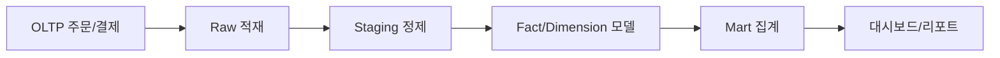

# Data Warehouse 101 (3/10): Fact와 Dimension

분석 질문은 대부분 얼마를 어떤 기준으로 보고 싶은지로 정리됩니다. 매출, 수량, 건수 같은 측정값과 사용자, 상품, 날짜 같은 속성을 분리해 두면 집계는 단순해지고 속성 변경도 더 유연하게 처리할 수 있습니다.

이 글은 Data Warehouse 101 시리즈의 3번째 글입니다.


*Data Warehouse 101 3장 흐름 개요*
> Fact 테이블의 입력(이벤트)과 Dimension 테이블의 변경(속성 변경)이 명확히 분리되면 스키마 유지 비용이 획기적으로 낮아집니다.

## 먼저 던지는 질문

- Fact 테이블과 Dimension 테이블은 무엇을 다르게 담을까요?
- 측정값과 속성을 분리하면 어떤 이점이 생길까요?
- 분석 모델에서 grain을 먼저 정해야 하는 이유는 무엇일까요?

## 이 글에서 배울 것

- Fact 테이블의 정의
- Dimension 테이블의 정의
- 둘을 분리했을 때 얻는 이점
- 모델링 실습 5단계
- 입문 단계에서 자주 나오는 실수 5가지

## 왜 중요한가

분석 질문은 대개 얼마나 많이 일어났는지와 어떤 기준으로 나눌 것인지로 읽힙니다. 측정값과 속성을 분리하면 집계는 빠르게 유지되고, 속성 변화는 더 유연하게 다룰 수 있습니다. 이 분리가 OLAP 모델링의 출발점입니다.

> 측정값과 속성을 분리하면 둘 다 더 오래 깔끔하게 유지됩니다.

## 개념 한눈에 보기

Fact 테이블은 '무엇이 일어났는가'(이벤트 행)를 기록하고, Dimension 테이블은 '어느 관점인가'(속성 모음)를 정의합니다. 이 분리로 스키마 변경 비용이 낮아지고, 모든 분석 쿼리가 일관된 구조로 작성됩니다.

## 핵심 용어

- **Fact**: 금액, 수량, 시간처럼 측정 가능한 이벤트입니다.
- **Dimension**: 사용자, 상품, 날짜처럼 fact의 맥락을 설명하는 속성 집합입니다.
- **Grain**: fact 한 행이 무엇을 의미하는지 적는 가장 작은 단위입니다.
- **Surrogate key**: 차원 테이블 내부에서 쓰는 대체 식별자입니다.
- **Conformed dimension**: 여러 fact가 함께 공유하는 공통 차원입니다.

## 전후 비교

**Before**: 주문 한 행에 사용자 이름과 상품 이름까지 함께 들어 있어 이름이 바뀌면 과거 행까지 모두 손봐야 합니다.

**After**: 사용자 이름은 dim_user에서만 관리하고 fact는 그대로 둡니다.

## 실습: 모델링 5단계

### 1단계 — dimension 만들기

```sql
CREATE TABLE dim_user (
    user_key BIGINT PRIMARY KEY,
    user_id BIGINT,
    name TEXT,
    country TEXT
);
```

### 2단계 — date dimension 만들기

```sql
CREATE TABLE dim_date (
    date_key INT PRIMARY KEY,
    full_date DATE,
    year INT,
    month INT,
    day_of_week INT
);
```

### 3단계 — fact 만들기

```sql
CREATE TABLE fact_orders (
    order_id BIGINT,
    user_key BIGINT,
    date_key INT,
    amount NUMERIC(12, 2),
    qty INT
);
```

### 4단계 — 분석용 조인 만들기

```sql
SELECT u.country, SUM(f.amount) AS revenue
FROM fact_orders f
JOIN dim_user u ON u.user_key = f.user_key
GROUP BY u.country;
```

### 5단계 — 시간 축 분석하기

```sql
SELECT d.year, d.month, SUM(f.amount) AS revenue
FROM fact_orders f
JOIN dim_date d ON d.date_key = f.date_key
GROUP BY d.year, d.month
ORDER BY 1, 2;
```

## 이 코드에서 먼저 봐야 할 점

- fact는 측정값과 분석 키를 중심으로 가볍게 유지합니다.
- dimension은 사람이 읽고 해석하는 데 필요한 속성을 담습니다.
- 잘 만든 dimension은 여러 fact가 함께 재사용할 수 있습니다.

## 자주 하는 실수 5가지

1. **fact에 문자열 속성을 직접 넣습니다.** 행 수가 커질수록 저장 비용과 조인 비용이 빠르게 커집니다.
2. **grain을 섞습니다.** 주문 단위와 상품 단위를 한 fact에 넣으면 집계 결과를 믿기 어려워집니다.
3. **surrogate key 없이 natural key만 씁니다.** 상위 시스템 키가 바뀌는 순간 과거 fact까지 영향을 받습니다.
4. **date dimension을 만들지 않습니다.** 주말, 공휴일, 회계 캘린더 같은 분석이 금방 불편해집니다.
5. **dimension에 측정값을 넣습니다.** 테이블의 역할이 흐려지고 팀 전체가 헷갈리기 쉽습니다.

## 실무에서는 이렇게 나타납니다

전자상거래에서는 fact_orders, fact_payments, fact_refunds를 따로 두고 dim_user, dim_product, dim_date를 공통으로 공유하는 경우가 많습니다. 사용자 국가가 바뀌어도 dim_user 한 곳만 관리하면 되므로 운영 부담이 줄어듭니다.

## 실무에서는 이렇게 생각합니다

- grain은 한 문장으로 정확히 쓸 수 있어야 합니다.
- conformed dimension은 팀 자산처럼 다룹니다.
- surrogate key로 상류 시스템의 변화를 흡수합니다.
- 날짜 차원은 대부분의 분석을 떠받치는 등뼈로 봅니다.
- fact는 좁고 길게, dimension은 넓고 짧게 가져갑니다.

## 체크리스트

- [ ] Fact와 Dimension의 역할 차이를 설명할 수 있다.
- [ ] Grain을 한 줄 문장으로 적을 수 있다.
- [ ] Surrogate key가 왜 필요한지 이해하고 있다.
- [ ] Date dimension이 분석에 주는 이점을 알고 있다.

## 연습 문제

1. fact_payments의 grain을 한 문장으로 적어 보세요.
2. dim_product에 들어갈 컬럼 다섯 개를 적어 보세요.
3. surrogate key를 생략했을 때의 단점 세 가지를 적어 보세요.

## 마무리와 다음 글

Fact와 Dimension을 분리하는 일은 분석 모델의 출발점입니다. 무엇을 세고 무엇으로 자를지 분명해지면 이후 설계가 훨씬 단순해집니다. 다음 글에서는 이 구조를 가장 널리 쓰는 형태로 정리한 Star Schema를 봅니다.

## Fact와 Dimension 설계를 코드로 구체화하기

Fact와 Dimension을 분리하는 이유는 "정규화가 좋아서"가 아니라, 측정과 맥락의 변경 주기가 다르기 때문입니다. 주문 금액은 이벤트 발생 시점에 확정되지만, 사용자 등급이나 상품 분류는 시간이 지나며 바뀝니다. 이 둘을 한 테이블에 섞으면 과거 재현이 어려워집니다.

아래는 Star Schema의 최소 DDL 예시입니다.

```sql
CREATE TABLE dim_customer (
    customer_key BIGINT PRIMARY KEY,
    customer_id BIGINT NOT NULL,
    customer_name TEXT,
    segment TEXT,
    valid_from TIMESTAMP,
    valid_to TIMESTAMP,
    is_current BOOLEAN
);

CREATE TABLE dim_product (
    product_key BIGINT PRIMARY KEY,
    product_id BIGINT NOT NULL,
    category TEXT,
    brand TEXT,
    unit_price NUMERIC(12, 2)
);

CREATE TABLE fact_sales (
    sales_id BIGINT,
    customer_key BIGINT,
    product_key BIGINT,
    order_date_key INT,
    quantity INT,
    amount NUMERIC(12, 2)
);
```

핵심은 fact에는 측정값과 외래 키만 두고, 사람이 해석할 속성은 dimension으로 밀어내는 것입니다. 이 경계를 지키면 쿼리도 단순해지고, 변경 영향도 국소화됩니다.

## Grain을 먼저 적는 이유

팀 내 모델 리뷰에서 가장 먼저 확인해야 할 문장은 grain 선언입니다. 예를 들어 "fact_sales는 주문-상품 라인 단위 한 행"이라고 쓰면, 다음 질문들이 자동으로 정리됩니다.

- amount는 주문 총액인가, 라인 금액인가
- discount는 주문 단위인가, 라인 단위인가
- 반품은 같은 grain에서 음수 행으로 표현할 것인가

grain 선언이 없으면 같은 테이블에서 서로 다른 집계를 수행하게 되어 지표 불일치가 반복됩니다.

## SCD 전략을 설계 표로 고정하기

Dimension 변경 추적은 나중에 붙이는 옵션이 아니라 초기 설계 항목입니다.

| 전략 | 저장 방식 | 장점 | 단점 | 추천 상황 |
| --- | --- | --- | --- | --- |
| Type 1 | 현재값 덮어쓰기 | 단순, 저장비용 낮음 | 과거 상태 소실 | 오탈자 수정, 비중요 속성 |
| Type 2 | 유효기간 행 추가 | 과거 재현 가능 | 조인 조건 복잡 | 고객 등급, 조직 변경 |
| Type 3 | 이전값 컬럼 보관 | 최근 변화 추적 쉬움 | 다회 변경에 취약 | 제한된 비교 분석 |

전자상거래에서 고객 세그먼트 변경 이력을 분석하려면 Type 2가 사실상 기본입니다. 반면, 상품 설명 텍스트 오탈자 정도는 Type 1로 충분할 수 있습니다.

## 분석 쿼리 일관성을 높이는 패턴

Dimension을 잘 설계해도 쿼리 작성 규칙이 없으면 결과가 흔들립니다. 팀 규칙으로 다음을 고정하는 것이 좋습니다.

1. 날짜 축은 항상 `dim_date`를 통해 조인합니다.
2. 지표 계산식은 mart 레이어에서 한 번 정의합니다.
3. fact 직접 조회를 허용하되, 최종 리포트는 mart만 사용합니다.

이 원칙을 지키면 "같은 매출인데 대시보드마다 값이 다름" 문제를 크게 줄일 수 있습니다.

## Fact/Dimension 품질 검증 규칙

모델이 커질수록 "정의는 맞는데 데이터가 틀린" 문제가 늘어납니다. 아래와 같은 검증 SQL을 정기 실행하면 품질 문제를 조기에 잡을 수 있습니다.

```sql
-- fact의 외래키 유실 점검
SELECT COUNT(*) AS orphan_rows
FROM fact_sales f
LEFT JOIN dim_customer c ON c.customer_key = f.customer_key
WHERE c.customer_key IS NULL;

-- 음수 금액 점검
SELECT COUNT(*) AS bad_amount_rows
FROM fact_sales
WHERE amount < 0;
```

검증은 일회성 쿼리가 아니라 배포 파이프라인의 품질 게이트여야 합니다. 특히 orphan key 검증은 dimension 적재 순서 오류를 즉시 드러내므로 필수 항목으로 두는 편이 좋습니다.

## Dimension 변경 정책 문서 예시

```yaml
dimension_change_policy:
  dim_customer:
    scd: type2
    business_keys: [customer_id]
    mutable_columns: [segment, tier]
  dim_product:
    scd: type1
    business_keys: [product_id]
    mutable_columns: [name, category]
```

정책이 명확하면 "어떤 컬럼 변경을 이력으로 남길지"를 팀마다 다르게 해석하는 문제를 줄일 수 있습니다. 결국 모델 신뢰도는 테이블 개수가 아니라 변경 규칙의 일관성에서 나옵니다.

## 실무 적용 메모

아래 메모는 해당 장의 개념을 실제 운영 환경에 옮길 때 반복적으로 확인하는 항목을 정리한 것입니다. 단순히 지식을 아는 것과 운영에서 안정적으로 반복하는 것은 다르기 때문에, 팀 단위 규칙으로 문서화해 두는 편이 좋습니다.

| 점검 영역 | 질문 | 권장 기준 |
| --- | --- | --- |
| 데이터 정의 | 같은 용어를 팀마다 다르게 쓰는가 | 용어집과 지표 정의를 단일 출처로 관리 |
| 파이프라인 안정성 | 재실행 시 결과가 동일한가 | idempotent 원칙, 상태 테이블 관리 |
| 비용 통제 | 월별 비용이 예측 가능한가 | 스캔 바이트, 고비용 쿼리 상위 추적 |
| 품질 보증 | 잘못된 데이터 유입을 조기에 잡는가 | null/중복/범위 검증 자동화 |
| 책임 분리 | 장애 시 소유자가 명확한가 | 계층별 owner와 on-call 채널 지정 |

운영에서는 기술 선택보다 경계와 책임이 더 큰 차이를 만듭니다. 예를 들어 모델이 훌륭해도 지표 소유자가 없으면 숫자 불일치 이슈가 장기간 방치될 수 있습니다. 반대로 도구가 완벽하지 않아도 책임 경계가 명확하면 복구 속도와 개선 속도가 빠릅니다.

```yaml
operating_baseline:
  contracts:
    raw: "append-only and replayable"
    transform: "test-required before publish"
    serving: "semantic definitions are versioned"
  quality_checks:
    - not_null
    - unique_key
    - accepted_values
    - referential_integrity
  cost_controls:
    - heavy_query_review_weekly
    - partition_filter_required
    - select_star_block_in_pr
  ownership:
    data_platform: "ingestion and storage"
    analytics_engineering: "transform and marts"
    domain_analytics: "metric definition and dashboard"
```

이 기준을 프로젝트 초기에 합의하면, 시리즈에서 다룬 개념이 문서 지식으로 끝나지 않고 운영 습관으로 정착됩니다. 특히 신규 팀원이 합류했을 때 학습 속도가 빨라지고, 장애나 지표 충돌 같은 사건이 생겨도 공통된 기준으로 빠르게 의사결정을 내릴 수 있습니다.

또한 분기 단위 회고에서는 기술 성능 지표뿐 아니라 의사결정 지표도 함께 보는 것이 좋습니다. 예를 들어 "대시보드 숫자 논쟁으로 소모된 회의 시간", "지표 정의 변경 후 영향 범위 확인 시간", "재처리 요청 처리 리드타임" 같은 운영 지표를 추적하면 데이터 조직의 성숙도를 더 현실적으로 파악할 수 있습니다.

## 실전 앵커: 모델, 파이프라인, 성능 검증

아래 예시는 이 글의 개념을 실제 운영으로 옮길 때 바로 재사용할 수 있는 최소 앵커입니다. 스키마, 적재 설정, 성능 비교를 한 묶음으로 두면 설계 논의가 추상 수준에서 끝나지 않고 실행 가능한 결정으로 이어집니다.

```sql
-- 공통 분석 질의 템플릿: 기간 + 세그먼트 + 지표
WITH scoped AS (
    SELECT
        f.date_key,
        f.amount,
        f.qty,
        c.segment,
        p.category
    FROM fact_sales f
    JOIN dim_customer c ON c.customer_key = f.customer_key
    JOIN dim_product p ON p.product_key = f.product_key
    WHERE f.date_key BETWEEN 20260101 AND 20260331
)
SELECT
    segment,
    category,
    SUM(amount) AS revenue,
    SUM(qty) AS units,
    COUNT(*) AS order_lines,
    ROUND(SUM(amount) / NULLIF(COUNT(*), 0), 2) AS avg_line_amount
FROM scoped
GROUP BY 1, 2
ORDER BY revenue DESC;
```

```yaml
pipeline_contract:
  schedule: "0 * * * *"
  source:
    type: cdc
    lag_slo_minutes: 15
  transform:
    engine: dbt
    model_layers: [stg, int, mart]
  quality_tests:
    - not_null
    - unique
    - relationships
    - accepted_values
  publish:
    target: mart_sales_daily
    strategy: merge
```



성능 비교는 반드시 동일 조건에서 수행해야 합니다. 파티션 필터 유무, 조인 순서, 집계 단위를 고정하지 않으면 숫자가 설계를 설명하지 못합니다.

| 비교 항목 | 조건 A(비최적화) | 조건 B(최적화) | 해석 |
| --- | --- | --- | --- |
| 스캔 바이트 | 480GB | 62GB | 파티션 프루닝이 대부분의 차이를 만듭니다. |
| 실행 시간 | 94초 | 18초 | 집계 이전 필터링으로 셔플 비용이 줄어듭니다. |
| 슬롯/크레딧 사용량 | 높음 | 중간 | 비용 안정성이 높아집니다. |
| 재현성 | 낮음 | 높음 | 표준 템플릿 쿼리 사용 시 비교 가능성이 유지됩니다. |

운영에서는 "정확한 한 번"보다 "안전한 재실행"이 더 중요한 경우가 많습니다. 그래서 적재 키를 두고 upsert 기준을 명확히 정의하는 방식이 필요합니다.

```sql
-- 재실행 가능한 머지 예시
MERGE INTO mart_sales_daily t
USING (
    SELECT
        d.full_date,
        c.segment,
        p.category,
        SUM(f.amount) AS revenue,
        SUM(f.qty) AS units
    FROM fact_sales f
    JOIN dim_date d ON d.date_key = f.date_key
    JOIN dim_customer c ON c.customer_key = f.customer_key
    JOIN dim_product p ON p.product_key = f.product_key
    WHERE d.full_date >= CURRENT_DATE - INTERVAL '7 day'
    GROUP BY 1, 2, 3
) s
ON t.full_date = s.full_date
AND t.segment = s.segment
AND t.category = s.category
WHEN MATCHED THEN UPDATE SET
    revenue = s.revenue,
    units = s.units,
    updated_at = CURRENT_TIMESTAMP
WHEN NOT MATCHED THEN INSERT (
    full_date, segment, category, revenue, units, updated_at
) VALUES (
    s.full_date, s.segment, s.category, s.revenue, s.units, CURRENT_TIMESTAMP
);
```

이 패턴을 기준선으로 두면, 모델 변경이나 파이프라인 장애가 생겨도 영향을 계층별로 좁혀 복구할 수 있습니다. 데이터 웨어하우스 운영은 쿼리 한두 개의 튜닝보다, 반복 가능한 설계 계약을 지키는 과정에 더 가깝습니다.

### 운영 확장 메모

데이터 웨어하우스를 오래 운영하면 기술 선택보다 운영 규율이 성능과 신뢰도를 좌우합니다. 다음 예시는 팀에서 반복적으로 사용하는 점검 묶음입니다.

```sql
-- 파티션 필터 누락 탐지용 예시
EXPLAIN
SELECT category, SUM(amount) AS revenue
FROM fact_sales
WHERE date_key BETWEEN 20260101 AND 20260131
GROUP BY category;
```

```yaml
review_policy:
  query_rules:
    - require_partition_filter: true
    - block_select_star_on_fact: true
    - require_owner_for_metric_change: true
  incident_rules:
    - classify: [schema_change, pipeline_lag, quality_failure]
    - first_response_minutes: 15
```


아키텍처가 단순해 보여도, 계약과 검증 루프를 문서화해 두면 신규 인원이 합류해도 같은 품질을 유지할 수 있습니다.

### 운영 확장 메모

데이터 웨어하우스를 오래 운영하면 기술 선택보다 운영 규율이 성능과 신뢰도를 좌우합니다. 다음 예시는 팀에서 반복적으로 사용하는 점검 묶음입니다.

```sql
-- 파티션 필터 누락 탐지용 예시
EXPLAIN
SELECT category, SUM(amount) AS revenue
FROM fact_sales
WHERE date_key BETWEEN 20260101 AND 20260131
GROUP BY category;
```

```yaml
review_policy:
  query_rules:
    - require_partition_filter: true
    - block_select_star_on_fact: true
    - require_owner_for_metric_change: true
  incident_rules:
    - classify: [schema_change, pipeline_lag, quality_failure]
    - first_response_minutes: 15
```


아키텍처가 단순해 보여도, 계약과 검증 루프를 문서화해 두면 신규 인원이 합류해도 같은 품질을 유지할 수 있습니다.

### 운영 확장 메모

데이터 웨어하우스를 오래 운영하면 기술 선택보다 운영 규율이 성능과 신뢰도를 좌우합니다. 다음 예시는 팀에서 반복적으로 사용하는 점검 묶음입니다.

```sql
-- 파티션 필터 누락 탐지용 예시
EXPLAIN
SELECT category, SUM(amount) AS revenue
FROM fact_sales
WHERE date_key BETWEEN 20260101 AND 20260131
GROUP BY category;
```

```yaml
review_policy:
  query_rules:
    - require_partition_filter: true
    - block_select_star_on_fact: true
    - require_owner_for_metric_change: true
  incident_rules:
    - classify: [schema_change, pipeline_lag, quality_failure]
    - first_response_minutes: 15
```


아키텍처가 단순해 보여도, 계약과 검증 루프를 문서화해 두면 신규 인원이 합류해도 같은 품질을 유지할 수 있습니다.

### 운영 확장 메모

데이터 웨어하우스를 오래 운영하면 기술 선택보다 운영 규율이 성능과 신뢰도를 좌우합니다. 다음 예시는 팀에서 반복적으로 사용하는 점검 묶음입니다.

```sql
-- 파티션 필터 누락 탐지용 예시
EXPLAIN
SELECT category, SUM(amount) AS revenue
FROM fact_sales
WHERE date_key BETWEEN 20260101 AND 20260131
GROUP BY category;
```

```yaml
review_policy:
  query_rules:
    - require_partition_filter: true
    - block_select_star_on_fact: true
    - require_owner_for_metric_change: true
  incident_rules:
    - classify: [schema_change, pipeline_lag, quality_failure]
    - first_response_minutes: 15
```


아키텍처가 단순해 보여도, 계약과 검증 루프를 문서화해 두면 신규 인원이 합류해도 같은 품질을 유지할 수 있습니다.

### 운영 확장 메모

데이터 웨어하우스를 오래 운영하면 기술 선택보다 운영 규율이 성능과 신뢰도를 좌우합니다. 다음 예시는 팀에서 반복적으로 사용하는 점검 묶음입니다.

```sql
-- 파티션 필터 누락 탐지용 예시
EXPLAIN
SELECT category, SUM(amount) AS revenue
FROM fact_sales
WHERE date_key BETWEEN 20260101 AND 20260131
GROUP BY category;
```

```yaml
review_policy:
  query_rules:
    - require_partition_filter: true
    - block_select_star_on_fact: true
    - require_owner_for_metric_change: true
  incident_rules:
    - classify: [schema_change, pipeline_lag, quality_failure]
    - first_response_minutes: 15
```


아키텍처가 단순해 보여도, 계약과 검증 루프를 문서화해 두면 신규 인원이 합류해도 같은 품질을 유지할 수 있습니다.

### 운영 확장 메모

데이터 웨어하우스를 오래 운영하면 기술 선택보다 운영 규율이 성능과 신뢰도를 좌우합니다. 다음 예시는 팀에서 반복적으로 사용하는 점검 묶음입니다.

```sql
-- 파티션 필터 누락 탐지용 예시
EXPLAIN
SELECT category, SUM(amount) AS revenue
FROM fact_sales
WHERE date_key BETWEEN 20260101 AND 20260131
GROUP BY category;
```

```yaml
review_policy:
  query_rules:
    - require_partition_filter: true
    - block_select_star_on_fact: true
    - require_owner_for_metric_change: true
  incident_rules:
    - classify: [schema_change, pipeline_lag, quality_failure]
    - first_response_minutes: 15
```


아키텍처가 단순해 보여도, 계약과 검증 루프를 문서화해 두면 신규 인원이 합류해도 같은 품질을 유지할 수 있습니다.

## 처음 질문으로 돌아가기

- **Fact와 Dimension은 어떻게 구분합니까?**
  - Fact는 '무엇이 일어났는가'(이벤트 행), Dimension은 '어느 관점인가'(속성 모음)입니다.
- **Fact 테이블이 너무 커지면 어떤 문제가 생길까요?**
  - 조인, 인덱싱, 쿼리 성능이 모두 악화되므로 파티셔닝이나 집계 테이블로 대응합니다.
- **Dimension 테이블의 변경을 어떻게 추적할까요?**
  - Type 1(덮어쓰기), Type 2(버전 관리), Type 3(병렬 컬럼) 등 SCD(Slowly Changing Dimension) 전략을 선택합니다.

<!-- toc:begin -->
## 시리즈 목차

- [Data Warehouse 101 (1/10): Data Warehouse란 무엇인가?](./01-what-is-data-warehouse.md)
- [Data Warehouse 101 (2/10): OLTP와 OLAP](./02-oltp-and-olap.md)
- **Fact와 Dimension (현재 글)**
- Star Schema (예정)
- Partition과 Clustering (예정)
- ETL과 ELT (예정)
- BI와 Dashboard (예정)
- Data Mart (예정)
- 성능 최적화 (예정)
- Warehouse 설계 예제 (예정)

<!-- toc:end -->

## 참고 자료

- [Kimball — Fact Table Design](https://www.kimballgroup.com/data-warehouse-business-intelligence-resources/kimball-techniques/dimensional-modeling-techniques/)
- [dbt — Dimensional Modeling](https://docs.getdbt.com/best-practices/how-we-structure/1-guide-overview)
- [Snowflake — Star Schema](https://docs.snowflake.com/en/user-guide/intro-key-concepts)
- [BigQuery — Schema Design](https://cloud.google.com/bigquery/docs/schemas)

- [이 시리즈의 예제 코드 (book-examples)](https://github.com/yeongseon-books/book-examples/tree/main/data-warehouse-101/ko)

Tags: DataWarehouse, Fact, Dimension, Modeling, Analytics
