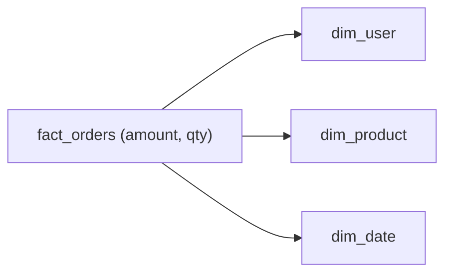

# Fact와 Dimension

> Data Warehouse 101 시리즈 (3/10)


## 이 글에서 다룰 문제

분석 질문은 대부분 얼마를 어떤 기준으로 보고 싶은지로 정리됩니다. 매출, 수량, 건수 같은 측정값과 사용자, 상품, 날짜 같은 속성을 분리해 두면 집계는 단순해지고 속성 변경도 더 유연하게 처리할 수 있습니다.

> 측정값과 설명용 속성을 분리하면 모델이 오래 버팁니다.

## 전체 흐름


## Before/After

**Before**: 주문 한 행에 사용자 이름과 상품 이름까지 함께 들어 있어 이름이 바뀌면 과거 행까지 모두 손봐야 합니다.

**After**: 사용자 이름은 dim_user에서만 관리하고 fact는 그대로 둡니다.

## 모델링 5단계

### 1단계 — Dimension 만들기

```sql
CREATE TABLE dim_user (
    user_key BIGINT PRIMARY KEY,
    user_id BIGINT,
    name TEXT,
    country TEXT
);
```

### 2단계 — Date dimension

```sql
CREATE TABLE dim_date (
    date_key INT PRIMARY KEY,
    full_date DATE,
    year INT,
    month INT,
    day_of_week INT
);
```

### 3단계 — Fact 만들기

```sql
CREATE TABLE fact_orders (
    order_id BIGINT,
    user_key BIGINT,
    date_key INT,
    amount NUMERIC(12, 2),
    qty INT
);
```

### 4단계 — 조인 분석

```sql
SELECT u.country, SUM(f.amount) AS revenue
FROM fact_orders f
JOIN dim_user u ON u.user_key = f.user_key
GROUP BY u.country;
```

### 5단계 — 시간축 분석

```sql
SELECT d.year, d.month, SUM(f.amount) AS revenue
FROM fact_orders f
JOIN dim_date d ON d.date_key = f.date_key
GROUP BY d.year, d.month
ORDER BY 1, 2;
```

## 이 코드에서 주목할 점

- fact는 측정값과 분석 키를 중심으로 가볍게 유지합니다.
- dimension은 사람이 읽고 해석하는 데 필요한 속성을 담습니다.
- 잘 만든 dimension은 여러 fact가 함께 재사용할 수 있습니다.

## 자주 하는 실수 5가지

1. **fact에 문자열 속성을 직접 넣습니다.** 행 수가 커질수록 저장 비용과 조인 비용이 빠르게 커집니다.
2. **grain을 섞습니다.** 주문 단위와 상품 단위를 한 fact에 넣으면 집계 결과를 믿기 어려워집니다.
3. **surrogate key 없이 natural key만 씁니다.** 상위 시스템 키가 바뀌는 순간 과거 fact까지 영향을 받습니다.
4. **date dimension을 만들지 않습니다.** 주말, 공휴일, 회계 캘린더 같은 분석이 금방 불편해집니다.
5. **dimension에 측정값을 넣습니다.** 테이블의 역할이 흐려지고 팀 전체가 헷갈리기 쉽습니다.

## 실무에서는 이렇게 쓰입니다

전자상거래에서는 fact_orders, fact_payments, fact_refunds를 따로 두고 dim_user, dim_product, dim_date를 공통으로 공유하는 경우가 많습니다. 사용자 국가가 바뀌어도 dim_user 한 곳만 관리하면 되므로 운영 부담이 줄어듭니다.

## 체크리스트

- [ ] Fact와 Dimension의 역할 차이를 설명할 수 있다.
- [ ] Grain을 한 줄 문장으로 적을 수 있다.
- [ ] Surrogate key가 왜 필요한지 이해하고 있다.
- [ ] Date dimension이 분석에 주는 이점을 알고 있다.

## 정리 및 다음 단계

Fact와 Dimension을 분리하는 일은 분석 모델의 출발점입니다. 무엇을 세고 무엇으로 자를지 분명해지면 이후 설계가 훨씬 단순해집니다. 다음 글에서는 이 구조를 가장 널리 쓰는 형태로 정리한 Star Schema를 살펴보겠습니다.

<!-- toc:begin -->
- [Data Warehouse란 무엇인가?](./01-what-is-data-warehouse.md)
- [OLTP와 OLAP](./02-oltp-and-olap.md)
- **Fact와 Dimension (현재 글)**
- Star Schema (예정)
- Partition과 Clustering (예정)
- ETL과 ELT (예정)
- BI와 Dashboard (예정)
- Data Mart (예정)
- 성능 최적화 (예정)
- Warehouse 설계 예제 (예정)
<!-- toc:end -->

## 참고 자료

- [Kimball — Fact Table Design](https://www.kimballgroup.com/data-warehouse-business-intelligence-resources/kimball-techniques/dimensional-modeling-techniques/)
- [dbt — Dimensional Modeling](https://docs.getdbt.com/best-practices/how-we-structure/1-guide-overview)
- [Snowflake — Star Schema](https://docs.snowflake.com/en/user-guide/intro-key-concepts)
- [BigQuery — Schema Design](https://cloud.google.com/bigquery/docs/schemas)

Tags: DataWarehouse, Fact, Dimension, Modeling, Analytics
