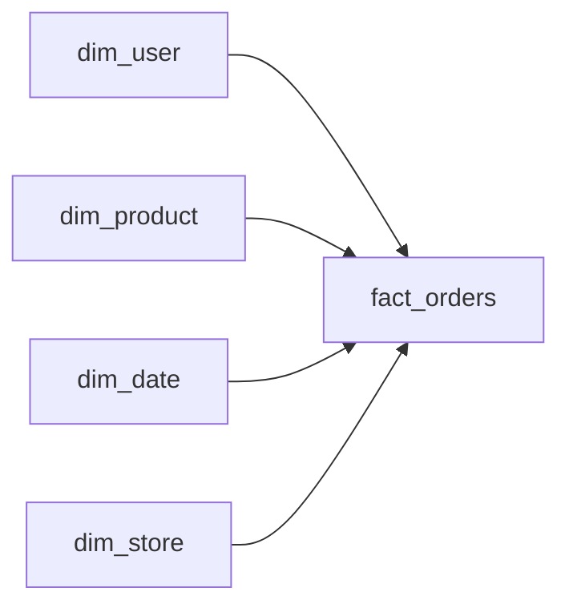

# Star Schema

> Data Warehouse 101 시리즈 (4/10)


## 이 글에서 다룰 문제

분석 쿼리는 *조인이 적을수록* 빠릅니다. Star Schema 는 *fact 한 개* 와 *주변 dimension* 만 두므로 *읽기에 최적* 입니다. BI 도구도 *별 모양* 을 가정하고 *드릴다운* 을 만듭니다.

> *분석은 읽기 게임이다. 별처럼 단순할수록 빠르다.*

## 전체 흐름


## Before/After

**Before**: dim_user → dim_country → dim_continent 처럼 *3단 조인*. BI 가 *느리다*.

**After**: dim_user 에 country, continent 를 *함께* 두면 *조인 한 번*.

## 설계 5단계

### 1단계 — Fact 정의

```sql
CREATE TABLE fact_orders (
    order_id BIGINT,
    user_key BIGINT,
    product_key BIGINT,
    date_key INT,
    store_key BIGINT,
    amount NUMERIC(12, 2),
    qty INT
);
```

### 2단계 — Dimension 정의

```sql
CREATE TABLE dim_product (
    product_key BIGINT PRIMARY KEY,
    product_id BIGINT,
    name TEXT,
    category TEXT,
    brand TEXT
);
```

### 3단계 — 별 모양 조인

```sql
SELECT p.category, SUM(f.amount) AS revenue
FROM fact_orders f
JOIN dim_product p ON p.product_key = f.product_key
GROUP BY p.category;
```

### 4단계 — 다중 dimension

```sql
SELECT d.year, p.category, SUM(f.amount) AS revenue
FROM fact_orders f
JOIN dim_product p ON p.product_key = f.product_key
JOIN dim_date d ON d.date_key = f.date_key
GROUP BY d.year, p.category;
```

### 5단계 — Drill-down

```sql
-- 카테고리 → 브랜드로 한 단계 들어간다
SELECT p.brand, SUM(f.amount) AS revenue
FROM fact_orders f
JOIN dim_product p ON p.product_key = f.product_key
WHERE p.category = 'Coffee'
GROUP BY p.brand;
```

## 이 코드에서 주목할 점

- 모든 조인이 *fact ↔ dimension* 한 단계.
- *dimension 안* 에 카테고리, 브랜드가 *함께* 산다.
- BI 의 drill-down 이 *그대로 SQL* 이 된다.

## 자주 하는 실수 5가지

1. **Snowflake 처럼 *과하게 정규화*.** *조인이 늘어* BI 가 *느려진다*.
2. **모든 컬럼을 *fact 안에* 채운다.** 별 모양이 *뭉개진다*.
3. **dimension 을 *시간이 흐를수록 좁게* 만든다.** *나중에 다시 넓혀야* 한다.
4. **Surrogate key 없는 *natural key* 만 사용.** *변경* 이 fact 를 *흔든다*.
5. **여러 fact 가 *서로 다른 dim_date* 를 둔다.** *공유 가능한 dim* 은 *공유* 한다.

## 실무에서는 이렇게 쓰입니다

Tableau, Looker, Power BI 같은 도구는 *star schema* 를 *전제* 로 합니다. dbt 의 *mart* 레이어도 보통 *별 모양* 으로 설계합니다.

## 체크리스트

- [ ] *Star* 와 *Snowflake* 를 구분할 수 있다.
- [ ] *Galaxy* 의 의미를 안다.
- [ ] BI 가 *별 모양* 을 *왜* 좋아하는지 안다.
- [ ] *Drill-down* 쿼리를 작성할 수 있다.

## 정리 및 다음 단계

Star Schema 는 *분석을 위한 가장 단순한 모양* 입니다. 다음 글에서는 데이터를 빠르게 읽는 *partition* 과 *clustering* 을 봅니다.

<!-- toc:begin -->
- [Data Warehouse란 무엇인가?](./01-what-is-data-warehouse.md)
- [OLTP와 OLAP](./02-oltp-and-olap.md)
- [Fact와 Dimension](./03-fact-and-dimension.md)
- **Star Schema (현재 글)**
- Partition과 Clustering (예정)
- ETL과 ELT (예정)
- BI와 Dashboard (예정)
- Data Mart (예정)
- 성능 최적화 (예정)
- Warehouse 설계 예제 (예정)
<!-- toc:end -->

## 참고 자료

- [Kimball — Star Schema](https://www.kimballgroup.com/data-warehouse-business-intelligence-resources/kimball-techniques/dimensional-modeling-techniques/star-schemas/)
- [Microsoft — Star Schema and Power BI](https://learn.microsoft.com/en-us/power-bi/guidance/star-schema)
- [dbt — Mart Layer](https://docs.getdbt.com/best-practices/how-we-structure/4-marts)
- [Wikipedia — Star Schema](https://en.wikipedia.org/wiki/Star_schema)

Tags: DataWarehouse, StarSchema, Modeling, Snowflake, Analytics
