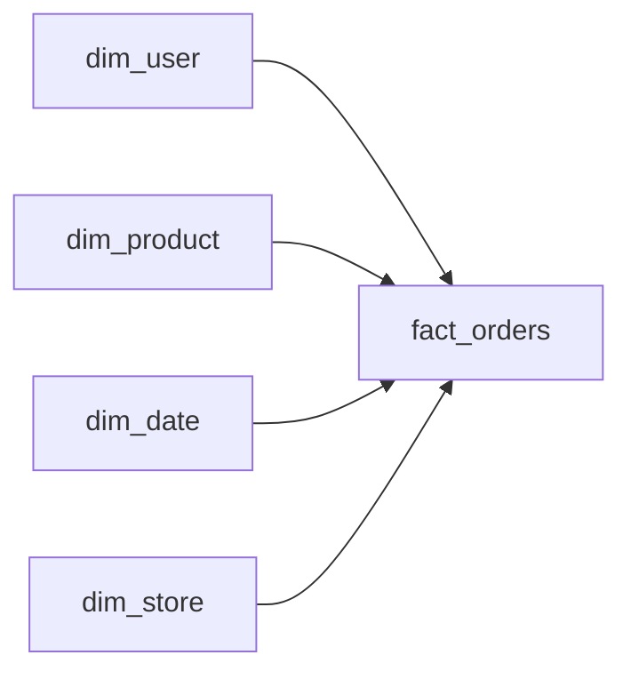

# Star Schema

> Data Warehouse 101 시리즈 (4/10)


## 이 글에서 다룰 문제

분석 쿼리는 조인 수가 늘어날수록 느려지기 쉽습니다. Star Schema는 중심 fact 하나와 그 주변 dimension으로 구조를 단순하게 만들기 때문에 읽기 성능과 이해 가능성을 함께 챙기기 좋습니다. BI 도구도 이런 별 모양을 전제로 drill-down 경험을 설계하는 경우가 많습니다.

> 분석 모델은 조인 경로가 짧을수록 설명하기 쉽고 운영하기도 쉽습니다.

## 전체 흐름


## Before/After

**Before**: dim_user → dim_country → dim_continent처럼 조인이 길어져 BI 응답이 느려집니다.

**After**: dim_user 안에 country와 continent를 함께 두면 한 번의 조인으로 끝납니다.

## 설계 5단계

### 1단계 — Fact 정의

```sql
CREATE TABLE fact_orders (
    order_id BIGINT,
    user_key BIGINT,
    product_key BIGINT,
    date_key INT,
    store_key BIGINT,
    amount NUMERIC(12, 2),
    qty INT
);
```

### 2단계 — Dimension 정의

```sql
CREATE TABLE dim_product (
    product_key BIGINT PRIMARY KEY,
    product_id BIGINT,
    name TEXT,
    category TEXT,
    brand TEXT
);
```

### 3단계 — 별 모양 조인

```sql
SELECT p.category, SUM(f.amount) AS revenue
FROM fact_orders f
JOIN dim_product p ON p.product_key = f.product_key
GROUP BY p.category;
```

### 4단계 — 다중 dimension

```sql
SELECT d.year, p.category, SUM(f.amount) AS revenue
FROM fact_orders f
JOIN dim_product p ON p.product_key = f.product_key
JOIN dim_date d ON d.date_key = f.date_key
GROUP BY d.year, p.category;
```

### 5단계 — Drill-down

```sql
-- 카테고리에서 브랜드로 한 단계 더 내려간다
SELECT p.brand, SUM(f.amount) AS revenue
FROM fact_orders f
JOIN dim_product p ON p.product_key = f.product_key
WHERE p.category = 'Coffee'
GROUP BY p.brand;
```

## 이 코드에서 주목할 점

- 조인 경로가 모두 fact와 dimension 사이 한 단계로 정리됩니다.
- category와 brand처럼 자주 함께 쓰는 속성은 같은 dimension에 두는 편이 실용적입니다.
- BI에서 보던 drill-down 동작이 거의 그대로 SQL로 이어집니다.

## 자주 하는 실수 5가지

1. **Snowflake처럼 과하게 정규화합니다.** 조인이 늘어나면서 BI 응답 속도가 떨어집니다.
2. **모든 컬럼을 fact에 몰아넣습니다.** 별 모양이 흐려지고 테이블 역할도 불분명해집니다.
3. **dimension을 지나치게 좁게 만듭니다.** 결국 필요한 속성을 다시 붙이느라 모델이 흔들립니다.
4. **surrogate key 없이 natural key만 사용합니다.** 상위 시스템 변경이 fact까지 전파됩니다.
5. **공유 가능한 dim을 fact마다 따로 만듭니다.** 기준 테이블이 갈라지면 숫자 해석도 달라지기 쉽습니다.

## 실무에서는 이렇게 쓰입니다

Tableau, Looker, Power BI 같은 도구는 star schema를 전제로 가장 잘 동작하는 경우가 많습니다. dbt의 mart 레이어도 실무에서는 이런 별 모양으로 정리하는 일이 흔합니다.

## 체크리스트

- [ ] Star와 Snowflake의 차이를 설명할 수 있다.
- [ ] Galaxy schema가 무엇인지 알고 있다.
- [ ] BI 도구가 왜 별 모양을 선호하는지 말할 수 있다.
- [ ] Drill-down 쿼리를 직접 작성할 수 있다.

## 정리 및 다음 단계

Star Schema는 분석 모델을 단순하게 유지하면서도 자주 쓰는 질의를 빠르게 처리하기 좋은 형태입니다. 조인 구조가 짧고 설명이 명확하다는 점이 큰 장점입니다. 다음 글에서는 큰 테이블을 빠르게 읽기 위한 partition과 clustering을 살펴보겠습니다.

<!-- toc:begin -->
- [Data Warehouse란 무엇인가?](./01-what-is-data-warehouse.md)
- [OLTP와 OLAP](./02-oltp-and-olap.md)
- [Fact와 Dimension](./03-fact-and-dimension.md)
- **Star Schema (현재 글)**
- Partition과 Clustering (예정)
- ETL과 ELT (예정)
- BI와 Dashboard (예정)
- Data Mart (예정)
- 성능 최적화 (예정)
- Warehouse 설계 예제 (예정)
<!-- toc:end -->

## 참고 자료

- [Kimball — Star Schema](https://www.kimballgroup.com/data-warehouse-business-intelligence-resources/kimball-techniques/dimensional-modeling-techniques/star-schemas/)
- [Microsoft — Star Schema and Power BI](https://learn.microsoft.com/en-us/power-bi/guidance/star-schema)
- [dbt — Mart Layer](https://docs.getdbt.com/best-practices/how-we-structure/4-marts)
- [Wikipedia — Star Schema](https://en.wikipedia.org/wiki/Star_schema)

Tags: DataWarehouse, StarSchema, Modeling, Snowflake, Analytics
