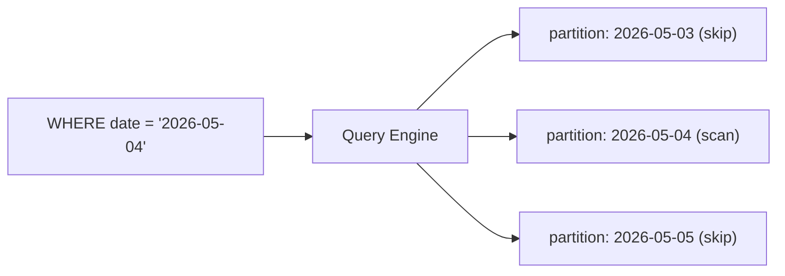

# Partition과 Clustering

> Data Warehouse 101 시리즈 (5/10)


## 이 글에서 다룰 문제

Warehouse fact는 수십억 행까지 커지는 일이 흔합니다. 이때 중요한 것은 더 빨리 읽는 것만이 아니라 아예 읽지 않아도 되는 데이터를 건너뛰는 일입니다. 날짜 기준 partition만 잘 잡아도 대부분의 데이터를 스캔하지 않고 넘어갈 수 있고, 그만큼 비용도 바로 줄어듭니다.

> 큰 테이블에서는 잘 읽는 기술보다 덜 읽는 기술이 더 중요할 때가 많습니다.

## 전체 흐름


## Before/After

**Before**: `WHERE order_date = '2026-05-04'` 조건이 있어도 전체 테이블을 스캔합니다.

**After**: 같은 쿼리가 하루치 partition만 읽어 비용과 시간이 크게 줄어듭니다.

## 적용 5단계

### 1단계 — Partition 정의

```sql
-- BigQuery 예시
CREATE TABLE fact_orders (
    order_id BIGINT,
    user_key BIGINT,
    amount NUMERIC(12, 2),
    order_date DATE
)
PARTITION BY order_date;
```

### 2단계 — Clustering 추가

```sql
CREATE TABLE fact_orders (
    order_id BIGINT,
    user_key BIGINT,
    amount NUMERIC(12, 2),
    order_date DATE
)
PARTITION BY order_date
CLUSTER BY user_key;
```

### 3단계 — Pruning 되는 쿼리

```sql
-- 하루치 partition만 읽는다
SELECT SUM(amount)
FROM fact_orders
WHERE order_date = '2026-05-04';
```

### 4단계 — Pruning 안 되는 쿼리

```sql
-- order_date에 함수를 적용하면 pruning이 깨진다
SELECT SUM(amount)
FROM fact_orders
WHERE EXTRACT(YEAR FROM order_date) = 2026;
```

### 5단계 — Cluster key 활용

```sql
-- user_key 조건을 함께 주면 더 적은 범위를 읽는다
SELECT SUM(amount)
FROM fact_orders
WHERE order_date BETWEEN '2026-05-01' AND '2026-05-31'
  AND user_key = 100;
```

## 이 코드에서 주목할 점

- pruning은 조건이 partition key와 직접 비교될 때 가장 잘 동작합니다.
- partition key에 함수를 씌우면 엔진이 건너뛸 범위를 찾기 어려워집니다.
- clustering은 partition 내부에서 읽을 범위를 더 줄여 주는 보조 장치입니다.

## 자주 하는 실수 5가지

1. **partition key에 함수를 적용합니다.** 곧바로 전체 스캔으로 돌아가기 쉽습니다.
2. **partition을 지나치게 잘게 쪼갭니다.** 메타데이터 관리 비용이 읽기 이득을 잡아먹을 수 있습니다.
3. **cluster key를 너무 많이 선택합니다.** 정렬 비용은 늘고 실제 이득은 크지 않을 수 있습니다.
4. **partition 없이 index만 믿습니다.** Warehouse는 OLTP 데이터베이스와 최적화 방식이 다릅니다.
5. **과거 partition을 자주 수정합니다.** 재처리 범위가 커지면서 운영이 무거워집니다.

## 실무에서는 이렇게 쓰입니다

BigQuery, Snowflake, Redshift 모두 partition과 clustering을 핵심 최적화 도구로 제공합니다. 날짜 partition에 사용자나 상품 기준 clustering을 더하는 조합이 실무에서 자주 보이는 기본 형태입니다.

## 체크리스트

- [ ] Partition과 Clustering의 차이를 설명할 수 있다.
- [ ] Pruning이 깨지는 대표 패턴을 알고 있다.
- [ ] Warehouse 비용이 주로 무엇으로 계산되는지 이해하고 있다.
- [ ] Partition key를 어떤 기준으로 고르는지 말할 수 있다.

## 정리 및 다음 단계

Partition과 Clustering은 큰 테이블에서 비용과 속도를 함께 다루는 기본 장치입니다. 핵심은 데이터를 전부 읽지 않도록 설계하는 데 있습니다. 다음 글에서는 이렇게 설계한 Warehouse에 데이터를 어떤 흐름으로 넣을지, ETL과 ELT를 살펴보겠습니다.

<!-- toc:begin -->
- [Data Warehouse란 무엇인가?](./01-what-is-data-warehouse.md)
- [OLTP와 OLAP](./02-oltp-and-olap.md)
- [Fact와 Dimension](./03-fact-and-dimension.md)
- [Star Schema](./04-star-schema.md)
- **Partition과 Clustering (현재 글)**
- ETL과 ELT (예정)
- BI와 Dashboard (예정)
- Data Mart (예정)
- 성능 최적화 (예정)
- Warehouse 설계 예제 (예정)
<!-- toc:end -->

## 참고 자료

- [BigQuery — Partitioned Tables](https://cloud.google.com/bigquery/docs/partitioned-tables)
- [BigQuery — Clustered Tables](https://cloud.google.com/bigquery/docs/clustered-tables)
- [Snowflake — Clustering Keys](https://docs.snowflake.com/en/user-guide/tables-clustering-keys)
- [Redshift — Distribution and Sort Keys](https://docs.aws.amazon.com/redshift/latest/dg/c_designing-tables-best-practices.html)

Tags: DataWarehouse, Partition, Clustering, Performance, Analytics
