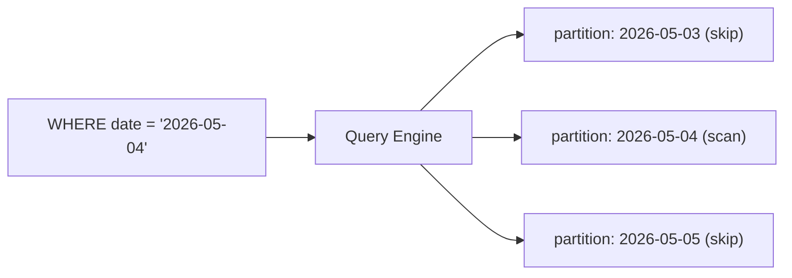

# Partition과 Clustering

> Data Warehouse 101 시리즈 (5/10)

<!-- a-grade-intro:begin -->

**핵심 질문**: *수십억 행* 의 fact 에서 *오늘 데이터* 만 *왜 빠르게* 뽑을 수 있을까요? 엔진은 *어떻게 줄일 부분* 을 *고를까요*?

> *Partition 은 *덩어리를 나누고*, Clustering 은 *덩어리 안을 정렬* 한다.*

<!-- a-grade-intro:end -->

## 이 글에서 배울 것

- *Partition* 의 정의와 효과
- *Clustering* 의 정의와 효과
- *Pruning* 이 일어나는 원리
- 5단계 적용 실습
- 흔한 함정 5가지

## 왜 중요한가

Warehouse 의 fact 는 *수십억 행* 이 보통입니다. *일자별 partition* 만 잘 잡아도 *95%* 의 행을 *읽지 않고 건너뜁니다*. *비용은 직접 절약* 됩니다.

> *읽지 않은 데이터에는 비용이 들지 않는다.*

## 개념 한눈에 보기



## 핵심 용어 정리

- **Partition**: 테이블을 *물리적으로 나눈 덩어리*. 보통 *날짜* 가 기준.
- **Clustering**: partition *안에서* 자주 쓰는 컬럼으로 *정렬*.
- **Pruning**: 쿼리 조건으로 *읽을 partition* 만 골라내는 것.
- **Partition key**: 나누는 *기준 컬럼*.
- **Cluster key**: 정렬하는 *기준 컬럼*.

## Before/After

**Before**: `WHERE order_date = '2026-05-04'` 인데 *전체 테이블* 을 스캔한다.

**After**: 같은 쿼리가 *하루치 partition* 만 읽는다. *비용 1/100*.

## 실습: 적용 5단계

### 1단계 — Partition 정의

```sql
-- BigQuery 예시
CREATE TABLE fact_orders (
    order_id BIGINT,
    user_key BIGINT,
    amount NUMERIC(12, 2),
    order_date DATE
)
PARTITION BY order_date;
```

### 2단계 — Clustering 추가

```sql
CREATE TABLE fact_orders (
    order_id BIGINT,
    user_key BIGINT,
    amount NUMERIC(12, 2),
    order_date DATE
)
PARTITION BY order_date
CLUSTER BY user_key;
```

### 3단계 — Pruning 되는 쿼리

```sql
-- 하루치 partition 만 읽힌다
SELECT SUM(amount)
FROM fact_orders
WHERE order_date = '2026-05-04';
```

### 4단계 — Pruning 안 되는 쿼리

```sql
-- order_date 에 함수가 걸리면 pruning 이 안 된다
SELECT SUM(amount)
FROM fact_orders
WHERE EXTRACT(YEAR FROM order_date) = 2026;
```

### 5단계 — Cluster key 활용

```sql
-- user_key 도 함께 걸면 더 적게 읽는다
SELECT SUM(amount)
FROM fact_orders
WHERE order_date BETWEEN '2026-05-01' AND '2026-05-31'
  AND user_key = 100;
```

## 이 코드에서 주목할 점

- *조건이 partition key* 와 *직접* 비교돼야 pruning 된다.
- *함수* 를 씌우면 *pruning 이 깨진다*.
- Clustering 은 *partition 안* 에서 *추가 효과* 를 준다.

## 자주 하는 실수 5가지

1. **Partition key 에 *함수* 적용.** *전체 스캔* 으로 떨어진다.
2. **Partition 너무 *잘게* 쪼갠다.** *메타데이터 비용* 이 *읽기 비용* 을 넘는다.
3. **Cluster key 를 *너무 많이* 잡는다.** *정렬 비용* 이 *읽기 이득* 을 넘는다.
4. **Partition 없이 *Index* 만 믿는다.** Warehouse 는 *index 의 세상* 이 아니다.
5. ***과거 partition* 을 *수정* 한다.** *재계산이 산더미*.

## 실무에서는 이렇게 쓰입니다

BigQuery, Snowflake, Redshift 모두 *partition + clustering* 을 *기본 도구* 로 갖습니다. *날짜 partition + 사용자 클러스터* 가 *기본 조합* 입니다.

## 시니어 엔지니어는 이렇게 생각합니다

- *Partition key 는 *쿼리의 첫 조건* 으로 만든다.*
- *Pruning 이 깨지는 패턴* 을 *팀에 공유* 한다.
- *비용은 *스캔된 바이트* 로 본다.*
- *Cluster key 는 *적게, 자주 쓰는* 것으로*.
- *과거 데이터 수정* 보다 *추가 적재* 를 선호한다.

## 체크리스트

- [ ] *Partition* 과 *Clustering* 의 차이를 안다.
- [ ] *Pruning* 이 깨지는 패턴을 안다.
- [ ] *비용 계산* 방식을 안다.
- [ ] *Partition key* 선택 기준을 안다.

## 연습 문제

1. *fact_payments* 의 *partition key* 와 *cluster key* 를 정해 보세요.
2. *Pruning 이 깨지는* 쿼리 *3가지* 를 적어 보세요.
3. *너무 잘게 쪼갠* partition 의 단점을 *2가지* 적어 보세요.

## 정리 및 다음 단계

Partition 과 Clustering 은 *비용과 속도* 를 동시에 개선합니다. 다음 글에서는 데이터를 적재하는 방법, *ETL* 과 *ELT* 를 봅니다.

<!-- toc:begin -->
- [Data Warehouse란 무엇인가?](./01-what-is-data-warehouse.md)
- [OLTP와 OLAP](./02-oltp-and-olap.md)
- [Fact와 Dimension](./03-fact-and-dimension.md)
- [Star Schema](./04-star-schema.md)
- **Partition과 Clustering (현재 글)**
- ETL과 ELT (예정)
- BI와 Dashboard (예정)
- Data Mart (예정)
- 성능 최적화 (예정)
- Warehouse 설계 예제 (예정)
<!-- toc:end -->

## 참고 자료

- [BigQuery — Partitioned Tables](https://cloud.google.com/bigquery/docs/partitioned-tables)
- [BigQuery — Clustered Tables](https://cloud.google.com/bigquery/docs/clustered-tables)
- [Snowflake — Clustering Keys](https://docs.snowflake.com/en/user-guide/tables-clustering-keys)
- [Redshift — Distribution and Sort Keys](https://docs.aws.amazon.com/redshift/latest/dg/c_designing-tables-best-practices.html)

Tags: DataWarehouse, Partition, Clustering, Performance, Analytics
