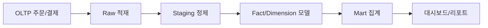

# Data Warehouse 101 (6/10): ETL과 ELT

이 글은 데이터 웨어하우스 101 시리즈의 6번째 글입니다.

Warehouse 컴퓨팅 비용이 낮아지면서 원본을 먼저 적재하고 그다음 SQL로 변환하는 방식이 기본이 되었습니다. 이렇게 하면 변환 로직이 SQL 파일로 남아 버전 관리가 쉬워지고, 재실행과 디버깅도 훨씬 단순해집니다.


*Data Warehouse 101 6장 흐름 개요*
> ETL은 '외부 도구의 변환'을, ELT는 '웨어하우스 엔진의 변환'을 신뢰하는 구조입니다. 메인테넌스와 디버깅 책임이 달라집니다.

## 먼저 던지는 질문

- ETL과 ELT는 변환을 어디에서 다르게 수행할까요?
- 현대 Warehouse가 ELT를 선호하는 이유는 무엇일까요?
- staging을 건너뛰면 어떤 문제가 생길까요?

## 이 글에서 배울 것

- ETL과 ELT의 차이
- 변환을 둘 위치를 고르는 기준
- 현대 Warehouse가 ELT를 선호하는 이유
- 파이프라인 실습 5단계
- 입문 단계에서 자주 나오는 실수 5가지

## 왜 중요한가

Warehouse 쪽 컴퓨트가 저렴해지면서 원본을 먼저 적재하고 SQL로 변환하는 방식이 기본값에 가까워졌습니다. 변환 로직이 SQL 파일로 남고 버전 관리가 가능해지며, 재실행도 쉬워졌기 때문입니다. 그래서 이제는 파이프라인을 코드처럼 다루는 감각이 중요합니다.

> 변환을 SQL로 끌어오면 가시성과 재현성이 함께 따라옵니다.

## 개념 한눈에 보기

ETL은 데이터를 변환한 뒤 적재하고, ELT는 먼저 적재한 뒤 웨어하우스 안에서 변환합니다. 각 방식은 비용 구조, 유연성, 운영 난이도가 다르므로 데이터 규모와 변경 빈도에 맞춰 선택합니다.

## 핵심 용어

- **ETL**: Extract → Transform → Load. 적재 전에 변환을 끝내는 방식입니다.
- **ELT**: Extract → Load → Transform. 적재 후 Warehouse 안에서 변환하는 방식입니다.
- **Staging**: 원본을 최대한 보존하는 첫 적재 계층입니다.
- **dbt**: SQL 기반 변환과 테스트를 함께 관리하는 도구입니다.
- **Idempotent**: 여러 번 실행해도 같은 결과를 만드는 성질입니다.

## 전후 비교

**Before**: ETL 도중 변환이 실패했는데 원본이 이미 사라져 재처리가 복잡해집니다.

**After**: staging에 원본을 남겨 두고 SQL 변환만 다시 실행합니다.

## 실습: 파이프라인 5단계

### 1단계 — 원본 적재하기

```sql
COPY raw.orders
FROM 's3://bucket/orders/2026-05-04/'
FORMAT AS PARQUET;
```

### 2단계 — staging 모델 만들기

```sql
CREATE OR REPLACE TABLE staging.orders AS

## ETL과 ELT 비교

두 패러다임은 변환 위치, 비용 구조, 유연성, 도구 생태계에서 뚜렷한 차이를 보입니다.

| 비교 항목 | ETL | ELT |
|---|---|---|
| 변환 순서 | Extract → Transform → Load | Extract → Load → Transform |
| 변환 위치 | 외부 도구 (예: Python, Spark) | Warehouse 내부 (SQL) |
| 적합 환경 | Warehouse 컴퓨팅 비용이 높거나 제한적인 환경 | 클라우드 Warehouse (BigQuery, Snowflake) |
| 대표 도구 | Pentaho, Informatica, Talend | dbt, Fivetran + SQL, Airbyte + dbt |
| 장점 | 적재 전 검증 가능, 정제된 데이터만 저장 | 원본 보존, SQL로 재실행 가능, 유연한 변경 |
| 단점 | 변환 로직이 외부에 숨음, 재실행 복잡 | 초기 저장 공간 필요, SQL 역량 요구 |

ETL은 변환 로직이 외부 도구에 캡슐화되므로 원본 데이터를 그대로 적재하지 않는 경우가 많습니다. 반면 ELT는 원본을 먼저 적재하고 SQL로 변환하므로 변환 로직이 가시적이며 버전 관리가 쉽습니다.

SELECT
    order_id::BIGINT AS order_id,
    user_id::BIGINT AS user_id,
    amount::NUMERIC(12, 2) AS amount,
    created_at::TIMESTAMP AS created_at
FROM raw.orders;
```

### 3단계 — 변환 모델 만들기

```sql
CREATE OR REPLACE TABLE marts.fact_orders AS
SELECT
    order_id,
    user_id,
    amount,
    DATE(created_at) AS order_date
FROM staging.orders
WHERE amount > 0;
```

### 4단계 — 테스트하기

```sql
-- No negative amounts allowed
SELECT COUNT(*) AS bad
FROM marts.fact_orders
WHERE amount <= 0;
```

### 5단계 — 재실행하기

```sql
-- Raw stays put; only the transform replays
TRUNCATE marts.fact_orders;
INSERT INTO marts.fact_orders SELECT ...;
```

## Python 예제: 간단한 ELT 파이프라인

아래는 pandas를 사용해 CSV 파일을 읽고, 정제 후 SQLite Warehouse에 적재하는 간단한 ELT 파이프라인 예제입니다.

```python
import sqlite3
import pandas as pd

# 1. Extract: CSV 파일 읽기
df_raw = pd.read_csv('orders_raw.csv')

# 2. Load: raw 계층에 적재
conn = sqlite3.connect('warehouse.db')
df_raw.to_sql('raw_orders', conn, if_exists='replace', index=False)

# 3. Transform: staging 모델 생성
query_staging = """
CREATE TABLE staging_orders AS
SELECT
    CAST(order_id AS INTEGER) AS order_id,
    CAST(user_id AS INTEGER) AS user_id,
    CAST(amount AS REAL) AS amount,
    DATE(created_at) AS created_at
FROM raw_orders
WHERE amount > 0
"""
conn.execute('DROP TABLE IF EXISTS staging_orders')
conn.execute(query_staging)

# 4. Transform: mart 모델 생성
query_mart = """
CREATE TABLE mart_daily_orders AS
SELECT
    created_at AS order_date,
    COUNT(*) AS order_count,
    SUM(amount) AS total_amount
FROM staging_orders
GROUP BY created_at
"""
conn.execute('DROP TABLE IF EXISTS mart_daily_orders')
conn.execute(query_mart)

conn.commit()
conn.close()
print('ELT pipeline completed.')
```

이 예제는 원본을 `raw_orders`에 그대로 보존하고, 정제는 SQL로 수행합니다. 변환 로직이 SQL 문자열에 담겨 있어 코드 리뷰와 버전 관리가 쉽습니다.


## 이 코드에서 먼저 봐야 할 점

- 원본, staging, mart로 흐름을 나누면 각 단계의 책임이 분명해집니다.
- 변환 로직이 SQL 파일에 모이면 리뷰와 버전 관리가 쉬워집니다.
- 같은 입력으로 다시 실행해도 같은 결과가 나오는 idempotent 구조가 중요합니다.

## 데이터 품질 체크

ELT 파이프라인에서는 변환 후 데이터 품질을 검증하는 단계가 필수입니다. 아래는 대표적인 품질 체크 항목입니다.

### null 비율 체크

```sql
SELECT
    COUNT(*) AS total_rows,
    COUNT(order_id) AS non_null_order_id,
    COUNT(user_id) AS non_null_user_id,
    COUNT(amount) AS non_null_amount,
    (COUNT(*) - COUNT(order_id)) * 100.0 / COUNT(*) AS order_id_null_pct
FROM staging.orders;
```

null 비율이 예상 임계값(예: 5%)을 넘으면 파이프라인을 중단하고 원인을 조사합니다.

### 중복 체크

```sql
SELECT order_id, COUNT(*) AS dup_count
FROM staging.orders
GROUP BY order_id
HAVING COUNT(*) > 1;
```

동일한 `order_id`가 여러 번 나타나는 경우 원본 적재 과정에서 문제가 있을 수 있습니다.

### 스키마 변경 감지

```sql
-- 컬럼 수와 타입이 예상 스키마와 일치하는지 확인
SELECT COUNT(*) AS column_count
FROM information_schema.columns
WHERE table_name = 'staging_orders';
```

스키마 변경이 감지되면 알람을 발생시키고, 변환 모델이 새 구조를 다룰 수 있는지 검토합니다. 이 세 가지 체크만 추가해도 데이터 신뢰성이 크게 높아집니다.

## 자주 하는 실수 5가지

1. **원본 데이터를 덮어씁니다.** 과거 시점 재현이 어려워집니다.
2. **변환을 Python 함수 안에 숨깁니다.** 로직이 보이지 않아 리뷰와 디버깅이 힘들어집니다.
3. **테스트 없이 적재합니다.** 잘못된 데이터가 그대로 대시보드까지 올라갈 수 있습니다.
4. **재실행할 때 결과가 달라집니다.** idempotent하지 않으면 파이프라인 신뢰가 떨어집니다.
5. **모든 변환을 한 모델에 몰아넣습니다.** 작은 모델로 나누는 편이 읽기와 유지보수에 유리합니다.

## 실무에서는 이렇게 나타납니다

Fivetran이나 Airbyte로 적재하고, dbt로 변환하고, Airflow나 Dagster로 스케줄을 관리하는 조합이 널리 쓰입니다. 변환 로직은 SQL 모델 형태로 Git에 남기고, 테스트도 같은 저장소에서 함께 관리합니다.

## 실무에서는 이렇게 생각합니다

- raw는 법적 기록처럼 보존합니다.
- 변환은 SQL 파일로 모아 둡니다.
- 모든 모델 옆에는 테스트가 있어야 합니다.
- idempotency는 재현성의 다른 이름이라고 봅니다.
- 파이프라인 자체도 버전 관리합니다.

## 체크리스트

- [ ] ETL과 ELT의 차이를 설명할 수 있다.
- [ ] Staging 계층의 역할을 이해하고 있다.
- [ ] Idempotent가 무엇을 뜻하는지 말할 수 있다.
- [ ] 변환 모델에 테스트를 붙여야 하는 이유를 알고 있다.

## 연습 문제

1. ETL이 더 적합한 사례 하나를 적어 보세요.
2. staging을 건너뛰었을 때의 위험 세 가지를 적어 보세요.
3. idempotent하지 않은 변환 예시 하나를 적어 보세요.

## 마무리와 다음 글

ELT는 Warehouse의 계산 능력을 적극적으로 활용하는 현대적인 적재 방식입니다. 원본 보존, SQL 중심 변환, 반복 가능한 재실행이라는 세 가지 장점이 함께 따라옵니다. 다음 글에서는 이렇게 준비한 데이터를 사람이 실제로 읽고 판단하는 도구인 BI와 대시보드를 살펴보겠습니다.


## ETL vs ELT를 선택하는 기준표

ETL과 ELT는 도구 취향 문제가 아니라 변환 책임을 어디에 둘지에 대한 운영 결정입니다. 아래 표는 선택 기준을 팀 논의에 바로 사용할 수 있도록 정리한 것입니다.

| 항목 | ETL | ELT |
| --- | --- | --- |
| 변환 위치 | 외부 처리 엔진 | Warehouse 내부 SQL |
| 초기 적재 형태 | 변환 후 적재 | 원본 먼저 적재 |
| 재처리 난이도 | 원본 보존 정책에 의존 | 상대적으로 단순 |
| 로직 가시성 | 파이썬/워크플로 코드 중심 | SQL 모델 중심 |
| 스케일링 방식 | 별도 컴퓨트 확장 | DW 컴퓨트 확장 |
| 현대 스택 적합성 | 특수 변환 강할 때 유리 | 일반 분석 파이프라인에 유리 |

대부분의 분석 워크로드에서는 ELT가 유지보수에 유리하지만, 복잡한 파일 파싱이나 외부 API 결합이 크면 ETL 단계가 여전히 필요합니다.

## Python ETL 파이프라인 예시

아래 코드는 입력 검증, 변환, 적재를 분리한 단순 ETL 예시입니다.

```python
from datetime import datetime
from decimal import Decimal


def normalize_order(row: dict) -> dict:
    amount = Decimal(str(row["amount"]))
    if amount <= 0:
        raise ValueError("amount must be positive")
    return {
        "order_id": int(row["order_id"]),
        "user_id": int(row["user_id"]),
        "amount": amount,
        "created_at": datetime.fromisoformat(row["created_at"]),
    }


def transform(rows: list[dict]) -> list[dict]:
    return [normalize_order(row) for row in rows]
```

이런 ETL 코드는 외부 데이터 품질이 낮거나 스키마가 자주 깨지는 환경에서 특히 유용합니다. 다만 변환 로직이 코드 내부에 깊게 숨으면 분석가 협업이 어려워질 수 있어, mart로 갈수록 SQL 중심으로 옮기는 전략이 좋습니다.

## ELT 운영 원칙

ELT를 안정적으로 운영하려면 "원본 보존 + 단계 분리 + 테스트 자동화"가 필요합니다.

```yaml
elt_principles:
  raw_layer:
    immutable: true
    load_mode: append
  staging_layer:
    casting: strict
    null_policy: explicit
  marts_layer:
    metric_owner: domain_team
    tests_required: true
  orchestration:
    retry_policy: "3 attempts"
    alert_channel: "#data-pipeline"
```

원칙이 없으면 파이프라인이 커질수록 디버깅 시간이 폭증합니다. 반대로 단계별 책임을 명확히 두면 장애가 나도 복구 범위를 좁힐 수 있습니다.

## 증분 처리에서 자주 쓰는 패턴

ELT에서 비용을 줄이려면 전체 재계산보다 증분 처리 기준을 먼저 정해야 합니다. 일반적으로는 `updated_at` 또는 CDC 로그 오프셋을 사용합니다.

```sql
INSERT INTO staging.orders
SELECT *
FROM raw.orders
WHERE updated_at > (SELECT last_success_at FROM pipeline_state WHERE job_name = 'orders_load');
```

증분 기준은 단순하지만 매우 중요합니다. 기준이 불안정하면 중복 적재와 누락이 동시에 발생할 수 있으므로, 상태 테이블 관리와 재처리 시나리오를 함께 설계해야 합니다.


## 실전 앵커: 모델, 파이프라인, 성능 검증

아래 예시는 이 글의 개념을 실제 운영으로 옮길 때 바로 재사용할 수 있는 최소 앵커입니다. 스키마, 적재 설정, 성능 비교를 한 묶음으로 두면 설계 논의가 추상 수준에서 끝나지 않고 실행 가능한 결정으로 이어집니다.

```sql
-- 공통 분석 질의 템플릿: 기간 + 세그먼트 + 지표
WITH scoped AS (
    SELECT
        f.date_key,
        f.amount,
        f.qty,
        c.segment,
        p.category
    FROM fact_sales f
    JOIN dim_customer c ON c.customer_key = f.customer_key
    JOIN dim_product p ON p.product_key = f.product_key
    WHERE f.date_key BETWEEN 20260101 AND 20260331
)
SELECT
    segment,
    category,
    SUM(amount) AS revenue,
    SUM(qty) AS units,
    COUNT(*) AS order_lines,
    ROUND(SUM(amount) / NULLIF(COUNT(*), 0), 2) AS avg_line_amount
FROM scoped
GROUP BY 1, 2
ORDER BY revenue DESC;
```

```yaml
pipeline_contract:
  schedule: "0 * * * *"
  source:
    type: cdc
    lag_slo_minutes: 15
  transform:
    engine: dbt
    model_layers: [stg, int, mart]
  quality_tests:
    - not_null
    - unique
    - relationships
    - accepted_values
  publish:
    target: mart_sales_daily
    strategy: merge
```



성능 비교는 반드시 동일 조건에서 수행해야 합니다. 파티션 필터 유무, 조인 순서, 집계 단위를 고정하지 않으면 숫자가 설계를 설명하지 못합니다.

| 비교 항목 | 조건 A(비최적화) | 조건 B(최적화) | 해석 |
| --- | --- | --- | --- |
| 스캔 바이트 | 480GB | 62GB | 파티션 프루닝이 대부분의 차이를 만듭니다. |
| 실행 시간 | 94초 | 18초 | 집계 이전 필터링으로 셔플 비용이 줄어듭니다. |
| 슬롯/크레딧 사용량 | 높음 | 중간 | 비용 안정성이 높아집니다. |
| 재현성 | 낮음 | 높음 | 표준 템플릿 쿼리 사용 시 비교 가능성이 유지됩니다. |

운영에서는 "정확한 한 번"보다 "안전한 재실행"이 더 중요한 경우가 많습니다. 그래서 적재 키를 두고 upsert 기준을 명확히 정의하는 방식이 필요합니다.

```sql
-- 재실행 가능한 머지 예시
MERGE INTO mart_sales_daily t
USING (
    SELECT
        d.full_date,
        c.segment,
        p.category,
        SUM(f.amount) AS revenue,
        SUM(f.qty) AS units
    FROM fact_sales f
    JOIN dim_date d ON d.date_key = f.date_key
    JOIN dim_customer c ON c.customer_key = f.customer_key
    JOIN dim_product p ON p.product_key = f.product_key
    WHERE d.full_date >= CURRENT_DATE - INTERVAL '7 day'
    GROUP BY 1, 2, 3
) s
ON t.full_date = s.full_date
AND t.segment = s.segment
AND t.category = s.category
WHEN MATCHED THEN UPDATE SET
    revenue = s.revenue,
    units = s.units,
    updated_at = CURRENT_TIMESTAMP
WHEN NOT MATCHED THEN INSERT (
    full_date, segment, category, revenue, units, updated_at
) VALUES (
    s.full_date, s.segment, s.category, s.revenue, s.units, CURRENT_TIMESTAMP
);
```

이 패턴을 기준선으로 두면, 모델 변경이나 파이프라인 장애가 생겨도 영향을 계층별로 좁혀 복구할 수 있습니다. 데이터 웨어하우스 운영은 쿼리 한두 개의 튜닝보다, 반복 가능한 설계 계약을 지키는 과정에 더 가깝습니다.


### 운영 확장 메모

데이터 웨어하우스를 오래 운영하면 기술 선택보다 운영 규율이 성능과 신뢰도를 좌우합니다. 다음 예시는 팀에서 반복적으로 사용하는 점검 묶음입니다.

```sql
-- 파티션 필터 누락 탐지용 예시
EXPLAIN
SELECT category, SUM(amount) AS revenue
FROM fact_sales
WHERE date_key BETWEEN 20260101 AND 20260131
GROUP BY category;
```

```yaml
review_policy:
  query_rules:
    - require_partition_filter: true
    - block_select_star_on_fact: true
    - require_owner_for_metric_change: true
  incident_rules:
    - classify: [schema_change, pipeline_lag, quality_failure]
    - first_response_minutes: 15
```


아키텍처가 단순해 보여도, 계약과 검증 루프를 문서화해 두면 신규 인원이 합류해도 같은 품질을 유지할 수 있습니다.


### 운영 확장 메모

데이터 웨어하우스를 오래 운영하면 기술 선택보다 운영 규율이 성능과 신뢰도를 좌우합니다. 다음 예시는 팀에서 반복적으로 사용하는 점검 묶음입니다.

```sql
-- 파티션 필터 누락 탐지용 예시
EXPLAIN
SELECT category, SUM(amount) AS revenue
FROM fact_sales
WHERE date_key BETWEEN 20260101 AND 20260131
GROUP BY category;
```

```yaml
review_policy:
  query_rules:
    - require_partition_filter: true
    - block_select_star_on_fact: true
    - require_owner_for_metric_change: true
  incident_rules:
    - classify: [schema_change, pipeline_lag, quality_failure]
    - first_response_minutes: 15
```


아키텍처가 단순해 보여도, 계약과 검증 루프를 문서화해 두면 신규 인원이 합류해도 같은 품질을 유지할 수 있습니다.


### 운영 확장 메모

데이터 웨어하우스를 오래 운영하면 기술 선택보다 운영 규율이 성능과 신뢰도를 좌우합니다. 다음 예시는 팀에서 반복적으로 사용하는 점검 묶음입니다.

```sql
-- 파티션 필터 누락 탐지용 예시
EXPLAIN
SELECT category, SUM(amount) AS revenue
FROM fact_sales
WHERE date_key BETWEEN 20260101 AND 20260131
GROUP BY category;
```

```yaml
review_policy:
  query_rules:
    - require_partition_filter: true
    - block_select_star_on_fact: true
    - require_owner_for_metric_change: true
  incident_rules:
    - classify: [schema_change, pipeline_lag, quality_failure]
    - first_response_minutes: 15
```


아키텍처가 단순해 보여도, 계약과 검증 루프를 문서화해 두면 신규 인원이 합류해도 같은 품질을 유지할 수 있습니다.


### 운영 확장 메모

데이터 웨어하우스를 오래 운영하면 기술 선택보다 운영 규율이 성능과 신뢰도를 좌우합니다. 다음 예시는 팀에서 반복적으로 사용하는 점검 묶음입니다.

```sql
-- 파티션 필터 누락 탐지용 예시
EXPLAIN
SELECT category, SUM(amount) AS revenue
FROM fact_sales
WHERE date_key BETWEEN 20260101 AND 20260131
GROUP BY category;
```

```yaml
review_policy:
  query_rules:
    - require_partition_filter: true
    - block_select_star_on_fact: true
    - require_owner_for_metric_change: true
  incident_rules:
    - classify: [schema_change, pipeline_lag, quality_failure]
    - first_response_minutes: 15
```


아키텍처가 단순해 보여도, 계약과 검증 루프를 문서화해 두면 신규 인원이 합류해도 같은 품질을 유지할 수 있습니다.


### 운영 확장 메모

데이터 웨어하우스를 오래 운영하면 기술 선택보다 운영 규율이 성능과 신뢰도를 좌우합니다. 다음 예시는 팀에서 반복적으로 사용하는 점검 묶음입니다.

```sql
-- 파티션 필터 누락 탐지용 예시
EXPLAIN
SELECT category, SUM(amount) AS revenue
FROM fact_sales
WHERE date_key BETWEEN 20260101 AND 20260131
GROUP BY category;
```

```yaml
review_policy:
  query_rules:
    - require_partition_filter: true
    - block_select_star_on_fact: true
    - require_owner_for_metric_change: true
  incident_rules:
    - classify: [schema_change, pipeline_lag, quality_failure]
    - first_response_minutes: 15
```


아키텍처가 단순해 보여도, 계약과 검증 루프를 문서화해 두면 신규 인원이 합류해도 같은 품질을 유지할 수 있습니다.


### 운영 확장 메모

데이터 웨어하우스를 오래 운영하면 기술 선택보다 운영 규율이 성능과 신뢰도를 좌우합니다. 다음 예시는 팀에서 반복적으로 사용하는 점검 묶음입니다.

```sql
-- 파티션 필터 누락 탐지용 예시
EXPLAIN
SELECT category, SUM(amount) AS revenue
FROM fact_sales
WHERE date_key BETWEEN 20260101 AND 20260131
GROUP BY category;
```

```yaml
review_policy:
  query_rules:
    - require_partition_filter: true
    - block_select_star_on_fact: true
    - require_owner_for_metric_change: true
  incident_rules:
    - classify: [schema_change, pipeline_lag, quality_failure]
    - first_response_minutes: 15
```


아키텍처가 단순해 보여도, 계약과 검증 루프를 문서화해 두면 신규 인원이 합류해도 같은 품질을 유지할 수 있습니다.

## 처음 질문으로 돌아가기

- **ETL과 ELT 중 어느 것이 더 좋은가요?**
  - 비용 구조, 변경 빈도, 팀의 SQL 역량이 달라 절대적 답은 없습니다.
- **ELT에서 변환 로직이 잘못되면 어떻게 복구할까요?**
  - 원본 데이터가 웨어하우스에 그대로 있으므로 변환만 다시 실행하면 되는 이점이 있습니다.
- **증분 ETL/ELT는 어떻게 구현할까요?**
  - 마지막 성공 시점을 기록하고, 그 이후 변경분만 처리하는 방식이 일반적입니다.

<!-- toc:begin -->
## 시리즈 목차

- [Data Warehouse 101 (1/10): Data Warehouse란 무엇인가?](./01-what-is-data-warehouse.md)
- [Data Warehouse 101 (2/10): OLTP와 OLAP](./02-oltp-and-olap.md)
- [Data Warehouse 101 (3/10): Fact와 Dimension](./03-fact-and-dimension.md)
- [Data Warehouse 101 (4/10): Star Schema](./04-star-schema.md)
- [Data Warehouse 101 (5/10): Partition과 Clustering](./05-partition-and-clustering.md)
- **ETL과 ELT (현재 글)**
- BI와 Dashboard (예정)
- Data Mart (예정)
- 성능 최적화 (예정)
- Warehouse 설계 예제 (예정)

<!-- toc:end -->

## 참고 자료

- [dbt — What Is dbt?](https://docs.getdbt.com/docs/introduction)
- [Fivetran — ELT vs ETL](https://www.fivetran.com/blog/elt-vs-etl)
- [Airbyte — Modern Data Stack](https://airbyte.com/blog/modern-data-stack)
- [Designing Data-Intensive Applications](https://dataintensive.net/)

- [이 시리즈의 예제 코드 (book-examples)](https://github.com/yeongseon-books/book-examples/tree/main/data-warehouse-101/ko)

Tags: DataWarehouse, ETL, ELT, Pipeline, Analytics
