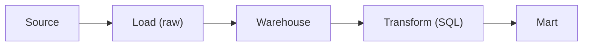

# ETL과 ELT

> Data Warehouse 101 시리즈 (6/10)


## 이 글에서 다룰 문제

Warehouse 컴퓨팅 비용이 낮아지면서 원본을 먼저 적재하고 그다음 SQL로 변환하는 방식이 기본이 되었습니다. 이렇게 하면 변환 로직이 SQL 파일로 남아 버전 관리가 쉬워지고, 재실행과 디버깅도 훨씬 단순해집니다.

> 원본을 먼저 보존하면 파이프라인은 더 투명해지고 다시 실행하기도 쉬워집니다.

## 전체 흐름


## Before/After

**Before**: ETL 도중 변환이 실패했는데 원본이 이미 사라져 재처리가 복잡해집니다.

**After**: staging에 원본을 남겨 두고 SQL 변환만 다시 실행합니다.

## 파이프라인 5단계

### 1단계 — 원본 적재

```sql
COPY raw.orders
FROM 's3://bucket/orders/2026-05-04/'
FORMAT AS PARQUET;
```

### 2단계 — Staging 모델

```sql
CREATE OR REPLACE TABLE staging.orders AS
SELECT
    order_id::BIGINT AS order_id,
    user_id::BIGINT AS user_id,
    amount::NUMERIC(12, 2) AS amount,
    created_at::TIMESTAMP AS created_at
FROM raw.orders;
```

### 3단계 — 변환 모델

```sql
CREATE OR REPLACE TABLE marts.fact_orders AS
SELECT
    order_id,
    user_id,
    amount,
    DATE(created_at) AS order_date
FROM staging.orders
WHERE amount > 0;
```

### 4단계 — 테스트

```sql
-- 음수 금액이 없어야 한다
SELECT COUNT(*) AS bad
FROM marts.fact_orders
WHERE amount <= 0;
```

### 5단계 — 재실행

```sql
-- 원본은 그대로 두고 변환만 다시 실행한다
TRUNCATE marts.fact_orders;
INSERT INTO marts.fact_orders SELECT ...;
```

## 이 코드에서 주목할 점

- 원본, staging, mart로 흐름을 나누면 각 단계의 책임이 분명해집니다.
- 변환 로직이 SQL 파일에 모이면 리뷰와 버전 관리가 쉬워집니다.
- 같은 입력으로 다시 실행해도 같은 결과가 나오는 idempotent 구조가 중요합니다.

## 자주 하는 실수 5가지

1. **원본 데이터를 덮어씁니다.** 과거 시점 재현이 어려워집니다.
2. **변환을 Python 함수 안에 숨깁니다.** 로직이 보이지 않아 리뷰와 디버깅이 힘들어집니다.
3. **테스트 없이 적재합니다.** 잘못된 데이터가 그대로 대시보드까지 올라갈 수 있습니다.
4. **재실행할 때 결과가 달라집니다.** idempotent하지 않으면 파이프라인 신뢰가 떨어집니다.
5. **모든 변환을 한 모델에 몰아넣습니다.** 작은 모델로 나누는 편이 읽기와 유지보수에 유리합니다.

## 실무에서는 이렇게 쓰입니다

Fivetran이나 Airbyte로 적재하고, dbt로 변환하고, Airflow나 Dagster로 스케줄을 관리하는 조합이 널리 쓰입니다. 변환 로직은 SQL 모델 형태로 Git에 남기고, 테스트도 같은 저장소에서 함께 관리합니다.

## 체크리스트

- [ ] ETL과 ELT의 차이를 설명할 수 있다.
- [ ] Staging 계층의 역할을 이해하고 있다.
- [ ] Idempotent가 무엇을 뜻하는지 말할 수 있다.
- [ ] 변환 모델에 테스트를 붙여야 하는 이유를 알고 있다.

## 정리 및 다음 단계

ELT는 Warehouse의 계산 능력을 적극적으로 활용하는 현대적인 적재 방식입니다. 원본 보존, SQL 중심 변환, 반복 가능한 재실행이라는 세 가지 장점이 함께 따라옵니다. 다음 글에서는 이렇게 준비한 데이터를 사람이 실제로 읽고 판단하는 도구인 BI와 대시보드를 살펴보겠습니다.

<!-- toc:begin -->
- [Data Warehouse란 무엇인가?](./01-what-is-data-warehouse.md)
- [OLTP와 OLAP](./02-oltp-and-olap.md)
- [Fact와 Dimension](./03-fact-and-dimension.md)
- [Star Schema](./04-star-schema.md)
- [Partition과 Clustering](./05-partition-and-clustering.md)
- **ETL과 ELT (현재 글)**
- BI와 Dashboard (예정)
- Data Mart (예정)
- 성능 최적화 (예정)
- Warehouse 설계 예제 (예정)
<!-- toc:end -->

## 참고 자료

- [dbt — What Is dbt?](https://docs.getdbt.com/docs/introduction)
- [Fivetran — ELT vs ETL](https://www.fivetran.com/blog/elt-vs-etl)
- [Airbyte — Modern Data Stack](https://airbyte.com/blog/modern-data-stack)
- [Designing Data-Intensive Applications](https://dataintensive.net/)

Tags: DataWarehouse, ETL, ELT, Pipeline, Analytics
