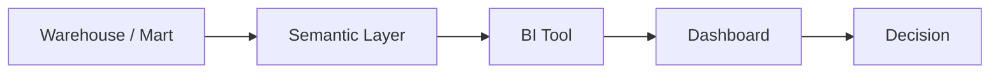

# BI와 Dashboard

> Data Warehouse 101 시리즈 (7/10)


## 이 글에서 다룰 문제

Warehouse 의 *마지막 1cm* 가 BI 입니다. *수십억 행* 을 잘 정리해도 *대시보드가 어수선* 하면 *결정* 이 *내려지지 않습니다*. 좋은 대시보드는 *질문 한 줄* 을 *답 한 화면* 으로 바꿉니다.

> *대시보드의 성공은 *오픈된 횟수* 가 아니라 *내려진 결정* 으로 잰다.*

## 전체 흐름


## Before/After

**Before**: *동일 지표* 가 부서마다 *다른 숫자*. 회의가 *숫자 협상* 으로 끝난다.

**After**: *Semantic layer* 한 곳에 *지표 정의*. 모두가 *같은 매출* 을 본다.

## 대시보드 설계 5단계

### 1단계 — 질문 정의

```text
"이번 달 매출이 *지난 달 대비* 얼마나 늘었는가?"
```

### 2단계 — 데이터 모델 확인

```sql
SELECT date_trunc('month', order_date) AS month,
       SUM(amount) AS revenue
FROM marts.fact_orders
GROUP BY 1;
```

### 3단계 — KPI 카드

```text
- 이번 달 매출: $1,200,000
- 전월 대비: +12%
- 전년 동월 대비: +35%
```

### 4단계 — 추세 차트

```sql
-- 12개월 추세
SELECT date_trunc('month', order_date) AS month,
       SUM(amount) AS revenue
FROM marts.fact_orders
WHERE order_date >= CURRENT_DATE - INTERVAL '12 months'
GROUP BY 1
ORDER BY 1;
```

### 5단계 — 드릴다운

```sql
-- 카테고리별 기여도
SELECT p.category, SUM(f.amount) AS revenue
FROM marts.fact_orders f
JOIN marts.dim_product p ON p.product_key = f.product_key
WHERE f.order_date >= date_trunc('month', CURRENT_DATE)
GROUP BY p.category
ORDER BY revenue DESC;
```

## 이 코드에서 주목할 점

- 한 화면이 *질문 한 줄* 에 답한다.
- KPI → 추세 → 드릴다운 의 *세 층*.
- 모든 숫자가 *같은 모델* 에서 나온다.

## 자주 하는 실수 5가지

1. **차트를 *너무 많이* 넣는다.** 한 화면 *3-5개* 가 *적정*.
2. ***지표 정의* 가 *대시보드마다 다름*.** *Semantic layer* 로 통일한다.
3. ***비교 기준* 이 *없다*.** *전월/전년* 비교 *없는* 숫자는 *무의미*.
4. ***색상* 이 *의미를 잃는다*.** 빨강은 *나쁨*, 초록은 *좋음* 으로 *통일*.
5. ***소수점* 을 *너무 많이* 보여준다.** *읽기 쉽게* 반올림한다.

## 실무에서는 이렇게 쓰입니다

분기 회의의 첫 슬라이드는 *대시보드 캡처* 입니다. *Looker, Tableau* 의 dashboard 가 *제품 결정* 의 *기준* 이 됩니다. *지표 정의* 는 dbt metrics 같은 *코드* 로 관리합니다.

## 체크리스트

- [ ] *Semantic layer* 의 의미를 안다.
- [ ] 좋은 대시보드의 *3가지 특징* 을 말할 수 있다.
- [ ] *KPI* 와 *추세* 와 *드릴다운* 의 차이를 안다.
- [ ] *비교 기준* 의 중요성을 안다.

## 정리 및 다음 단계

BI 는 *Warehouse 의 얼굴* 입니다. 다음 글에서는 *팀별 분석 도메인* 인 *Data Mart* 를 봅니다.

<!-- toc:begin -->
- [Data Warehouse란 무엇인가?](./01-what-is-data-warehouse.md)
- [OLTP와 OLAP](./02-oltp-and-olap.md)
- [Fact와 Dimension](./03-fact-and-dimension.md)
- [Star Schema](./04-star-schema.md)
- [Partition과 Clustering](./05-partition-and-clustering.md)
- [ETL과 ELT](./06-etl-and-elt.md)
- **BI와 Dashboard (현재 글)**
- Data Mart (예정)
- 성능 최적화 (예정)
- Warehouse 설계 예제 (예정)
<!-- toc:end -->

## 참고 자료

- [Looker — Semantic Layer](https://cloud.google.com/looker/docs/intro)
- [Tableau — Visual Best Practices](https://www.tableau.com/learn/articles/data-visualization-tips)
- [Power BI — Star Schema](https://learn.microsoft.com/en-us/power-bi/guidance/star-schema)
- [dbt — Semantic Layer](https://docs.getdbt.com/docs/use-dbt-semantic-layer/dbt-sl)

Tags: DataWarehouse, BI, Dashboard, Visualization, Analytics
