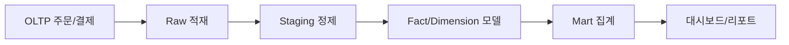

# Data Warehouse 101 (7/10): BI와 Dashboard

이 글은 데이터 웨어하우스 101 시리즈의 7번째 글입니다.

데이터 웨어하우스에 데이터를 잘 쌓아도 마지막 화면이 시끄러우면 의사결정은 느려집니다. 결국 BI와 대시보드는 숫자를 저장하는 층이 아니라, 질문 하나를 화면 하나로 바꾸는 층입니다. 좋은 대시보드는 많이 보여 주는 화면이 아니라 빠르게 같은 결론에 도달하게 만드는 화면입니다.


## 먼저 던지는 질문

- 왜 같은 숫자를 보고도 팀마다 다른 결론을 내릴까요?
- BI 도구와 대시보드는 각각 어떤 역할을 맡을까요?
- 좋은 대시보드는 어떤 질문 구조를 가져야 할까요?

## 큰 그림


*Data Warehouse 101 7장 흐름 개요*

BI는 데이터를 통해 의사 결정을 돕는 프로세스이고, Dashboard는 그 결과를 보여주는 화면입니다. 좋은 대시보드는 올바른 지표 선정, 명확한 시각화, 일관된 업데이트로 만들어집니다.

> Dashboard 설계는 '무엇을 봐야 하는가'를 먼저 정하고, 그 다음에 '어디서 가져올 것인가'를 결정합니다.

## 이 글에서 배울 것

- BI 도구가 데이터 웨어하우스 위에서 맡는 역할
- 좋은 대시보드가 공통으로 갖는 특징
- 숫자를 의사결정으로 연결하는 시각화 원칙
- 질문에서 KPI, 추세, 드릴다운으로 이어지는 5단계 설계 흐름
- 실무에서 반복되는 대표적인 실수 5가지

## 왜 중요한가

웨어하우스 프로젝트가 실패하는 이유가 항상 적재나 모델링 때문인 것은 아닙니다. 꽤 많은 경우 마지막 소비 지점에서 문제가 생깁니다. 팀마다 같은 지표를 다르게 정의하고, 차트는 많은데 질문에 대한 답은 없고, 숫자는 보이는데 비교 기준이 없어 해석이 갈립니다.

이 지점에서 BI와 대시보드의 역할이 분명해집니다. BI는 데이터를 사람이 읽는 형태로 꺼내는 층이고, 대시보드는 그중에서도 특정 질문에 답하도록 구성한 화면입니다. 둘을 잘 만들면 회의 시간이 짧아지고, 운영팀과 제품팀이 같은 숫자를 보며 이야기할 수 있습니다.

> 대시보드의 성공은 열람 수가 아니라 실제로 내려진 결정 수로 판단합니다.

## 개념 한눈에 보기

BI는 데이터를 통해 의사 결정을 돕는 프로세스이고, Dashboard는 그 결과를 보여주는 화면입니다. 좋은 대시보드는 '무엇을 봐야 하는가'부터 정하고, 그 다음에 데이터 출처를 결정합니다.

## 핵심 용어

- **BI 도구**: Tableau, Looker, Power BI처럼 데이터를 시각화하고 탐색하는 도구입니다.
- **시맨틱 레이어**: 매출, 사용자 수, 전환율 같은 지표의 정의를 한곳에서 맞추는 공통 계층입니다.
- **KPI**: 핵심 성과 지표입니다. 한 줄로 설명할 수 있어야 합니다.
- **드릴다운**: 요약 숫자에서 세부 원인으로 내려가는 탐색 방식입니다.
- **갱신 주기**: 대시보드 숫자가 얼마나 자주 새로 계산되는지를 뜻합니다.

## 전후 비교

**Before**: 같은 매출 지표를 제품팀, 재무팀, 마케팅팀이 서로 다르게 계산합니다. 회의는 성과 리뷰가 아니라 숫자 협상으로 끝납니다.

**After**: 시맨틱 레이어에서 매출 정의를 하나로 통일합니다. 모든 팀이 같은 숫자를 보고, 논의는 계산 방식이 아니라 원인과 대응으로 이동합니다.

좋은 대시보드는 많은 정보를 담은 화면이 아닙니다. 질문에 필요한 정보만 남긴 화면입니다. 예를 들어 “이번 달 매출이 지난달보다 얼마나 늘었는가?”라는 질문을 던졌다면, 첫 화면에는 그 질문에 답하는 숫자와 비교 기준이 먼저 보여야 합니다.

이때 대시보드는 보통 세 층으로 구성됩니다. 첫째, 지금 상태를 바로 읽게 해 주는 KPI입니다. 둘째, 그 숫자가 시간 흐름에서 어떻게 변했는지 보여 주는 추세입니다. 셋째, 어떤 제품군이나 채널이 결과를 만들었는지 파고드는 드릴다운입니다. 이 순서가 뒤집히면 사용자는 화면을 오래 보면서도 핵심을 잡지 못합니다.

## 실습: 대시보드를 5단계로 설계해 보기

### 1단계 — 질문 정의하기

```text
"How much did this month's revenue grow *vs last month*?"
```

### 2단계 — 모델 확인하기

```sql
SELECT date_trunc('month', order_date) AS month,
       SUM(amount) AS revenue
FROM marts.fact_orders
GROUP BY 1;
```

## BI 도구 비교

대표적인 BI 도구는 비용, 셋프서비스 역량, 임베디드 지원에서 차이를 보입니다.

| 도구 | 비용 | 셋프서비스 | 임베디드 | 특징 |
|---|---|---|---|---|
| Looker | 높음 | 제한적 | 강력 | 시맨틱 레이어(LookML), Google Cloud 통합 |
| Tableau | 높음 | 강력 | 보통 | 드래그앤드롭 UI, 다양한 시각화 |
| Metabase | 낮음 (OSS) | 간단 | 제한적 | 설치 쉽고 SQL 직접 지원 |
| Superset | 낮음 (OSS) | 보통 | 가능 | Python 생태계, SQL Lab, 대시보드 커스텀 |

Looker와 Tableau는 기업 환경에서 널리 쓰이지만 비용이 높고, Metabase와 Superset은 오픈소스로 초기 비용 부담이 적습니다. 셋프서비스는 비기술 사용자가 직접 차트를 만들 수 있는 정도를 뜻합니다.


### 3단계 — KPI 카드 만들기

```text
- This month revenue: $1,200,000
- vs last month: +12%
- vs same month last year: +35%
```

### 4단계 — 추세 차트 만들기

```sql
-- 12-month trend
SELECT date_trunc('month', order_date) AS month,
       SUM(amount) AS revenue
FROM marts.fact_orders
WHERE order_date >= CURRENT_DATE - INTERVAL '12 months'
GROUP BY 1
ORDER BY 1;
```

### 5단계 — drill-down 열기

```sql
-- Contribution by category
SELECT p.category, SUM(f.amount) AS revenue
FROM marts.fact_orders f
JOIN marts.dim_product p ON p.product_key = f.product_key
WHERE f.order_date >= date_trunc('month', CURRENT_DATE)
GROUP BY p.category
ORDER BY revenue DESC;
```

## 대시보드 설계 원칙

좋은 대시보드는 많은 차트를 모아 놓은 화면이 아니라, 질문에 필요한 정보만 남긴 화면입니다. 아래 원칙을 따르면 해석 비용이 낮고 빠른 의사결정을 도울 수 있습니다.

### 1. 한 화면에 한 질문

대시보드는 명확한 질문에서 시작해야 합니다. "이번 달 매출이 지난달보다 얼마나 늘었는가?"처럼 구체적인 질문이 있어야 이에 맞는 지표와 비교 기준을 배치할 수 있습니다.

### 2. KPI → 추세 → 드릴다운 순서

첫 화면에는 지금 상태를 보여주는 KPI가 먼저 나와야 합니다. 그 다음은 시간 흐름에 따른 추세, 마지막으로 세부 요인을 파고드는 드릴다운입니다. 이 순서가 뒤집히면 사용자는 핵심을 잡지 못합니다.

### 3. 비교 기준 명시

숫자만 표시하면 그것이 좋은지 나쁨지 판단하기 어렵습니다. 항상 전달 대비, 전년 동월 대비, 목표 대비 같은 비교 기준을 함께 보여줘야 합니다.

### 4. 색상 규칙 통일

빨간색이 어떤 화면에서는 증가, 다른 화면에서는 감소를 뜻하면 해석 속도가 떨어집니다. 조직 전체에서 색상 규칙을 통일해야 합니다.

### 5. 소수점과 단위 단순화

대시보드는 보고서가 아니라 의사결정 도구입니다. 읽기 쉽은 자릿수로 반올림하고, K(1,000), M(1,000,000) 같은 단위를 사용해 숙지를 높여야 합니다.


## 이 코드에서 먼저 봐야 할 점

- 한 화면은 질문 하나에 답합니다.
- KPI, 추세, 드릴다운이라는 세 층이 자연스럽게 이어집니다.
- 모든 숫자가 같은 모델과 같은 지표 정의에서 나옵니다.

이 세 가지가 지켜지면 대시보드는 설명 자료가 아니라 운영 도구가 됩니다. 반대로 하나라도 흔들리면 숫자는 많은데 해석은 갈리는 화면이 되기 쉽습니다.

## SQL 예제: BI용 뷰 생성

BI 도구는 보통 뷰(view)나 테이블에 접근합니다. 아래는 대시보드에서 바로 사용할 수 있는 뷰 생성 예제입니다.

```sql
CREATE OR REPLACE VIEW bi.monthly_revenue AS
SELECT
    DATE_TRUNC('month', f.order_date) AS month,
    p.category,
    c.country,
    SUM(f.amount) AS revenue,
    COUNT(DISTINCT f.order_id) AS order_count,
    COUNT(DISTINCT f.user_key) AS active_users
FROM marts.fact_orders f
JOIN warehouse.dim_product p ON p.product_key = f.product_key
JOIN warehouse.dim_customer c ON c.customer_key = f.customer_key
GROUP BY 1, 2, 3;
```

이 뷰는 월별 매출, 주문 수, 활성 사용자 수를 카테고리와 국가별로 집계합니다. BI 도구는 이 뷰에서 데이터를 가져와 차트를 만듭니다.

```sql
-- 대시보드에서 실행할 간단한 쿼리
SELECT month, SUM(revenue) AS total_revenue
FROM bi.monthly_revenue
WHERE month >= '2026-01-01'
GROUP BY month
ORDER BY month;
```

BI 뷰는 지표 정의를 한곳에 모으므로 시맨틱 레이어 역할도 합니다. 모든 팀이 같은 뷰를 사용하면 매출 정의가 통일됩니다.


## 자주 하는 실수 5가지

1. **차트를 너무 많이 넣습니다.** 한 화면에 모든 질문을 담으려 하면 아무 질문에도 답하지 못합니다. 보통 한 화면에 3~5개 정도가 균형이 좋습니다.
2. **지표 정의가 대시보드마다 다릅니다.** 같은 매출인데 환불 포함 여부가 화면마다 다르면 신뢰를 잃습니다. 시맨틱 레이어나 공통 모델로 정의를 통일해야 합니다.
3. **비교 기준이 없습니다.** 숫자만 놓고 증감 비교가 없으면 사용자는 그 숫자가 좋은지 나쁜지 판단하기 어렵습니다.
4. **색상 규칙이 흔들립니다.** 어떤 화면에서는 빨강이 증가, 다른 화면에서는 감소를 뜻하면 해석 속도가 급격히 떨어집니다. 색은 일관성이 먼저입니다.
5. **소수점을 과하게 보여 줍니다.** 대시보드는 보고서가 아니라 의사결정 도구입니다. 읽기 쉬운 자리수로 반올림하는 편이 낫습니다.

## 실무에서는 이렇게 나타납니다

분기 리뷰 자료의 첫 장은 대개 대시보드 캡처입니다. 제품팀은 Looker나 Tableau 화면을 보며 기능 출시 효과를 확인하고, 운영팀은 일별 주문 수나 오류율을 같은 방식으로 추적합니다. 여기서 중요한 점은 차트 도구가 아니라 숫자의 공통 언어입니다. 지표 정의가 코드나 메타데이터로 관리되지 않으면, 화려한 화면을 만들어도 결국 다시 스프레드시트로 돌아갑니다.

실무 팀은 보통 대시보드 사용량도 함께 봅니다. 아무도 열지 않는 화면은 시각화가 나쁜 것일 수도 있지만, 더 자주 묻는 질문을 담지 못했을 가능성도 큽니다. 대시보드는 만드는 순간 끝나는 산출물이 아니라, 팀의 질문이 바뀔 때 같이 조정해야 하는 운영 자산입니다.

## 실무에서는 이렇게 생각합니다

- 대시보드는 데이터 전시장보다 질문 응답 화면에 가깝습니다.
- 시맨틱 레이어는 조직이 같은 숫자를 말하게 만드는 공통 언어입니다.
- 비교 기준이 없는 숫자는 해석 비용이 높습니다.
- 첫 화면 KPI는 세 개 안팎으로 제한하는 편이 읽기 쉽습니다.
- 사용률이 낮은 대시보드는 디자인보다 질문 정의를 먼저 다시 봐야 합니다.

## 체크리스트

- [ ] 시맨틱 레이어가 왜 필요한지 설명할 수 있습니다.
- [ ] 좋은 대시보드의 특징 세 가지를 말할 수 있습니다.
- [ ] KPI, 추세, 드릴다운의 역할 차이를 구분할 수 있습니다.
- [ ] 비교 기준이 왜 필요한지 설명할 수 있습니다.

## 연습 문제

1. 여러분 팀이 매주 보는 핵심 질문 하나를 고르고, 그 질문에 맞는 KPI 세 개를 적어 보세요.
2. 차트가 지나치게 많은 기존 대시보드 하나를 떠올린 뒤, 질문 하나만 남긴다면 무엇을 지우고 무엇을 남길지 정리해 보세요.
3. 팀마다 매출이나 활성 사용자 정의가 다를 때 어떤 기준으로 시맨틱 레이어를 정리할지 설명해 보세요.

## 마무리와 다음 글

BI는 데이터 웨어하우스의 마지막 소비 지점입니다. 저장과 모델링이 잘 되어도 마지막 화면이 흔들리면 의사결정이 느려집니다. 반대로 질문, KPI, 추세, 드릴다운이 한 흐름으로 연결되면 숫자는 바로 행동으로 이어집니다.

다음 글에서는 데이터 마트를 다룹니다. 데이터 마트는 조직 전체 웨어하우스에서 한 도메인이나 한 팀이 자주 쓰는 분석용 부분집합입니다. BI가 마지막 화면이라면, 데이터 마트는 그 화면이 빠르고 일관되게 작동하도록 받쳐 주는 중간 층이라고 보면 됩니다.


## BI 도구 선택을 비교표로 정리하기

대시보드 품질은 화면 디자인만으로 결정되지 않습니다. 도구가 제공하는 시맨틱 모델, 권한 정책, 캐시 전략까지 함께 맞아야 합니다. 아래 비교표는 실무에서 자주 검토하는 기준입니다.

| 도구 | 강점 | 약점 | 적합한 팀 |
| --- | --- | --- | --- |
| Looker | 시맨틱 레이어, 거버넌스 강함 | 초기 모델링 학습 필요 | 지표 정의 일관성이 중요한 조직 |
| Tableau | 시각 탐색 자유도 높음 | 지표 정의 분산 위험 | 분석가 중심 탐색 문화 |
| Power BI | M365 연계, 배포 편의성 | 대규모 모델링 복잡도 관리 필요 | MS 생태계 중심 조직 |
| Metabase | 빠른 도입, 간단한 self-service | 대규모 거버넌스 한계 | 초기 팀, 경량 리포팅 |

도구는 정답이 아니라 팀의 질문 구조와 운영 모델에 맞추는 선택입니다. 특히 지표 정의 충돌이 자주 발생한다면 시맨틱 레이어 지원 여부를 우선순위로 두는 것이 좋습니다.

## 대시보드 설계 원칙 8가지

좋은 대시보드는 정보량보다 해석 속도를 기준으로 설계해야 합니다.

1. 첫 화면 KPI는 3개 안팎으로 제한합니다.
2. 숫자에는 항상 비교 기준(전월, 전년동기, 목표)을 붙입니다.
3. 색상 의미는 전 페이지에서 동일하게 유지합니다.
4. 드릴다운 경로는 위에서 아래로 한 방향으로 설계합니다.
5. 단위(원, %, 건)를 제목 근처에 명시합니다.
6. 갱신 주기와 마지막 갱신 시각을 노출합니다.
7. 필터 기본값은 실제 사용 시나리오에 맞춥니다.
8. 해석이 필요한 지표는 정의 툴팁을 제공합니다.

이 원칙은 화려함과 무관하게 실제 의사결정 속도를 높입니다.

## 시맨틱 레이어를 코드로 관리하기

지표 정의를 문서로만 두면 시간이 지나며 화면마다 미세하게 달라집니다. 아래 YAML은 메트릭 정의를 코드로 관리하는 간단한 예시입니다.

```yaml
metrics:
  - name: monthly_revenue
    expression: "SUM(amount)"
    grain: "month"
    owner: "finance-analytics"
    filters:
      - "status = 'paid'"
  - name: active_buyers_30d
    expression: "COUNT(DISTINCT user_key)"
    grain: "day"
    owner: "growth-analytics"
    filters:
      - "order_date >= CURRENT_DATE - 30"
```

이처럼 정의를 저장소에서 관리하면 리뷰, 이력 추적, 배포 자동화가 쉬워지고 "누가 맞는 숫자를 보고 있는가" 논쟁이 줄어듭니다.

## 대시보드 장애 대응 기준

대시보드는 읽기 전용 화면처럼 보이지만 운영 자산입니다. 따라서 최소한의 대응 기준이 필요합니다.

- p95 렌더링 시간이 임계값을 넘으면 쿼리 플랜 점검을 우선 수행합니다.
- 지표 불일치 제보가 오면 SQL 수정 전에 정의 충돌 여부를 먼저 확인합니다.
- 캐시 만료 정책을 무작정 줄이기보다 사용 시점과 비용을 함께 검토합니다.
- 사용률이 낮은 대시보드는 삭제가 아니라 질문 재정의 후 재구성합니다.

이 기준을 갖추면 대시보드를 "만드는 일"에서 "운영하는 일"로 전환할 수 있습니다.


## 실전 앵커: 모델, 파이프라인, 성능 검증

아래 예시는 이 글의 개념을 실제 운영으로 옮길 때 바로 재사용할 수 있는 최소 앵커입니다. 스키마, 적재 설정, 성능 비교를 한 묶음으로 두면 설계 논의가 추상 수준에서 끝나지 않고 실행 가능한 결정으로 이어집니다.

```sql
-- 공통 분석 질의 템플릿: 기간 + 세그먼트 + 지표
WITH scoped AS (
    SELECT
        f.date_key,
        f.amount,
        f.qty,
        c.segment,
        p.category
    FROM fact_sales f
    JOIN dim_customer c ON c.customer_key = f.customer_key
    JOIN dim_product p ON p.product_key = f.product_key
    WHERE f.date_key BETWEEN 20260101 AND 20260331
)
SELECT
    segment,
    category,
    SUM(amount) AS revenue,
    SUM(qty) AS units,
    COUNT(*) AS order_lines,
    ROUND(SUM(amount) / NULLIF(COUNT(*), 0), 2) AS avg_line_amount
FROM scoped
GROUP BY 1, 2
ORDER BY revenue DESC;
```

```yaml
pipeline_contract:
  schedule: "0 * * * *"
  source:
    type: cdc
    lag_slo_minutes: 15
  transform:
    engine: dbt
    model_layers: [stg, int, mart]
  quality_tests:
    - not_null
    - unique
    - relationships
    - accepted_values
  publish:
    target: mart_sales_daily
    strategy: merge
```



성능 비교는 반드시 동일 조건에서 수행해야 합니다. 파티션 필터 유무, 조인 순서, 집계 단위를 고정하지 않으면 숫자가 설계를 설명하지 못합니다.

| 비교 항목 | 조건 A(비최적화) | 조건 B(최적화) | 해석 |
| --- | --- | --- | --- |
| 스캔 바이트 | 480GB | 62GB | 파티션 프루닝이 대부분의 차이를 만듭니다. |
| 실행 시간 | 94초 | 18초 | 집계 이전 필터링으로 셔플 비용이 줄어듭니다. |
| 슬롯/크레딧 사용량 | 높음 | 중간 | 비용 안정성이 높아집니다. |
| 재현성 | 낮음 | 높음 | 표준 템플릿 쿼리 사용 시 비교 가능성이 유지됩니다. |

운영에서는 "정확한 한 번"보다 "안전한 재실행"이 더 중요한 경우가 많습니다. 그래서 적재 키를 두고 upsert 기준을 명확히 정의하는 방식이 필요합니다.

```sql
-- 재실행 가능한 머지 예시
MERGE INTO mart_sales_daily t
USING (
    SELECT
        d.full_date,
        c.segment,
        p.category,
        SUM(f.amount) AS revenue,
        SUM(f.qty) AS units
    FROM fact_sales f
    JOIN dim_date d ON d.date_key = f.date_key
    JOIN dim_customer c ON c.customer_key = f.customer_key
    JOIN dim_product p ON p.product_key = f.product_key
    WHERE d.full_date >= CURRENT_DATE - INTERVAL '7 day'
    GROUP BY 1, 2, 3
) s
ON t.full_date = s.full_date
AND t.segment = s.segment
AND t.category = s.category
WHEN MATCHED THEN UPDATE SET
    revenue = s.revenue,
    units = s.units,
    updated_at = CURRENT_TIMESTAMP
WHEN NOT MATCHED THEN INSERT (
    full_date, segment, category, revenue, units, updated_at
) VALUES (
    s.full_date, s.segment, s.category, s.revenue, s.units, CURRENT_TIMESTAMP
);
```

이 패턴을 기준선으로 두면, 모델 변경이나 파이프라인 장애가 생겨도 영향을 계층별로 좁혀 복구할 수 있습니다. 데이터 웨어하우스 운영은 쿼리 한두 개의 튜닝보다, 반복 가능한 설계 계약을 지키는 과정에 더 가깝습니다.


### 운영 확장 메모

데이터 웨어하우스를 오래 운영하면 기술 선택보다 운영 규율이 성능과 신뢰도를 좌우합니다. 다음 예시는 팀에서 반복적으로 사용하는 점검 묶음입니다.

```sql
-- 파티션 필터 누락 탐지용 예시
EXPLAIN
SELECT category, SUM(amount) AS revenue
FROM fact_sales
WHERE date_key BETWEEN 20260101 AND 20260131
GROUP BY category;
```

```yaml
review_policy:
  query_rules:
    - require_partition_filter: true
    - block_select_star_on_fact: true
    - require_owner_for_metric_change: true
  incident_rules:
    - classify: [schema_change, pipeline_lag, quality_failure]
    - first_response_minutes: 15
```


아키텍처가 단순해 보여도, 계약과 검증 루프를 문서화해 두면 신규 인원이 합류해도 같은 품질을 유지할 수 있습니다.


### 운영 확장 메모

데이터 웨어하우스를 오래 운영하면 기술 선택보다 운영 규율이 성능과 신뢰도를 좌우합니다. 다음 예시는 팀에서 반복적으로 사용하는 점검 묶음입니다.

```sql
-- 파티션 필터 누락 탐지용 예시
EXPLAIN
SELECT category, SUM(amount) AS revenue
FROM fact_sales
WHERE date_key BETWEEN 20260101 AND 20260131
GROUP BY category;
```

```yaml
review_policy:
  query_rules:
    - require_partition_filter: true
    - block_select_star_on_fact: true
    - require_owner_for_metric_change: true
  incident_rules:
    - classify: [schema_change, pipeline_lag, quality_failure]
    - first_response_minutes: 15
```


아키텍처가 단순해 보여도, 계약과 검증 루프를 문서화해 두면 신규 인원이 합류해도 같은 품질을 유지할 수 있습니다.

## 처음 질문으로 돌아가기

- **대시보드에 표시해야 할 지표는 어떻게 선정할까요?**
  - 비즈니스 목표와 직접 연결되고, 액션 가능한 지표를 우선합니다.
- **대시보드 조회가 느리면 어디부터 점검할까요?**
  - 쿼리 성능 먼저, 그 다음 캐싱 전략, 마지막으로 UI 렌더링 순서입니다.
- **실시간 대시보드와 배치 대시보드의 차이는 뭘까요?**
  - 실시간은 비용 높지만 최신 정보, 배치는 비용 낮지만 지연이 발생합니다.

<!-- toc:begin -->
## 시리즈 목차

- [Data Warehouse 101 (1/10): Data Warehouse란 무엇인가?](./01-what-is-data-warehouse.md)
- [Data Warehouse 101 (2/10): OLTP와 OLAP](./02-oltp-and-olap.md)
- [Data Warehouse 101 (3/10): Fact와 Dimension](./03-fact-and-dimension.md)
- [Data Warehouse 101 (4/10): Star Schema](./04-star-schema.md)
- [Data Warehouse 101 (5/10): Partition과 Clustering](./05-partition-and-clustering.md)
- [Data Warehouse 101 (6/10): ETL과 ELT](./06-etl-and-elt.md)
- **BI와 Dashboard (현재 글)**
- Data Mart (예정)
- 성능 최적화 (예정)
- Warehouse 설계 예제 (예정)

<!-- toc:end -->

## 참고 자료

- [Looker — Semantic Layer](https://cloud.google.com/looker/docs/intro)
- [Tableau — Visual Best Practices](https://www.tableau.com/learn/articles/data-visualization-tips)
- [Power BI — Star Schema](https://learn.microsoft.com/en-us/power-bi/guidance/star-schema)
- [dbt — Semantic Layer](https://docs.getdbt.com/docs/use-dbt-semantic-layer/dbt-sl)

- [이 시리즈의 예제 코드 (book-examples)](https://github.com/yeongseon-books/book-examples/tree/main/data-warehouse-101/ko)

Tags: DataWarehouse, BI, Dashboard, Visualization, Analytics
