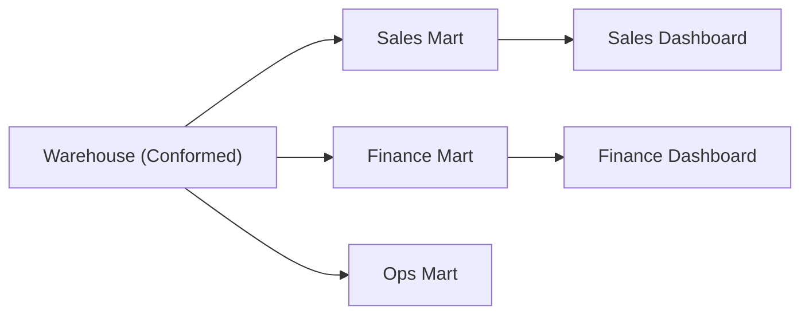

# Data Mart

> Data Warehouse 101 시리즈 (8/10)


## 이 글에서 다룰 문제

Warehouse는 전사 공통 데이터를 모으는 중심 저장소입니다. 하지만 영업, 재무, 운영 팀은 같은 데이터를 두고도 다른 용어와 다른 기준으로 질문합니다. Data Mart는 이런 차이를 흡수해서 각 팀이 바로 쓸 수 있는 형태로 다시 정리한 얇은 계층입니다.

> 공통 기준은 Warehouse에 두고, 팀별 해석은 Mart에서 다루는 편이 안정적입니다.

## 전체 흐름


## Before/After

**Before**: 영업팀이 Warehouse의 raw fact를 직접 조회해 조인이 복잡하고 응답도 느립니다.

**After**: sales mart가 팀 용어에 맞춰 미리 정리되어 대시보드가 빠르게 열립니다.

## Mart 설계 5단계

### 1단계 — 도메인 정의

```text
"영업 mart 는 *영업 기회* 단위로 본다. *고객, 단계, 금액, 담당자* 를 묶는다."
```

### 2단계 — Conformed dim 사용

```sql
CREATE OR REPLACE TABLE sales_mart.fact_opportunity AS
SELECT
    o.opp_id,
    u.user_key AS owner_key,
    c.customer_key,
    o.stage,
    o.amount,
    o.created_at
FROM staging.opportunities o
JOIN warehouse.dim_user u ON u.user_id = o.owner_id
JOIN warehouse.dim_customer c ON c.customer_id = o.customer_id;
```

### 3단계 — 사전 집계

```sql
CREATE OR REPLACE TABLE sales_mart.agg_pipeline_by_owner AS
SELECT
    owner_key,
    stage,
    SUM(amount) AS pipeline_amount,
    COUNT(*) AS opp_count
FROM sales_mart.fact_opportunity
GROUP BY 1, 2;
```

### 4단계 — Mart 쿼리

```sql
SELECT u.name, SUM(a.pipeline_amount) AS total_pipeline
FROM sales_mart.agg_pipeline_by_owner a
JOIN warehouse.dim_user u ON u.user_key = a.owner_key
WHERE a.stage IN ('proposal', 'negotiation')
GROUP BY u.name;
```

### 5단계 — 권한 분리

```sql
GRANT SELECT ON SCHEMA sales_mart TO ROLE sales_readers;
GRANT SELECT ON SCHEMA finance_mart TO ROLE finance_readers;
```

## 이 코드에서 주목할 점

- conformed dimension은 Warehouse의 공통 기준을 그대로 가져옵니다.
- 팀이 실제로 쓰는 용어가 컬럼명과 모델 이름에 반영됩니다.
- 권한을 도메인 단위로 나누면 데이터 노출 범위를 관리하기 쉽습니다.

## 자주 하는 실수 5가지

1. **mart마다 별도 dimension을 만듭니다.** 결국 팀마다 숫자가 달라지는 원인이 됩니다.
2. **Warehouse 정리 없이 mart부터 만듭니다.** 공통 기준을 나중에 맞추기가 훨씬 어려워집니다.
3. **모든 컬럼을 mart로 끌고 옵니다.** 비용은 늘고 사용성은 오히려 떨어집니다.
4. **권한 분리를 생략합니다.** 민감 데이터가 불필요하게 넓게 노출될 수 있습니다.
5. **mart가 실시간 뷰인지 물질화된 복사본인지 모호합니다.** 갱신 주기와 소유자를 명확히 적어야 합니다.

## 실무에서는 이렇게 쓰입니다

dbt 프로젝트에서는 marts 폴더를 도메인별로 나누는 경우가 많습니다. 영업, 재무, 제품, 마케팅이 각자의 mart를 가지되, 공통 dimension은 Warehouse에서 공유해 숫자 기준을 맞춥니다.

## 체크리스트

- [ ] Warehouse와 Mart의 차이를 설명할 수 있다.
- [ ] Conformed dimension이 왜 중요한지 알고 있다.
- [ ] 권한 분리가 필요한 이유를 말할 수 있다.
- [ ] 사전 집계가 주는 이점과 비용을 이해하고 있다.

## 정리 및 다음 단계

Mart는 팀과 공통 데이터 모델 사이를 연결하는 얇은 다리입니다. 좋은 mart는 팀별 용어를 반영하면서도 공통 기준을 깨지 않습니다. 다음 글에서는 이렇게 쌓아 올린 모델을 더 빠르고 저렴하게 읽기 위한 성능 최적화 패턴을 살펴보겠습니다.

<!-- toc:begin -->
- [Data Warehouse란 무엇인가?](./01-what-is-data-warehouse.md)
- [OLTP와 OLAP](./02-oltp-and-olap.md)
- [Fact와 Dimension](./03-fact-and-dimension.md)
- [Star Schema](./04-star-schema.md)
- [Partition과 Clustering](./05-partition-and-clustering.md)
- [ETL과 ELT](./06-etl-and-elt.md)
- [BI와 Dashboard](./07-bi-and-dashboard.md)
- **Data Mart (현재 글)**
- 성능 최적화 (예정)
- Warehouse 설계 예제 (예정)
<!-- toc:end -->

## 참고 자료

- [Kimball — Data Mart](https://www.kimballgroup.com/data-warehouse-business-intelligence-resources/kimball-techniques/dimensional-modeling-techniques/)
- [dbt — Mart Layer](https://docs.getdbt.com/best-practices/how-we-structure/4-marts)
- [Snowflake — Schema Design](https://docs.snowflake.com/en/user-guide/intro-key-concepts)
- [Wikipedia — Data Mart](https://en.wikipedia.org/wiki/Data_mart)

Tags: DataWarehouse, DataMart, Modeling, Domain, Analytics
