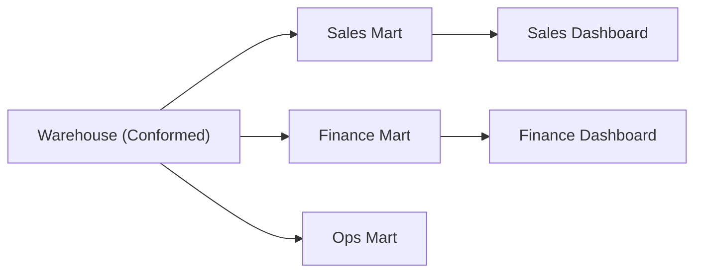

# Data Mart

> Data Warehouse 101 시리즈 (8/10)


## 이 글에서 다룰 문제

Warehouse 는 *전사 공통* 의 데이터를 모읍니다. 하지만 *영업, 재무, 운영* 은 *서로 다른 단어* 를 씁니다. Mart 는 *각 팀의 언어로* 데이터를 *재구성* 한 *얇은 layer* 입니다.

> *공통은 Warehouse 에, 도메인은 Mart 에.*

## 개념 한눈에 보기



## Before/After

**Before**: 영업팀이 Warehouse 의 *raw fact* 를 직접 본다. *조인이 복잡* 하고 *느리다*.

**After**: *sales mart* 가 *팀 용어* 로 *집계 완료*. 대시보드가 *3초* 안에 뜬다.

## 실습: Mart 설계 5단계

### 1단계 — 도메인 정의

```text
"영업 mart 는 *영업 기회* 단위로 본다. *고객, 단계, 금액, 담당자* 를 묶는다."
```

### 2단계 — Conformed dim 사용

```sql
CREATE OR REPLACE TABLE sales_mart.fact_opportunity AS
SELECT
    o.opp_id,
    u.user_key AS owner_key,
    c.customer_key,
    o.stage,
    o.amount,
    o.created_at
FROM staging.opportunities o
JOIN warehouse.dim_user u ON u.user_id = o.owner_id
JOIN warehouse.dim_customer c ON c.customer_id = o.customer_id;
```

### 3단계 — 사전 집계

```sql
CREATE OR REPLACE TABLE sales_mart.agg_pipeline_by_owner AS
SELECT
    owner_key,
    stage,
    SUM(amount) AS pipeline_amount,
    COUNT(*) AS opp_count
FROM sales_mart.fact_opportunity
GROUP BY 1, 2;
```

### 4단계 — Mart 쿼리

```sql
SELECT u.name, SUM(a.pipeline_amount) AS total_pipeline
FROM sales_mart.agg_pipeline_by_owner a
JOIN warehouse.dim_user u ON u.user_key = a.owner_key
WHERE a.stage IN ('proposal', 'negotiation')
GROUP BY u.name;
```

### 5단계 — 권한 분리

```sql
GRANT SELECT ON SCHEMA sales_mart TO ROLE sales_readers;
GRANT SELECT ON SCHEMA finance_mart TO ROLE finance_readers;
```

## 이 코드에서 주목할 점

- *Conformed dim* 은 *Warehouse* 에서 가져온다.
- *팀 용어* 가 *컬럼명* 에 그대로 드러난다.
- 권한이 *도메인 단위* 로 분리된다.

## 자주 하는 실수 5가지

1. **Mart 마다 *별도 dim* 을 만든다.** *숫자 충돌* 의 원인.
2. **Warehouse 없이 *Mart 부터* 만든다.** *공통화* 가 *나중에 어렵다*.
3. ***모든 컬럼* 을 mart 로 가져온다.** *불필요한 비용*.
4. ***권한 분리* 를 *생략*.** *민감 데이터 노출* 위험.
5. **Mart 가 *살아 있는 SQL* 인지 *복사본* 인지 *불분명*.** 갱신 정책 *명시*.

## 실무에서는 이렇게 쓰입니다

dbt 의 *marts/* 폴더가 *도메인별* 로 나뉩니다. 영업, 재무, 제품, 마케팅이 *각자의 mart* 를 갖고, *공통 dim* 만 *Warehouse* 에서 가져옵니다.

## 체크리스트

- [ ] *Warehouse* 와 *Mart* 의 차이를 안다.
- [ ] *Conformed dimension* 의 의미를 안다.
- [ ] *권한 분리* 의 필요성을 안다.
- [ ] *사전 집계* 의 trade-off 를 안다.

## 정리 및 다음 단계

Mart 는 *팀과 데이터 사이* 의 *얇은 다리* 입니다. 다음 글에서는 *성능 최적화* 의 핵심 패턴을 봅니다.

<!-- toc:begin -->
- [Data Warehouse란 무엇인가?](./01-what-is-data-warehouse.md)
- [OLTP와 OLAP](./02-oltp-and-olap.md)
- [Fact와 Dimension](./03-fact-and-dimension.md)
- [Star Schema](./04-star-schema.md)
- [Partition과 Clustering](./05-partition-and-clustering.md)
- [ETL과 ELT](./06-etl-and-elt.md)
- [BI와 Dashboard](./07-bi-and-dashboard.md)
- **Data Mart (현재 글)**
- 성능 최적화 (예정)
- Warehouse 설계 예제 (예정)
<!-- toc:end -->

## 참고 자료

- [Kimball — Data Mart](https://www.kimballgroup.com/data-warehouse-business-intelligence-resources/kimball-techniques/dimensional-modeling-techniques/)
- [dbt — Mart Layer](https://docs.getdbt.com/best-practices/how-we-structure/4-marts)
- [Snowflake — Schema Design](https://docs.snowflake.com/en/user-guide/intro-key-concepts)
- [Wikipedia — Data Mart](https://en.wikipedia.org/wiki/Data_mart)

Tags: DataWarehouse, DataMart, Modeling, Domain, Analytics
