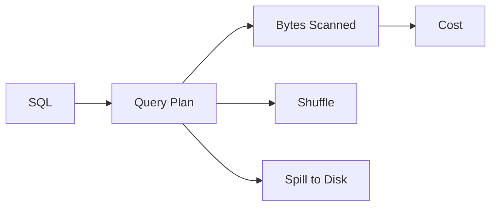

# 성능 최적화

Warehouse는 읽은 데이터 양에 따라 비용이 커지는 경우가 많습니다. 같은 답을 더 적은 바이트로 구하면 비용과 시간 둘 다 줄일 수 있습니다. 그래서 성능 최적화는 감으로 시작하지 않고, 어떤 계획으로 얼마나 읽었는지 먼저 확인하는 데서 출발합니다.

이 글은 Data Warehouse 101 시리즈의 9번째 글입니다.

## 이 글에서 다룰 문제

- Warehouse 성능은 어떤 패턴에서 가장 크게 갈릴까요?
- 같은 결과를 더 적은 비용으로 읽는 방법은 무엇일까요?
- bytes scanned와 shuffle, spill은 왜 먼저 확인할까요?
- 대략 집계와 materialized view는 언제 효과적일까요?
- 플랜을 보지 않고 하는 튜닝이 왜 자주 빗나갈까요?

## 이 글에서 배울 것

- 성능을 좌우하는 핵심 패턴
- 비용을 줄이는 다섯 가지 관점
- 쿼리 플랜을 읽는 기본 감각
- 최적화 실습 5단계
- 입문 단계에서 자주 나오는 실수 5가지

## 왜 중요한가

Warehouse는 읽은 양에 따라 비용이 커집니다. 같은 답을 더 적은 bytes로 읽으면 시간도 줄고 비용도 줄어듭니다. 그래서 최적화는 감이 아니라 플랜과 측정값에서 시작해야 합니다.

> 측정 없는 최적화는 추측입니다. 먼저 플랜을 읽어야 합니다.

## 개념 한눈에 보기



## 핵심 용어

- **Bytes Scanned**: 쿼리가 실제로 읽은 데이터 양입니다. 가장 직접적인 비용 지표입니다.
- **Shuffle**: 조인이나 집계 과정에서 노드 사이로 데이터가 이동하는 현상입니다.
- **Spill**: 메모리를 넘친 데이터가 디스크로 내려간 상태입니다.
- **Materialized View**: 자주 보는 결과를 미리 계산해 둔 뷰입니다.
- **Approximate Aggregate**: `APPROX_COUNT_DISTINCT` 같은 근사 집계 함수입니다.

## Before / After

**Before**: `SELECT *`로 전체 컬럼을 읽어 수십 GB를 스캔하고 비용도 크게 나옵니다.

**After**: 필요한 네 개 컬럼만 읽어 스캔 양과 비용을 함께 줄입니다.

## 실습: 최적화 5단계

### 1단계 — 컬럼 범위 줄이기

```sql
-- Before
SELECT * FROM fact_orders WHERE order_date = '2026-05-04';

-- After
SELECT order_id, user_key, amount
FROM fact_orders
WHERE order_date = '2026-05-04';
```

### 2단계 — partition pruning 유지하기

```sql
-- Compare directly without functions
WHERE order_date BETWEEN '2026-05-01' AND '2026-05-31'
```

### 3단계 — materialized view 사용하기

```sql
CREATE MATERIALIZED VIEW mv_daily_revenue AS
SELECT order_date, SUM(amount) AS revenue
FROM fact_orders
GROUP BY order_date;
```

### 4단계 — 근사 집계 사용하기

```sql
-- 99% accuracy is enough most of the time
SELECT APPROX_COUNT_DISTINCT(user_key) AS active_users
FROM fact_orders
WHERE order_date >= CURRENT_DATE - 30;
```

### 5단계 — 큰 조인의 작은 쪽을 broadcast하기

```sql
-- BigQuery hint example (conceptual)
SELECT /*+ BROADCAST(d) */ f.amount, d.country
FROM fact_orders f
JOIN dim_user d ON d.user_key = f.user_key;
```

## 이 코드에서 먼저 봐야 할 점

- 필요한 컬럼만 읽는 습관이 가장 큰 절약으로 이어집니다.
- partition pruning이 깨지지 않도록 조건식을 단순하게 유지해야 합니다.
- 자주 반복되는 집계는 미리 계산해 두는 편이 전체 비용을 낮춥니다.

## 자주 하는 실수 5가지

1. **`SELECT *`를 습관적으로 사용합니다.** 읽는 컬럼이 늘수록 비용도 함께 커집니다.
2. **partition key에 함수를 씌웁니다.** pruning이 깨져 전체 스캔으로 돌아가기 쉽습니다.
3. **대규모 `COUNT(DISTINCT)`를 무조건 정확 계산합니다.** approximate로 충분한 경우가 많습니다.
4. **materialized view를 갱신하지 않습니다.** 대시보드에 오래된 숫자가 노출될 수 있습니다.
5. **index 중심 사고에 머뭅니다.** Warehouse에서는 partition과 clustering이 더 중요한 경우가 많습니다.

## 실무에서는 이렇게 나타납니다

실무에서는 분석가와 데이터 엔지니어가 쿼리 플랜을 자주 확인합니다. 비용이 일정 임계값을 넘으면 Slack 같은 채널로 알람을 보내고, 반복적으로 무거운 쿼리는 materialized view로 캐시해 둡니다.

## 실무에서는 이렇게 생각합니다

- 가장 먼저 bytes scanned를 봅니다.
- 플랜을 읽지 않은 튜닝은 튜닝으로 취급하지 않습니다.
- 근사 집계를 지나치게 두려워하지 않습니다.
- 비용 경고를 팀 채널로 연결합니다.
- 큰 쿼리는 작은 단계로 나누는 선택도 자주 합니다.

## 체크리스트

- [ ] 쿼리 플랜을 보고 병목을 짐작할 수 있다.
- [ ] Bytes scanned가 왜 중요한 비용 지표인지 안다.
- [ ] Materialized view의 장단점을 설명할 수 있다.
- [ ] Approximate aggregate를 언제 써도 되는지 이해하고 있다.

## 연습 문제

1. 느린 쿼리 하나를 골라 필요한 컬럼만 남기도록 줄여 보세요.
2. pruning이 깨진 쿼리를 하나 고쳐 보세요.
3. 근사 집계를 써도 되는 경우와 쓰면 안 되는 경우를 적어 보세요.

## 마무리와 다음 글

성능 최적화는 작은 요령 몇 개를 외우는 일이 아니라, 어떤 쿼리가 무엇을 얼마나 읽는지 이해하는 일입니다. 컬럼 수를 줄이고, pruning을 살리고, 자주 쓰는 결과를 미리 계산하는 세 가지 원칙만 지켜도 큰 차이가 납니다. 다음 글에서는 지금까지 배운 내용을 묶어 처음부터 끝까지 Warehouse를 설계하는 예제를 살펴보겠습니다.

<!-- toc:begin -->
- [Data Warehouse란 무엇인가?](./01-what-is-data-warehouse.md)
- [OLTP와 OLAP](./02-oltp-and-olap.md)
- [Fact와 Dimension](./03-fact-and-dimension.md)
- [Star Schema](./04-star-schema.md)
- [Partition과 Clustering](./05-partition-and-clustering.md)
- [ETL과 ELT](./06-etl-and-elt.md)
- [BI와 Dashboard](./07-bi-and-dashboard.md)
- [Data Mart](./08-data-mart.md)
- **성능 최적화 (현재 글)**
- Warehouse 설계 예제 (예정)
<!-- toc:end -->

## 참고 자료

- [BigQuery — Optimize Query Performance](https://cloud.google.com/bigquery/docs/best-practices-performance-overview)
- [Snowflake — Query Performance](https://docs.snowflake.com/en/user-guide/performance-query)
- [Use The Index, Luke](https://use-the-index-luke.com/)
- [Redshift — Query Tuning](https://docs.aws.amazon.com/redshift/latest/dg/c-query-performance.html)

Tags: DataWarehouse, Performance, Optimization, Cost, Analytics
