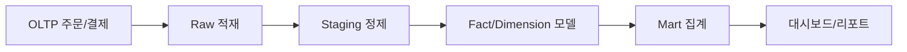

# Data Warehouse 101 (9/10): 성능 최적화

이 글은 데이터 웨어하우스 101 시리즈의 9번째 글입니다.

Warehouse는 읽은 데이터 양에 따라 비용이 커지는 경우가 많습니다. 같은 답을 더 적은 바이트로 구하면 비용과 시간 둘 다 줄일 수 있습니다. 그래서 성능 최적화는 감으로 시작하지 않고, 어떤 계획으로 얼마나 읽었는지 먼저 확인하는 데서 출발합니다.


*Data Warehouse 101 9장 흐름 개요*
> Slow query log와 쿼리 실행 계획은 성능 최적화의 출발점입니다.

## 먼저 던지는 질문

- Warehouse 성능은 어떤 패턴에서 가장 크게 갈릴까요?
- 같은 결과를 더 적은 비용으로 읽는 방법은 무엇일까요?
- bytes scanned와 shuffle, spill은 왜 먼저 확인할까요?

## 이 글에서 배울 것

- 성능을 좌우하는 핵심 패턴
- 비용을 줄이는 다섯 가지 관점
- 쿼리 플랜을 읽는 기본 감각
- 최적화 실습 5단계
- 입문 단계에서 자주 나오는 실수 5가지

## 왜 중요한가

Warehouse는 읽은 양에 따라 비용이 커집니다. 같은 답을 더 적은 bytes로 읽으면 시간도 줄고 비용도 줄어듭니다. 그래서 최적화는 감이 아니라 플랜과 측정값에서 시작해야 합니다.

> 측정 없는 최적화는 추측입니다. 먼저 플랜을 읽어야 합니다.

## 개념 한눈에 보기

성능 최적화는 '측정 → 병목 특정 → 개선 → 검증'의 반복입니다. 추측으로 시작하지 말고 쿼리 실행 계획과 Slow query log를 먼저 확인해 진짜 문제가 어디 있는지 파악합니다.

## 핵심 용어

- **Bytes Scanned**: 쿼리가 실제로 읽은 데이터 양입니다. 가장 직접적인 비용 지표입니다.
- **Shuffle**: 조인이나 집계 과정에서 노드 사이로 데이터가 이동하는 현상입니다.
- **Spill**: 메모리를 넘친 데이터가 디스크로 내려간 상태입니다.
- **Materialized View**: 자주 보는 결과를 미리 계산해 둔 뷰입니다.
- **Approximate Aggregate**: `APPROX_COUNT_DISTINCT` 같은 근사 집계 함수입니다.

## 전후 비교

**Before**: `SELECT *`로 전체 컬럼을 읽어 수십 GB를 스캔하고 비용도 크게 나옵니다.

**After**: 필요한 네 개 컬럼만 읽어 스캔 양과 비용을 함께 줄입니다.

## 실습: 최적화 5단계

### 1단계 — 컬럼 범위 줄이기

```sql
-- Before
SELECT * FROM fact_orders WHERE order_date = '2026-05-04';

-- After
SELECT order_id, user_key, amount
FROM fact_orders
WHERE order_date = '2026-05-04';
```

## 최적화 기법 비교

성능 최적화에는 여러 기법이 있으며, 각각 효과와 비용이 다릅니다.

| 기법 | 효과 | 비용 | 적용 조건 | 고려사항 |
|---|---|---|---|---|
| 파티셔닝 (Partitioning) | 높음 | 낮음 | 시간 기반 필터링이 많은 테이블 | partition key에 함수 쓰면 pruning 깨짐 |
| 정렬키 (Clustering) | 보통 | 낮음 | JOIN이나 GROUP BY가 특정 컬럼에 집중 | 너무 많은 clustering key는 오히려 역효과 |
| 물리화된 뷰 (Materialized View) | 높음 | 보통 | 반복 집계 쿼리 | 갱신 비용과 저장 공간 추가 |
| 캠싱 (Caching) | 높음 | 낮음 | 동일 쿼리 반복 | 캐시 무효화 타이밍 주의 |
| 쿼리 리라이트 (Query Rewrite) | 보통 | 높음 | 쿼리 패턴이 복잡한 경우 | 유지보수 비용 증가 |

파티셔닝과 정렬키는 DDL만 수정하면 되므로 비용이 낮지만, 물리화된 뷰는 저장 공간과 갱신 비용이 추가됩니다. 쿼리 리라이트는 효과가 크지만 로직이 복잡해지며 유지보수가 어려워집니다.


### 2단계 — partition pruning 유지하기

```sql
-- Compare directly without functions
WHERE order_date BETWEEN '2026-05-01' AND '2026-05-31'
```

### 3단계 — materialized view 사용하기

```sql
CREATE MATERIALIZED VIEW mv_daily_revenue AS
SELECT order_date, SUM(amount) AS revenue
FROM fact_orders
GROUP BY order_date;
```

### 4단계 — 근사 집계 사용하기

```sql
-- 99% accuracy is enough most of the time
SELECT APPROX_COUNT_DISTINCT(user_key) AS active_users
FROM fact_orders
WHERE order_date >= CURRENT_DATE - 30;
```

## SQL 예제: EXPLAIN 분석

쿼리 실행 계획(EXPLAIN)을 보면 병목을 찾을 수 있습니다. 아래는 BigQuery 예시입니다.

```sql
EXPLAIN
SELECT p.category, SUM(f.amount) AS revenue
FROM fact_orders f
JOIN dim_product p ON p.product_key = f.product_key
WHERE f.order_date BETWEEN '2026-01-01' AND '2026-01-31'
GROUP BY p.category;
```

EXPLAIN 결과에서 확인할 항목:

1. **Bytes scanned**: 가장 중요한 비용 지표입니다. 이 값을 줄이는 것이 최적화의 첫 목표입니다.
2. **Partition filtering**: pruning이 적용됐는지 확인합니다. "파티션이 3개로 축소됨"처럼 표시됩니다.
3. **Join method**: broadcast join인지 shuffle join인지 확인합니다. 작은 테이블은 broadcast가 빠릅니다.
4. **Spill to disk**: 메모리를 넘기면 디스크로 spill이 발생해 속도가 크게 떨어집니다.

```sql
-- 개선 후
EXPLAIN
SELECT p.category, SUM(f.amount) AS revenue
FROM fact_orders f
JOIN dim_product p ON p.product_key = f.product_key
WHERE f.order_date >= '2026-01-01'  -- BETWEEN 대신 >= 사용
  AND f.order_date < '2026-02-01'
GROUP BY p.category;
```

개선 후 bytes scanned가 줄었는지, pruning이 적용됐는지 다시 확인합니다.


### 5단계 — 큰 조인의 작은 쪽을 broadcast하기

```sql
-- BigQuery hint example (conceptual)
SELECT /*+ BROADCAST(d) */ f.amount, d.country
FROM fact_orders f
JOIN dim_user d ON d.user_key = f.user_key;
```

## 이 코드에서 먼저 봐야 할 점

- 필요한 컬럼만 읽는 습관이 가장 큰 절약으로 이어집니다.
- partition pruning이 깨지지 않도록 조건식을 단순하게 유지해야 합니다.
- 자주 반복되는 집계는 미리 계산해 두는 편이 전체 비용을 낮춥니다.

## 비용 기반 최적화

클라우드 Warehouse는 읽은 데이터 양으로 과금하므로, 비용 기반 최적화는 성능 최적화와 직결됩니다.

### 비용 분석 쿼리

```sql
-- BigQuery: 가장 비싼 쿼리 확인
SELECT
    user_email,
    query,
    total_bytes_processed / (1024*1024*1024) AS gb_scanned,
    total_slot_ms / 1000 AS compute_seconds
FROM `region-us`.INFORMATION_SCHEMA.JOBS_BY_PROJECT
WHERE creation_time >= TIMESTAMP_SUB(CURRENT_TIMESTAMP(), INTERVAL 7 DAY)
ORDER BY total_bytes_processed DESC
LIMIT 10;
```

비싼 쿼리를 찾아 우선 최적화하면 전체 비용 절감 효과가 큽니다.

### 비용 경고 설정

```sql
-- Snowflake: resource monitor로 비용 제한
CREATE RESOURCE MONITOR cost_limit
WITH CREDIT_QUOTA = 1000
TRIGGERS
    ON 80 PERCENT DO NOTIFY
    ON 100 PERCENT DO SUSPEND;
```

비용 임계값을 넘으면 알람을 보내거나 작업을 중단할 수 있습니다.

### 파티션 크기 모니터링

```sql
-- 파티션별 크기 확인
SELECT
    partition_id,
    total_rows,
    total_logical_bytes / (1024*1024*1024) AS size_gb
FROM `project.dataset.INFORMATION_SCHEMA.PARTITIONS`
WHERE table_name = 'fact_orders'
ORDER BY size_gb DESC;
```

크기가 고르지 않은 파티션은 재분배하거나 clustering을 추가합니다.


## 자주 하는 실수 5가지

1. **`SELECT *`를 습관적으로 사용합니다.** 읽는 컬럼이 늘수록 비용도 함께 커집니다.
2. **partition key에 함수를 씌웁니다.** pruning이 깨져 전체 스캔으로 돌아가기 쉽습니다.
3. **대규모 `COUNT(DISTINCT)`를 무조건 정확 계산합니다.** approximate로 충분한 경우가 많습니다.
4. **materialized view를 갱신하지 않습니다.** 대시보드에 오래된 숫자가 노출될 수 있습니다.
5. **index 중심 사고에 머뭅니다.** Warehouse에서는 partition과 clustering이 더 중요한 경우가 많습니다.

## 실무에서는 이렇게 나타납니다

실무에서는 분석가와 데이터 엔지니어가 쿼리 플랜을 자주 확인합니다. 비용이 일정 임계값을 넘으면 Slack 같은 채널로 알람을 보내고, 반복적으로 무거운 쿼리는 materialized view로 캐시해 둡니다.

## 실무에서는 이렇게 생각합니다

- 가장 먼저 bytes scanned를 봅니다.
- 플랜을 읽지 않은 튜닝은 튜닝으로 취급하지 않습니다.
- 근사 집계를 지나치게 두려워하지 않습니다.
- 비용 경고를 팀 채널로 연결합니다.
- 큰 쿼리는 작은 단계로 나누는 선택도 자주 합니다.

## 체크리스트

- [ ] 쿼리 플랜을 보고 병목을 짐작할 수 있다.
- [ ] Bytes scanned가 왜 중요한 비용 지표인지 안다.
- [ ] Materialized view의 장단점을 설명할 수 있다.
- [ ] Approximate aggregate를 언제 써도 되는지 이해하고 있다.

## 연습 문제

1. 느린 쿼리 하나를 골라 필요한 컬럼만 남기도록 줄여 보세요.
2. pruning이 깨진 쿼리를 하나 고쳐 보세요.
3. 근사 집계를 써도 되는 경우와 쓰면 안 되는 경우를 적어 보세요.

## 마무리와 다음 글

성능 최적화는 작은 요령 몇 개를 외우는 일이 아니라, 어떤 쿼리가 무엇을 얼마나 읽는지 이해하는 일입니다. 컬럼 수를 줄이고, pruning을 살리고, 자주 쓰는 결과를 미리 계산하는 세 가지 원칙만 지켜도 큰 차이가 납니다. 다음 글에서는 지금까지 배운 내용을 묶어 처음부터 끝까지 Warehouse를 설계하는 예제를 봅니다.


## 인덱스 전략보다 먼저 보는 최적화 우선순위

Warehouse 성능 개선 요청이 오면 많은 팀이 먼저 인덱스를 떠올립니다. 하지만 열 지향 DW에서는 스캔 범위와 데이터 이동이 더 큰 병목입니다. 아래 표는 우선순위를 정리한 기준입니다.

| 우선순위 | 전략 | 기대 효과 | 검증 지표 |
| --- | --- | --- | --- |
| 1 | 컬럼 선택 최소화 | 스캔 바이트 즉시 감소 | bytes scanned/query |
| 2 | partition pruning 유지 | 대형 테이블 범위 절단 | partition hit ratio |
| 3 | 조인 순서/키 정리 | shuffle 감소 | shuffle bytes |
| 4 | 사전 집계/물질화 | 반복 질의 가속 | dashboard latency |
| 5 | 근사 함수 활용 | 대규모 distinct 비용 절감 | query cost per run |

핵심은 "계획 없이 힌트부터 넣지 않는다"는 원칙입니다. 먼저 어떤 단계에서 비용이 커지는지 계측해야 합니다.

## 쿼리 최적화 예시: 적용 전후

```sql
-- Before: 불필요한 전체 컬럼 스캔
SELECT *
FROM marts.fact_orders
WHERE order_date BETWEEN '2026-01-01' AND '2026-12-31';

-- After: 필요한 컬럼만 선택
SELECT order_date, user_key, amount
FROM marts.fact_orders
WHERE order_date BETWEEN '2026-01-01' AND '2026-12-31';
```

단순한 변경처럼 보여도 열 지향 시스템에서는 비용 차이가 큽니다. `SELECT *`는 자주 "임시 디버깅"으로 시작해 운영 쿼리로 남는 경우가 많으므로 코드 리뷰에서 차단하는 것이 좋습니다.

## 실행 계획 해석 체크리스트

실행 계획을 볼 때는 아래 항목을 순서대로 확인하면 효율적입니다.

1. 스캔 단계에서 예상/실제 바이트 차이가 큰가
2. 조인 단계에서 한쪽 테이블이 과도하게 확장되는가
3. 셔플 후 스필이 발생하는가
4. 같은 집계를 반복 계산하는 단계가 있는가

각 항목은 개선 방향이 다릅니다. 예를 들어 스캔이 문제면 partition/컬럼 선택을 고치고, 셔플이 문제면 조인 키와 데이터 분포를 확인해야 합니다.

## 운영 자동화 예시

아래 YAML은 비용 이상 징후를 자동 감시하는 예시입니다.

```yaml
query_guardrails:
  max_bytes_scanned_gb: 50
  max_runtime_seconds: 120
  notify_channel: "#dw-cost-alert"
  actions:
    - warn_on_pr
    - tag_heavy_query
    - require_review_for_select_star
```

가드레일을 두면 개인 습관에 의존하지 않고 팀 차원에서 비용을 통제할 수 있습니다. 특히 신규 분석가 온보딩 시 효과가 큽니다.

## 인덱스 전략 비교 관점

OLTP에서의 인덱스 사고를 Warehouse에 그대로 옮기면 오해가 생깁니다. Warehouse에서는 인덱스보다 파티션, 클러스터링, 물질화 계층의 영향이 크다는 점을 기준으로 설계해야 합니다.


## 비용 중심 쿼리 리뷰 루틴

성능 개선을 이벤트성 작업으로 두지 않으려면 정기 리뷰 루틴이 필요합니다.

```yaml
weekly_query_review:
  select_candidates:
    - top_20_by_cost
    - top_20_by_runtime
  checks:
    - select_star_usage
    - partition_filter_presence
    - repeated_heavy_aggregations
  output:
    - action_items
    - owner_assignment
    - due_date
```

루틴이 있으면 개선이 개인의 감각이 아니라 팀 운영 체계로 전환됩니다.

## 인덱스 전략 비교표

| 전략 | OLTP 효과 | DW 효과 | 비고 |
| --- | --- | --- | --- |
| B-Tree 인덱스 확장 | 높음 | 제한적 | DW에서는 스캔 최적화가 우선 |
| 파티셔닝 | 중간 | 매우 높음 | 범위 절단 핵심 |
| 클러스터링 | 중간 | 높음 | 자주 쓰는 필터에 유효 |
| 물질화 뷰 | 상황 의존 | 높음 | 반복 집계 가속 |

이 표를 통해 "인덱스를 늘리면 해결된다"는 단선적 사고를 줄일 수 있습니다.

## 쿼리 가드레일 SQL 예시

```sql
-- 리뷰 대상 후보: 고비용 쿼리 상위
SELECT query_id, user_name, bytes_scanned, total_time_ms
FROM admin.query_history
WHERE execution_date >= CURRENT_DATE - 7
ORDER BY bytes_scanned DESC
LIMIT 20;
```

운영 데이터에 기반한 리뷰가 있어야 최적화 우선순위를 합리적으로 정할 수 있습니다.


## 실무 적용 메모

아래 메모는 해당 장의 개념을 실제 운영 환경에 옮길 때 반복적으로 확인하는 항목을 정리한 것입니다. 단순히 지식을 아는 것과 운영에서 안정적으로 반복하는 것은 다르기 때문에, 팀 단위 규칙으로 문서화해 두는 편이 좋습니다.

| 점검 영역 | 질문 | 권장 기준 |
| --- | --- | --- |
| 데이터 정의 | 같은 용어를 팀마다 다르게 쓰는가 | 용어집과 지표 정의를 단일 출처로 관리 |
| 파이프라인 안정성 | 재실행 시 결과가 동일한가 | idempotent 원칙, 상태 테이블 관리 |
| 비용 통제 | 월별 비용이 예측 가능한가 | 스캔 바이트, 고비용 쿼리 상위 추적 |
| 품질 보증 | 잘못된 데이터 유입을 조기에 잡는가 | null/중복/범위 검증 자동화 |
| 책임 분리 | 장애 시 소유자가 명확한가 | 계층별 owner와 on-call 채널 지정 |

운영에서는 기술 선택보다 경계와 책임이 더 큰 차이를 만듭니다. 예를 들어 모델이 훌륭해도 지표 소유자가 없으면 숫자 불일치 이슈가 장기간 방치될 수 있습니다. 반대로 도구가 완벽하지 않아도 책임 경계가 명확하면 복구 속도와 개선 속도가 빠릅니다.

```yaml
operating_baseline:
  contracts:
    raw: "append-only and replayable"
    transform: "test-required before publish"
    serving: "semantic definitions are versioned"
  quality_checks:
    - not_null
    - unique_key
    - accepted_values
    - referential_integrity
  cost_controls:
    - heavy_query_review_weekly
    - partition_filter_required
    - select_star_block_in_pr
  ownership:
    data_platform: "ingestion and storage"
    analytics_engineering: "transform and marts"
    domain_analytics: "metric definition and dashboard"
```

이 기준을 프로젝트 초기에 합의하면, 시리즈에서 다룬 개념이 문서 지식으로 끝나지 않고 운영 습관으로 정착됩니다. 특히 신규 팀원이 합류했을 때 학습 속도가 빨라지고, 장애나 지표 충돌 같은 사건이 생겨도 공통된 기준으로 빠르게 의사결정을 내릴 수 있습니다.

또한 분기 단위 회고에서는 기술 성능 지표뿐 아니라 의사결정 지표도 함께 보는 것이 좋습니다. 예를 들어 "대시보드 숫자 논쟁으로 소모된 회의 시간", "지표 정의 변경 후 영향 범위 확인 시간", "재처리 요청 처리 리드타임" 같은 운영 지표를 추적하면 데이터 조직의 성숙도를 더 현실적으로 파악할 수 있습니다.


## 실전 앵커: 모델, 파이프라인, 성능 검증

아래 예시는 이 글의 개념을 실제 운영으로 옮길 때 바로 재사용할 수 있는 최소 앵커입니다. 스키마, 적재 설정, 성능 비교를 한 묶음으로 두면 설계 논의가 추상 수준에서 끝나지 않고 실행 가능한 결정으로 이어집니다.

```sql
-- 공통 분석 질의 템플릿: 기간 + 세그먼트 + 지표
WITH scoped AS (
    SELECT
        f.date_key,
        f.amount,
        f.qty,
        c.segment,
        p.category
    FROM fact_sales f
    JOIN dim_customer c ON c.customer_key = f.customer_key
    JOIN dim_product p ON p.product_key = f.product_key
    WHERE f.date_key BETWEEN 20260101 AND 20260331
)
SELECT
    segment,
    category,
    SUM(amount) AS revenue,
    SUM(qty) AS units,
    COUNT(*) AS order_lines,
    ROUND(SUM(amount) / NULLIF(COUNT(*), 0), 2) AS avg_line_amount
FROM scoped
GROUP BY 1, 2
ORDER BY revenue DESC;
```

```yaml
pipeline_contract:
  schedule: "0 * * * *"
  source:
    type: cdc
    lag_slo_minutes: 15
  transform:
    engine: dbt
    model_layers: [stg, int, mart]
  quality_tests:
    - not_null
    - unique
    - relationships
    - accepted_values
  publish:
    target: mart_sales_daily
    strategy: merge
```



성능 비교는 반드시 동일 조건에서 수행해야 합니다. 파티션 필터 유무, 조인 순서, 집계 단위를 고정하지 않으면 숫자가 설계를 설명하지 못합니다.

| 비교 항목 | 조건 A(비최적화) | 조건 B(최적화) | 해석 |
| --- | --- | --- | --- |
| 스캔 바이트 | 480GB | 62GB | 파티션 프루닝이 대부분의 차이를 만듭니다. |
| 실행 시간 | 94초 | 18초 | 집계 이전 필터링으로 셔플 비용이 줄어듭니다. |
| 슬롯/크레딧 사용량 | 높음 | 중간 | 비용 안정성이 높아집니다. |
| 재현성 | 낮음 | 높음 | 표준 템플릿 쿼리 사용 시 비교 가능성이 유지됩니다. |

운영에서는 "정확한 한 번"보다 "안전한 재실행"이 더 중요한 경우가 많습니다. 그래서 적재 키를 두고 upsert 기준을 명확히 정의하는 방식이 필요합니다.

```sql
-- 재실행 가능한 머지 예시
MERGE INTO mart_sales_daily t
USING (
    SELECT
        d.full_date,
        c.segment,
        p.category,
        SUM(f.amount) AS revenue,
        SUM(f.qty) AS units
    FROM fact_sales f
    JOIN dim_date d ON d.date_key = f.date_key
    JOIN dim_customer c ON c.customer_key = f.customer_key
    JOIN dim_product p ON p.product_key = f.product_key
    WHERE d.full_date >= CURRENT_DATE - INTERVAL '7 day'
    GROUP BY 1, 2, 3
) s
ON t.full_date = s.full_date
AND t.segment = s.segment
AND t.category = s.category
WHEN MATCHED THEN UPDATE SET
    revenue = s.revenue,
    units = s.units,
    updated_at = CURRENT_TIMESTAMP
WHEN NOT MATCHED THEN INSERT (
    full_date, segment, category, revenue, units, updated_at
) VALUES (
    s.full_date, s.segment, s.category, s.revenue, s.units, CURRENT_TIMESTAMP
);
```

이 패턴을 기준선으로 두면, 모델 변경이나 파이프라인 장애가 생겨도 영향을 계층별로 좁혀 복구할 수 있습니다. 데이터 웨어하우스 운영은 쿼리 한두 개의 튜닝보다, 반복 가능한 설계 계약을 지키는 과정에 더 가깝습니다.


### 운영 확장 메모

데이터 웨어하우스를 오래 운영하면 기술 선택보다 운영 규율이 성능과 신뢰도를 좌우합니다. 다음 예시는 팀에서 반복적으로 사용하는 점검 묶음입니다.

```sql
-- 파티션 필터 누락 탐지용 예시
EXPLAIN
SELECT category, SUM(amount) AS revenue
FROM fact_sales
WHERE date_key BETWEEN 20260101 AND 20260131
GROUP BY category;
```

```yaml
review_policy:
  query_rules:
    - require_partition_filter: true
    - block_select_star_on_fact: true
    - require_owner_for_metric_change: true
  incident_rules:
    - classify: [schema_change, pipeline_lag, quality_failure]
    - first_response_minutes: 15
```


아키텍처가 단순해 보여도, 계약과 검증 루프를 문서화해 두면 신규 인원이 합류해도 같은 품질을 유지할 수 있습니다.


### 운영 확장 메모

데이터 웨어하우스를 오래 운영하면 기술 선택보다 운영 규율이 성능과 신뢰도를 좌우합니다. 다음 예시는 팀에서 반복적으로 사용하는 점검 묶음입니다.

```sql
-- 파티션 필터 누락 탐지용 예시
EXPLAIN
SELECT category, SUM(amount) AS revenue
FROM fact_sales
WHERE date_key BETWEEN 20260101 AND 20260131
GROUP BY category;
```

```yaml
review_policy:
  query_rules:
    - require_partition_filter: true
    - block_select_star_on_fact: true
    - require_owner_for_metric_change: true
  incident_rules:
    - classify: [schema_change, pipeline_lag, quality_failure]
    - first_response_minutes: 15
```


아키텍처가 단순해 보여도, 계약과 검증 루프를 문서화해 두면 신규 인원이 합류해도 같은 품질을 유지할 수 있습니다.

## 처음 질문으로 돌아가기

- **느린 쿼리를 찾는 가장 좋은 방법은 뭘까요?**
  - Slow query log를 활성화해 자동으로 수집하는 것이 가장 객관적입니다.
- **인덱스를 많이 만들면 쓰기 성능은 어떻게 될까요?**
  - 읽기는 빨라지지만 쓰기와 유지보수 비용이 증가하므로 트레이드오프를 고려해야 합니다.
- **쿼리 최적화와 데이터베이스 튜닝 중 뭘 먼저 해야 할까요?**
  - 쿼리부터 시작합니다. 나쁜 쿼리는 튜닝으로도 구원할 수 없습니다.

<!-- toc:begin -->
## 시리즈 목차

- [Data Warehouse 101 (1/10): Data Warehouse란 무엇인가?](./01-what-is-data-warehouse.md)
- [Data Warehouse 101 (2/10): OLTP와 OLAP](./02-oltp-and-olap.md)
- [Data Warehouse 101 (3/10): Fact와 Dimension](./03-fact-and-dimension.md)
- [Data Warehouse 101 (4/10): Star Schema](./04-star-schema.md)
- [Data Warehouse 101 (5/10): Partition과 Clustering](./05-partition-and-clustering.md)
- [Data Warehouse 101 (6/10): ETL과 ELT](./06-etl-and-elt.md)
- [Data Warehouse 101 (7/10): BI와 Dashboard](./07-bi-and-dashboard.md)
- [Data Warehouse 101 (8/10): Data Mart](./08-data-mart.md)
- **성능 최적화 (현재 글)**
- Warehouse 설계 예제 (예정)

<!-- toc:end -->

## 참고 자료

- [BigQuery — Optimize Query Performance](https://cloud.google.com/bigquery/docs/best-practices-performance-overview)
- [Snowflake — Query Performance](https://docs.snowflake.com/en/user-guide/performance-query)
- [Use The Index, Luke](https://use-the-index-luke.com/)
- [Redshift — Query Tuning](https://docs.aws.amazon.com/redshift/latest/dg/c-query-performance.html)

- [이 시리즈의 예제 코드 (book-examples)](https://github.com/yeongseon-books/book-examples/tree/main/data-warehouse-101/ko)

Tags: DataWarehouse, Performance, Optimization, Cost, Analytics
