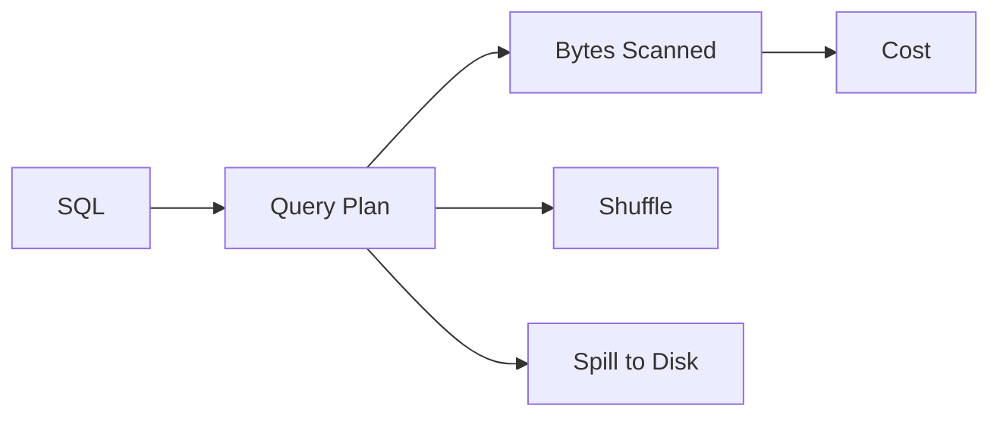

# 성능 최적화

> Data Warehouse 101 시리즈 (9/10)


## 이 글에서 다룰 문제

Warehouse는 읽은 데이터 양에 따라 비용이 커지는 경우가 많습니다. 같은 답을 더 적은 바이트로 구하면 비용과 시간 둘 다 줄일 수 있습니다. 그래서 성능 최적화는 감으로 시작하지 않고, 어떤 계획으로 얼마나 읽었는지 먼저 확인하는 데서 출발합니다.

> 측정 없이 빠르다 느리다를 말하는 최적화는 오래 가지 못합니다.

## 전체 흐름


## Before/After

**Before**: `SELECT *`로 전체 컬럼을 읽어 수십 GB를 스캔하고 비용도 크게 나옵니다.

**After**: 필요한 네 개 컬럼만 읽어 스캔 양과 비용을 함께 줄입니다.

## 최적화 5단계

### 1단계 — 컬럼 좁히기

```sql
-- 개선 전
SELECT * FROM fact_orders WHERE order_date = '2026-05-04';

-- 개선 후
SELECT order_id, user_key, amount
FROM fact_orders
WHERE order_date = '2026-05-04';
```

### 2단계 — Partition pruning 보장

```sql
-- 함수 없이 직접 비교한다
WHERE order_date BETWEEN '2026-05-01' AND '2026-05-31'
```

### 3단계 — 사전 집계 사용

```sql
CREATE MATERIALIZED VIEW mv_daily_revenue AS
SELECT order_date, SUM(amount) AS revenue
FROM fact_orders
GROUP BY order_date;
```

### 4단계 — Approximate aggregate

```sql
-- 정확도 99%면 충분한 경우
SELECT APPROX_COUNT_DISTINCT(user_key) AS active_users
FROM fact_orders
WHERE order_date >= CURRENT_DATE - 30;
```

### 5단계 — 큰 조인은 *작은 쪽 broadcast*

```sql
-- BigQuery 힌트 예시 (개념 설명용)
SELECT /*+ BROADCAST(d) */ f.amount, d.country
FROM fact_orders f
JOIN dim_user d ON d.user_key = f.user_key;
```

## 이 코드에서 주목할 점

- 필요한 컬럼만 읽는 습관이 가장 큰 절약으로 이어집니다.
- partition pruning이 깨지지 않도록 조건식을 단순하게 유지해야 합니다.
- 자주 반복되는 집계는 미리 계산해 두는 편이 전체 비용을 낮춥니다.

## 자주 하는 실수 5가지

1. **`SELECT *`를 습관적으로 사용합니다.** 읽는 컬럼이 늘수록 비용도 함께 커집니다.
2. **partition key에 함수를 씌웁니다.** pruning이 깨져 전체 스캔으로 돌아가기 쉽습니다.
3. **대규모 `COUNT(DISTINCT)`를 무조건 정확 계산합니다.** approximate로 충분한 경우가 많습니다.
4. **materialized view를 갱신하지 않습니다.** 대시보드에 오래된 숫자가 노출될 수 있습니다.
5. **index 중심 사고에 머뭅니다.** Warehouse에서는 partition과 clustering이 더 중요한 경우가 많습니다.

## 실무에서는 이렇게 쓰입니다

실무에서는 분석가와 데이터 엔지니어가 쿼리 플랜을 자주 확인합니다. 비용이 일정 임계값을 넘으면 Slack 같은 채널로 알람을 보내고, 반복적으로 무거운 쿼리는 materialized view로 캐시해 둡니다.

## 체크리스트

- [ ] 쿼리 플랜을 보고 병목을 짐작할 수 있다.
- [ ] Bytes scanned가 왜 중요한 비용 지표인지 안다.
- [ ] Materialized view의 장단점을 설명할 수 있다.
- [ ] Approximate aggregate를 언제 써도 되는지 이해하고 있다.

## 정리 및 다음 단계

성능 최적화는 작은 요령 몇 개를 외우는 일이 아니라, 어떤 쿼리가 무엇을 얼마나 읽는지 이해하는 일입니다. 컬럼 수를 줄이고, pruning을 살리고, 자주 쓰는 결과를 미리 계산하는 세 가지 원칙만 지켜도 큰 차이가 납니다. 다음 글에서는 지금까지 배운 내용을 묶어 처음부터 끝까지 Warehouse를 설계하는 예제를 살펴보겠습니다.

<!-- toc:begin -->
- [Data Warehouse란 무엇인가?](./01-what-is-data-warehouse.md)
- [OLTP와 OLAP](./02-oltp-and-olap.md)
- [Fact와 Dimension](./03-fact-and-dimension.md)
- [Star Schema](./04-star-schema.md)
- [Partition과 Clustering](./05-partition-and-clustering.md)
- [ETL과 ELT](./06-etl-and-elt.md)
- [BI와 Dashboard](./07-bi-and-dashboard.md)
- [Data Mart](./08-data-mart.md)
- **성능 최적화 (현재 글)**
- Warehouse 설계 예제 (예정)
<!-- toc:end -->

## 참고 자료

- [BigQuery — Optimize Query Performance](https://cloud.google.com/bigquery/docs/best-practices-performance-overview)
- [Snowflake — Query Performance](https://docs.snowflake.com/en/user-guide/performance-query)
- [Use The Index, Luke](https://use-the-index-luke.com/)
- [Redshift — Query Tuning](https://docs.aws.amazon.com/redshift/latest/dg/c-query-performance.html)

Tags: DataWarehouse, Performance, Optimization, Cost, Analytics
